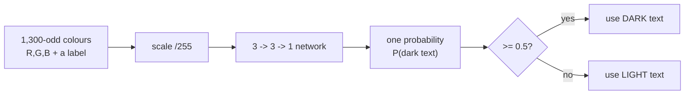
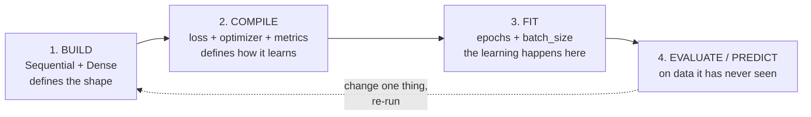
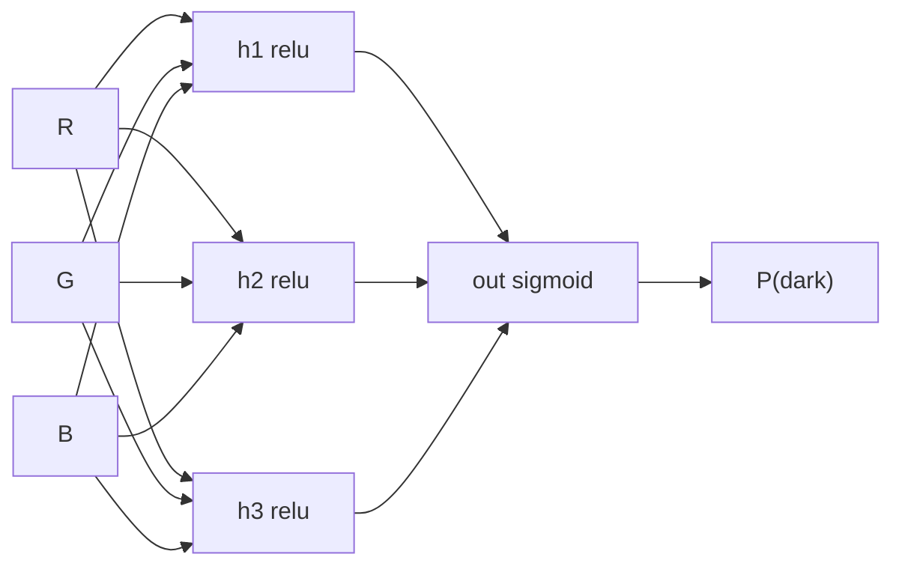

# Lab — Build and Train Your First Neural Network in Keras

**Time:** ~25–30 minutes · **Environment:** Google Colab (free tier; CPU is fine — no GPU) · **Prereq:** Session 6 (concepts only). No prior Keras experience assumed.

By the end of this lab you will have **trained a neural network**. Not read about one — trained one, watched it fail first, then watched it learn.

The lab is written so you can run it alone at your desk or type along live. Every cell shows its **expected output in comments**. Your numbers will differ slightly: neural-network training starts from random values, and although we set seeds to reduce the wobble, it never disappears entirely. Any output marked `Example:` is illustrative.

---

## What we are building



*Caption: the whole lab in one line — a colour goes in, a probability comes out, a threshold turns it into a decision.*

And the four stages every Keras model goes through, in order:



*Caption: build → compile → fit → evaluate. Every Keras program you ever write has these four stages. Keep this picture; the rest is detail.*

---

## Setup (≈2 min)

**Colab:** go to [colab.research.google.com](https://colab.research.google.com) → **New notebook**. TensorFlow, pandas, NumPy, scikit-learn and matplotlib are already installed. There is nothing to `pip install`.

> **JupyterLite will not work for this lab.** It runs Python in your browser with no account, but there is no TensorFlow/Keras build for it. If Colab is blocked for you, pair with a colleague's screen or use Kaggle Notebooks (free, needs an account).

```python
# Cell 0 — imports and reproducibility
import numpy as np
import pandas as pd
import tensorflow as tf
from sklearn.model_selection import train_test_split

tf.random.set_seed(42)      # makes the random weight initialisation repeatable
np.random.seed(42)

print("TensorFlow", tf.__version__)
# Expected: TensorFlow 2.x.x   (any 2.x works; Keras 3 also fine)
```

**Checkpoint 0:** you see a TensorFlow version number and no red error text. If you see a warning about CUDA / GPU — ignore it. We are not using a GPU; these models are far too small to need one.

---

## Part 1 — Get the data and look at it (≈5 min)

The dataset is a list of background colours, each with three numbers (Red, Green, Blue, each 0–255) and one label saying whether that background needs dark text or light text on top of it.

```python
# Cell 1 — load the colour dataset
URL = "https://tinyurl.com/y2qmhfsr"
# ^ resolves to raw.githubusercontent.com/thomasnield/machine-learning-demo-data/
#   master/classification/light_dark_font_training_set.csv
#   (short link confirmed live 2026-07-17 -- VERIFY IT RESOLVES ON THE DAY.
#    If it fails, skip to Cell 1b and continue as normal.)

df = pd.read_csv(URL)
print(df.head())
print("rows:", len(df), "| columns:", list(df.columns))

# Expected:
#    RED  GREEN  BLUE  LIGHT_OR_DARK_FONT_IND
# 0    0      0     0                       0
# 1    0      0    64                       0
# ...
# rows: ~1300  | columns: ['RED', 'GREEN', 'BLUE', 'LIGHT_OR_DARK_FONT_IND']
# (Exact row count varies by file revision; the four-column schema is what matters.)
```

### Cell 1b — the offline fallback (only if Cell 1 failed)

If the URL is blocked, dead, or your room has no network, **run this instead**. It synthesises an equivalent dataset from first principles — random colours, labelled by the standard perceived-luminance formula. The rest of the lab runs identically, and the model reaches similar accuracy.

```python
# Cell 1b — self-contained fallback: generate an equivalent dataset in 6 lines
rng = np.random.default_rng(42)
rgb = rng.integers(0, 256, size=(1345, 3))                       # random colours
lum = 0.299*rgb[:, 0] + 0.587*rgb[:, 1] + 0.114*rgb[:, 2]        # perceived brightness
label = (lum > 127.5).astype(int)     # bright background -> 1 -> use DARK text

df = pd.DataFrame(rgb, columns=["RED", "GREEN", "BLUE"])
df["LIGHT_OR_DARK_FONT_IND"] = label
print(df.head(), "\nrows:", len(df))
# Expected: a 4-column frame, 1345 rows, same schema as Cell 1.
```

> **Why this is a legitimate substitute.** "Which text colour is readable on this background?" really is a luminance question — that is exactly why the source course admits the problem "would probably be better solved with logistic regression." Generating the data from the luminance rule does not cheat: the network never sees the rule, only the colours and the labels, and it has to discover the boundary itself. What you lose is the small amount of real-world messiness in the original file (a few borderline colours humans labelled by eye). What you gain is a lab that cannot be broken by a dead link.

### Scale the inputs, and split off a test set

```python
# Cell 2 — features, labels, scaling, and the train/test split
X = df[["RED", "GREEN", "BLUE"]].values / 255.0     # scale 0..255 -> 0..1
y = df["LIGHT_OR_DARK_FONT_IND"].values             # 0 or 1

print("X shape:", X.shape, "| X range:", X.min(), "to", X.max())
print("label counts:", np.bincount(y))
# Expected:
# X shape: (~1345, 3) | X range: 0.0 to 1.0
# label counts: [~600 ~745]      <- roughly balanced, not exactly
# (Row count depends on which of Cell 1 / Cell 1b you ran; only the shape matters.)

X_train, X_test, y_train, y_test = train_test_split(
    X, y, test_size=1/3, stratify=y, random_state=42)
print("train rows:", len(X_train), "| test rows:", len(X_test))
# Expected: train rows: ~896 | test rows: ~449
```

**Why `/255`.** RGB channels run 0–255. Neural networks train much more comfortably when inputs sit in a small range around zero-to-one, because all the weights then start out on a comparable footing and the optimiser's step size means roughly the same thing in every direction. Feed raw 0–255 values in and training is slower and less stable. We use `/255` rather than a fitted scaler because 255 is a **known, fixed** maximum — no need to learn it from the data. *(In Session 8, where the second dataset has no known range, you will see `StandardScaler` fitted on the training set only — that is the general version of this same move.)*

**Why hold back a third of the data.** Anything the model has seen during training, it may simply have memorised. The only honest score is on rows it has never seen. `stratify=y` keeps the two classes in the same proportion in both halves so the split does not accidentally hand us an easy or an impossible test set.

### Checkpoint 1 — which label means "dark"?

We defined our model's output as **the probability that the background needs DARK text**, with the rule **≥ 0.5 → DARK**. So we had better confirm that label `1` in this file actually means "dark". Never assume a label's direction — check it.

```python
# Cell 3 — verify the label direction empirically
lum = 0.299*df.RED + 0.587*df.GREEN + 0.114*df.BLUE
for k in (0, 1):
    print(f"label {k}: mean background brightness = {lum[df.LIGHT_OR_DARK_FONT_IND == k].mean():.1f}")
# Example:
# label 0: mean background brightness = 55.0     <- dark backgrounds
# label 1: mean background brightness = 198.0    <- bright backgrounds

# A BRIGHT background needs DARK text. So the class with the HIGHER number above
# is the "use dark text" class. If that is label 1, you are aligned -- do nothing.
# If it turns out to be label 0, flip the labels with the next line and re-run Cell 2:
# y = 1 - y
```

> **Why this cell exists.** The source deck this lab derives from contradicts itself about the threshold: one slide says probability ≥ .5 means DARK, another says it means light. We resolved that in favour of **≥ 0.5 → DARK** (`AI_input.md` §6, error #1) — but resolving it on a slide is worthless if the data disagrees. Thirty seconds of checking beats an afternoon of a model that is exactly, confidently backwards. This is a habit, not a one-off: **whenever someone hands you a labelled dataset, confirm which way the labels point before you trust a single metric.**

---

## Part 2 — Build the network (≈5 min)

Here it is. This is the model. Five lines.

```python
# Cell 4 — the whole network
model = tf.keras.Sequential([
    tf.keras.layers.Input(shape=(3,)),                    # three inputs: R, G, B
    tf.keras.layers.Dense(3, activation="relu"),          # hidden layer: 3 neurons
    tf.keras.layers.Dense(1, activation="sigmoid"),       # output: one probability
])
model.summary()

# Expected:
# Model: "sequential"
# ┌─────────────────────────┬────────────────┬───────────────┐
# │ Layer (type)            │ Output Shape   │       Param # │
# ├─────────────────────────┼────────────────┼───────────────┤
# │ dense (Dense)           │ (None, 3)      │            12 │
# │ dense_1 (Dense)         │ (None, 1)      │             4 │
# └─────────────────────────┴────────────────┴───────────────┘
#  Total params: 16
```

**Sixteen numbers.** That is the entire model. Nine weights from the three inputs to the three hidden neurons, three hidden biases, three weights from hidden to output, one output bias. `12 + 4 = 16`. Every one of them starts random and will be nudged by training.



*Caption: the 3 → 3 → 1 network. Nine arrows in, three arrows out, plus one bias per hidden/output neuron = 16 learnable numbers.*

### Every argument, explained

| Code | What it means | Why this value here |
|---|---|---|
| `Sequential([...])` | A plain stack of layers: each one's output is the next one's input. | Our network has no branches or merges, so the simplest container is the right one. |
| `Input(shape=(3,))` | Declares three input features per row. | R, G, B. The `(3,)` is per-example — the row count is not part of the shape. |
| `Dense(3, ...)` | A **fully connected** layer of 3 neurons: every input connects to every neuron. | "Dense" is the plainest possible layer; 3 neurons is a deliberately tiny hidden layer, small enough to hold in your head. |
| `activation="relu"` | Rectified Linear Unit: `max(0, z)` — negatives become 0, positives pass through. | The standard hidden-layer default: cheap, fast, avoids the vanishing-gradient stall. Without *some* nonlinearity here, stacking layers would collapse into a single straight line. |
| `Dense(1, ...)` | One output neuron → one number per input row. | Binary question, one answer. |
| `activation="sigmoid"` | Squashes any number into the range 0–1. | Turns a raw score into something we can read as a **probability of dark text**. For multi-class you would use several output neurons and `softmax` instead. |

> **A note on which "deep" this is.** "Deep learning" conventionally means *more than one hidden layer*. Ours has exactly one — so, strictly, this is a neural network but not a deep one. We are calling that out rather than glossing over it (the source course does not). Nothing you learn here changes when you add layers; the count goes up, the mechanism does not.

> **Older syntax you will also see.** `Dense(3, activation="relu", input_shape=(3,))` as the first layer, with no separate `Input` line, is the same model in the older style — it appears in Session 8's lab. Both work; `Input(shape=...)` is the form guaranteed to work on Keras 3.

### Checkpoint 2 — look at the actual starting weights

```python
# Cell 5 — what does the model contain before we train it?
w_hidden, b_hidden = model.layers[0].get_weights()
print("hidden weights:\n", np.round(w_hidden, 3))
print("hidden biases:", b_hidden)
# Example:
# hidden weights:
#  [[-0.72  0.61  0.90]
#   [ 0.15 -0.86  0.34]
#   [ 0.98  0.42 -0.55]]
# hidden biases: [0. 0. 0.]
```

**Read what you got.** The weights are small random numbers, **positive and negative**, spread symmetrically around zero. The biases start at exactly **zero**. That is Keras's default: **Glorot-uniform** for weights (a range sized to the layer's width, so signals neither explode nor die as they pass through), and **zeros** for biases.

> **Correcting a source error.** The deck this material comes from states that weights are initialised "between −1 and 1" while its own from-scratch code uses `np.random.rand`, which returns numbers between **0 and 1** — all positive. Those two claims cannot both be true, and the all-positive version is the worse one: a layer whose weights are all positive starts out unable to represent "this input pushes the answer *down*", and has to spend training escaping that. Rather than repeat either claim, we just printed the real thing. Symmetric around zero, biases zero. *(`AI_input.md` §6, error #2.)*

---

## Part 3 — Compile it (≈3 min)

Building defined the *shape* of the model. Compiling defines *how it learns*.

```python
# Cell 6 — compile: how the model will learn
model.compile(
    optimizer="adam",                  # HOW to update the weights
    loss="binary_crossentropy",        # WHAT counts as "wrong"
    metrics=["accuracy"],              # what to REPORT to us humans
)
print("compiled")
# Expected: compiled
```

| Argument | Its job | Plain English |
|---|---|---|
| `loss="binary_crossentropy"` | The number training tries to make smaller. | "How wrong were we, weighting confident mistakes heavily?" Predicting 0.99 for a colour whose true label is 0 is punished far harder than predicting 0.6. This is the standard loss for a 0/1 classifier with a sigmoid output. |
| `optimizer="adam"` | The rule for adjusting weights after each batch. | The gradient tells us which way is downhill (Session 6's flashlight); Adam decides how big a step to take, adapting per weight. It is the sensible default; you rarely need anything else to start. |
| `metrics=["accuracy"]` | A human-readable score, reported but **not** optimised. | "What fraction did we get right?" The optimiser never looks at this. It exists so you can follow along. |

> **The loss and the metric are different things, on purpose.** Loss must be smooth so the optimiser can follow its slope. Accuracy is a step function — it jumps when a prediction crosses 0.5 and is flat everywhere else, so it carries no usable slope. We minimise a proxy (loss) and *watch* the thing we care about (accuracy). When they disagree, believe the loss about training and the accuracy about the world.

> **A correction to the source.** The original deck compiles this model with `MeanSquaredError` loss. Squared error is for predicting continuous numbers; for a 0/1 classifier with a sigmoid output, **binary cross-entropy** is the conventional and better-behaved choice (it produces stronger gradients when the model is confidently wrong). The source likely used MSE to keep one loss function across a whole three-day course. We use `binary_crossentropy`, and so does Session 8. *(`AI_input.md` §5.)*

---

## Part 4 — The honest moment: score it *before* you train it (≈5 min)

The model is built and compiled. It has never seen a single row of data. Its 16 numbers are random. **Let's ask it to do the job anyway.**

```python
# Cell 7 — evaluate BEFORE training
loss0, acc0 = model.evaluate(X_test, y_test, verbose=0)
print(f"UNTRAINED accuracy on unseen data: {acc0:.3f}   (loss {loss0:.3f})")
# Example:
# UNTRAINED accuracy on unseen data: 0.549   (loss 0.719)
```

Around **chance**. Roughly a coin flip. Now the more interesting question — *how* is it wrong?

```python
# Cell 8 — what did it actually predict?
probs0 = model.predict(X_test, verbose=0).ravel()
preds0 = (probs0 >= 0.5).astype(int)
print("probability range:", round(probs0.min(), 3), "to", round(probs0.max(), 3))
print("predicted class counts:", np.bincount(preds0, minlength=2))
print("actual    class counts:", np.bincount(y_test,  minlength=2))
# Example:
# probability range: 0.412 to 0.605
# predicted class counts: [  0 449]      <- it said "DARK" to every single colour
# actual    class counts: [201 248]
```

**This is the moment.** Look at what the untrained network actually did: it produced almost the same number for every colour (a narrow band near 0.5), so after thresholding it predicted **one class for everything**. It is not making bad decisions — it is not making decisions at all. Its "accuracy" of ~0.55 is simply the fraction of the test set that happens to belong to the class it guessed. A model that always answers "DARK" would score exactly the same.

> **Carry this forward.** An accuracy number on its own cannot distinguish *learned the problem* from *guessed the majority class*. Here you can see the difference because the problem is balanced and tiny. On a real dataset where 98% of rows are one class, a do-nothing model reports 98% accuracy and looks superb. That is the trap Session 8 dismantles with the confusion matrix, and the one Session 13 turns on a vendor's "99% accurate" claim. **You have now seen it happen in your own notebook, with your own model.**

### Checkpoint 3

Before continuing, be able to answer: *Why did the untrained model output roughly 0.5 for everything?* — Because its biases are zero and its weights are small and symmetric, so the raw output hovers near 0, and `sigmoid(0) = 0.5`. It has no reason to prefer any answer, so it doesn't.

---

## Part 5 — `fit()`: watch it learn (≈7 min)

Now train it. This is the line the whole session exists for.

```python
# Cell 9 — TRAIN
history = model.fit(
    X_train, y_train,
    epochs=100,          # 100 passes over the training data
    batch_size=32,       # update the weights after every 32 rows
    verbose=1,           # print a line per epoch so we can watch
)

# Example output (first and last few lines):
# Epoch 1/100
# 29/29 ━━━━━━━━━━ 1s 4ms/step - accuracy: 0.5612 - loss: 0.6871
# Epoch 2/100
# 29/29 ━━━━━━━━━━ 0s 3ms/step - accuracy: 0.6398 - loss: 0.6603
# Epoch 3/100
# 29/29 ━━━━━━━━━━ 0s 3ms/step - accuracy: 0.7154 - loss: 0.6212
# ...
# Epoch 50/100
# 29/29 ━━━━━━━━━━ 0s 3ms/step - accuracy: 0.9420 - loss: 0.1998
# ...
# Epoch 100/100
# 29/29 ━━━━━━━━━━ 0s 3ms/step - accuracy: 0.9598 - loss: 0.1361
```

**Watch the two numbers move.** Loss falls, accuracy rises. That is learning — nothing more mystical is happening. Each epoch the model made predictions, measured how wrong it was, and nudged all sixteen numbers slightly in the direction that reduces the error.

### Reading the log

| What you see | What it means |
|---|---|
| `Epoch 7/100` | Pass number 7 through the entire training set. |
| `29/29` | 29 batches per epoch. 896 training rows ÷ `batch_size=32` ≈ 29 weight updates per epoch — so **2,900 updates total**, not 100. |
| `loss: 0.62` | The number being minimised. Should trend **down**. Bumpiness is normal; a persistent rise is not. |
| `accuracy: 0.71` | Fraction correct **on the training data**. Not a trustworthy score — the model saw these rows. |
| `4ms/step` | Timing. Irrelevant here; it becomes everything at real scale. |

> **`epochs` and `batch_size`, precisely.** An **epoch** is one complete pass over the training data. **`batch_size`** is how many rows the model looks at before updating its weights. Smaller batches mean more, noisier updates per epoch (often better learning, slower per epoch); larger batches mean fewer, smoother updates. They are the two knobs that decide *how much* training happens, and they interact: halving `batch_size` doubles the number of weight updates at the same epoch count.

### Type-along: change ONE thing and re-run

This is the rhythm for the rest of your career with this stuff. **Hold the block, change one thing, re-run, compare.**

```python
# Cell 10 — rebuild from scratch and train for only 5 epochs
def build_and_compile():
    m = tf.keras.Sequential([
        tf.keras.layers.Input(shape=(3,)),
        tf.keras.layers.Dense(3, activation="relu"),
        tf.keras.layers.Dense(1, activation="sigmoid"),
    ])
    m.compile(optimizer="adam", loss="binary_crossentropy", metrics=["accuracy"])
    return m

short = build_and_compile()
short.fit(X_train, y_train, epochs=5, batch_size=32, verbose=0)   # ONLY CHANGE: 100 -> 5
print("5 epochs  -> test accuracy:", round(short.evaluate(X_test, y_test, verbose=0)[1], 3))
print("100 epochs-> test accuracy:", round(model.evaluate(X_test, y_test, verbose=0)[1], 3))
# Example:
# 5 epochs  -> test accuracy: 0.717
# 100 epochs-> test accuracy: 0.958
```

**Why we rebuilt.** Calling `fit()` again on the *same* model would continue training from where it left off, not start over. A fresh `build_and_compile()` gives a clean comparison. This trips up nearly everyone once.

**Debrief:** five epochs is not enough — the model has started to learn but is nowhere near finished. This is **underfitting**: too little training (or too little model) for the problem. Its opposite, overfitting, is Session 8's opening act.

---

## Part 6 — Evaluate, then predict a real colour (≈5 min)

```python
# Cell 11 — the honest score, on data the model has never seen
test_loss, test_acc = model.evaluate(X_test, y_test, verbose=0)
print(f"TEST accuracy: {test_acc:.3f}   (untrained it was {acc0:.3f})")
# Example:
# TEST accuracy: 0.958   (untrained it was 0.549)
```

From coin-flip to ~96% on colours it has never seen, in a few seconds of CPU time and sixteen numbers. **That is the session.**

Now use it. Pick a colour — a brand colour, a status-page green, whatever the room shouts out.

```python
# Cell 12 — predict for colours of your choosing
def advise(r, g, b):
    p = float(model.predict(np.array([[r, g, b]]) / 255.0, verbose=0)[0][0])
    return f"({r:>3},{g:>3},{b:>3})  P(dark) = {p:.3f}  ->  {'DARK' if p >= 0.5 else 'LIGHT'} text"

for colour in [(255, 255, 204),   # salmon-pale / cream
               ( 26,  26,  26),   # near black
               (255, 255, 255),   # white
               (122,  55, 139),   # purple
               (128, 128, 128)]:  # mid grey -- the genuinely hard one
    print(advise(*colour))

# Example:
# (255,255,204)  P(dark) = 0.981  ->  DARK text
# ( 26, 26, 26)  P(dark) = 0.008  ->  LIGHT text
# (255,255,255)  P(dark) = 0.995  ->  DARK text
# (122, 55,139)  P(dark) = 0.041  ->  LIGHT text
# (128,128,128)  P(dark) = 0.604  ->  DARK text     <- note how much less confident
```

**The decision rule: `P(dark) ≥ 0.5 → DARK text`.** The model outputs a probability that this background wants dark text; 0.5 is where we choose to cut. Two things worth saying out loud:

1. **0.5 is a choice, not a law.** It is the neutral default. Session 8 moves it deliberately and shows what that costs you.
2. **Look at mid-grey.** 0.60 versus 0.98 for cream. The model is telling you it is unsure — and it is right to be, because mid-grey genuinely is ambiguous to a human eye too. A probability carries information a bare label throws away. Most systems throw it away anyway.

### Checkpoint 4 — you are done

You can now say all of these truthfully:

- [ ] I built a neural network and I know what all 16 of its numbers are.
- [ ] I scored it before training and saw it perform at chance — and saw *why*.
- [ ] I trained it and watched loss fall and accuracy rise.
- [ ] I scored it on data it had never seen: ~0.96.
- [ ] I fed it a colour of my own and got a decision out.

---

## Now break it / now extend it

Do these in order; each takes 2–4 minutes. **Rebuild the model each time** (use `build_and_compile()`), or you will be continuing the previous training rather than starting fresh.

### Break it

**1. Remove the scaling.** Rebuild, then train on the **raw** 0–255 values instead of `X`:

```python
X_raw_train = X_train * 255.0
X_raw_test  = X_test  * 255.0
m = build_and_compile()
m.fit(X_raw_train, y_train, epochs=100, batch_size=32, verbose=0)
print("unscaled -> test accuracy:", round(m.evaluate(X_raw_test, y_test, verbose=0)[1], 3))
# Example: unscaled -> test accuracy: 0.83   (noticeably worse, and less stable run to run)
```
*What to notice:* the same model, the same data, the same number of epochs — and a worse result, because the inputs are now 255× larger than the weights expect. Re-run it three times: the variance between runs is larger too. **This is why `/255` is not a formality.** *(If you get a good score anyway, run it again — instability is the point, and it does not show up every time.)*

**2. Delete the nonlinearity.** Rebuild with `activation="linear"` on the hidden layer instead of `"relu"`, then train 100 epochs.
*What to notice:* it probably still does fine — because this problem is close to linearly separable (brightness is roughly a weighted sum of R, G and B, which is exactly what a linear model computes). **That is an honest and slightly deflating result, and you should sit with it.** The nonlinearity is what lets a network learn a *curved* boundary; our problem barely needs one. It is also why the source course admits this problem "would probably be better solved with logistic regression." Neural networks earn their keep on problems where the boundary is not a straight line.

**3. Make the learning rate absurd.** Rebuild, but compile with `optimizer=tf.keras.optimizers.Adam(learning_rate=5.0)`.
*What to notice:* loss goes flat, jumps around, or turns into `nan`. Each step overshoots the valley instead of descending into it. `nan` loss is the classic signature of "learning rate too high" — recognise it once and you will diagnose it instantly forever.

### Extend it

**4. Change the network's size.** Try hidden layers of 1, 3, 32 and 256 neurons (`Dense(n, activation="relu")`), 100 epochs each. Print test accuracy for each.
*What to look for:* 1 neuron is too few to do the job. 3 is enough. 32 and 256 are not meaningfully better — just slower and carrying thousands of parameters for a problem that needs 16. **More model is not more skill.** Bring your table to Session 8.

**5. Make it deep.** Add a second `Dense(3, activation="relu")` between the existing two. Now — by the strict definition — it is *deep learning*. Does the test accuracy improve?
*What to look for:* almost certainly not, and possibly slightly worse. Depth buys the ability to represent complicated boundaries; there is no complicated boundary here to represent. A useful antidote to the word "deep."

**6. Track the test set during training.** Re-run Cell 9 with `validation_data=(X_test, y_test)` added. Keras will now print `val_loss` and `val_accuracy` each epoch.
*What to look for:* the two accuracies rise together here. **Make them come apart** — shrink the training set to 60 rows (`X_train[:60], y_train[:60]`) and train for 500 epochs. Training accuracy will head for 1.00 while validation stalls. That gap has a name, and it is the first thing Session 8 puts on the screen.

---

## What we did not do today (and it matters)

Be clear-eyed about the size of what just happened. You trained a model. You did **not**:

- check *which* colours it gets wrong (a confusion matrix would show that) — **Session 8**;
- ask whether 96% is even a good score for this base rate — **Sessions 8 and 12**;
- tune anything systematically, or guard against overfitting — **Session 8**;
- do anything at all about deploying, monitoring, or being accountable for this model — **Sessions 13–14**.

The five lines in Cell 4 are, genuinely, the easy part. That is not a warning against the technology; it is a recalibration. When someone demonstrates that their team "built an AI model", they have done what you just did in twenty-five minutes. **The hard, expensive, career-shaped work is everything downstream of `fit()`.**

## What to keep

Save this notebook — **Session 8 opens by reloading exactly this data and this workflow**, then makes the model good. The shape you now have in your hands is the template:

> **load → scale → split → build → compile → fit → evaluate → predict**

Swap the dataset and the input shape and this outline does not change. Everything else in the course is about the judgement you exercise at each of those eight arrows.
