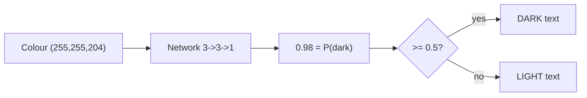
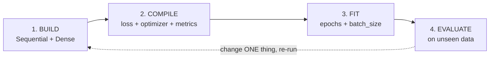
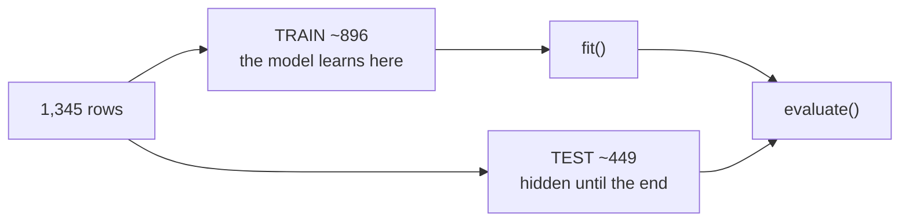
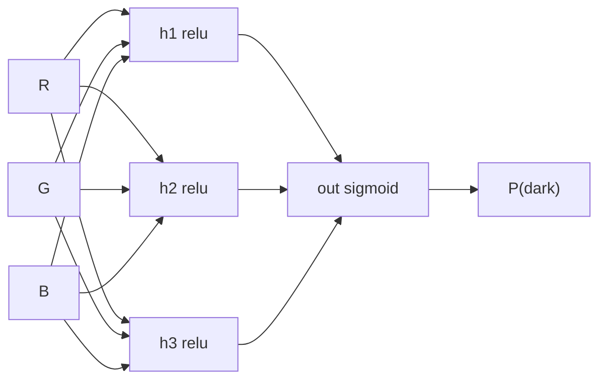
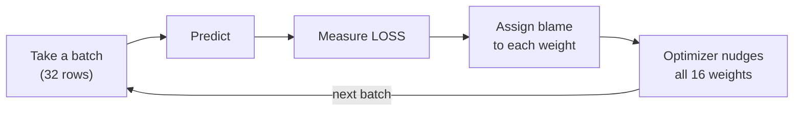

# Slides Outline — Session 7: Hands-On I, Build & Train a Network in Keras

Slide-by-slide spec for the deck-builder. Build per `../../powerpoint_instructions.md` (layout, palette, type, accessibility, licence footers). Speaker notes go in the Notes pane, never on the slide. Mermaid sources are in each slide's **Visual** field — render in-palette, with alt text.

> **This deck is deliberately thin.** Per `powerpoint_instructions.md` §7: *"Sessions 7, 8 — these decks are thin; the lab carries them. ~8–10 slides + the Colab notebook. Deck sets up and debriefs the lab."* The deck's job is to frame each lab segment in 60–90 seconds and then get out of the way. **Do not expand it to 18 slides.** If a point needs more than one slide, it belongs in `exercises/lab.md` or `content/`.

**Deck size:** 1 title + 1 agenda + **9 content** + 1 discussion + 1 resources = **13 slides.** Target 45 min, of which perhaps 10 minutes are spent on slides and 35 in the notebook.

**Licence note for this whole deck:** every diagram, table and code block here is **our own work** — the lab was authored from scratch because the source deck's exercise slides are title-only. Nothing is reproduced from the LINK-ONLY source (Nield, *Deep Learning for Beginners* Day 1, O'Reilly). Code shown uses the **TensorFlow/Keras API (Apache-2.0, SLIDE-SAFE)**; footer tag on code slides: *"Keras API, Apache-2.0"*. The source deck appears **only as a link on the resources slide**.

**Presenter setup (do before the room arrives):**
- Colab notebook open, Cell 0 already run, TensorFlow imported.
- The dataset URL **verified resolving that morning**. If it does not, have Cell 1b (the offline generator) already in place.
- A second browser tab with a blank notebook, for anyone who needs to be caught up.
- Screen font size increased — the room is reading your code from the back.

---

## Slide 1 — Title

- **On-slide text:** "Hands-On I: Build & Train a Network in Keras" · Session 7 · Do block · AI Training Series. Subtitle: *"Nobody leaves this room without having trained a model."*
- **Speaker notes:** Set the contract in one sentence: this is not a lecture, it is a lab, and the deliverable is a notebook you keep. Tell them the slides are minimal on purpose — we're going to live in Colab. Ask everyone to have Colab open *now*, not in five minutes.
- **Visual:** Series title layout.
- **Source/licence:** none (original).

## Slide 2 — Agenda + setup check

- **On-slide text:** The eight-arrow workflow as the agenda: load → scale → split → **build** → **compile** → **evaluate (untrained!)** → **fit** → evaluate & predict. Footer: "45 min + 15 min Q&A". Big: **colab.research.google.com**.
- **Speaker notes:** Walk the arrow chain in 20 seconds and flag the odd one out — we evaluate *before* we train, on purpose, and that's the moment the session is built around. Then stop and do the setup check: everyone runs `import tensorflow as tf; print(tf.__version__)`. Do not proceed until hands are down. A room where three people are still logging in at minute twelve loses this session.
- **Visual:** The eight arrows as a simple horizontal chain, with the "evaluate (untrained)" node highlighted in the accent colour.
- **Source/licence:** none.

## Slide 3 — The problem, and an honest disclaimer

- **On-slide text (headline is a claim):** "A tiny problem, chosen because you can see through it." Bullets: background colour in (R, G, B); one probability out; **≥ 0.5 → DARK text**; ~1,300 labelled colours. Callout: *"A brightness rule solves this. We're using a network because it's small enough to read."*
- **Speaker notes:** Introduce the running example and immediately deflate it — this problem does not need a neural network, and the course that originated it says so. That honesty is the point: we chose a problem where you can check every answer against your own eyes and print all 16 parameters. Also state the threshold direction now and hold it all session: the output is the probability of *dark*, so ≥ 0.5 means dark. (The source deck contradicts itself here; we resolved it — see the correction slide.)
- **Visual:**

- **Source/licence:** original (example concept re-pitched from the LINK-ONLY source; nothing reproduced).

## Slide 4 — Four stages, every time

- **On-slide text:** "Every Keras program is the same four stages." BUILD (shape) · COMPILE (learning rules) · FIT (weights change) · EVALUATE (the honest score). Plus the loop-back arrow: *change one thing, re-run*.
- **Speaker notes:** This is the mental scaffold for the next 35 minutes — put it up now and refer back to it at every lab segment ("we're at compile"). Emphasise the separation: building says nothing about how it learns, compiling says nothing about the data. And point at the dotted loop: that's where practitioners spend 95% of their time, and it's Session 8 in one arrow.
- **Visual:**

- **Source/licence:** original; Keras API terms (Apache-2.0).

## Slide 5 — LAB CUE: the data, and why `/255`

- **On-slide text:** "Scale the inputs; hold a third back." Bullets: RGB 0–255 → `/255` → 0–1; weights start near zero, inputs shouldn't be 255× bigger; `test_size=1/3`, `stratify=y`; **check which label means "dark" before you trust anything**.
- **Speaker notes:** Run lab Cells 1–3 live. Two teaching beats. (1) `/255` because 255 is a *known* maximum — no need to learn it from data; challenge 1 removes it and the score drops. (2) The label-direction check: a model trained on inverted labels trains beautifully and is exactly wrong, and nothing in the log warns you. Thirty seconds of checking, every time someone hands you labelled data. **Verify the dataset link resolved this morning; if not, run Cell 1b, which generates the data offline — say so out loud rather than fumbling.**
- **Visual:**

- **Source/licence:** original. Dataset link is lab data only — **never reproduce dataset content on a slide.**

## Slide 6 — LAB CUE: the whole model is 16 numbers

- **On-slide text:** The five-line build cell, large enough to read from the back:
  `Sequential([ Input(shape=(3,)), Dense(3, activation="relu"), Dense(1, activation="sigmoid") ])`
  Callout: **Total params: 16.**
- **Speaker notes:** Run lab Cells 4–5. Derive the 16 out loud — 3×3 weights + 3 biases + 3×1 weights + 1 bias — so it is arithmetic, not a magic number from `summary()`. Then the anchor line: a frontier language model is this same structure with a few hundred billion of these; the mechanism does not change with the count. Explain each argument only as deep as the room needs: Dense = everything connects to everything; relu = negatives become zero; sigmoid = squash to 0–1 so we can read it as a probability.
- **Visual:** The code block (large), beside:

- **Source/licence:** our code; **footer tag: "Keras API, Apache-2.0"**.

## Slide 7 — LAB CUE: compile — three arguments, three jobs

- **On-slide text:** Three-row table. `loss="binary_crossentropy"` → *what counts as wrong (the model learns from this)*. `optimizer="adam"` → *how far to move each weight*. `metrics=["accuracy"]` → *reported to you; never optimised*.
- **Speaker notes:** Keep this short — two minutes, it's the compressible segment. The one idea worth landing: **the number that trains the model and the number that reassures you are not the same number.** Accuracy is a step function with no usable slope, so it can't drive learning; we optimise a smooth proxy and watch the thing we care about. Mention the correction in passing: the source deck uses squared error here, which is for predicting numbers, not probabilities — we use cross-entropy, and so does Session 8.
- **Visual:** The three-row table. Optionally the loss-value table from `content/04` (p = 0.99 → loss 0.01; p = 0.5 → 0.69; p = 0.01 → 4.61) to make "confidently wrong is punished hard" concrete.
- **Source/licence:** original; Keras API (Apache-2.0).

## Slide 8 — THE MOMENT: score it before you train it

- **On-slide text (headline is a claim):** "An untrained network scores 55% — and hasn't made a single decision." Bullets: `evaluate()` before `fit()`; accuracy **0.549**; probabilities all between **0.41 and 0.61**; **predicted the same class for all 449 colours**.
- **Speaker notes:** **This is the slide the session exists for — do not rush it, and do not cut it.** Poll first: "the model is built but untrained — what accuracy do you predict?" Most will say 50%. Run `evaluate()`: 0.55. Let someone in the room work out why it's not 50 before you say it — because it answers one class for everything, and that class is 55% of the test set. Then the reveal that matters: 0.55 isn't partial skill, it's arithmetic about the dataset with the model contributing nothing. Sit in the silence for a beat.
- **Visual:** Two large numbers side by side — `predicted class counts: [0, 449]` vs `actual class counts: [201, 248]` — with the probability range `0.412 … 0.605` beneath. No diagram; the numbers are the visual.
- **Source/licence:** original (our lab output; mark illustrative — values vary by run).

## Slide 9 — Why that matters far beyond a font colour

- **On-slide text:** "Doing nothing scores well on the problems you care about." Table: light/dark **0.55** · build-pipeline defect **0.95** · rare hardware fault **0.995** · fraud **0.999**. Caption: *every one of those is achievable by predicting the majority class and detecting nothing.*
- **Speaker notes:** Generalise the previous slide immediately, while it's warm. On a balanced toy problem a do-nothing model looks obviously bad. On a 99.5%-healthy dataset it reports 99.5% and sounds like a triumph. They have now watched exactly that model get built, in their own notebook — that memory is the asset. Name the forward links explicitly: Session 8 gives them the instrument that exposes it (confusion matrix), Session 13 aims it at a vendor claiming 99% accuracy.
- **Visual:** The four-row table. **Do not use red/green** for the "sounds good / is bad" distinction — use a shape or a label (a11y requirement).
- **Source/licence:** original.

## Slide 10 — LAB CUE: `fit()` — watch the numbers move

- **On-slide text:** Four lines of real training log (epoch 1 → 3 → 50 → 100), with `loss` and `accuracy` circled. Bullets: an **epoch** = one pass over the data; **batch_size** = rows per weight update; `100 epochs × 29 batches` = **2,900 updates, not 100**.
- **Speaker notes:** Run lab Cell 9 live with `verbose=1` and let the log scroll — the room should physically watch loss fall and accuracy climb. Read epoch 1 aloud: accuracy 0.56, loss 0.687 — that's the untrained state from two slides ago, confirming itself, because a loss of ~0.69 means "saying 0.5 to everything". Then the arithmetic nobody expects: epochs × batches = the real number of weight updates. Halving batch size doubles the learning without touching `epochs`.
- **Visual:**

- **Source/licence:** original (our log output; mark illustrative).

## Slide 11 — LAB CUE: change one thing, re-run

- **On-slide text:** "Change one thing. Re-run. Compare." Two results: `5 epochs → 0.717` · `100 epochs → 0.958`. Beneath, the **knobs table** (abbreviated to 5 rows: epochs, batch size, learning rate, hidden units, layers) with the "too high / too low" columns.
- **Speaker notes:** Run lab Cell 10. Two lessons. (1) Five epochs underfits — the model started learning and stopped too early. (2) The trap that catches everyone once: `fit()` called again *continues* training, it does not restart — so rebuild before every comparison. Then point at the knobs table and land the real message: **almost every knob has a failure mode at both ends.** There's no direction that is simply "better", which is why this is a search, not a recipe — and why Session 8 is a whole session about it.
- **Visual:** The abbreviated knobs table from `content/07`. Keep to 5 rows and 4 columns for legibility.
- **Source/licence:** original.

## Slide 12 — Debrief: you trained a model. That was the easy part.

- **On-slide text (headline is a claim):** "Twenty-five minutes to 96%. The hard part starts now." Two columns — **Done today:** built it, trained it, scored it on unseen data, predicted a colour. **Not done:** which colours it gets wrong · whether 96% is good for this base rate · overfitting · deployment, drift, accountability.
- **Speaker notes:** Close by relocating the difficulty, honestly and without cynicism. When a vendor or an internal team demonstrates "we built an AI model", they did what this room just did in twenty-five minutes. That's the correct baseline, and it moves your scepticism to where it belongs: the data, the labels, the held-out evaluation, the judgement afterwards. Then hand off: keep the notebook, Session 8 reloads exactly this data and makes the model actually good. For the managers: the going-forward skill isn't the syntax, it's knowing what those two numbers mean.
- **Visual:** Two-column layout. Right column visibly longer than the left — that asymmetry *is* the message.
- **Source/licence:** original.

## Slide 13 — Discussion / Q&A

- **On-slide text:** 3–4 prompts from `exercises/discussion.md`, e.g. *"A vendor demos a model that trains live on stage. What have you actually learned?"* · *"Where in your work does someone report a single number that could be hiding its mistakes?"* · *"When would you NOT use a neural network?"*
- **Speaker notes:** 15 minutes. Full prompts and what each surfaces are in `exercises/discussion.md`. If the room is quiet, open with the vendor-demo question — it converts the lab into something about their job within one answer.
- **Visual:** Discussion layout.
- **Source/licence:** none.

## Slide 14 — Resources & credits

- **On-slide text:** Colab · Keras/TensorFlow docs (Apache-2.0) · scikit-learn (BSD-3) · the dataset repo link · the source course (Nield, *Deep Learning for Beginners*, O'Reilly — **link only**) · this session's `lab.md` and `content/`.
- **Speaker notes:** Point them at `content/` for the full written version of everything skipped, and at the lab's "break it / extend it" challenges as homework that takes fifteen minutes and teaches more than the session did. Remind them to save the notebook — Session 8 opens with it.
- **Visual:** Links + licence attributions from `resources/sources.md`.
- **Source/licence:** attributions per `resources/sources.md`. **The source deck appears here as a link only — never embedded.**

---

## Build checklist for this deck

- [ ] **13 slides, not 20.** The lab carries this session; resist expansion.
- [ ] Slide 8 (the honest moment) is unhurried and unabbreviated — it is the point of the hour.
- [ ] Every code block is legible from the back of the room (≥ 18 pt, monospace, high contrast).
- [ ] Code slides carry the footer tag *"Keras API, Apache-2.0"*.
- [ ] The source deck is **not** embedded anywhere — resources slide link only.
- [ ] All illustrative numbers are labelled as such (training is random; results vary).
- [ ] Slide 9's table does not distinguish rows by colour alone.
- [ ] Alt text on all four Mermaid diagrams.
- [ ] Presenter has verified the dataset link **on the morning of delivery**, and knows where Cell 1b is.
