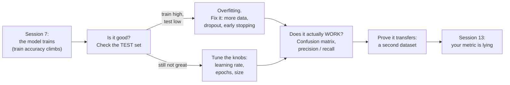

# Session 8 Overview — From "It Trains" to "It's Actually Good"

Session 7 ended on a small victory: a network that learns. You loaded RGB colours, built a `3 → 3 → 1` model in a few lines of Keras, called `fit()`, and watched training accuracy climb from chance toward the high 90s. That is a real milestone — but it is also where most tutorials stop, and it is exactly where the interesting engineering *starts*.

The uncomfortable truth this session teaches: **a high training accuracy is not evidence that your model is good. It might just be evidence that your model has memorised the answers.** The whole discipline of "making it better" is about telling those two situations apart, and then doing something about it.

## The arc of this session

## What each part is for

| Part | File | The question it answers |
|---|---|---|
| Overfitting made visible | `01-overfitting-made-visible.md` | How do I *see* that my model memorised instead of learned? |
| Fixing overfitting | `02-fixing-overfitting.md` | Given the gap, what do I actually change — and does it work? |
| Tuning the knobs | `03-tuning-the-knobs.md` | Learning rate, epochs, size — which way do I turn each, and what breaks at the extremes? |
| Confusion matrix & metrics | `04-confusion-matrix-and-metrics.md` | A single accuracy number is flattering. How do I tell whether the model *actually* works? |
| Proving it transfers | `05-proving-it-transfers.md` | Was this workflow specific to one toy dataset, or is it the real job? |
| Key takeaways | `99-key-takeaways.md` | If I remember one thing… |

## Why this matters to your role

- **Developers:** these are the four or five moves you will actually make on every model you ever train. Overfit, diagnose, regularise, tune, and *measure honestly*. The lab gives you a notebook that is a template for real work.
- **Release / problem / configuration managers:** you rarely train the model, but you constantly **receive its numbers** — in a status report, a vendor pitch, a go/no-go review. `content/04` is written for you. After it, "the model is 97% accurate" is a question, not an answer: 97% *at what*, on *which* data, and *which* errors did it make? That instinct is the entire point of Session 13, and it starts here.

## The honest framing

Machine-learning practitioners are, in Andrew Ng's phrase, "really good at doing well on a test set" — and deploying a real system takes a great deal more than that. This session does not pretend otherwise. What it does is give you the *first* honest instrument: the ability to look past a headline accuracy at the structure of a model's mistakes. That instrument is cheap, universal, and almost always skipped. Skipping it is how a model that "reports a nice number" ends up failing on exactly the cases you cared about.

> **Source honesty:** the topic set here is drawn from Thomas Nield's *Deep Learning for Beginners, Day 3* (O'Reilly, all-rights-reserved — we link it, we do not copy it). The source uses **mean-squared-error loss with a sigmoid classifier** and its labs ran on the now-dead **Katacoda** platform; we correct the first to the conventional **binary cross-entropy** and replace the second with fresh Colab code. Both corrections are flagged where they occur.
