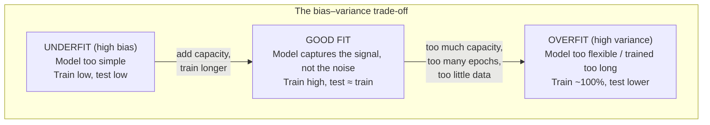
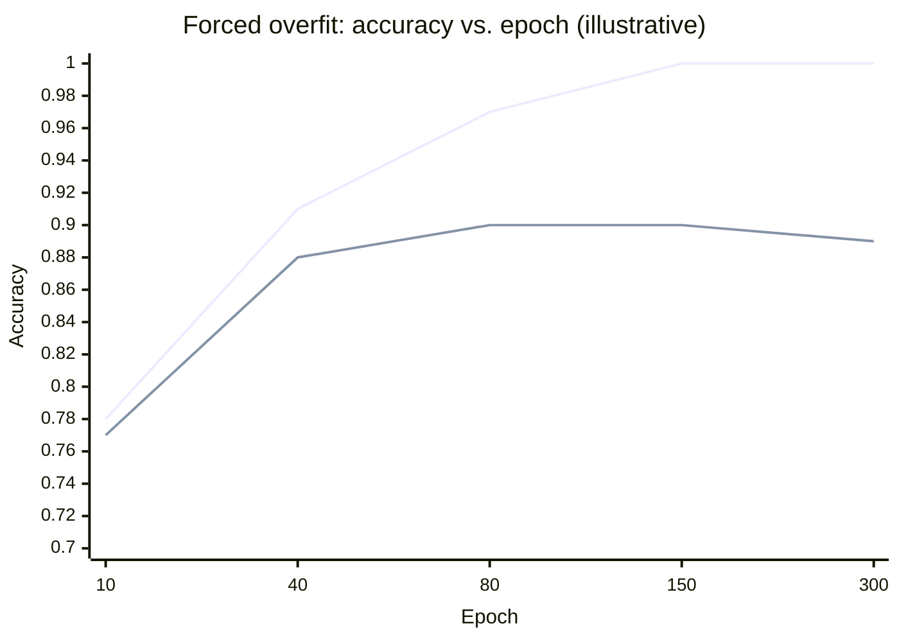
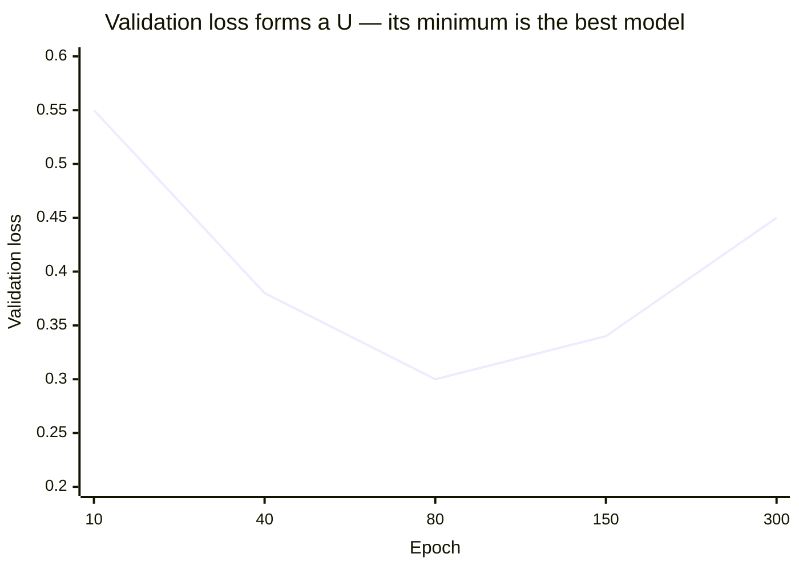

# Overfitting, Made Visible

Overfitting is the single most important failure mode in supervised learning, and the good news is that it is *observable*. You do not need theory to catch it — you need two numbers, watched over time.

## The definition, and the one diagnostic

**Overfitting means the model performs well on the data it was trained on but fails to predict correctly on new data.** It has learned the training set — including its noise and its accidents — instead of the underlying pattern that would generalise.

The diagnostic is a single comparison:

> Train the model. Score it on the **training set** and on a held-out **test (validation) set**. If the training score is high and the test score is meaningfully lower, you are overfitting.

That gap — train minus test — is the thing you watch. A caveat worth stating up front: a low test score can *also* mean there is simply no learnable signal in your data ("or just no correlation altogether"). The train-vs-test gap distinguishes the two: overfitting is *high train, low test*; no-signal is *low train, low test*.

## Why neural networks overfit so readily

This is a bias–variance story.

| | **High bias** (underfit) | **High variance** (overfit) |
|---|---|---|
| Behaviour | Commits to a rigid shape (e.g. a straight line) regardless of the data | Bends to fit every point, including noise |
| Example model | Linear / logistic regression | A large neural network trained too long |
| On training data | Mediocre | Excellent |
| On new data | Mediocre (consistently) | Poor (erratic) |
| Sensitivity to outliers | Low | High |

Linear and logistic regression are *highly biased* methods — they are resilient to overfitting because they prioritise a method (stay a straight line) over bending to the data. **Neural networks are the opposite: they are flexible enough to fit almost anything, which is exactly why they can memorise instead of generalise.** Flexibility is the feature *and* the hazard.

## Making it visible: the recipe

You can *force* a network to overfit — which is the best way to learn to recognise it. The recipe is three ingredients, any one of which pushes toward memorisation, all three together guarantee it:

1. **Too little data** — a handful of training rows, so the network can literally memorise each one.
2. **Too much capacity** — a large network (many, wide layers) with far more parameters than the data can constrain.
3. **Too much training** — many epochs, so the optimiser keeps grinding down training error long after generalisation has peaked.

In the lab we take Session 7's colour dataset, keep only ~60 training rows, blow the network up to `3 → 256 → 256 → 1`, and train for 300 epochs. The result is the canonical overfitting signature.

## Reading the curve

The instrument is a plot of accuracy (or loss) versus epoch, **one line for training, one for validation**. Keras hands you both if you pass `validation_data` to `fit()` and keep the returned `history`.

Here is the signature of overfitting as a table of what those two lines do over training (illustrative values from the lab's forced-overfit run — your exact numbers vary with random initialisation):

| Epoch | Train accuracy | Validation accuracy | Gap | Reading |
|---|---|---|---|---|
| 10 | 0.78 | 0.77 | 0.01 | Both still learning — healthy |
| 40 | 0.91 | 0.88 | 0.03 | Fine |
| 80 | 0.97 | 0.90 | 0.07 | Gap opening — watch it |
| 150 | 1.00 | 0.90 | 0.10 | Train perfect, val stalled — overfitting |
| 300 | 1.00 | 0.89 | 0.11 | Train memorised; val *drifting down* — clearly overfit |

The same story as a curve:

Three things to notice, because they are the whole diagnosis:

1. **Early on, the two lines move together.** While the model is learning the real pattern, it helps on both sets. There is nothing wrong here.
2. **They separate.** At some epoch, training accuracy keeps rising but validation accuracy flattens. That separation point is where the model stops learning the *signal* and starts memorising the *sample*.
3. **Validation can turn *down*.** In the worst case validation accuracy actively degrades while training accuracy sits at 1.00 — the model is now getting worse at the only thing that matters (new data) in exchange for looking perfect on data it has already seen.

> **If you take one image from this session, take this one:** two lines that start together and then split apart. The split is overfitting. Everything in `02-fixing-overfitting.md` is a way to keep those two lines together for longer.

## The loss view (often clearer than accuracy)

Accuracy is a step function of the underlying probabilities, so it can look flat while things are quietly getting worse. **Validation *loss* usually shows the turn earlier and more sharply than validation accuracy** — it often forms a clean "U": down while learning, then a minimum, then rising as the model overfits. The bottom of that U is the model you actually want (and is exactly what early stopping, in the next file, reaches for).

## Why we don't just trust training accuracy

Because training accuracy answers the wrong question. It measures *"can the model reproduce answers it has already seen?"* — and a large enough network can always answer yes, up to 100%, by memorisation. The only question that predicts field behaviour is *"can it answer questions it has never seen?"*, and that is what the held-out set is for. This is the same instinct that `content/04` applies to a single accuracy number: **the flattering measurement is rarely the one that tells you what you need to know.**

---

**Next:** `02-fixing-overfitting.md` — given the gap, three concrete remedies and how to check each one worked.
