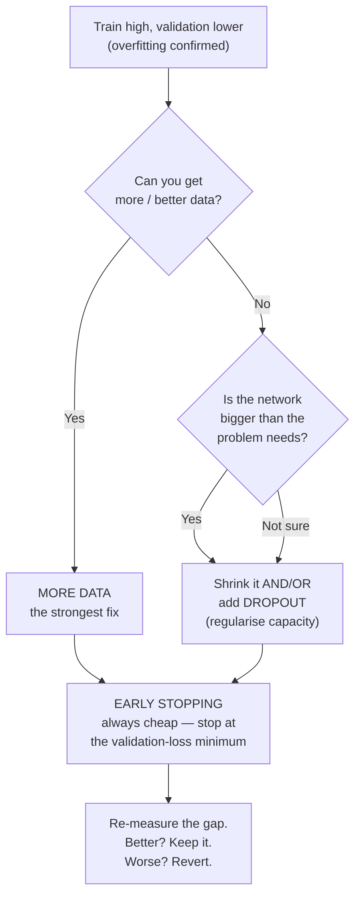
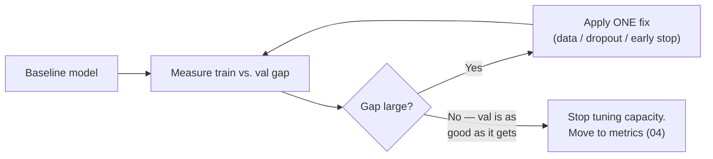

# Fixing Overfitting

You have the gap (`01`). Now you close it. There are three moves you will reach for constantly, in a natural order of preference, plus a few honourable mentions. The discipline is not "apply all of them" — it is **change one thing, re-measure the gap, keep what helped.**

## The decision, in one picture



## Fix 1 — More data (the strongest fix)

Overfitting is fundamentally a mismatch between model capacity and data quantity: too much freedom, too few examples to pin it down. The most reliable cure is to add examples. More data gives the optimiser more constraints, so the only way to reduce training error is to find a pattern that is *actually there* — memorising individual rows stops paying off.

In the lab this is dramatic: the forced overfit used only ~60 training rows. Restoring the full training set (roughly a thousand rows) closes most of the gap on its own, with no other change.

| Configuration | Train acc | Val acc | Gap |
|---|---|---|---|
| 60 training rows (forced overfit) | 1.00 | 0.90 | 0.10 |
| Full training set (~1000 rows) | 0.97 | 0.96 | 0.01 |

**Caveats that matter in the real world:**

- More data helps only if it is *representative* of what you will see in production. A thousand more rows from the same narrow slice fixes nothing (this is selection bias, revisited in Session 13).
- Data is often the expensive part. Labelled data frequently has to be created by hand — "an open secret" of ML projects is the manual labelling cost. When you can't buy more data, you fall to Fixes 2 and 3.
- **Data augmentation** is "more data" for free: generating plausible variants of what you have (for images: crops, flips, brightness shifts). It is not covered in this lab but is the same idea.

## Fix 2 — Dropout (regularise the capacity you have)

When you can't add data, reduce the model's ability to memorise. **Dropout** does this with a trick that sounds destructive and works beautifully: during each training step, randomly "drop" (set to zero) a fraction of the neurons in a layer.

Why that helps: if any single neuron can be switched off at random, the network cannot rely on one neuron memorising one training example. It is forced to spread the representation across many neurons — to learn *redundant, robust* features rather than brittle, memorised ones. It is often described as training a large ensemble of smaller networks that share weights.

```python
from tensorflow.keras.models import Sequential
from tensorflow.keras.layers import Dense, Dropout

model = Sequential([
    Dense(256, activation="relu", input_shape=(3,)),
    Dropout(0.4),                 # drop 40% of this layer's activations each step
    Dense(256, activation="relu"),
    Dropout(0.4),
    Dense(1, activation="sigmoid"),
])
# Dropout is ACTIVE during fit() and AUTOMATICALLY OFF during predict()/evaluate().
# You never turn it off by hand — Keras handles train vs. inference mode.
```

Key facts to internalise:

- The **rate** (here `0.4`) is the fraction dropped. Typical values are `0.2`–`0.5`. Too high and the network can't learn (underfitting); too low and it barely regularises.
- Dropout is **on during training, off at inference**. Keras switches automatically. This is why you may see *training* accuracy *below* validation accuracy with heavy dropout — training is handicapped on purpose, evaluation is not. That inversion is a feature, not a bug.
- Dropout is a "free" fix in the sense that it needs no new data — you are trading a little training-time capacity for generalisation.

## Fix 3 — Early stopping (stop at the U's minimum)

Recall from `01` that validation loss usually forms a "U": it falls while the model learns, bottoms out, then rises as the model overfits. **Early stopping simply stops training at that minimum** instead of grinding on to epoch 300.

```python
from tensorflow.keras.callbacks import EarlyStopping

early = EarlyStopping(
    monitor="val_loss",        # watch validation loss (the U)
    patience=15,               # allow 15 epochs of no improvement before stopping
    restore_best_weights=True, # roll back to the best epoch, not the last one
)

history = model.fit(
    X_train, y_train,
    validation_data=(X_val, y_val),
    epochs=300,                # an UPPER BOUND now — early stopping ends it sooner
    batch_size=32,
    callbacks=[early],
    verbose=0,
)
# Example: "Restoring model weights from the end of the best epoch: 88."
# Training stops around epoch 103 (88 + 15 patience) instead of running all 300.
```

The two settings that matter:

- **`patience`** — how many epochs of no improvement to tolerate before giving up. Too small and you stop on a random wobble; too large and you waste time overfitting past the minimum. `10`–`20` is a common range for small models.
- **`restore_best_weights=True`** — *always set this.* Without it, you keep the weights from the last (worse) epoch rather than the best one. This one flag is the difference between early stopping and "just training for fewer epochs and hoping."

Early stopping is the cheapest fix of all — it needs no new data, no architecture change, and it also saves training time. **Turn it on by default.** It converts "how many epochs?" from a guess into something the validation set decides for you.

## What NOT to do (the anti-fixes)

| Tempting move | Why it's wrong |
|---|---|
| Train for *more* epochs to push validation up | Once the U has turned, more epochs make validation *worse*. You are optimising the wrong number. |
| Make the network bigger to "learn harder" | More capacity is *more* overfitting, not less, when data is the bottleneck. |
| Judge the fix by training accuracy | Training accuracy going up is meaningless. **Only the gap and the validation score tell you if a fix worked.** |
| Tune on the *test* set until it looks good | You've now overfit to the test set. Keep a final, untouched set (Session 3's three-way split). More on this in Session 13. |

## The workflow that ties them together



The order in practice: **turn on early stopping always** (it costs nothing), **add data if you can** (best fix), **add dropout / shrink the net if you can't** (when data is fixed). After each change, look only at the gap and the validation score. In the lab, the three fixes together take the forced-overfit model from a 0.10 gap back to roughly 0.01 — the two lines are together again.

---

**Next:** `03-tuning-the-knobs.md` — the model no longer memorises; now make it learn *well*.
