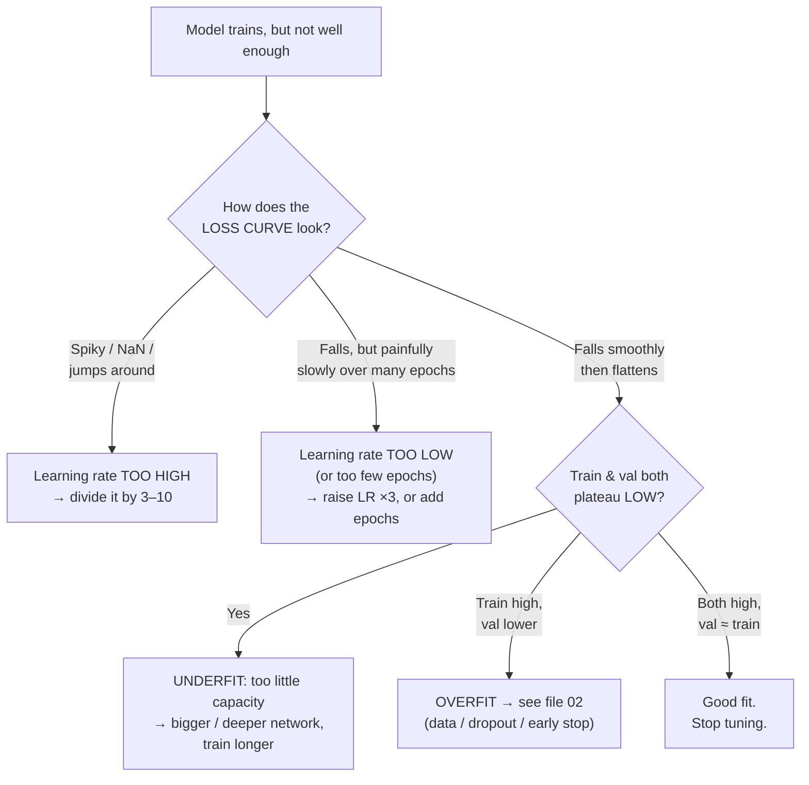
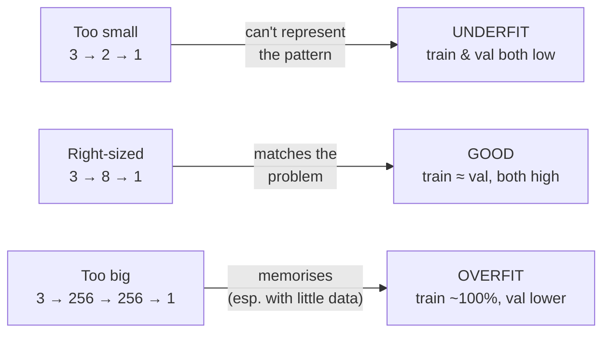

# Tuning the Knobs That Matter

Fixing overfitting keeps the model honest. **Tuning** makes it good. There are dozens of hyperparameters you *could* touch; three account for most of the outcome and are the ones to learn first: **learning rate, number of epochs, and network size.** For each, the lesson is the same shape — there is a failure mode at *each* extreme, and the sweet spot is found by watching the validation curve, not by faith.

A word on vocabulary: **parameters** are what the model learns (the weights). **Hyperparameters** are what *you* set before training (learning rate, epochs, layer sizes, dropout rate, batch size). Tuning is the search over hyperparameters.

## The tuning decision flowchart



## Knob 1 — Learning rate (the most consequential, and the most abused)

The learning rate controls **how big a step** gradient descent takes down the loss surface at each update. It is, empirically, the hyperparameter that most often decides whether training works at all.

The intuition from Session 7's "giant vs. ant" image: too big a step and you crash over the valley; too small and you take a thousand years to reach the bottom.

| Learning rate | Symptom on the loss curve | What's happening |
|---|---|---|
| **Too high** (e.g. 1.0) | Loss spikes, oscillates, or becomes `NaN` | Steps overshoot the minimum, bounce off the walls, diverge |
| **A bit high** | Loss falls fast then plateaus *high* and jitters | Converges quickly to a mediocre spot, can't settle |
| **Good** (often ~1e-3) | Loss falls smoothly and settles low | Steps are the right size |
| **Too low** (e.g. 1e-6) | Loss falls, but agonisingly slowly | Correct direction, tiny steps — needs far more epochs |

```python
from tensorflow.keras.optimizers import Adam

model.compile(
    optimizer=Adam(learning_rate=1e-3),   # the knob. Adam's default is 1e-3 — a sane start.
    loss="binary_crossentropy",           # conventional for binary classification (see note below)
    metrics=["accuracy"],
)
```

Practical rules:

- **Start at Adam's default `1e-3`.** Adam adapts the *per-parameter* step internally, which makes it forgiving — but the base learning rate still matters.
- **Tune it by factors of ~3 or 10**, not by small nudges: `1e-2 → 3e-3 → 1e-3 → 3e-4`. The effect is multiplicative, so search multiplicatively.
- **If loss goes to `NaN`, the learning rate is (almost always) too high.** This is the single most common training failure and the first thing to check.

> **Correction flagged from the source deck:** the original *DL for Beginners* code pairs **mean-squared-error loss with a sigmoid/softmax classifier**. That works but is unconventional; the standard choice for binary classification is **`binary_crossentropy`** (and `categorical_crossentropy` for multi-class), which we use throughout. It gives cleaner gradients and better-calibrated probabilities. This is noted in `AI_input.md` §5 as a deliberate source simplification worth fixing on reuse.

## Knob 2 — Epochs (how many passes over the data)

One **epoch** is one full pass through the training set. More epochs = more learning, up to a point — and past that point, overfitting (`01`).

| Epochs | Result |
|---|---|
| Too few | **Underfit** — training stopped before the model finished learning the signal. Train *and* val both low. |
| About right | Val loss at its minimum (the bottom of the "U"). |
| Too many | **Overfit** — training accuracy keeps rising, val loss climbs back up. |

**The clean resolution:** you should almost never tune epochs by hand. Set `epochs` to a generous upper bound and let **`EarlyStopping`** (from `02`) pick the real number by watching validation loss. That converts a guess into a measurement. Hand-tuning epochs is what you do only when you *want* to force a particular behaviour — as we do in the lab to make overfitting visible.

## Knob 3 — Network size (capacity)

Size means **how many layers (depth) and how many neurons per layer (width)** — together, how many parameters the model has, i.e. how much it can represent.



- **Too small:** the network literally cannot express the decision boundary the problem needs. Both scores plateau low — no amount of training or data helps. The fix is more capacity.
- **Too big:** more capacity than the data can constrain → memorisation → overfitting. The fix is less capacity *or* more data/dropout.
- **Right-sized** is problem-dependent, and you find it by search. A sane strategy: **start small, grow until validation stops improving, then stop.** For the colour dataset, a single hidden layer of ~8 units is plenty; `256 → 256` is absurd overkill (which is exactly why we use it to force overfitting).

**Capacity and data are coupled.** A big network is fine *if* you have the data to constrain it. This is why "just make it bigger" is not a universal fix — bigger only helps when you are underfitting, and hurts when you are data-limited.

## How to tune without fooling yourself

Two failure modes to avoid:

1. **Changing several knobs at once.** Then you don't know which one helped. Change one, re-measure, decide, repeat.
2. **Tuning against the test set until it looks good.** Every time you look at the test set and react, you leak a little information into your choices — you are slowly overfitting to it. Keep a **final hold-out set** you touch exactly once (Session 3's three-way split; Session 13's "your metric is lying").

A minimal, honest tuning loop (the lab implements this):

```python
# Sweep ONE knob, hold everything else fixed, read the validation score.
for lr in [1e-1, 1e-2, 1e-3, 1e-4]:
    model = build_model(learning_rate=lr)          # same architecture each time
    h = model.fit(X_train, y_train,
                  validation_data=(X_val, y_val),
                  epochs=100, batch_size=32, verbose=0)
    print(f"lr={lr:<6} -> val_acc={h.history['val_accuracy'][-1]:.3f}")

# Example output (illustrative — yours will vary):
# lr=0.1    -> val_acc=0.812   (too high: jittery, mediocre)
# lr=0.01   -> val_acc=0.955
# lr=0.001  -> val_acc=0.962   (best here)
# lr=0.0001 -> val_acc=0.905   (too low for only 100 epochs: underfit)
```

That table — one column of knob values, one column of validation scores — *is* hyperparameter tuning at its most basic. Grid search, random search, and Bayesian optimisation are just automated, larger versions of the same loop. The instinct is what matters: **turn the knob, watch the honest number, keep what helps.**

---

**Next:** `04-confusion-matrix-and-metrics.md` — the model is trained and tuned. Now the hardest question: does it actually *work*?
