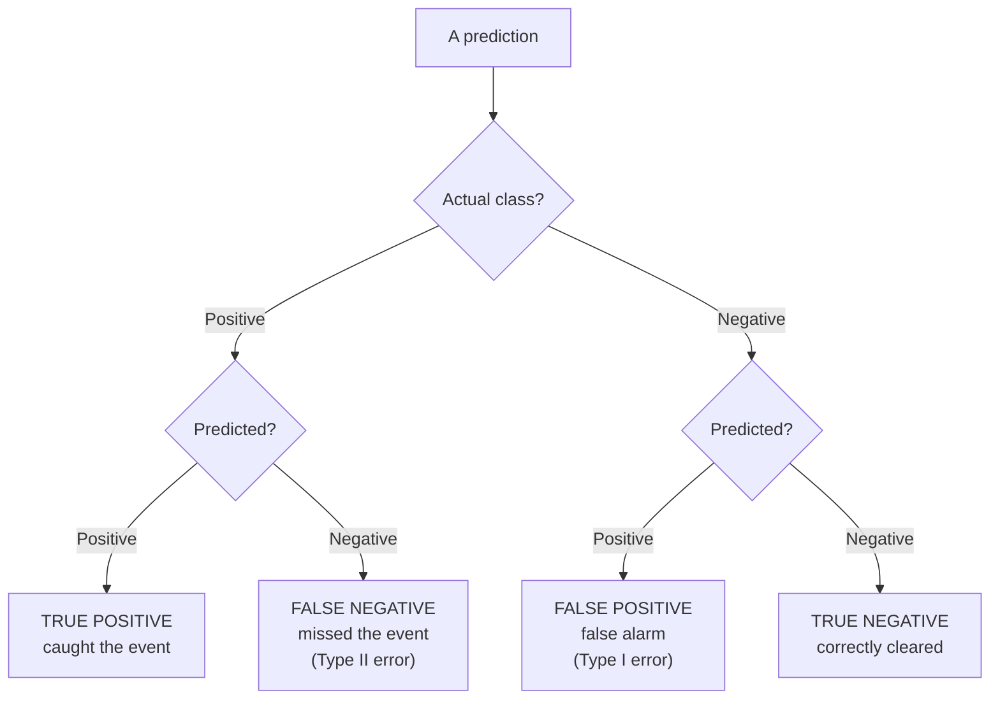
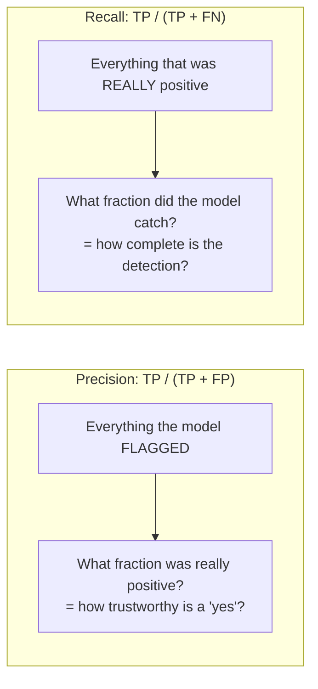
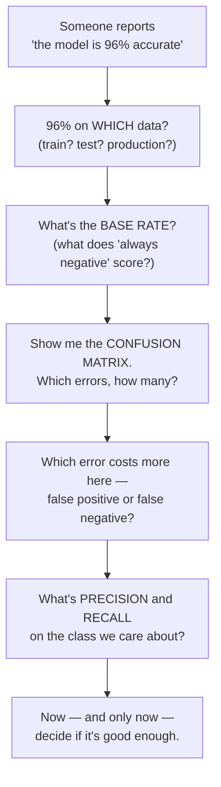

# The Confusion Matrix, Precision & Recall — Telling Whether a Model Actually Works

This is the most important file in the session, and the one written for *everyone* — you do not have to train a model to be handed its accuracy number and asked to make a decision on it. The core claim: **a single accuracy number is a headline, not the story. To know whether a model works, you have to look at the structure of its mistakes.** The confusion matrix is how you look.

## Why accuracy alone lies: the "predict Michael" parable

A model is asked to predict which employees will quit. It notices that a person named "Michael" once quit, and learns the rule: *"anyone named Michael will quit; everyone else will stay."* In a company of 100 people with one Michael, a *different* employee actually quits.

Score it: the model was wrong about Michael (predicted quit, he stayed) and wrong about the person who did quit (predicted stay, she left). It got **every case it cared about wrong** — and it still reports **98% accuracy**, because it correctly predicted "stay" for the 98 uneventful people.

Push it further: if 99% of employees never quit, a model that predicts *"nobody ever quits"* scores **99% accuracy** while being utterly useless. This is the trap: **when the event you care about is rare, accuracy rewards ignoring it.** Rare events are the norm in the things that matter — disease, fraud, security breaches, equipment failure, attrition. (This framing is paraphrased from Thomas Nield's *DL for Beginners*, all-rights-reserved — the concept, retold in our words.)

The fix is to stop collapsing performance into one number and instead count the *four kinds of outcome* separately.

## The confusion matrix

For a binary classifier, every prediction falls into one of four cells, formed by crossing **what was true** with **what the model said**. First, fix which class is "positive" — the event of interest, the thing you are trying to *detect* (quitting, malignant, fraud). Then:

| | **Predicted POSITIVE** | **Predicted NEGATIVE** |
|---|---|---|
| **Actually POSITIVE** | **TP** — true positive (caught it) | **FN** — false negative (missed it) · *Type II error* |
| **Actually NEGATIVE** | **FP** — false positive (false alarm) · *Type I error* | **TN** — true negative (correctly cleared) |



The two error cells are **not interchangeable**, and which one hurts depends entirely on the application:

- A **false negative** on a cancer screen is a missed tumour — potentially fatal.
- A **false positive** on the same screen is an unnecessary follow-up biopsy — costly and frightening, but not fatal.
- For a spam filter, the trade flips: a false positive (a real email sent to spam) is worse than a false negative (one spam in the inbox).

**You cannot know whether a model is "good" until you know which error it makes and which error your problem punishes.** Accuracy hides this completely.

## The Michael matrix, worked

Filling the four cells for the parable (positive = "quits"):

| | Predicted: will quit | Predicted: will stay |
|---|---|---|
| **Actually quit** | 0 (TP) | 1 (FN) |
| **Actually stayed** | 1 (FP) | 98 (TN) |

Now derive every metric from these four numbers.

## The metrics, from the four cells

| Metric | Formula | Reads as | Michael value |
|---|---|---|---|
| **Accuracy** | (TP + TN) / all | "Overall, how often right?" | (0+98)/100 = **0.98** |
| **Precision** | TP / (TP + FP) | "When it *says* positive, how often is it right?" | 0/(0+1) = **0.00** |
| **Recall** (sensitivity) | TP / (TP + FN) | "Of the actual positives, how many did it catch?" | 0/(0+1) = **0.00** |
| **Specificity** | TN / (TN + FP) | "Of the actual negatives, how many did it clear?" | 98/(98+1) = **0.99** |
| **F1 score** | 2·(P·R)/(P + R) | "Harmonic mean of precision & recall" | **undefined** (P=R=0) |

The punchline in one line: **accuracy 0.98, precision 0, recall 0.** The model is a total failure at the only job it had — detecting quitting — and its accuracy score cheerfully hides that. This is why professionals never report accuracy alone for a classification problem.

### Precision vs. recall — the one distinction to keep

These two are the workhorses, and they answer different questions about the *positive* predictions:

- **Precision** = of the cases the model *flagged*, what fraction were real? Low precision = **noisy, lots of false alarms.** You care about precision when acting on a positive is expensive (every flag triggers a costly investigation).
- **Recall** = of the cases that *were* real, what fraction did the model catch? Low recall = **it misses things.** You care about recall when *missing* a positive is expensive (a missed tumour, an undetected breach).



**Precision and recall trade off.** Flag more aggressively → catch more real positives (recall up) but raise false alarms (precision down). Flag conservatively → the reverse. You cannot usually maximise both; you choose the balance your problem demands. **F1** is a single number that rewards having both reasonably high (it is the *harmonic* mean, so it collapses toward the smaller of the two — you cannot game F1 by acing one and failing the other).

## The threshold: where the trade-off lives

A classifier does not actually output "yes/no." It outputs a **probability** (the sigmoid gives a number in 0–1). You turn that into a decision by comparing it to a **threshold**, conventionally `0.5`:

```python
probs = model.predict(X_test)          # e.g. 0.12, 0.83, 0.49, 0.51, ...
preds = (probs >= 0.5).astype(int)     # the 0.5 is a CHOICE, not a law of nature
```

**That 0.5 is a dial, not a constant.** Moving it slides you along the precision/recall trade-off:

| Threshold | Effect | Precision | Recall |
|---|---|---|---|
| Lower (e.g. 0.3) | Flag more cases as positive | ↓ (more false alarms) | ↑ (miss fewer) |
| 0.5 | Default | — | — |
| Higher (e.g. 0.7) | Flag only when very confident | ↑ (fewer false alarms) | ↓ (miss more) |

For a cancer screen you would *deliberately lower* the threshold: you accept more false positives (extra biopsies) to raise recall (miss fewer tumours). The "right" threshold is a business/clinical decision about the relative cost of the two errors — **not something the model can decide for you.** (Sweeping the threshold across all values and plotting the trade-off gives the **ROC curve**, and the area under it — **AUC** — summarises a model across all thresholds. ROC/AUC is the natural next step, covered where model comparison matters; the key idea here is that the threshold is yours to set.)

## Doing it in code: `sklearn.metrics`

You never compute these by hand in practice — scikit-learn (`sklearn.metrics`, BSD-3) does it, and the same functions work for *any* classifier, Keras or otherwise. This is the exact code from the lab:

```python
from sklearn.metrics import (confusion_matrix, classification_report,
                             precision_score, recall_score, f1_score,
                             ConfusionMatrixDisplay)

probs = model.predict(X_test).ravel()
preds = (probs >= 0.5).astype(int)

cm = confusion_matrix(y_test, preds)
print(cm)
# Example (breast-cancer test set, positive = malignant):
# [[40  3]    <- 43 actually malignant: 40 caught (TP), 3 MISSED (FN)
#  [ 2 69]]   <- 71 actually benign:    2 false alarms (FP), 69 cleared (TN)

print(classification_report(y_test, preds,
                            target_names=["malignant", "benign"]))
# Example output (illustrative — your numbers vary with random init):
#               precision    recall  f1-score   support
#    malignant       0.95      0.93      0.94        43
#       benign       0.96      0.97      0.96        71
#     accuracy                           0.96       114
#    macro avg       0.96      0.95      0.95       114
# weighted avg       0.96      0.96      0.96       114
```

Read that report the way a professional does: **96% accuracy looks great — but recall on malignant is 0.93, meaning the model missed 3 of 43 cancers.** Whether 93% recall is acceptable is a decision no accuracy number can make for you. That is the entire lesson.

> **A trap to teach explicitly:** in scikit-learn's bundled breast-cancer data, the label encoding is **0 = malignant, 1 = benign** — so "class 1" is the *benign* (negative) case, not the positive one. If you compute `recall_score(y_test, preds)` without specifying `pos_label`, you get recall for class 1 (benign), which is the wrong number to worry about. Always confirm which class is "positive" before reading any precision/recall value. Getting this backwards is a classic, silent error.

## Precision / recall / F1 — a comparison across models

The reason to compute all of these, rather than one, is that they rank models *differently*. Consider three hypothetical models on the same rare-event problem (positive = the rare event, ~5% of cases):

| Model | Accuracy | Precision | Recall | F1 | Verdict |
|---|---|---|---|---|---|
| A — "always predict negative" | **0.95** | 0.00 | 0.00 | 0.00 | Useless. High accuracy is pure base rate. |
| B — aggressive flagger | 0.82 | 0.20 | **0.95** | 0.33 | Catches almost everything, drowns in false alarms. |
| C — balanced | 0.93 | **0.71** | 0.78 | **0.74** | The only genuinely useful model. |

Ranked by **accuracy**, Model A "wins" — and it is worthless. Ranked by **recall**, Model B wins — and it is impractical. Ranked by **F1**, Model C wins, which matches judgement. **The metric you rank by determines which model you ship.** Choosing that metric to match the real cost of errors is the actual skill — and choosing it *badly*, or letting a vendor choose it for you, is exactly the failure Session 13 dissects.

## What to carry into every model review



Those five questions are the deliverable of this session for a non-coding audience. You will use them in vendor evaluations, go/no-go reviews, and status meetings for the rest of your career. A model that "reports a nice number" cannot survive them — which is the whole point.

---

**Next:** `05-proving-it-transfers.md` — was any of this specific to one dataset, or is it the job?
