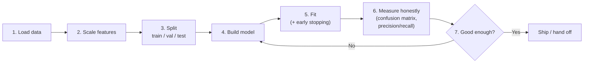
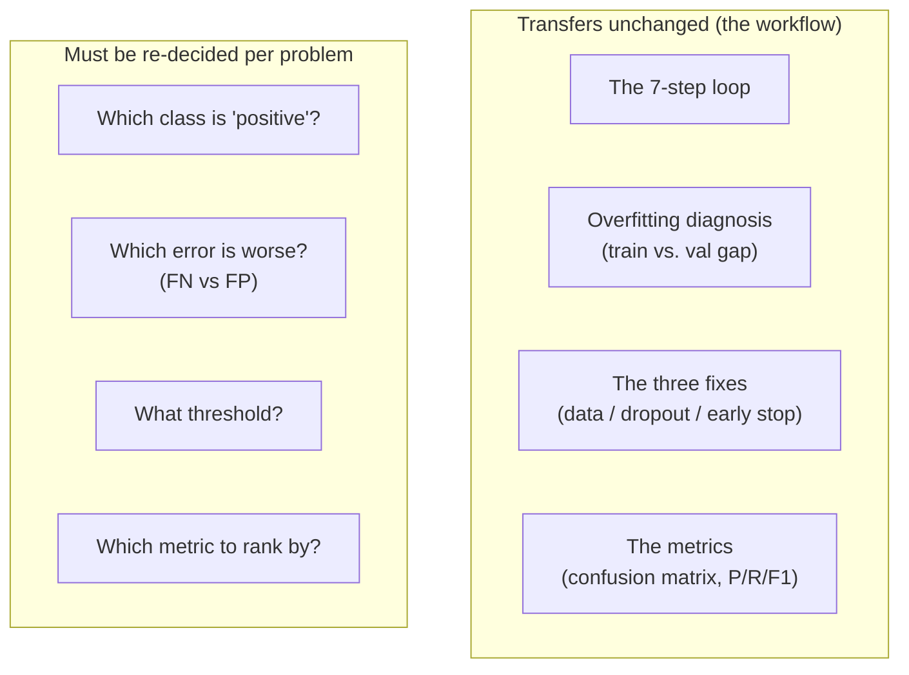

# Proving the Workflow Transfers

A fair objection after the first four files: *"Did all of this just work because the colour dataset is a toy?"* The answer is the point of this file — **the workflow is the deliverable, not the dataset.** We take the exact same moves to a completely different problem and watch them still hold. If they didn't transfer, they wouldn't be worth learning.

## The workflow, stated once, dataset-free

Everything in Sessions 7–8 reduces to a seven-step loop that does not care what the data is:



Notice what is *not* in that loop: anything about colours, or fonts, or the specific problem. The loop is the job. In this session's second half we run it on scikit-learn's bundled **breast-cancer dataset** — 569 tumours, 30 numeric measurements each (radius, texture, perimeter, …), labelled malignant or benign. It ships with the library (BSD-3, no download), which makes it slide-safe and reproducible, and — unlike coloured fonts — it has *stakes*, which is exactly what makes the metrics half land.

## Same code, different data

Here is the whole transfer, side by side with what changed:

| Step | Colour dataset (Session 7) | Breast-cancer dataset | What changed |
|---|---|---|---|
| Load | `read_csv(url)` | `load_breast_cancer()` | source only |
| Features | 3 (R, G, B) | 30 (cell measurements) | `input_shape=(30,)` |
| Scale | `/ 255` (known range) | `StandardScaler` (unknown ranges) | scaler, not division |
| Split | train / val / test | train / val / test | identical |
| Build | `Dense … sigmoid` | `Dense … sigmoid` | just the input width |
| Fit | `fit(... EarlyStopping)` | `fit(... EarlyStopping)` | identical |
| Measure | confusion matrix, P/R | confusion matrix, P/R | identical |

The model definition changes by a single number — the input width — and the loss, optimiser, callbacks, and every metric call are byte-for-byte the same:

```python
from sklearn.datasets import load_breast_cancer
from sklearn.preprocessing import StandardScaler
from sklearn.model_selection import train_test_split

data = load_breast_cancer()
X, y = data.data, data.target          # X: (569, 30), y: 0=malignant, 1=benign

X_train, X_test, y_train, y_test = train_test_split(
    X, y, test_size=0.2, stratify=y, random_state=42)   # stratify: keep class ratio

scaler = StandardScaler().fit(X_train)  # FIT on train only, then apply to both
X_train = scaler.transform(X_train)     # (never fit the scaler on the test set —
X_test  = scaler.transform(X_test)      #  that leaks test information into training)

# ...the model, compile, fit, and metrics code is exactly the colour-dataset code,
#    with input_shape=(30,) instead of (3,).
```

## The one genuinely new idea: scaling unknown ranges

The colour data had a known range (0–255), so we scaled by dividing by 255. The 30 tumour features have *wildly different* ranges — some are small decimals, some are in the hundreds — and we don't know them in advance. **`StandardScaler`** handles this generally: it rescales each feature to mean 0, standard deviation 1 (a z-score), so no single large-valued feature dominates the gradient just because of its units.

Two rules that matter more than the mechanics:

1. **Fit the scaler on the training set only, then apply it to test.** Fitting on all the data (or on the test set) leaks information about the test distribution into training — a subtle form of the cheating we warned about in `03`. This is one of the most common real-world data-leakage bugs.
2. **Scaling is a modelling choice, not a ritual.** Neural networks and distance-based methods (k-NN) usually need it; tree-based methods (Session 5) don't. Scale because the model benefits, not by reflex.

## What transfers, and what you have to re-decide



The **mechanics** transfer for free — that is why they are worth learning once. The **judgements** do not, and *must not*: they depend on what the errors cost in *this* problem. On the colour dataset, a wrong font colour is cosmetic — precision and recall barely matter, any of them is "fine." On the breast-cancer data, a false negative is a missed cancer — recall on the malignant class is the number you live or die by, and 96% accuracy is not reassuring if it hides three missed tumours out of forty-three (see `04`).

**That contrast is the lesson.** Same code, same accuracy-looks-great, completely different stakes — and only the confusion matrix tells them apart. A practitioner who runs the loop but skips the honest measurement will ship both models with equal confidence, and be right about one of them by luck.

## Why this sets up the rest of the course

- **Session 13 ("your metric is lying")** takes the base-rate problem to its conclusion: a vendor reports 99% on their own test sample, and outside data reveals the real-world number is about 14% (the source deck prints 3.39% — Session 13 corrects it live, and the correction is the best part). You now have the exact tools — base rate, confusion matrix, precision — to see through it.
- **Session 14 (risk & mitigation)** treats "which error is worse" as a safety question, not just a metric.
- Every hands-on model you build after this uses the seven-step loop. It is the closest thing this course has to a universal procedure.

---

**Next:** `99-key-takeaways.md` — the whole session in a page.
