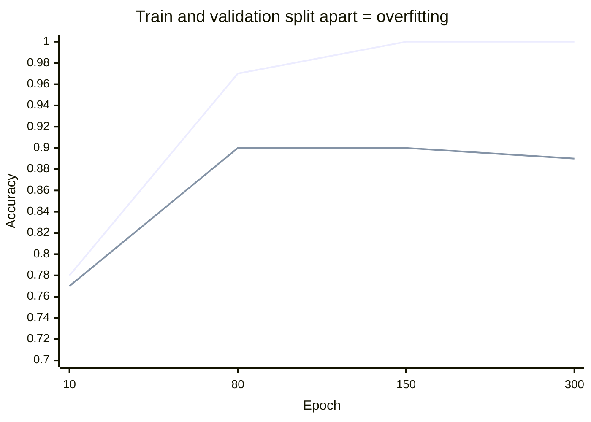

# Key Takeaways — Session 8

A one-page recap. If you read nothing else, read this.

## The five things

1. **A high training accuracy proves nothing.** It can mean the model learned, or it can mean the model memorised. The only way to tell is to score a held-out **test set** and look at the gap.
2. **Overfitting is visible and fixable.** Two lines — train and validation — that start together and split apart *is* overfitting. Close the gap with, in order of preference: **more data**, **dropout**, **early stopping** (turn early stopping on by default).
3. **Three knobs carry most of the outcome.** **Learning rate** (too high → diverges/`NaN`; too low → crawls), **epochs** (let early stopping choose them), **network size** (too small → underfit; too big → overfit). Change one at a time; watch the honest number.
4. **Accuracy is a headline, not the story.** A single number hides *which* mistakes a model makes. The **confusion matrix** shows the four outcomes; **precision** ("when it says yes, is it right?") and **recall** ("of the real positives, how many did it catch?") tell you if it works. Which one matters depends on **which error costs more**.
5. **The workflow transfers; the judgements don't.** Load → scale → split → build → fit → *measure honestly* → repeat is the same on every dataset. But which class is "positive," which error is worse, and what threshold to set must be re-decided per problem, based on real costs.

## The two pictures to keep

**Overfitting** — the split:

**The confusion matrix** — where accuracy hides the truth:

| | Predicted positive | Predicted negative |
|---|---|---|
| **Actually positive** | TP (caught) | **FN (missed)** ← the cell accuracy hides |
| **Actually negative** | FP (false alarm) | TN (cleared) |

## The five questions to ask about any reported number

You will use these in vendor pitches, go/no-go reviews, and status meetings:

1. **On which data** was that accuracy measured — train, test, or production?
2. **What's the base rate** — what would "always predict the common class" score?
3. **Show me the confusion matrix** — which errors, and how many?
4. **Which error costs more here** — false positive or false negative?
5. **What are precision and recall** on the class we actually care about?

## If you remember one thing

> **The flattering number is almost never the one that tells you whether the model works. Look at the mistakes, not the headline.**

This is the instinct that makes the next block of the course (Risk) land — and it is why Session 13 can take a "99% accurate" vendor claim apart down to a real-world ~14%.
