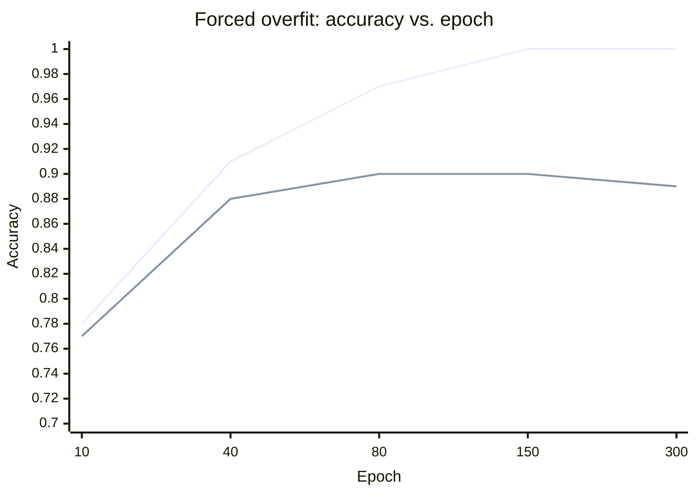
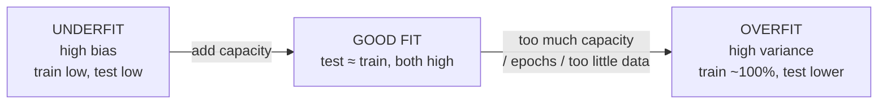
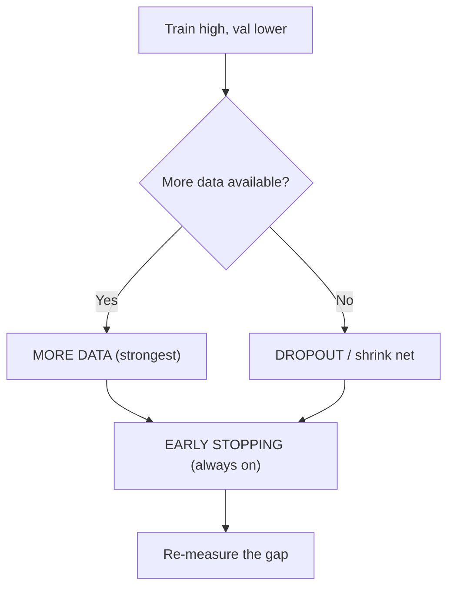
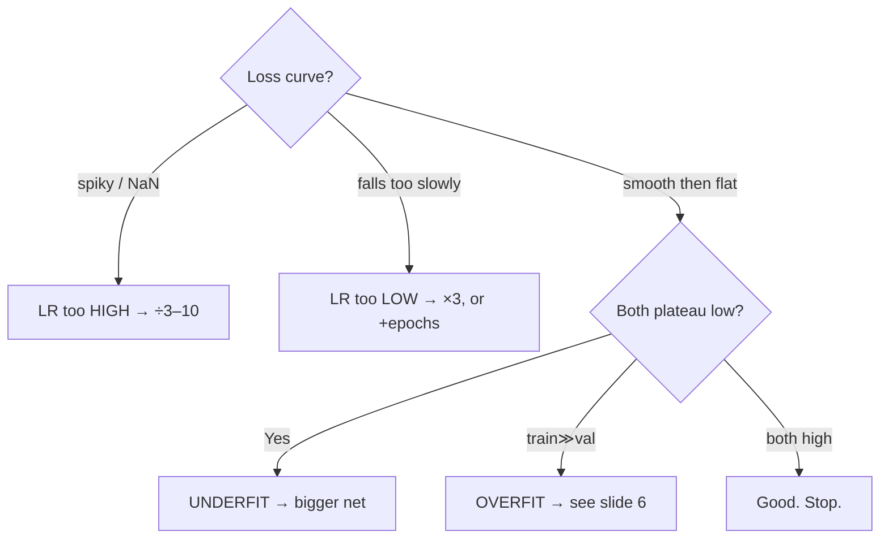
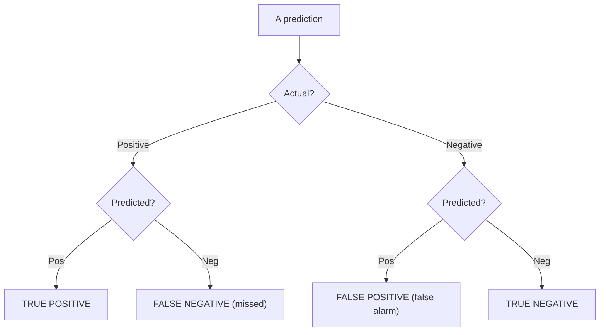
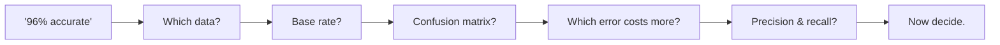

# Slide Outline — Session 8: Hands-On II, Make It Better

Deck-build rules: follow [`../../powerpoint_instructions.md`](../../powerpoint_instructions.md). This is a **thin deck by design** — the lab (`../exercises/lab.md`) carries the session (see build note for Sessions 7/8 in the instructions §7). ~11 content slides + title + agenda + Q&A + resources = ~15 slides. The deck's job is to *set up each lab segment and debrief it*; the doing happens live in Colab.

Every derived visual carries a source/licence footer. SLIDE-SAFE here: our own code/prose, scikit-learn (BSD-3), TensorFlow/Keras (Apache-2.0). The O'Reilly source deck is LINK-ONLY (never embedded). Diagrams below give Mermaid source for the builder to render in-palette; do not use red/green as the only distinction.

---

### Slide 1 — Title
- **On-slide:** "Hands-On II: Make It Better" · Session 8 · Block: *Do* · AI Training Series
- **Speaker notes:** Last session we got a network to train. Today we turn "it trains" into "it's actually good" — and, more importantly, learn to *tell the difference*. This is the session where ML starts to look like engineering.
- **Visual:** series title layout.
- **Source/licence:** none.

### Slide 2 — Agenda
- **On-slide:** Overfit it → Fix it → Tune it → Measure it → Prove it transfers. (Lab-driven; type along in Colab.)
- **Speaker notes:** Five moves. We'll deliberately break a model, fix it three ways, tune its knobs, then switch datasets and learn to read a confusion matrix. Colab open now — link on screen.
- **Visual:** the 5-step agenda bar; minute budget from `README.md`.
- **Source/licence:** none.

### Slide 3 — The uncomfortable claim
- **On-slide (headline):** "A high training accuracy proves nothing."
- **Bullets:** It can mean *learned* · or it can mean *memorised* · only a held-out test set tells them apart · today: how to tell, and what to do.
- **Speaker notes:** This is the thesis. A large network can hit 100% on training data by memorising it — that's not learning, it's a photographic memory for the answer key. The entire session is about seeing past that flattering number.
- **Visual:** two-panel "learned vs. memorised" concept.
- **Source/licence:** our own.

### Slide 4 — Overfitting, made visible *(sets up Lab Part 1)*
- **On-slide (headline):** "Overfitting is two lines splitting apart."
- **Bullets:** Train accuracy climbs to ~1.0 · validation flattens below · the gap is the overfit · recipe to force it: little data + big net + many epochs.
- **Speaker notes:** We'll cripple the training set to 60 rows, use an oversized net, train 300 epochs. Watch the two curves. Early on they move together — that's real learning. Then they split — that's memorisation. Point at the gap when it appears in the lab.
- **Visual (render this Mermaid):**

- **Source/licence:** our own (illustrative values). Label lines with text, not colour alone.

### Slide 5 — Bias vs. variance (why nets overfit)
- **On-slide (headline):** "Neural nets overfit *because* they're flexible."
- **Bullets:** High bias = too rigid (underfit) · high variance = too flexible (overfit) · linear/logistic = resilient · deep nets = prone. Flexibility is the feature and the hazard.
- **Speaker notes:** Regression stays a straight line no matter what — resilient to overfitting, but limited. A neural net can bend to fit anything, including noise. Same property that makes them powerful makes them memorise. That's the trade-off.
- **Visual (render):**

- **Source/licence:** our own.

### Slide 6 — Fix it three ways *(debriefs Lab Part 2)*
- **On-slide (headline):** "Close the gap: more data, dropout, early stopping."
- **Bullets:** More data — the real cure (if representative) · Dropout — regularise capacity you can't remove · Early stopping — stop at the validation-loss minimum (turn it on by default) · change one, re-measure the gap.
- **Speaker notes:** Order of preference. Data is strongest but expensive. Dropout randomly disables neurons so no one neuron can memorise — expect training accuracy to *drop*, that's it working. Early stopping is nearly free; always use `restore_best_weights=True`.
- **Visual (render):**

- **Source/licence:** our own; API is Keras (Apache-2.0).

### Slide 7 — The scoreboard *(the Lab Part 2 payoff)*
- **On-slide (headline):** "Every fix shrank the gap."
- **Visual = table (illustrative lab output):**

| Run | Train | Val | Gap |
|---|---|---|---|
| Forced overfit | 1.00 | 0.90 | 0.10 |
| + more data | 0.97 | 0.96 | 0.01 |
| + dropout | 0.88 | 0.90 | −0.02 |
| + early stopping | 0.95 | 0.91 | 0.04 |

- **Speaker notes:** This is what the room will see in Cell 8. More data closed the gap almost entirely; dropout pushed validation *above* training; early stopping cost the least effort. In real work you combine them.
- **Source/licence:** our own (illustrative).

### Slide 8 — Tune the knobs *(sets up Lab Part 3)*
- **On-slide (headline):** "Three knobs, a failure mode at each extreme."
- **Bullets:** Learning rate — too high diverges (`NaN`), too low crawls · Epochs — let early stopping choose · Network size — too small underfits, too big overfits · change ONE, watch the honest number.
- **Speaker notes:** Learning rate is the one that most often decides whether training works at all. If loss goes to `NaN`, it's too high — first thing to check. Tune it by factors of 3–10, not small nudges. We'll sweep it live and read the validation column.
- **Visual (render):**

- **Source/licence:** our own.

### Slide 9 — Accuracy is a headline, not the story *(sets up Lab Part 5 / content 04)*
- **On-slide (headline):** "A model can be 98% accurate and 0% useful."
- **Bullets:** The "predict Michael" parable · 1 quitter in 100, model gets every real case wrong · still reports 98% · when the event is rare, accuracy rewards ignoring it.
- **Speaker notes:** Paraphrase the parable (concept from Nield's deck, in our words). A model that predicts only "Michael quits" is wrong about Michael and wrong about the actual quitter — yet 98% accurate because it nailed the 98 uneventful people. Rare events — disease, fraud, breaches, failures — are exactly where this bites.
- **Visual:** the Michael 2×2 (table below).
- **Source/licence:** concept paraphrased from O'Reilly DL Day 3 (LINK-ONLY) — *do not reproduce their slide*; our retelling only.

### Slide 10 — The confusion matrix
- **On-slide (headline):** "Count the four outcomes separately."
- **Visual = the 2×2 + the metrics table:**

| | Predicted + | Predicted − |
|---|---|---|
| **Actual +** | TP (caught) | **FN (missed)** |
| **Actual −** | FP (false alarm) | TN (cleared) |

- **Speaker notes:** Every prediction lands in one of four cells. The two error cells are not interchangeable — a missed tumour (FN) and a false alarm (FP) have wildly different costs. Accuracy blends all four into one number and hides which mistakes you made.
- **Visual (also render):**

- **Source/licence:** our own; concept standard.

### Slide 11 — Precision vs. recall (the one distinction)
- **On-slide (headline):** "Precision = trust a 'yes'. Recall = catch them all."
- **Bullets:** Precision = TP/(TP+FP) — of flagged, how many real? · Recall = TP/(TP+FN) — of real, how many caught? · they trade off via the threshold · F1 = harmonic mean · which matters = which error costs more.
- **Speaker notes:** Low precision = noisy, false alarms. Low recall = misses things. You usually can't max both — lowering the threshold raises recall and lowers precision. For a cancer screen you deliberately favour recall. The threshold (default 0.5) is a *dial you own*, not a law.
- **Visual = comparison table (three models, illustrative):**

| Model | Accuracy | Precision | Recall | F1 | Verdict |
|---|---|---|---|---|---|
| A — always "negative" | 0.95 | 0.00 | 0.00 | 0.00 | useless |
| B — aggressive | 0.82 | 0.20 | 0.95 | 0.33 | drowns in false alarms |
| C — balanced | 0.93 | 0.71 | 0.78 | 0.74 | the only useful one |

- **Speaker notes (cont.):** Rank by accuracy, A wins and is worthless. Rank by F1, C wins — matches judgement. The metric you rank by decides which model ships.
- **Source/licence:** our own (illustrative); metrics via scikit-learn (BSD-3).

### Slide 12 — Does it actually work? *(the Lab Part 5 reveal)*
- **On-slide (headline):** "96% accurate — and it missed 3 of 43 cancers."
- **Visual = the breast-cancer confusion matrix (illustrative):**

| | Predicted malignant | Predicted benign |
|---|---|---|
| **Actual malignant** | 40 (TP) | **3 (FN — missed)** |
| **Actual benign** | 2 (FP) | 69 (TN) |

`accuracy 0.96 · malignant recall 0.93 · malignant precision 0.95`
- **Speaker notes:** Same code as the colour model, new dataset, real stakes. Accuracy looks great; the matrix shows 3 missed cancers. Is 93% recall acceptable? That's a *decision*, not a number — and no accuracy figure could have told you. Also flag the trap: sklearn encodes malignant = 0, so "class 1" is benign — confirm which class is positive before trusting any recall value.
- **Source/licence:** scikit-learn breast-cancer dataset + metrics (BSD-3); numbers illustrative.

### Slide 13 — Five questions for any reported number
- **On-slide (headline):** "You'll use these in every model review."
- **Bullets:** 1) On which data? · 2) What's the base rate? · 3) Show the confusion matrix · 4) Which error costs more? · 5) Precision & recall on the class we care about?
- **Speaker notes:** This is the deliverable for the non-coders in the room. A bare accuracy figure cannot survive these five questions. This is exactly the toolkit Session 13 turns on a vendor's "99% accurate" pitch — and it's why the workflow (load→scale→split→build→fit→*measure honestly*) transfers to any dataset.
- **Visual (render):**

- **Source/licence:** our own.

### Slide 14 — Discussion / poll
- **On-slide:** "A vendor says their model is 97% accurate. What do you ask?" (+ the live polls from `../exercises/discussion.md`)
- **Speaker notes:** Run the five questions against a real or hypothetical vendor claim. Segue to Session 13: this is where "your metric is lying" begins.
- **Visual:** discussion layout.
- **Source/licence:** none.

### Slide 15 — Resources & credits
- **On-slide:** the lab notebook link · scikit-learn (BSD-3) · TensorFlow/Keras (Apache-2.0) · Google Colab · source-deck credit (link-only) · full list in `../resources/sources.md`.
- **Speaker notes:** The notebook is a reusable template — swap the dataset and the seven steps hold. Attribution and licences on this slide.
- **Visual:** resources layout.
- **Source/licence:** attributions per `../resources/sources.md`.
