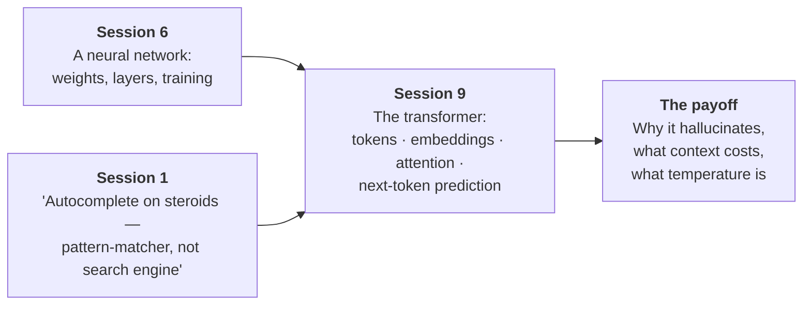
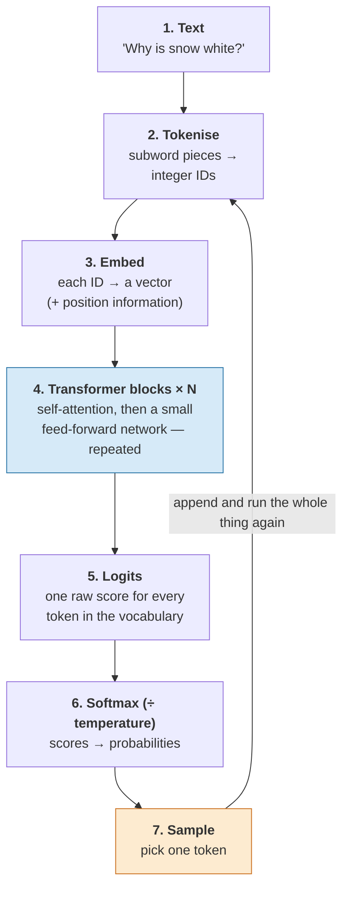

# Overview — One Sentence, All the Way Through

This session takes a single sentence and follows it through every stage of a large language model, from the characters you typed to the token that comes back. By the end you should be able to draw the whole pipeline from memory and say, for each box, what it does and what it does not do.

## Where this sits

Two earlier sessions left you holding two pieces that did not obviously connect.

- **Session 6** gave you a neural network: inputs, weighted sums, a nonlinearity, layers, and training by error reduction. Concrete, but small — three inputs, one probability out.
- **Session 1** gave you a claim about LLMs: *autocomplete on steroids — a pattern-matcher, not a search engine.* Memorable, but behavioural. It described what the thing does from outside.

This session is the bridge. A large language model *is* the Session 6 machine — the same weighted sums, the same nonlinearities, the same training by error reduction — arranged in one particular way, called a **transformer**, and scaled up. The arrangement is what makes it work on language, and one component of the arrangement, **attention**, is what makes it work at all.

## The pipeline, in one diagram

Everything in this session hangs off this. It is worth memorising.

**Figure 1 — the full path from typed text to one generated token.**

Two features of that diagram do most of the work in this session:

- **The blue box is where meaning happens.** Stages 2, 3, 5, 6 and 7 are bookkeeping — chopping, looking up, scaling, sampling. Stage 4, repeated dozens of times, is where a token's representation stops being "the word *white*" and becomes "the word *white*, in this sentence, doing this job."
- **The orange loop is why generation feels the way it does.** The model produces exactly one token per full pass. To write a 500-token answer it runs the whole stack 500 times. This single fact explains streaming output, per-token pricing, latency, and half of what people find mysterious about LLM behaviour.

## The arc of the session

| # | File | The question it answers |
|---|---|---|
| 01 | `01-tokens.md` | Why does the model not see words? What is a token, really, and what tokenises badly? |
| 02 | `02-embeddings.md` | How does a discrete integer become something a network can do arithmetic on? What does "direction = meaning" mean? |
| 03 | `03-self-attention.md` | **The centre of the session.** Same words, different meaning — what tells them apart? Worked with real numbers. |
| 04 | `04-the-transformer-stack.md` | Multi-head, layers, residuals; encoder vs. decoder; what a parameter count is actually made of. |
| 05 | `05-generating-one-token-at-a-time.md` | Why one token at a time? What does temperature *do*? Top-k, top-p, and when to use 0. |
| 06 | `06-the-context-window.md` | Why is context finite? Why does it cost O(n²)? Why does more context sometimes make answers worse? |
| 07 | `07-why-it-hallucinates.md` | **The payoff.** Walk the pipeline and find the fact-check. There isn't one. |
| 99 | `99-key-takeaways.md` | The recap, and the one thing to remember. |

## The hook, stated now so it can be resolved later

Two questions:

> **"Who is Snow White?"**
> **"Why is snow white?"**

Nearly the same words. One asks about a fairy-tale character; the other asks about the physics of light scattering in ice crystals. A word-frequency model cannot separate them. A bag-of-embeddings model cannot separate them — the vector for *snow* is the same vector in both. Something in the machine has to look at the *rest of the sentence* and rewrite what each word means in light of it.

That something is **self-attention**, and `content/03` computes the difference explicitly, in code you can run. Hold the question until then.

## The honest framing

Three things this session is deliberately not:

1. **Not a derivation.** We show `softmax(QKᵀ/√d)V` and explain every symbol, but we do not derive it. As in Session 6: shown, not derived.
2. **Not architecture-current.** Production models in 2026 use variants we mention but do not teach in depth — grouped-query attention, KV-cache tricks, mixture-of-experts, rotary position embeddings, sparse and sliding-window attention. The core we teach is the load-bearing part and it is common to all of them. Pointers are in `resources/sources.md` for anyone who wants the modern layer.
3. **Not a claim that this is understanding.** We will describe what attention computes. Whether a system that computes it *understands* anything is Session 16's argument, not ours. Keep the two apart — conflating "we can explain the mechanism" with "therefore it is just statistics, therefore it is trivial" is as sloppy as the hype it reacts against.

What this session *is*: a mechanical account complete enough that the rest of the course — cost, prompting, RAG, risk — stops requiring you to take anything on faith.
