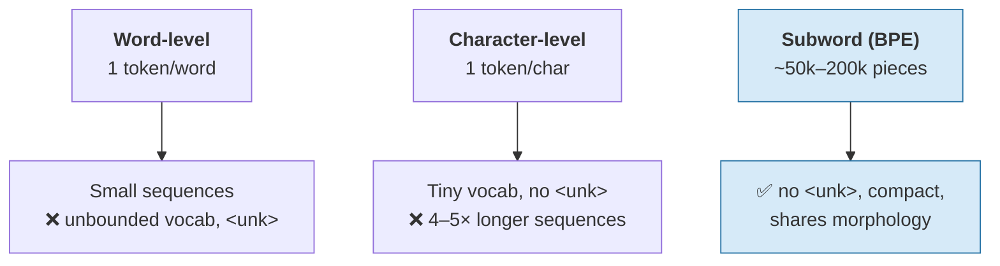

# Tokens — The Model Never Sees Your Words

Before a model does anything intelligent, it does something crude: it chops your text into pieces from a fixed vocabulary and replaces each piece with an integer. Everything downstream operates on those integers. This file explains why that step exists, how it works, and which of its consequences will bite you.

Session 2 established the token as **the unit you are billed in**. This file explains the *mechanism* — why a token is not a word, and why some perfectly ordinary inputs cost three times what you would guess.

## Why not just use words?

The obvious design is one integer per word. It fails on three counts:

| Problem with word-level | Consequence |
|---|---|
| **The vocabulary is unbounded.** New words, names, product codes, typos, URLs, and identifiers appear forever. | You need an "unknown word" symbol, and every unknown word becomes an information black hole. `QCT-8895-rev3` → `<unk>`. |
| **Morphology is thrown away.** `configure`, `configured`, `configuring`, `reconfiguration` are four unrelated integers. | The model must learn each independently, from scratch, wasting capacity. |
| **Other languages break the assumption.** Chinese has no spaces; German glues words together; code has no words at all. | A whitespace splitter is a monolingual, prose-only design. |

The opposite extreme — one integer per **character** — has no unknown-token problem and a tiny vocabulary, but makes sequences four to five times longer, and attention costs grow with the *square* of sequence length (`content/06`). That is an expensive way to save memory.

**Subword tokenisation** is the compromise everyone converged on: common words get one token; rare words are assembled from frequent fragments; nothing is ever unknown, because in the worst case you fall back to bytes.



## How the vocabulary gets built: BPE in one paragraph

**Byte-Pair Encoding** is the algorithm behind most production tokenisers. Start with a vocabulary of the 256 possible bytes. Scan a huge text corpus and find the most frequent *adjacent pair* of symbols. Merge that pair into a single new symbol and add it to the vocabulary. Repeat until the vocabulary reaches its target size — typically 50,000 to 200,000 entries. The merge list *is* the tokeniser (see `resources/sources.md` #2, Hugging Face LLM Course, Apache-2.0).

The consequence to hold on to: **the vocabulary is a frequency artefact of the training corpus.** Nothing about it is linguistic. If English prose dominated the corpus, English prose tokenises efficiently and everything else does not.

Here is BPE on a toy corpus, in runnable Python, so you can see a vocabulary get built:

```python
# Byte-Pair Encoding, minimal, on a toy corpus.
# Real tokenisers do this over billions of words; the algorithm is identical.
from collections import Counter

corpus = ["release", "released", "releasing", "reload", "reloaded"]
# Start: every word is a list of characters, with a word-boundary marker.
words = [list(w) + ["</w>"] for w in corpus]

def most_frequent_pair(words):
    pairs = Counter()
    for w in words:
        for a, b in zip(w, w[1:]):
            pairs[(a, b)] += 1
    return pairs.most_common(1)[0] if pairs else (None, 0)

merges = []
for step in range(6):                      # 6 merges is enough to see the pattern
    pair, count = most_frequent_pair(words)
    if pair is None or count < 2:
        break
    merges.append(pair)
    merged = "".join(pair)
    words = [                              # replace every occurrence of the pair
        [merged if (t, u) == pair else t
         for t, u in zip(w, w[1:] + [None]) if t is not None]
        for w in words
    ]
    # crude re-scan: drop the second element of each merged pair
    words = [[t for i, t in enumerate(w) if not (i > 0 and w[i-1] == merged and t == pair[1])]
             for w in words]
    print(f"merge {step+1}: {pair} (seen {count}x)  ->  {words[0]}")

# merge 1: ('r', 'e') (seen 5x)  ->  ['re', 'l', 'e', 'a', 's', 'e', '</w>']
# merge 2: ('e', 'l') (seen 5x)  ->  ['re', 'el'... ]  (exact path depends on tie-breaks)
#
# The point, not the exact trace: 're' and 'lease' become single symbols because they
# are FREQUENT, not because a linguist decided they were morphemes.
```

> **Read the comment, not the trace.** The exact merge order depends on tie-breaking and is not the lesson. The lesson is that `re` becomes one symbol because it appeared five times, and for no other reason.

## What this means for your text

Run this against a real tokeniser. `tiktoken` is OpenAI's BPE implementation (MIT); `transformers` gives you the same for open models.

```python
# pip install tiktoken
import tiktoken

enc = tiktoken.get_encoding("o200k_base")     # the GPT-4o-era encoding

def show(text):
    ids = enc.encode(text)
    pieces = [enc.decode([i]) for i in ids]
    print(f"{len(ids):3d} tokens  {pieces}")

show("Who is Snow White?")
show("Why is snow white?")
show("Konfigurationsmanagement")
show("QCT-8895-rev3")
show("def build_release_notes(commits, since='v1.4.2'):")

#   5 tokens  ['Who', ' is', ' Snow', ' White', '?']
#   5 tokens  ['Why', ' is', ' snow', ' white', '?']
#   ~6 tokens ['K', 'onfig', 'ur', 'ations', 'management']   <- German compound, shredded
#   ~7 tokens ['Q', 'CT', '-', '88', '95', '-rev', '3']      <- part numbers are expensive
#   ~13 tokens ['def', ' build', '_release', '_notes', '(', 'comm', 'its', ...]
#
# Exact IDs and splits vary by encoding — run it against the encoding your model uses.
```

Four things to notice, all of which matter later:

1. **The leading space is part of the token.** `' Snow'` and `'Snow'` are *different* tokens with different IDs. This is why prompts that end in a trailing space sometimes behave oddly — you have handed the model a fragment.
2. **Case is part of the token.** `' Snow'` and `' snow'` are different tokens. Our two hook sentences therefore differ in *three* of five tokens, not one. We will be careful about that in `content/03` — the honest version of the "same words" claim is *same word forms, near-identical tokens, entirely different meaning*.
3. **German compounds and identifiers are shredded.** `Konfigurationsmanagement` is one word to a human and five or six tokens to the model. Non-English text typically costs 1.5–3× more tokens than the equivalent English, which is a *direct* cost multiplier (Session 2) and a direct context-window multiplier (`content/06`).
4. **Numbers split unpredictably.** `8895` may become `88` + `95`. This is a large part of why LLMs are unreliable at arithmetic: the model does not see the quantity 8895, it sees two arbitrary fragments (see `resources/sources.md` #10 for the tokenisation-and-symbolic-reasoning literature).

## A cost table you can reason with

Rough multipliers relative to plain English prose. **Approximate, and encoding-dependent — measure your own workload rather than quoting these.**

| Input type | Typical tokens per 1,000 characters | Why |
|---|---|---|
| English prose | ~250 | The corpus optimum: common words are single tokens |
| German prose | ~300–400 | Compounds and inflection split; less represented in the merge list |
| Source code | ~350–450 | Indentation, punctuation, and identifiers fragment |
| JSON / XML | ~400–500 | Structural punctuation is nearly one token per character |
| Base64 / hashes / IDs | ~600–900 | No frequent substrings exist; falls back near byte level |
| CJK text | Varies widely | Depends heavily on the encoding's coverage |

For this room, the operational point: **a log file, a config diff, and a stack trace are among the most expensive things you can put in a prompt** — three to four times worse per character than the same amount of English. That governs both the bill and how much of your context window is left for the actual question.

## The live demo

Tiktokenizer (`tiktokenizer.vercel.app`, MIT, runs entirely in the browser) is the fastest way to make this land in a room. Paste in the two Snow White sentences, then a German sentence, then a chunk of a real build log. Watch the count jump. Ninety seconds, no setup, and the "numbers split weirdly" point lands better than any slide.

## Key takeaways

- The model never sees words. It sees **integer IDs of subword pieces** drawn from a fixed vocabulary built by frequency (BPE), not by linguistics.
- Subword tokenisation exists because word-level has an unbounded vocabulary and character-level makes sequences too long — and attention punishes length quadratically.
- **Leading spaces and capitalisation are part of the token.** `' Snow'` ≠ `' snow'` ≠ `'snow'`.
- Non-English text, code, structured data, and identifiers tokenise 1.5–3× worse than English prose. That is simultaneously a **cost** multiplier and a **context-window** multiplier.
- Unreliable arithmetic starts here: numbers get split into arbitrary fragments before the model ever reasons about them.
