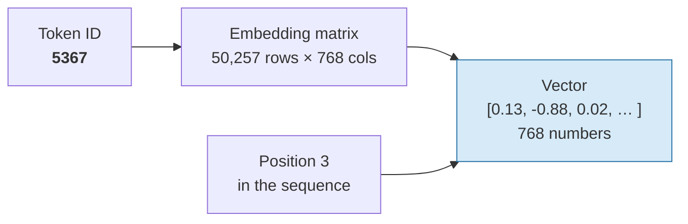
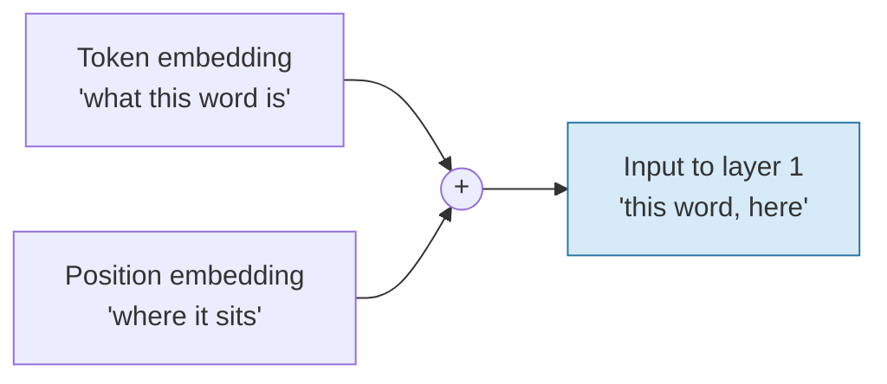

# Embeddings — Turning an Integer Into a Direction

Token ID 5,367 is a label, not a quantity. You cannot usefully add it, average it, or multiply it by a weight. This file explains the step that fixes that: every token ID is replaced by a **vector**, and the geometry of those vectors carries meaning. It also sets up the problem that the next file solves.

## The lookup table

An embedding layer is, mechanically, the least glamorous component in the entire model: a **matrix with one row per vocabulary entry**. Token ID 5,367 means "take row 5,367." That row is a list of numbers — 768 of them in GPT-2 small, thousands in a frontier model.

| Model | Vocabulary size | Embedding dimension `d_model` | Embedding matrix |
|---|---|---|---|
| GPT-2 small | 50,257 | 768 | 50,257 × 768 ≈ **38.6M** numbers |
| A typical modern open model | ~128,000 | 4,096 | ≈ **524M** numbers |

That table already tells you something: the lookup table alone can be a third of a small model's parameters. Every one of those numbers is **learned during training** — nobody hand-assigned meanings to dimensions.



## Why a direction can mean something

The training objective — predict the next token — forces the model to place tokens that behave similarly in similar places. Words that appear in the same kinds of contexts end up pointing in similar directions, because that is the cheapest way for the network to make good predictions about both of them.

"Similar direction" has a precise measure: **cosine similarity**, which is the dot product of two unit vectors. It ranges from −1 (opposite) through 0 (unrelated) to 1 (identical direction).

```python
# Cosine similarity in a hand-made 3-D toy space, so the geometry is visible.
# Dimensions here mean: [royalty, male-ness, computing].  Real embeddings have
# hundreds of dimensions and NO dimension has a clean human label.
import numpy as np

V = {
    "king":   np.array([0.95, 0.90, 0.10]),
    "queen":  np.array([0.95, 0.05, 0.12]),
    "man":    np.array([0.10, 0.92, 0.08]),
    "woman":  np.array([0.10, 0.06, 0.09]),
    "server": np.array([0.05, 0.50, 0.95]),
}

def cos(a, b):
    return float(a @ b / (np.linalg.norm(a) * np.linalg.norm(b)))

for a, b in [("king", "queen"), ("king", "man"), ("king", "server"), ("man", "woman")]:
    print(f"cos({a:6s},{b:7s}) = {cos(V[a], V[b]):.3f}")

# cos(king  ,queen  ) = 0.762
# cos(king  ,man    ) = 0.764
# cos(king  ,server ) = 0.420
# cos(man   ,woman  ) = 0.529

analogy = V["king"] - V["man"] + V["woman"]
best = max((w for w in V if w not in ("king", "man", "woman")),
           key=lambda w: cos(analogy, V[w]))
print("king - man + woman ->", best, f"(cos={cos(analogy, V[best]):.3f})")
# king - man + woman -> queen (cos=1.000)
```

**Two honesty notes on that output, because this example is over-sold everywhere.**

First, the analogy lands at cosine 1.000 because this toy space was *constructed* to make it land. With real embeddings you get a plausible-but-messy neighbourhood, not a clean hit, and the famous `king − man + woman ≈ queen` result is weaker and more contested than the popular retelling suggests — among other things, the standard evaluation excludes the input words from the answer, which does a lot of the work.

Second, **no dimension of a real embedding has a human-readable label.** We wrote "royalty, male-ness, computing" so you could see the geometry. In a trained model, meaning is distributed across hundreds of dimensions and no single axis corresponds to a concept you could name. Beware demos that imply otherwise.

What survives both caveats is the load-bearing claim: **relative direction encodes relatedness, and relatedness is computed with a dot product.** That is enough, and it is what attention runs on.

## Position has to be added separately

Here is a fact that surprises people: the attention mechanism in `content/03` is, by itself, **order-blind**. If you shuffle the tokens, the raw attention computation produces the same set of outputs, just permuted. `"dog bites man"` and `"man bites dog"` would be indistinguishable.

So position must be injected explicitly. The original transformer added a fixed sinusoidal pattern to each embedding; GPT-2 learned a position vector per slot and added it; most 2026 models use **rotary position embeddings (RoPE)**, which rotate the query and key vectors by an angle proportional to position, which has the pleasant property of encoding *relative* distance rather than absolute slot number.

**Figure — position information is added to the token vector before the stack runs.**



The practical consequence: **the same word at a different position is a different input vector.** This is one of the mechanisms behind lost-in-the-middle effects in `content/06` — position is not a neutral tag, it is part of the representation, and the model was trained on a particular distribution of positions.

## Where this leaves us — the problem

Look carefully at what we have after this stage. Every token has a vector. The vector for `' snow'` was fetched from row 5,367 of a fixed table.

**It is the same vector in every sentence.** The `' snow'` in *"Why is snow white?"* and the `' Snow'` in *"Who is Snow White?"* get near-identical treatment: two fixed lookups, plus a position offset. Nothing so far has consulted the rest of the sentence.

| What we have after embedding | What we still need |
|---|---|
| A vector per token, from a fixed table | A vector per token **in this context** |
| Position information | The knowledge that *white* here is a name-part, not a colour |
| Static, context-free meaning | Dynamic, context-sensitive meaning |

This is exactly the gap the hook exposed. Static embeddings are why the pre-2017 generation of language models plateaued: a system whose word representations do not change with context cannot disambiguate, and natural language is ambiguity all the way down.

The fix is the next file.

## Key takeaways

- An embedding layer is a **lookup table**: one learned vector per vocabulary entry. In GPT-2 small that is 50,257 × 768 ≈ 38.6M numbers, all learned.
- Meaning lives in **direction**. Relatedness is measured by cosine similarity, which is a dot product — the operation attention is built out of.
- Real embedding dimensions have **no human-readable labels**, and the famous `king − man + woman` analogy is a weaker result than its fame suggests. Use it to convey geometry, not as evidence of anything.
- Attention is **order-blind**, so position must be added explicitly (learned, sinusoidal, or rotary). The same word in a different position is a different input vector.
- Crucially, an embedding is **context-free** — the same row every time. That is precisely the limitation self-attention exists to remove.
