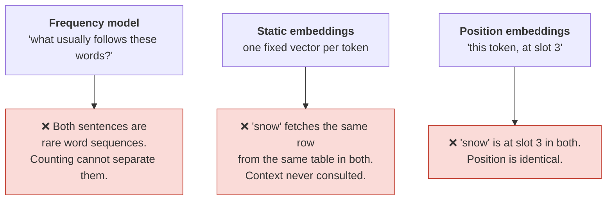
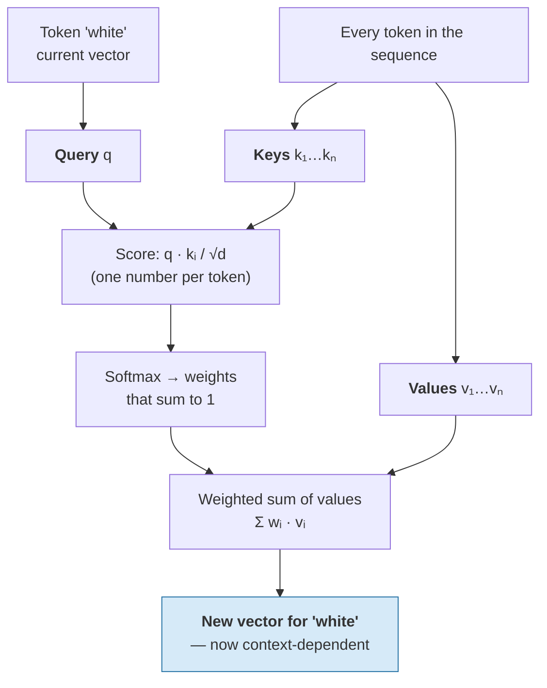
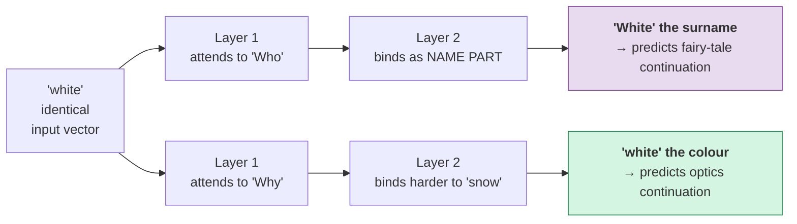

# Self-Attention — What Tells "Snow White" From "snow white"

This is the centre of the session. Everything before it was preparation; everything after it is consequence. We take one minimal pair, show precisely why nothing so far can separate them, then compute — with numbers you can run — the mechanism that does.

## The minimal pair

> **A. "Who is Snow White?"**
> **B. "Why is snow white?"**

Read them aloud. A asks about a fairy-tale character. B asks about optics — why does frozen water scatter all visible wavelengths roughly equally, so it looks white?

The word forms are almost identical. Let's be exact about how identical, because the honest version of this claim is more interesting than the slogan.

| | Sentence A | Sentence B |
|---|---|---|
| Text | `Who is Snow White?` | `Why is snow white?` |
| Tokens (typical BPE) | `['Who', ' is', ' Snow', ' White', '?']` | `['Why', ' is', ' snow', ' white', '?']` |
| Token count | 5 | 5 |
| Identical tokens | `' is'`, `'?'` | `' is'`, `'?'` |
| Differing tokens | `'Who'`, `' Snow'`, `' White'` | `'Why'`, `' snow'`, `' white'` |
| Meaning of the pair `snow`+`white` | A **name** — one referring unit, a person | A **subject and its predicate** — a substance and its colour |

So: not literally the same tokens, because case matters (`content/01`). But here is the sharper point, and it is the one that makes this pair worth building a session around:

**The casing does not carry the meaning.** Write sentence A in a chat window as `who is snow white` — no capitals at all, as people constantly do — and every human reader still understands it as the fairy tale. Now the token sequences differ in exactly **one** token: `who` versus `why`. One token, at the *start* of the sentence, three positions away, changes what the final two tokens mean.

That is the phenomenon to explain. **Meaning is not a property of a token. It is a property of a token in a context.** And the context that determines it can be anywhere in the sentence, at any distance, in any direction.

## Why nothing so far can do this

Walk back through what we have built:



We need a step that lets `white` **look at** `who`/`why` and change what it means accordingly. Not "look up a rule about it" — *learn*, from data, which other tokens are worth looking at, and rebuild itself out of them.

## Attention in one sentence

> **Each token rebuilds its own representation as a weighted average of every token's contribution, and it decides the weights itself.**

Everything else is bookkeeping for that sentence.

### Query, Key, Value — the mechanism, without mystique

Each token vector is multiplied by three learned matrices, producing three different projections of itself:

| Projection | Read it as | The token's role |
|---|---|---|
| **Query** (`Q`) | *"Here is what I am looking for."* | The asker |
| **Key** (`K`) | *"Here is what I am, advertised for matching."* | The advertiser |
| **Value** (`V`) | *"Here is the information I will contribute if you pick me."* | The contributor |

The retrieval analogy is standard and worth stating carefully because it is easy to over-read. It is *like* a lookup in a dictionary: a query is compared against every key, and the values of the best-matching keys are returned. Unlike a dictionary, **the match is soft** — you do not get one value, you get a weighted blend of all of them, with weights summing to 1. Nothing is retrieved; everything is mixed.

**Figure — one attention step for a single token.**



The whole thing in one line, which you have seen on every transformer slide ever made:

```
Attention(Q, K, V) = softmax( Q Kᵀ / √d_k ) V
```

Every symbol, decoded:

| Symbol | What it is | Why it is there |
|---|---|---|
| `Q Kᵀ` | Every query dotted with every key → an *n × n* grid of raw scores | This grid is the "who should look at whom" matrix. **It is also where the O(n²) cost lives** (`content/06`). |
| `/ √d_k` | Divide by the square root of the key dimension | Dot products of long vectors grow large; without this, softmax saturates into a near-one-hot spike and gradients vanish during training. Pure numerical hygiene. |
| `softmax(…)` | Turn each row of scores into positive weights summing to 1 | Makes each row a genuine weighted average — a distribution over "where I looked." |
| `… V` | Multiply the weights by the value vectors | The actual mixing. Output row *i* = the blend of context that token *i* chose. |

## Computing the difference — run this

Now we resolve the hook. The setup is deliberately rigged for legibility: a **4-dimensional** embedding space with named axes, and hand-written projection matrices. Real models learn 768 or 4,096 dimensions with no interpretable axes. **What is not rigged is the arithmetic** — it is exactly the formula above, and the effect it demonstrates is the real one.

The critical design choice: **the vectors for `snow` and `white` are byte-for-byte identical in both sentences.** Only the first token differs (`Who` vs `Why`). If the output for `white` comes out different, attention is the only thing that could have done it.

```python
# Self-attention on the minimal pair, from scratch.
# Toy 4-D space with named axes: [WHO, WHY, SNOW, WHITE].
# 'snow' and 'white' start as the SAME vectors in both sentences.
import numpy as np
np.set_printoptions(precision=3, suppress=True)

E = {"Who":   np.array([1., 0., 0., 0.]),
     "Why":   np.array([0., 1., 0., 0.]),
     "is":    np.array([.1, .1, .1, .1]),
     "snow":  np.array([0., 0., 1., 0.]),      # identical in both sentences
     "white": np.array([0., 0., 0., 1.])}      # identical in both sentences

# Learned in a real model; hand-set here. Row 4 says: the query for 'white'
# looks for the question word and for 'snow'.
W_q = np.array([[0, 0, 0, 0],
                [0, 0, 0, 0],
                [0, 0, 1, 0],
                [1.0, 0.5, 1.0, 0]], float)
W_k = np.eye(4)
W_v = np.eye(4)

def layer(X):
    Q, K, V = X @ W_q, X @ W_k, X @ W_v
    S = Q @ K.T / np.sqrt(4)                       # scaled dot-product scores
    A = np.exp(S - S.max(1, keepdims=True))        # softmax, row-wise
    A /= A.sum(1, keepdims=True)
    return A, X + A @ V                            # + residual connection

for sent in (["Who", "is", "snow", "white"],
             ["Why", "is", "snow", "white"]):
    X = np.stack([E[t] for t in sent])
    A1, H1 = layer(X)          # layer 1
    A2, H2 = layer(H1)         # layer 2 — queries now come from layer 1's output
    print(" ".join(sent))
    print("  layer1 attention row for 'white':", A1[3])
    print("  layer1 output       for 'white':", H1[3])
    print("  layer2 attention row for 'white':", A2[3])
    print("  layer2 output       for 'white':", H2[3])

# Who is snow white
#   layer1 attention row for 'white': [0.304 0.209 0.304 0.184]
#   layer1 output       for 'white': [0.324 0.021 0.324 1.205]
#   layer2 attention row for 'white': [0.288 0.188 0.356 0.168]
#   layer2 output       for 'white': [0.9   0.063 1.02  1.639]
# Why is snow white
#   layer1 attention row for 'white': [0.253 0.224 0.325 0.197]
#   layer1 output       for 'white': [0.022 0.276 0.348 1.22 ]
#   layer2 attention row for 'white': [0.228 0.202 0.392 0.178]
#   layer2 output       for 'white': [0.066 0.783 1.09  1.665]
```

### Reading the output

**The input vector for `white` was identical in both runs. The output is not.** Three things happened, and each is a real property of real transformers.

**1. The WHO/WHY channel flipped.** Look at the first two numbers of the layer-1 output for `white`:

| | WHO component | WHY component |
|---|---|---|
| *"Who is snow white"* | **0.324** | 0.021 |
| *"Why is snow white"* | 0.022 | **0.276** |

The token `white` has absorbed the identity of the question word standing three positions away. Its representation now carries "I am in an identity question" versus "I am in a causal question." **This is the answer to the hook**, and it is the entire mechanism: information moved sideways along the sequence into the token, and the token's meaning changed as a result.

**2. The attention weights themselves differ.** In *"Why is snow white"*, the token `white` puts **more** weight on `snow` (0.325) than it does in *"Who is snow white"* (0.304). That is the model binding predicate to subject — in the physics question, `white` is *about* snow in a way it is not in the name. The weights are not just a routing detail; they are part of the answer.

**3. The divergence compounds with depth.** From layer 1 to layer 2, the gap in how much weight `white` gives `snow` widens from 0.304 vs 0.325 to **0.356 vs 0.392**. Why? Because layer 2's queries are computed from layer 1's *outputs*, which already differ. Each layer's disambiguation feeds the next.

**Figure — the same input, two trajectories, diverging with depth.**



That is why a 12-layer or 96-layer stack is not redundancy. Early layers do local, syntactic work; later layers assemble larger structures out of what earlier layers resolved. Meaning is built up over depth.

## Two more properties worth knowing

**Attention is not symmetric.** `white` attending to `snow` at weight 0.325 does not imply `snow` attends to `white` at 0.325. Q and K are different projections, so the score `qᵢ · kⱼ` differs from `qⱼ · kᵢ`. The relation "is relevant to" genuinely is one-directional.

**Distance costs nothing.** The score between token 1 and token 4,000 is one dot product, exactly like the score between adjacent tokens. This is the property that made transformers beat RNNs, which had to pass information hop by hop and forgot things over long distances. In a transformer, **every token is one step from every other token.** You pay for it in the O(n²) grid, which is `content/06`'s problem.

## The honest caveat: attention weights are not explanations

There is a strong temptation, once you can see a heat map, to read attention weights as the model's reasoning: "look, it attended to *snow*, so it understood the sentence is about snow." Resist it. Attention weights show **where information was routed**, not **why** or **what was concluded**. A model can attend heavily to a token and do nothing useful with it; information also flows through residual connections and feed-forward layers that no attention map displays. In a 96-layer, 96-head model there are thousands of these maps and they do not compose into a narrative.

Attention maps are a genuinely useful debugging and teaching signal. They are not an explanation, and the interpretability literature is explicit that treating them as one is a mistake. Keep this distinction — it is the same skeptical discipline the whole course runs on.

## Key takeaways

- Meaning is a property of **a token in a context**, not of a token. `who` versus `why`, three positions away, changes what the last two tokens mean.
- Self-attention gives every token a **Query** ("what I'm looking for"), a **Key** ("what I am"), and a **Value** ("what I'll contribute"). Each token rebuilds itself as a **weighted average of all values**, with weights it computes itself.
- `softmax(QKᵀ/√d)V`: `QKᵀ` is the n×n relevance grid (and the source of quadratic cost), `√d` is numerical hygiene, softmax makes a distribution, `V` does the mixing.
- Demonstrated: **identical input vector for `white`, different output vector**, purely from context — and the divergence **grows with depth** because each layer's queries come from the previous layer's disambiguated outputs.
- Every token is **one hop** from every other token, at any distance. That is the transformer's superpower and the reason context costs O(n²).
- **Attention weights are routing, not reasoning.** Do not read a heat map as an explanation.
