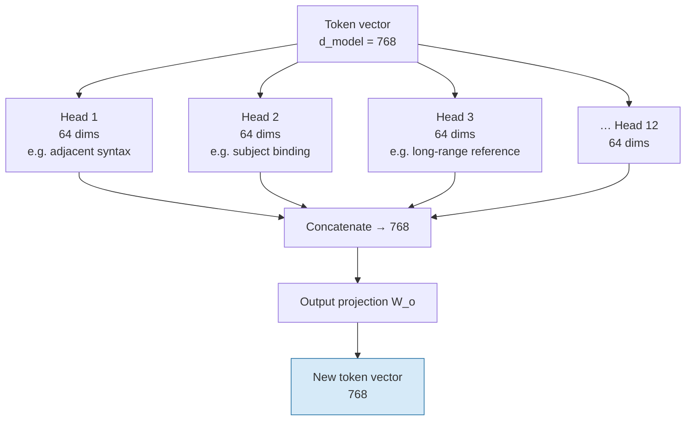
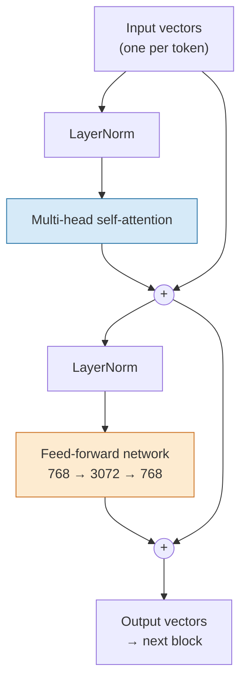
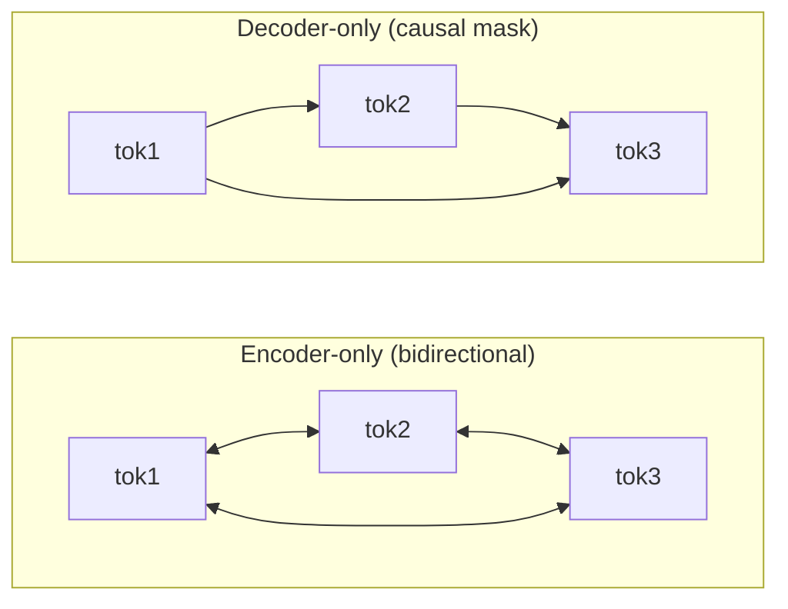

# The Stack — Heads, Layers, and Where the Parameters Go

One attention operation is not a language model. This file assembles the rest: many attention heads in parallel, a feed-forward network after each, the same block repeated dozens of times, and the architectural fork — encoder, decoder, or both — that determines what a model is *for*.

## Multi-head attention: several questions at once

The mechanism in `content/03` produces **one** weighted mixture per token. But a token typically needs several unrelated kinds of context at once. The word `white` in *"Why is snow white?"* needs to know: what noun am I predicating of (syntax)? what question type is this (discourse)? am I a colour term or part of a name (semantics)?

One attention operation gives one distribution over the sequence, so it can express one such relation well. The fix is unsubtle: **run several in parallel with different learned projections**, and concatenate the results.

Note the arithmetic: `d_model` is **split** across heads, not duplicated. GPT-2 small has `d_model = 768` and 12 heads, so each head works in 64 dimensions (768 / 12 = 64). Twelve heads therefore cost roughly the same as one head of full width — you buy diversity of attention patterns, not extra compute.

> **A caution that follows from `content/03`.** It is common to say "this head does coreference, that head does syntax." Some heads *do* show clean, interpretable patterns. Many do not, roles are not stable across inputs, and heads can be removed with less damage than the neat story predicts. Use "different heads learn different relations" as intuition, not as a claim about any specific head.

## The transformer block

Attention moves information *between* tokens. It does not do much computation *within* a token — the output is a weighted average of values, which is a fairly weak operation on its own. So each attention sub-layer is followed by a small feed-forward network (the Session 6 machine: two linear layers with a nonlinearity between them) applied to **each token independently**.

The division of labour is worth stating:

| Sub-layer | Operates | Does |
|---|---|---|
| **Multi-head self-attention** | Across tokens | Moves and mixes information between positions |
| **Feed-forward network** | Within each token, independently | Transforms that token's mixed representation; where most parameters live |

Both sub-layers are wrapped in two devices that make deep stacks trainable:

- **Residual connections** — the block computes `x + f(x)`, not `f(x)`. The original vector is always preserved and the layer only adds a correction. Without this, gradients through 96 layers vanish and the model cannot train. (Our `content/03` code included this: `return A, X + A @ V`.)
- **Layer normalisation** — renormalise activations to a stable scale at each step, so numbers do not drift over depth.

**Figure — one transformer block. Stack N of these.**

The feed-forward network expands to **4× `d_model`** and back (768 → 3072 → 768 in GPT-2). That expansion is where the bulk of a model's parameters sit — and, on current evidence, a large share of where factual associations are stored.

Stack this block 12 times (GPT-2 small), 96 times (GPT-3 scale), or more. Every block has its own independent set of weights; nothing is shared between layers.

## Encoder, decoder, or both

The original 2017 transformer was an encoder-decoder built for translation. The field then split it in two, and the split determines what a model can be used for. This table is the one to put on a slide.

| | **Encoder-only** | **Decoder-only** | **Encoder-decoder** |
|---|---|---|---|
| Attention pattern | **Bidirectional** — every token sees every other, both directions | **Causal / masked** — a token sees only tokens *before* it | Encoder bidirectional; decoder causal + cross-attends to the encoder |
| Trained to | Fill in masked-out tokens | Predict the **next** token | Map a full input sequence to an output sequence |
| Natural output | A representation (a vector) | Text, generated left to right | Text, conditioned on a whole input |
| Good at | Classification, retrieval, **embeddings**, named-entity extraction | Open-ended generation, chat, code, instruction following | Translation, summarisation |
| Cannot do | Generate fluent long text | See the future — by construction | — |
| Examples | BERT-family, most embedding models | **GPT, Claude, Llama, Gemini, Qwen** — nearly everything you talk to | T5-family, classic NMT |

Two consequences you will actually use:

1. **Everything you interact with as a chat assistant is decoder-only.** The causal mask is not an optimisation; it is what makes next-token training possible at scale. Every position in a training document is simultaneously a training example, because each token may only look leftward.
2. **The embedding models behind RAG (Session 13) are usually encoder-only**, and that is the right choice: to represent a chunk of text as one vector you want every token to see the whole chunk, in both directions. It is also why you should not expect a chat model and an embedding model to be interchangeable.

**Figure — who can see whom.**

## Where the parameters actually go

"124 million parameters" is an opaque number until you break it down. GPT-2 small is the right model to do this with: it is small enough to enumerate, its configuration is public, and it is the model running inside the Transformer Explainer demo (`resources/sources.md` #1, MIT).

Configuration: `d_model = 768` · 12 layers · 12 heads (64 dims each) · feed-forward inner width 3,072 · vocabulary 50,257 · context length 1,024.

| Component | Arithmetic | Parameters |
|---|---|---|
| Token embedding table | 50,257 × 768 | ≈ 38.6M |
| Position embedding table | 1,024 × 768 | ≈ 0.8M |
| Attention Q, K, V, output projections | 4 × 768 × 768 × 12 layers | ≈ 28.3M |
| Feed-forward layers | 2 × 768 × 3,072 × 12 layers | ≈ 56.6M |
| LayerNorm scales and biases | small | < 0.1M |
| **Total** | | **≈ 124M** |

Three observations that transfer to models a thousand times larger:

- **The feed-forward layers are the biggest single block** — about 45% here, and a larger share in bigger models. Attention gets the fame; the FFNs get the parameters.
- **The embedding table is a third of a small model** and a rounding error in a large one. Scaling `d_model` and depth grows the stack far faster than the vocabulary.
- **Context length costs almost nothing in parameters** — 0.8M for 1,024 positions. Long context is not expensive because of *weights*; it is expensive at **runtime**, which is `content/06`.

> **We deliberately use GPT-2 small, not a frontier model.** Its numbers are public, verifiable, and stable; frontier configurations are mostly undisclosed, and published breakdowns of proprietary models circulate in material we cannot use. The *shape* of the breakdown is what transfers, and it transfers exactly.

## What the stack finally produces

After the last block, each token has a 768-number vector representing "this token, fully contextualised." To predict the next token, the model takes the vector at the **last** position and multiplies it by an output matrix of size `d_model × vocab` — producing one raw score, a **logit**, for every one of the 50,257 possible next tokens.

Those 50,257 numbers are the model's entire opinion about what comes next. What happens to them is the next file.

## Key takeaways

- **Multi-head attention** runs several attention operations in parallel over slices of `d_model` (12 heads × 64 dims = 768), letting a token track several relations at once. Do not over-read individual head roles.
- A **transformer block** = attention (moves information *between* tokens) + feed-forward network (transforms *within* a token), each wrapped in a **residual connection** and **layer norm**. Residuals are what make deep stacks trainable.
- **Encoder-only** = bidirectional, produces representations (embeddings, classification). **Decoder-only** = causally masked, produces text — this is every chat model you use. **Encoder-decoder** = sequence-to-sequence.
- In GPT-2 small's 124M parameters, **feed-forward layers are the largest block (~45%)**, the embedding table ~31%, attention ~23%, and position embeddings under 1%.
- Context length is cheap in **parameters** and expensive at **runtime** — the subject of `content/06`.
- The stack's final act is one logit per vocabulary entry: 50,257 numbers, the model's complete opinion about the next token.
