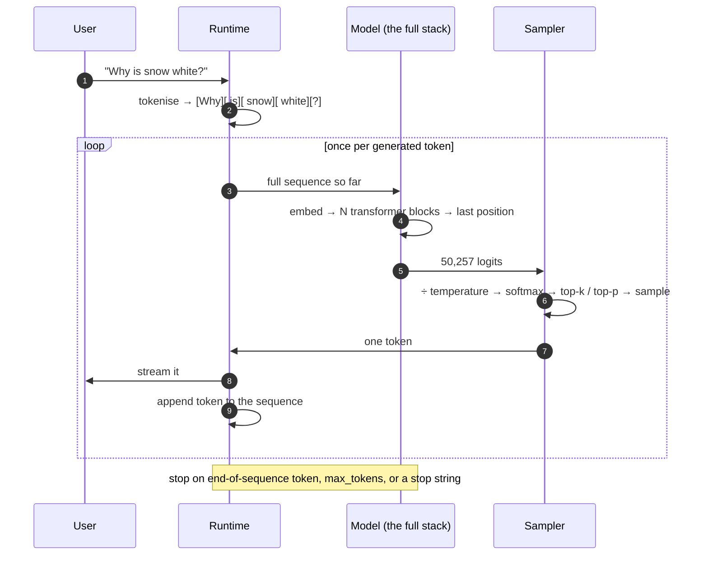

# One Token at a Time — Logits, Softmax, Temperature

The stack produces 50,257 numbers. This file covers what happens to them: how raw scores become probabilities, how a probability distribution becomes one chosen token, what the **temperature** knob actually does to the arithmetic, and why the whole thing has to be repeated for every single token of output.

## The loop

An LLM does not write an answer. It writes **one token**, appends it to the input, and writes one token again. This is called **autoregressive** generation, and almost every surprising behaviour of these systems traces back to it.

**Figure — the generation loop as a sequence of exchanges.**



Five consequences, all of which you have already observed without knowing why:

| Observation | Why |
|---|---|
| Output **streams** word by word | Each token genuinely is produced separately; there is nothing to stream from a finished answer, because no answer exists yet |
| Long answers cost more **and take longer** | One full forward pass per output token |
| Output tokens are priced higher than input tokens | Input can be processed in one parallel pass; output requires one sequential pass each |
| The model **cannot revise** what it already emitted | The token is in the sequence and is now part of the input. There is no backspace |
| A confident wrong opening sentence **drags the rest along** | Every subsequent token is conditioned on it. The model's own errors become context it must be consistent with |

That fourth and fifth point deserve emphasis for this audience. There is no planning stage. The model does not decide what the answer will be and then render it. **It commits to token 1 before it has any representation of token 40.** Chain-of-thought prompting (Session 10) works precisely because it converts "think then answer" into "emit intermediate tokens that the later tokens can then attend to" — you are giving the model a scratchpad inside the only mechanism it has.

## Logits → probabilities

The final vector at the last position, multiplied by the output matrix, gives one **logit** per vocabulary entry: an unbounded raw score. Bigger means "more likely," but they are not probabilities — they can be negative and they do not sum to anything.

**Softmax** converts them: exponentiate each, then divide by the total.

```
P(token i) = exp(logit_i) / Σ_j exp(logit_j)
```

Exponentiating does two things: it forces everything positive, and it **amplifies gaps**. A logit lead of 2.5 becomes a probability ratio of about 12×. Softmax is not a gentle normaliser; it is a sharpener.

## Temperature — what the knob actually does

Temperature is one division, applied to the logits before softmax:

```
P(token i) = exp(logit_i / T) / Σ_j exp(logit_j / T)
```

That is the entire mechanism. Dividing by `T < 1` spreads the logits further apart, so softmax sharpens toward the leader. Dividing by `T > 1` compresses them together, so the distribution flattens and unlikely tokens get real probability mass.

```python
# What temperature does to a next-token distribution. Nothing else changes:
# the model, the prompt, and the logits are identical in all three rows.
import numpy as np

logits = np.array([8.0, 5.5, 4.0, 2.0])
names = ["Canberra", "Sydney", "Melbourne", "Perth"]   # after "The capital of Australia is"

for T in (0.5, 1.0, 2.0):
    z = logits / T
    p = np.exp(z - z.max()); p /= p.sum()              # softmax, numerically stable
    print(f"T={T}: " + "  ".join(f"{n}={v:.3f}" for n, v in zip(names, p)))

# T=0.5: Canberra=0.993  Sydney=0.007  Melbourne=0.000  Perth=0.000
# T=1.0: Canberra=0.907  Sydney=0.074  Melbourne=0.017  Perth=0.002
# T=2.0: Canberra=0.680  Sydney=0.195  Melbourne=0.092  Perth=0.034
```

Read the bottom row carefully, because it is the practical lesson. At `T=2.0`, this model answers **"Melbourne" or "Perth" about 13% of the time** — to a question it knows the answer to perfectly well. The knowledge did not change. The logits did not change. Only the sampling did.

| Temperature | Effect on the distribution | Use it for |
|---|---|---|
| **0** | Degenerate — always take the highest logit (greedy). No sampling at all. | Extraction, classification, structured output, anything you need to be reproducible |
| **0.1 – 0.4** | Sharpened; the leader nearly always wins | Factual Q&A, code, summarisation, tool/function calls |
| **0.7 – 1.0** | The trained distribution, roughly as-is | General assistant chat — the usual default |
| **1.2 – 2.0** | Flattened; genuine unpredictability | Brainstorming, creative variation, generating diverse candidates to filter |

> **Temperature 0 is not "accurate mode."** It is "the most probable token, every time." The most probable continuation of a thin pattern is still a fabrication — it is just a *reproducible* fabrication. Turning temperature down reduces variance, not error. This distinction matters enormously and is the seam between this file and `content/07`.

**Figure — same logits, three shapes.**

```mermaid
xychart-beta
    title "Probability of each candidate, by temperature"
    x-axis ["Canberra", "Sydney", "Melbourne", "Perth"]
    y-axis "Probability" 0 --> 1
    bar [0.993, 0.007, 0.000, 0.000]
    bar [0.907, 0.074, 0.017, 0.002]
    bar [0.680, 0.195, 0.092, 0.034]
```



*(Bars, front to back: T=0.5, T=1.0, T=2.0.)*

## Top-k and top-p: truncating the tail

Temperature reshapes the whole distribution, including a very long tail of nonsense — 50,000 tokens, most of them absurd in context, each with a tiny but nonzero probability. Multiply tiny by 50,000 and the tail collectively is not tiny. Two standard truncations fix this:

| Method | Rule | Behaviour |
|---|---|---|
| **Top-k** | Keep the `k` highest-probability tokens, renormalise, sample from those | Fixed width. Too narrow when many options are genuinely good; too wide when only one is |
| **Top-p (nucleus)** | Keep the smallest set whose probabilities sum to `p` (e.g. 0.9), renormalise, sample | **Adaptive** — narrow when the model is confident, wide when it is not. Generally preferred |

Worked from the numbers above at `T=1.0`: top-p with `p=0.9` keeps only *Canberra* (0.907 ≥ 0.9) and discards everything else. Loosen to `p=0.99` and *Sydney* and *Melbourne* come back in. The same `p` behaves completely differently depending on how confident the model is — which is the point.

Practical guidance: **change one knob.** Adjusting temperature and top-p together makes behaviour hard to reason about. Most teams set top-p to a fixed sane value (0.9–1.0) and vary temperature only.

## Determinism, and why "temperature 0" still surprises people

At temperature 0 the sampling is deterministic — but the *system* often is not. Identical prompts can still produce different outputs because of floating-point non-determinism in batched GPU kernels (your request is batched with other users' requests, and reduction order changes), silent model version updates behind a stable API name, and any system-prompt or tool-definition text you did not author.

For this audience the operational rule is: **if you need reproducibility, pin the model version, set temperature 0, log the exact full prompt including system text, and store the output.** Do not assume the API will regenerate it. This is a configuration-management problem, and it is exactly the kind of thing this room is good at once it knows to look.

## Key takeaways

- Generation is **autoregressive**: one full forward pass per output token, each token appended and fed back. This explains streaming, per-token cost, latency, and the absence of a backspace.
- **There is no planning stage.** Token 1 is committed before token 40 exists. Chain-of-thought works by making intermediate reasoning into tokens that later tokens can attend to.
- **Logits → softmax → probabilities.** Softmax exponentiates, which sharpens differences rather than merely normalising them.
- **Temperature is one division** applied to the logits before softmax. Low `T` sharpens toward the leader; high `T` flattens. At `T=2.0` our example gives a wrong capital city ~13% of the time with unchanged knowledge.
- **Temperature 0 gives reproducibility, not accuracy.** The most probable fabrication is still a fabrication.
- **Top-p (nucleus)** truncates the tail adaptively and is generally preferable to fixed **top-k**. Vary one knob at a time.
- True determinism additionally requires pinning the model version and logging the exact full prompt — batched GPU arithmetic and silent model updates defeat temperature 0 on their own.
