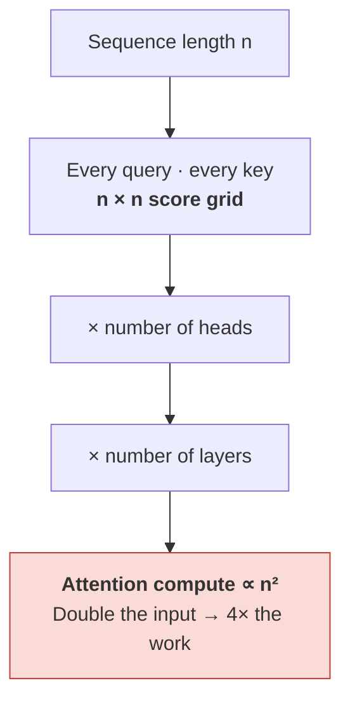
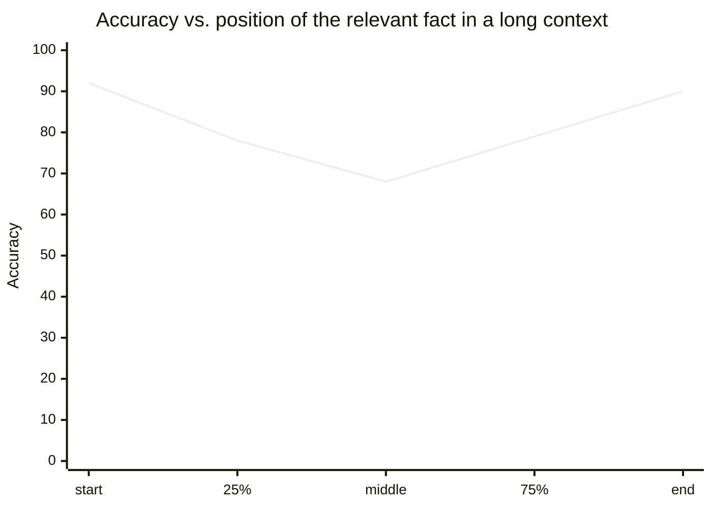

# The Context Window — Why It Is Finite, Why It Costs O(n²), Why More Is Not Better

The context window is the amount of text the model can attend to at once. This file explains where the limit comes from, why cost grows with the *square* of length rather than linearly, and the uncomfortable empirical finding that filling a large window degrades answer quality well before you hit the limit.

## Where the quadratic comes from

Go back to `content/03`. To compute attention, every token's query is dotted with every token's key. That produces an **n × n grid** of scores.

| Tokens in context (n) | Score grid entries (n²) | Relative to 1K |
|---|---|---|
| 1,024 | ~1.0 million | 1× |
| 4,096 | ~16.8 million | **16×** |
| 16,384 | ~268 million | **256×** |
| 65,536 | ~4.3 **billion** | **4,096×** |
| 262,144 | ~68.7 billion | **65,536×** |
| 1,048,576 (1M) | ~1.1 **trillion** | **~1,048,576×** |

And that is **per attention head, per layer**. A 12-layer, 12-head model computes 144 of those grids on every forward pass. A 96-layer, 96-head model computes 9,216 of them.

> **The rule to carry out of this session: doubling the context does not double the attention cost — it quadruples it.**



This is not the only cost that grows — the feed-forward layers grow **linearly** with n — but it is the one that dominates once contexts get long, and it is the one that made "just make the window bigger" a research problem rather than a configuration change.

## The KV cache: why the loop is not as bad as it looks

`content/05` said the model runs the full stack once per generated token. Naively that means generating token 1,000 requires recomputing attention over all 999 previous tokens, from scratch, having already done nearly the same work for token 999. Generating a sequence of length n would cost O(n³) in total. Nobody would ship that.

The fix is the **KV cache**. The keys and values for a token depend only on that token and the ones before it — never on what comes after. So once computed, they never change. Cache them. Each new token computes its own query, dots it against the *cached* keys, and appends its own key and value to the cache.

| | Without KV cache | With KV cache |
|---|---|---|
| Work per new token | Recompute everything: O(n²) | New token against cached keys: **O(n)** |
| Total for n tokens | O(n³) | **O(n²)** |
| Memory cost | None | **Grows linearly with n** — and it is large |

The cache is not free, and its size is easy to compute. For GPT-2 small (12 layers, `d_model` 768, 2 bytes per number in fp16):

```
per token = 2 (K and V) × 12 layers × 768 dims × 2 bytes = 36,864 bytes ≈ 36 KB
```

So a full 1,024-token context holds about **36 MB** of cache — for a 124M-parameter model. Scale the layers and dimensions to a frontier model with a long context and the KV cache runs to **tens of gigabytes per concurrent conversation**. This, more than compute, is what limits how many users a GPU can serve at once, and it is why the industry invested so heavily in cache-shrinking architectures (grouped-query attention, multi-query attention, sliding-window attention) rather than in raw speed.

**Two things this explains that you will meet directly:**

- **Prompt caching** (Session 2's cost lever) is exactly this cache, persisted between requests. If the first 10,000 tokens of your prompt are identical every time, the provider can reuse their KVs instead of recomputing them — hence the steep discount on cached input tokens. It also explains the constraint: caching works on a **stable prefix**. Put the volatile part of your prompt at the *end*, or you invalidate the cache.
- **Time-to-first-token vs. inter-token latency** are different quantities. The first token requires processing the entire prompt (the "prefill", parallel but O(n²)); subsequent tokens are cheap O(n) steps. A long prompt with a short answer is latency-dominated by prefill.

## Then why not just make the window enormous?

Three limits, in increasing order of how much they will annoy you:

1. **Compute and memory**, above. Real, but engineering has repeatedly pushed it back.
2. **Training distribution.** A model is trained on sequences up to some length. Its position handling is reliable over the range it saw. Extending beyond that — by interpolation tricks or light fine-tuning — mostly works, but "supports 1M tokens" and "was trained on 1M-token documents" are very different claims. Vendors advertise the first.
3. **It stops helping, and then starts hurting.** This is the one that matters operationally.

## Context rot and lost-in-the-middle

The intuition everyone starts with is that context is like RAM: if it fits, it is available, and more is never worse. That intuition is wrong, and the evidence is now solid.

**Lost in the middle** (Liu et al., TACL 2023 — see `resources/sources.md` #7). Put the answer-bearing document at various positions in a long context and measure accuracy. The result is a **U-shaped curve**: models do best when the relevant information is at the very beginning or the very end, and measurably worse when it sits in the middle — in some settings worse than giving the model *no* documents at all.

**Context rot** (Chroma, 2025 — `resources/sources.md` #6). A broader replication across 18 models. Two findings sharpen the picture considerably:

- Performance degrades as input length grows **even on tasks where retrieval is perfect** — that is, even when the model demonstrably has the right text in front of it. Length itself is a degradation factor, not just a search difficulty.
- **Distractors get worse with length.** Plausible-but-wrong material that a model shrugs off in a short context increasingly pulls it off course as the context grows.

**Figure — the shape to expect (schematic; run your own measurement for your own workload).**



*Schematic only — illustrating the U-shape reported in the long-context literature. The numbers are not measurements and must not be presented as such.*

Mechanistically this is not mysterious. Softmax over n positions distributes a fixed budget of attention mass: with more tokens competing, each individual relevant token can receive less weight. Position handling is least practised in the interior of long sequences. And more text means more plausible-looking near-misses for attention to land on.

### The engineering rules that follow

| Rule | Why |
|---|---|
| **Curate, don't dump.** Fewer, more relevant tokens beat more, less relevant ones. | Distractors actively hurt, and they hurt more at length. |
| **Put the critical material at the start or the end.** Question last is a good default. | The U-curve is real and cheap to exploit. |
| **Retrieve, then filter, then rank** (Session 13's RAG pipeline). | "Just put all the docs in the window" is the failure mode the literature documents. |
| **Measure degradation on *your* task at *your* lengths.** | Published curves are directional. Your documents, your model, your distractors. |
| **Treat a long window as a budget, not an entitlement.** | It is simultaneously your cost meter, your latency driver, and your accuracy risk. |

For a release/problem/configuration audience this is the single most transferable finding in the session: **"I gave it all the logs and it got worse" is not user error and it is not a bug. It is the documented behaviour of the mechanism.**

## Key takeaways

- Attention compares every token with every token — an **n × n grid per head per layer**. Doubling context **quadruples** attention compute.
- The **KV cache** rescues autoregressive generation from O(n³) to O(n²) by never recomputing keys and values, at the price of memory that grows **linearly** with context — tens of GB per conversation at frontier scale, and the real limit on concurrent users.
- Prompt caching is the KV cache persisted across requests, which is why it needs a **stable prefix**: put volatile content last.
- Long context is limited by compute, by the training distribution ("supports 1M" ≠ "trained on 1M"), and — most importantly — by **degradation**.
- **Lost-in-the-middle**: accuracy is U-shaped in the position of the relevant fact. **Context rot**: performance drops with length even when retrieval is perfect, and distractors bite harder as length grows.
- Therefore: **curate rather than dump**, put critical material first or last, and measure degradation on your own workload.
