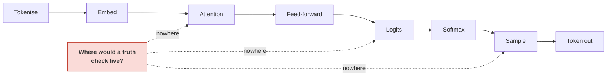
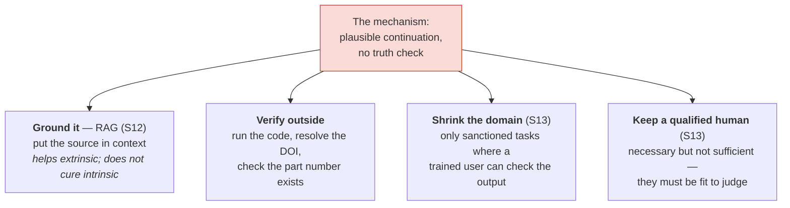

# Why It Hallucinates — The Payoff

Session 1 told you an LLM hallucinates because it completes patterns rather than retrieving facts. That was a claim you had to accept. You have now seen every stage of the machine. This file cashes the claim in: we walk the pipeline and ask, at each box, *where is the fact check?* — and find that there is nowhere for one to be.

## The question, asked mechanically

Here is the whole pipeline again, with one column added.

| Stage | What it does | Does it check the output against the world? |
|---|---|---|
| **Tokenise** | Splits text into vocabulary pieces by a frequency-derived merge list | No. It has no notion of meaning at all, let alone truth. |
| **Embed** | Fetches a learned vector per token ID, adds position | No. A lookup table has no truth value. |
| **Attention** | Rebuilds each token as a weighted mixture of context | No. It computes *relevance*, which is not *correctness*. A false statement is exactly as attendable as a true one. |
| **Feed-forward** | Transforms each token's representation | No. It applies learned weights. Weights encode statistical association, not verified propositions. |
| **Output projection** | Produces one logit per vocabulary entry | No. A logit answers "how well does this token fit the pattern," not "is this true." |
| **Softmax** | Normalises logits into probabilities | No. It is arithmetic. |
| **Sample** | Picks one token | No. It is a random draw from a distribution. |

**There is no stage that could hold one.** Not "the check is weak" or "the check sometimes fails" — there is no component whose job is verification, and no signal available to one. The model's only optimisation target during training was: *make the next token more probable*. A system optimised for plausible continuation produces plausible continuations. When the pattern is well supported by training data, plausible and true coincide and the output is correct. When the pattern is thin, they come apart — and **the machine cannot tell the difference, because the same arithmetic ran in both cases.**

This is the precise sense in which Session 1's framing was right: **hallucination is not a defect in the mechanism. It is the mechanism, observed where the data ran out.**

## Why it is confident

The follow-up question people ask is: fine, but why does it not *sound* uncertain?

Look at what "confidence" is made of. The model's internal certainty is the shape of the softmax distribution — sharp means one token dominates, flat means several compete. Now ask: what shapes that distribution? **Pattern strength**, not evidential support.

Consider a request for a citation to a paper that does not exist. The model has seen tens of thousands of real citations. The *format* is a very strong pattern: author surnames, a year in parentheses, a plausible title, a venue, a volume, page numbers. At each position, one token overwhelmingly fits the pattern. The distribution is sharp at every step. The model is, in the only sense it has, **highly confident** — and the paper does not exist.

| | Answering a well-supported question | Fabricating |
|---|---|---|
| Softmax shape | Sharp | **Often equally sharp** |
| What is driving the sharpness | A strong pattern that reflects a real regularity | A strong pattern in *form*, with nothing behind it |
| What the model can distinguish | — | **Nothing. The arithmetic is identical.** |

This is the mechanical restatement of Session 1's point about human false memories: *certainty is not a truth signal*. In a human, confidence tracks fluency of recall. In an LLM, confidence tracks probability mass. **Neither tracks evidence**, and that is the whole reason the two failure modes feel so similar.

The fluency of the prose is a further trap. The output is fluent because fluency is the training objective. It is not fluent *because* it is correct, and there is no correlation you may rely on. **The surface signals humans use to gauge reliability in other humans — coherence, specificity, confident register, appropriate jargon — are exactly the signals this system is optimised to produce regardless of truth.**

## Naming the mechanisms you have now seen

Session 1 gave you the taxonomy (intrinsic vs. extrinsic hallucination, after Maynez et al. 2020). This session lets you attach each to a stage.

| Failure you observe | The mechanism, now that you know the machine |
|---|---|
| **Fabricated citations, APIs, part numbers** | Strong *format* patterns with thin *content* patterns. Every token is locally plausible; the composite never existed. |
| **Contradicting a document you supplied** (intrinsic) | Attention is a **soft blend**, not a retrieval. The supplied document competes for attention mass with the pre-training prior. It does not automatically win. |
| **Confidently wrong arithmetic** | Numbers were shredded into arbitrary token fragments (`content/01`) before any "reasoning" occurred. The model pattern-matches over fragments. |
| **Quality drops as you add documents** | Context rot and lost-in-the-middle (`content/06`). More text, more distractors, thinner attention mass per relevant token. |
| **The wrong opening sentence poisons the answer** | Autoregression (`content/05`). The error is now in the context and later tokens are conditioned to stay consistent with it. |
| **Same prompt, different answer** | Sampling (`content/05`). Temperature > 0 is a random draw. |
| **Turning temperature to 0 does not fix it** | Temperature reshapes the distribution; it does not add evidence. You get the *most probable* fabrication, reproducibly. |

That last row is the one to hammer. It is a common and expensive misconception in engineering teams: *set temperature to 0 and it will stop making things up*. It will not. It will make the same thing up every time.

## What actually helps, and why the mechanism says so

Nothing in this file argues LLMs are unusable. It argues that reliability has to be **added from outside**, because the mechanism cannot supply it. The interventions that work are the ones that put a check where the pipeline has none.

Two honest limits on that diagram, both of which follow from what you have just learned:

- **Grounding is not a cure.** Putting the source in context makes the right answer *available* and *more probable*. It does not make it *guaranteed*, because attention blends the document with the prior rather than deferring to it. This is exactly why intrinsic hallucination — contradicting a document you supplied — remains a live failure mode in RAG systems. Session 13 measures it rather than assuming it away.
- **The verification burden grows with capability.** As the model gets better, the residual errors get rarer and harder to spot, while the volume of output you are checking goes up. A system that is right 99% of the time is *harder* to supervise than one that is right 80% of the time, because vigilance decays when it is almost never rewarded. Sessions 13–13 build the process answer to this; it is not a technical problem and no model release will solve it.

## The one-paragraph version

An LLM converts your text into vocabulary fragments, replaces each with a learned vector, repeatedly rewrites each vector as a weighted blend of its context, and finally scores every possible next token by how well it fits the resulting pattern — then rolls a die weighted by those scores. Every step is an arithmetic operation on learned parameters. **Not one step consults anything outside the model, and not one step has a mechanism for being wrong-and-knowing-it.** When the pattern is dense, the output is right. When it is thin, the output is fluent, specific, confident, and false — produced by identical arithmetic, and indistinguishable from the inside. That is what "autocomplete on steroids — a pattern-matcher, not a search engine" means, mechanically. **Verification is not a precaution you take around this system. It is the missing component.**

## Key takeaways

- Walk the pipeline stage by stage and there is **no component that checks output against truth** — and no signal available to one. The training objective was next-token probability, and nothing else.
- Hallucination is therefore **the mechanism running where the data is thin**, not a defect bolted onto it. Correct answers and fabrications are produced by *identical* arithmetic.
- **Confidence tracks pattern strength, not evidence.** A fabricated citation can have a sharper distribution than a true fact, because the *format* is a very strong pattern. Fluency is the training objective, not a reliability signal.
- **Temperature 0 does not fix hallucination.** It produces the most probable fabrication, reproducibly.
- Grounding (RAG) makes the right answer more probable but not guaranteed — attention blends the source with the prior, which is why intrinsic hallucination survives grounding.
- Reliability must be **added from outside**: verifiable outputs, a shrunk operating domain, external checks, and a human who is genuinely fit to judge. The verification burden **grows** as the model improves.
