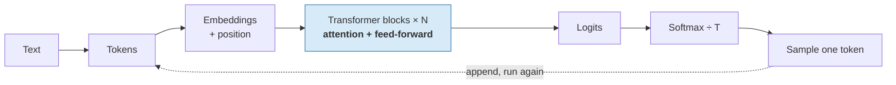

# Key Takeaways — Session 9

The whole session, compressed. If you read nothing else in this folder, read this — but the mechanism only becomes usable once you have watched the Snow White numbers change in `content/03`.

## The pipeline

## By topic

**Tokens** — The model never sees words, only integer IDs of subword pieces from a frequency-built (BPE) vocabulary. Leading spaces and capitalisation are part of the token. German, code, JSON, and identifiers cost 1.5–3× more tokens than English prose, which is simultaneously a bill multiplier and a context-window multiplier. Numbers get split into arbitrary fragments — the root of unreliable arithmetic.

**Embeddings** — A learned lookup table, one vector per vocabulary entry (50,257 × 768 ≈ 38.6M numbers in GPT-2 small). Meaning is direction; relatedness is a dot product. No real dimension has a human-readable label. Attention is order-blind, so position must be added explicitly. Critically, an embedding is **context-free** — the same row every time.

**Self-attention — the centre of the session** — Every token gets a **Query** ("what I'm looking for"), **Key** ("what I am"), and **Value** ("what I'd contribute"), and rebuilds itself as a weighted average of all values, with weights it computes itself: `softmax(QKᵀ/√d)V`. In *"Who is snow white"* vs *"Why is snow white"*, the vector for `white` goes **in identical and comes out different** — and the divergence **grows with depth**, because each layer's queries are built from the previous layer's disambiguated outputs. Every token is one hop from every other, at any distance. Attention weights show routing, **not reasoning** — never read a heat map as an explanation.

**The stack** — Multi-head attention splits `d_model` across heads (768 = 12 × 64) so a token can track several relations at once. Each block is attention (moves information *between* tokens) + a feed-forward network (transforms *within* a token), both wrapped in residual connections and layer norm. **Decoder-only** (causally masked) is every chat model you use; **encoder-only** (bidirectional) is what produces the embeddings behind RAG. In GPT-2 small's 124M parameters, feed-forward is the largest block (~45%), embeddings ~31%, attention ~23%.

**Generation** — Autoregressive: one full forward pass per output token. Hence streaming, per-token pricing, latency, and **no backspace**. There is no planning stage — token 1 is committed before token 40 exists. **Temperature is one division applied to logits before softmax**: low sharpens, high flattens. Top-p truncates the tail adaptively; prefer it to top-k, and vary one knob at a time. **Temperature 0 buys reproducibility, not accuracy.**

**Context** — Attention builds an n × n grid per head per layer: **doubling context quadruples attention compute**. The KV cache rescues generation from O(n³) to O(n²) at the cost of memory growing linearly — tens of GB per conversation at frontier scale, and the real limit on concurrency. Prompt caching is that cache persisted, which is why it needs a **stable prefix**. And more context is not monotonically better: **lost-in-the-middle** (U-shaped accuracy by position) and **context rot** (degradation with length even at perfect retrieval; distractors bite harder at length) mean you should curate rather than dump, and put critical material first or last.

**Why it hallucinates — the payoff** — Walk every stage and ask where a truth check would live: **there is nowhere for one to be.** The only training objective was next-token probability. Correct answers and fabrications come out of *identical* arithmetic; the model cannot distinguish them because there is nothing to distinguish them with. Confidence tracks **pattern strength**, not evidence — a fabricated citation can have a sharper distribution than a true fact, because the *format* is a very strong pattern. Fluency is the objective, not a reliability signal. Reliability has to be added from outside, and the verification burden **grows** as the model improves.

## The corrections this session makes to common beliefs

| Common belief | What the mechanism says |
|---|---|
| "A token is a word." | A token is a frequency-derived fragment. `' Snow'` ≠ `' snow'` ≠ `'snow'`. |
| "Bigger context is strictly better." | Cost is quadratic and accuracy degrades with length even at perfect retrieval. |
| "Temperature 0 makes it accurate." | It makes it *reproducible*. The most probable fabrication is still a fabrication. |
| "It sounded confident, so it's probably right." | Confidence is distribution sharpness, which tracks pattern strength — not truth. |
| "The attention map shows its reasoning." | It shows where information was routed. Nothing more. |
| "RAG eliminates hallucination." | It makes the right answer more probable. Attention blends the source with the prior; intrinsic hallucination survives. |
| "It plans the answer then writes it." | It commits to token 1 before token 40 exists. |

## If you remember one thing

> **Every stage of an LLM computes how well a token *fits the pattern*. No stage computes whether it is *true* — so a correct answer and a confident fabrication are produced by exactly the same arithmetic, and the machine cannot tell them apart. Verification is not a precaution around this system; it is the component that is missing.**
