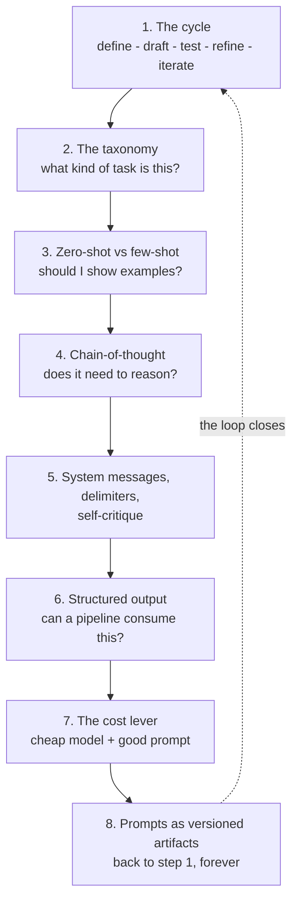

# Overview — Prompting Is a Technique, Not a Personality Trait

This session's argument in one line: **prompting is a repeatable, testable engineering loop, and the people who get value from LLMs are the ones running that loop.** Everything below is the arc of how we get there.

---

## The problem this session solves

Ask ten people in a technical organisation how they prompt an LLM, and you get ten variations of the same non-answer: *"I just ask it."* When the output is bad, the response is to re-roll — retype the request slightly differently and hope. When the output is good, nobody records why. The prompt lives in someone's chat history, or their head, and dies there.

That is not a skill problem. It is a **process** problem, and it has three symptoms:

| Symptom | What it looks like | What it costs |
|---|---|---|
| **No objective** | "Make this better." | You cannot tell whether the output is good, so you accept the first plausible one. |
| **No test set** | The prompt was tried once, on one input, and declared working. | It fails silently on input #7, in production, in front of a customer. |
| **No versioning** | The prompt is in a chat window or pasted inline in a script. | Someone "improves" it, three other things regress, nobody notices. |

The fix for all three is the same shape: **treat the prompt like code.** Define what "working" means, keep a small set of real examples to test against, change one thing at a time, and keep the versions.

---

## What the 2024 source material got right — and what it missed

This session's frameworks are inherited from a January-2024 prompt-engineering deck. Being honest about it is part of the lesson, because *watching a curriculum expire teaches you why to test your own.*

**It got two things right, and they are durable:**

1. **The prompt-engineering cycle** — a six-step loop. Model-agnostic, still correct in 2026. `content/01`.
2. **The 11-task-type taxonomy** — a working reference that tells you what kind of thing you are asking for, and therefore which principles apply. `content/02`.

**It missed, entirely:** zero-shot, few-shot, chain-of-thought, delimiters, system messages, output schemas, temperature, context windows, hallucination, prompt injection, RAG, evaluation. And most damningly, for a deck called a *Cookbook*: it contains **not one verbatim prompt**. It lists recipe *categories* — "Summarizing a Long Article into Bullet Points" — and no recipes.

So this session keeps the skeleton and rebuilds the body. Every technique from `content/03` onward is authored for this course, and every one of them comes with a complete prompt you can copy.

> **The meta-lesson, worth saying out loud in the room:** a prompting curriculum written 30 months ago is missing half its vocabulary. Whatever you learn today, assume the same about it. That is exactly why we teach *testing* as the core skill rather than a list of magic phrases — testing is what survives when the phrases stop working.

---

## The arc of the session

*Caption: the session arc. Note that it is a circle, not a list — step 8 hands back to step 1, which is the whole point.*

---

## Four claims this session defends

**1. Prompting is a loop, not a lucky guess.**
The difference between a professional and an amateur prompter is not vocabulary. It is that the professional has a small set of test cases and runs the prompt against all of them before believing anything. *(`content/01`, `content/08`)*

**2. The technique you need depends on the task type.**
"Summarise this incident report" and "decide whether this config change is risky" are different *kinds* of request and want different prompt shapes. A taxonomy stops you defaulting to one shape for everything. *(`content/02`)*

**3. Structured output is what makes prompting an engineering activity rather than a chat activity.**
As long as the model returns prose, a human must read it. The moment it returns schema-valid JSON, a pipeline can act on it — release-note generation, incident triage, config-diff classification all become automatable, with a human gate where it matters. *(`content/06`)*

**4. Prompting is a cost lever, measurably.**
A smaller, cheaper, faster model given examples, a clear output contract, and a decomposed task will frequently match a frontier model given a lazy one-liner. That is a procurement argument, an SLA argument, and a latency argument, and it is the reason management should care about this session. With one honest caveat: **compare at equal token spend, or you are measuring your own spending, not your prompting.** *(`content/07`)*

---

## What this session deliberately does *not* cover

Skepticism is house style, so here is the boundary:

| Not covered here | Where it lives |
|---|---|
| Longer worked examples on the team's own tasks; iterating on a bad prompt live | **Session 11** (Prompting II) |
| Claude-specific workflow — Projects, Artifacts, extended thinking, connectors | **Session 11** |
| RAG / grounding a prompt in your own documents | **Session 13** |
| Prompt injection and jailbreaking — attacking the delimiter discipline we teach here | **Session 14** |
| Agents, tool loops, multi-step autonomy | later sessions |

And one thing nobody covers, because it isn't true: there is no phrase that reliably makes a model smarter. Prompting shapes and constrains behaviour. It does not add capability the model lacks. When a task is genuinely beyond the model, the correct move is a different model, a decomposed task, or retrieval — **not a better adjective.**

---

## How to read the rest of this folder

| File | Read it for |
|---|---|
| `01-the-prompt-engineering-cycle.md` | The loop, with a fully worked release-notes example through all six steps |
| `02-task-type-taxonomy.md` | The 11 types, their design principles, and the task→technique decision table |
| `03-zero-shot-and-few-shot.md` | Examples in the prompt: when, how many, and when they backfire |
| `04-chain-of-thought.md` | Reasoning: the 2023 trick, the 2026 parameter, and when it doesn't help |
| `05-system-messages-delimiters-self-critique.md` | The three structural habits, with before/after pairs |
| `06-structured-output.md` | JSON you can build on: asking vs. guaranteeing |
| `07-cheap-model-well-prompted.md` | The cost arithmetic, and how to run the comparison honestly |
| `08-prompts-as-versioned-artifacts.md` | Eval sets, regression, CI — the practice that makes the rest stick |
| `99-key-takeaways.md` | The recap, and the one thing to remember |
