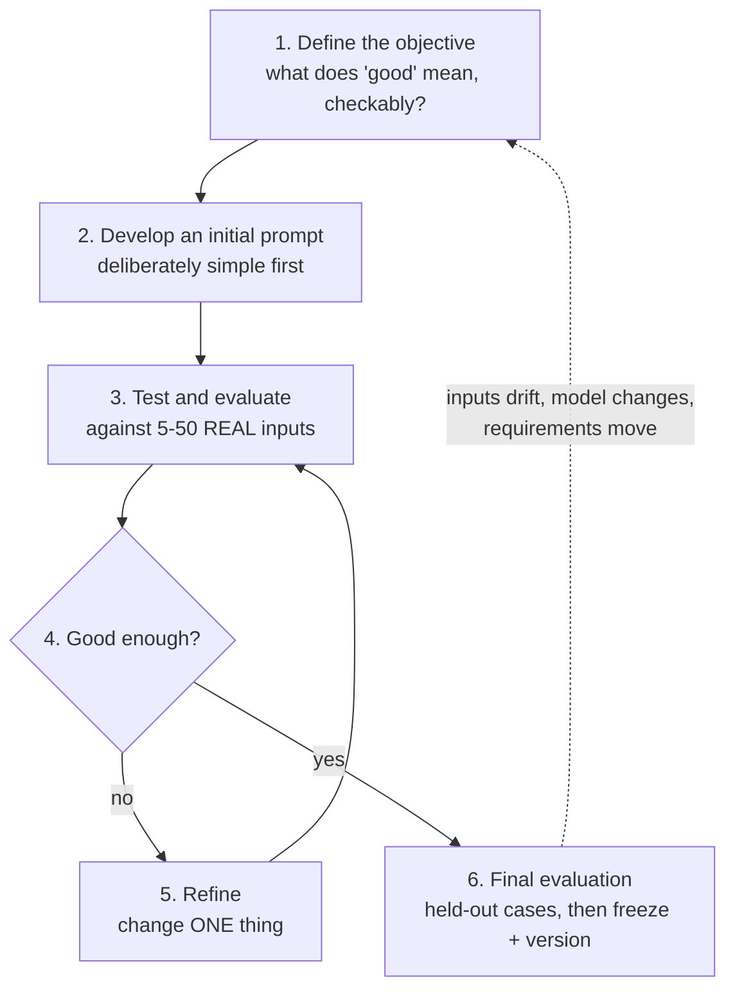

# The Prompt-Engineering Cycle

The one framework worth inheriting from the 2024 source deck, corrected for 2026 practice: prompting is a **six-step loop**, and the step people skip is the one that makes it engineering.

---

## The loop


*Caption: the prompt-engineering cycle. The inner loop (test → refine → test) is where the work is; the outer dotted line is why the prompt is never finished.*

The source deck drew this as a linear 1–6 list. Drawing it as a list is how you get people who "did prompt engineering" once. **The inner loop is the technique.**

---

## The six steps, and what each one costs you when skipped

| # | Step | What it actually means | Failure if you skip it |
|---|---|---|---|
| 1 | **Define the objective** | Write down what a *good* output looks like, in terms you could check without re-reading the prompt. Ideally a rule someone else could apply. | You accept the first plausible output. "Plausible" is exactly what an LLM is optimised to produce. |
| 2 | **Develop an initial prompt** | Draft the simplest thing that could work. Do **not** front-load every technique you know. | You start with a 400-word prompt and can never tell which part is doing the work. |
| 3 | **Test and evaluate** | Run it against several **real** inputs — ideally ones that have burned you before. Record the results. | The prompt works on the example you invented and fails on the messy reality. This is the most-skipped step and the most expensive. |
| 4 | **Refine** | Change **one** thing. Re-run the same test set. | Changing three things at once means you learn nothing from the result. |
| 5 | **Iterate** | Repeat 3–4 until the marginal improvement stops justifying the effort. Set that threshold *before* you start. | Prompt-golf forever. Diminishing returns are real and arrive early. |
| 6 | **Final evaluation** | Run on cases you have *not* been tuning against, then freeze the prompt, version it, and record the score. | You overfit the prompt to your five test cases — the same overfitting failure taught in Session 8, in a different costume. |

> **The correction to the source deck.** The 2024 version treats testing as step 3 of 6 and "final evaluation" as a tidy ending. Current professional practice inverts the emphasis: **you cannot start until you have (a) success criteria and (b) a way to test against them.** Without those two, you are not engineering, you are guessing. The good news is that the bar is much lower than people fear — **20 to 50 cases drawn from real failures is a strong start**, and 5 is enough to begin. (see `resources/sources.md` #4, #5)

---

## Step 1 in detail: what a checkable objective looks like

This is where most attempts die, so it gets its own table. The test of a good objective: **could a colleague grade an output against it without asking you a question?**

| Vague objective (useless) | Checkable objective (usable) |
|---|---|
| "Good release notes." | "One bullet per user-visible change; no bullet mentions an internal ticket ID; every bullet starts with a verb; internal-only refactors are excluded; ≤ 12 bullets." |
| "Summarise the incident well." | "≤ 120 words; states the customer-visible symptom, the duration, and the component; does **not** state a root cause unless the input says one was confirmed." |
| "Classify the config diff." | "Returns exactly one of {no-risk, review-needed, blocking}; `blocking` only if the diff touches a file under `security/` or changes a value in the production profile." |

Notice what the right-hand column really is: **an eval rubric.** You have written your test set's scoring function before writing the prompt. That is the whole trick.

---

## A fully worked pass through the cycle

The task: **draft release notes from a list of merged commits.** Real, boring, and exactly what this room does.

### Step 1 — Define the objective

> Output is a Markdown bullet list. One bullet per *user-visible* change. Each bullet: starts with a past-tense verb, ≤ 20 words, plain language (no internal component code-names), no ticket IDs. Pure refactors, test-only changes, and dependency bumps with no behaviour change are **omitted**. Maximum 12 bullets. If nothing is user-visible, output exactly `No user-visible changes.`

### Step 2 — Initial prompt (deliberately naive)

```text
Write release notes from these commits:

<commits pasted here>
```

### Step 3 — Test on 5 real commit lists

Result: it produced one bullet per commit including `chore: bump lodash`, invented a feature name that appeared nowhere in the input, kept the ticket IDs, and on the shortest list produced three paragraphs of enthusiastic marketing prose.

That is a completely normal first result. The prompt asked for none of the things the objective requires, so the model supplied its own defaults — which are trained-in habits, not your requirements.

### Steps 4–5 — Refine, one change at a time

| Iteration | The single change | Effect on the 5 test cases |
|---|---|---|
| v2 | Added the explicit output contract (verb-first, ≤ 20 words, no ticket IDs, Markdown bullets). | Format fixed on 5/5. Still included the dependency bump; still invented a feature name once. |
| v3 | Added the exclusion rule as a named list (refactors / test-only / dependency bumps with no behaviour change). | Dependency bump dropped on 5/5. Invention still present on 1/5. |
| v4 | Added the grounding constraint: *"Every bullet must be traceable to at least one commit message. Do not describe changes not present in the input."* | Invention gone on 5/5. |
| v5 | Added **two worked examples** (a commit line → its bullet, and a commit line → omitted). See `content/03`. | Tone stabilised; the "marketing prose on short lists" failure disappeared. |
| v6 | Added the empty case: *"If no change is user-visible, output exactly `No user-visible changes.`"* | The edge case that had produced an apologetic paragraph now returns the exact string. |

Five refinements, each testable, each attributable. Compare that with the usual alternative: rewriting the whole prompt from scratch in frustration and having no idea what fixed it.

### Step 6 — Final evaluation

Run v6 against **three commit lists it has never seen**, including one deliberately awkward one (a release that is genuinely all internal). Score against the rubric from step 1. Then freeze it, give it a version number, and store it next to the code that calls it. `content/08` covers what "store it" should mean.

The finished v6 prompt is written out in full in `content/05`, after we have introduced the system message and delimiters that it uses.

---

## The cycle in code: a minimal harness

The cycle does not require tooling, but the moment you have more than three test cases, a twenty-line script beats copy-pasting. This is the skeleton the lab (`exercises/lab.md`) builds out.

```python
"""Minimal prompt-evaluation loop.
Model IDs and pricing below are placeholders - VERIFY AT DELIVERY.
"""
from anthropic import Anthropic

client = Anthropic()  # reads ANTHROPIC_API_KEY from the environment
MODEL = "claude-<small-model>-<version>"  # VERIFY AT DELIVERY

PROMPT_V6 = """..."""  # the full prompt lives in content/05

# The eval set: real inputs plus a checkable expectation.
# Five cases is enough to start. Grow it every time production surprises you.
CASES = [
    {"name": "normal-release",  "commits": "...", "must_not_contain": ["JIRA-", "lodash"]},
    {"name": "internal-only",   "commits": "...", "expect_exact": "No user-visible changes."},
    {"name": "single-feature",  "commits": "...", "max_bullets": 1},
]

def run(prompt: str, commits: str) -> str:
    resp = client.messages.create(
        model=MODEL,
        max_tokens=1000,
        temperature=0,           # determinism first: you are debugging the PROMPT, not the sampler
        system=prompt,
        messages=[{"role": "user", "content": commits}],
    )
    return resp.content[0].text

def score(case: dict, output: str) -> bool:
    if "expect_exact" in case and output.strip() != case["expect_exact"]:
        return False
    if any(bad in output for bad in case.get("must_not_contain", [])):
        return False
    if "max_bullets" in case and output.count("\n- ") + 1 > case["max_bullets"]:
        return False
    return True

passes = 0
for case in CASES:
    out = run(PROMPT_V6, case["commits"])
    ok = score(case, out)
    passes += ok
    print(f"{case['name']:<16} {'PASS' if ok else 'FAIL'}")

print(f"\n{passes}/{len(CASES)} passed")

# Expected output (illustrative):
# normal-release   PASS
# internal-only    PASS
# single-feature   FAIL
#
# 2/3 passed
#
# A FAIL here is a GOOD outcome on the first run - it means the eval set has
# teeth. An eval set that passes 100% on your first draft is measuring nothing.
```

Two deliberate choices in that snippet worth naming:

- **`temperature=0`.** While you are iterating on a prompt you want the model's randomness out of the way, so that a change in output is attributable to your change in prompt. Turn temperature back up later if the task actually wants variety (creative tasks — see `content/02`). Note that temperature 0 is *near*-deterministic, not guaranteed-deterministic; batching and floating-point non-determinism mean identical inputs can still occasionally differ.
- **The scorer is dumb string checks.** That is fine, and it is where to start. Most useful prompt regressions are catchable by "did it contain a ticket ID", "was it under the length limit", "did it return valid JSON". Reach for an LLM-as-judge only for the criteria that genuinely need judgement, and only after you have exhausted the cheap deterministic checks.

---

## When to stop

Set the stopping rule before you start, or you will prompt-golf forever. Three usable rules:

| Rule | Use when |
|---|---|
| **Threshold** — "stop at 90% pass on the eval set." | You have a scoreable rubric. Best default. |
| **Budget** — "stop after 6 iterations or 45 minutes." | Exploratory work, or when the objective is fuzzy. |
| **Marginal-return** — "stop when two consecutive iterations each gain < 5%." | Mature prompts being tuned rather than built. |

And the fourth, uncomfortable rule: **stop and change something other than the prompt.** If four honest iterations have not moved the number, the problem is probably not phrasing. Candidates: the model is too small for the task, the task should be decomposed into two calls, the input is missing information the model would need (a retrieval problem, not a prompting problem), or the objective is not actually achievable. Recognising this is a senior skill and it saves days.

---

## What to take from this file

- The loop's value is the **inner** loop: test → refine one thing → test again.
- **Write the rubric before the prompt.** The rubric *is* the eval set's scoring function.
- **Five real cases beat fifty invented ones.** Grow the set from production failures.
- **Change one thing per iteration**, or you learn nothing.
- **Know your stopping rule in advance**, including the rule that says "the prompt is not the problem."
