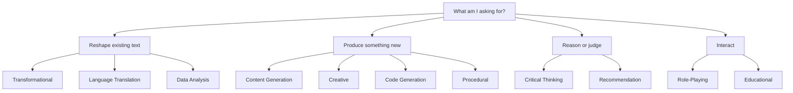
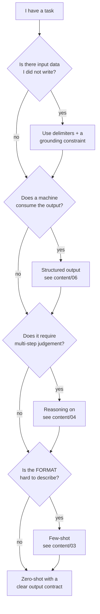

# The Task-Type Taxonomy — A Working Reference

Eleven kinds of thing you can ask an LLM to do, each with its own design principles. The point of a taxonomy is not tidiness: it is to stop you writing every prompt in the same shape, and to tell you which techniques to reach for.

---

## Why a taxonomy at all

Most people converge on one prompt shape — a polite instruction, no examples, no output contract — and apply it to everything. That shape happens to be decent for *transformational* tasks (summarise, rewrite, translate) and poor for almost everything else. Classifying the task first is a 10-second habit that changes which knobs you touch.

*Caption: the 11 task types, grouped by what the model is being asked to do. The grouping is ours; the 11 types are re-authored from the source deck (see `resources/sources.md` #1).*

> **A note on rigour.** This 11-type taxonomy is a *practical* reference, not an academic one — it was designed for a beginner webinar and its categories overlap (a code-review request is arguably Code Generation *and* Critical Thinking). For a defensible, systematically-derived vocabulary — 33 terms and 58 text-prompting techniques — use **The Prompt Report v6** (CC BY 4.0, `resources/sources.md` #3). Use the 11 types to *decide what to do*; use The Prompt Report to *agree on what words mean* when two engineers argue about what "few-shot" includes.

---

## The eleven types

Each entry gives the source deck's design principles (re-authored), plus what it looks like for this audience, plus the techniques that matter for it.

### 1. Transformational
Reshaping text you already have: summarise, condense, reformat, simplify, extract.

- **Principles:** state the transformation precisely; say explicitly what must be *preserved*; give the target length/format; supply an example if the format is unusual.
- **This room's version:** turning a 40-message incident thread into a 100-word customer-facing status note; converting a changelog into release notes; extracting affected components from a bug report.
- **Techniques that pay:** output contract (length, format), delimiters (separate instructions from the source text), few-shot for format, **grounding constraint** ("do not add information not present in the source") — this is the single highest-value line for transformational tasks, because the failure mode is fabrication.

### 2. Creative
Open-ended generation where variety is the point.

- **Principles:** encourage open-endedness; give clear boundaries anyway (length, tone, forbidden content); name specific elements to include; balance specificity against flexibility.
- **This room's version:** honestly, rare. Naming a project, brainstorming failure scenarios for a pre-mortem, generating adversarial test-case ideas.
- **Techniques that pay:** **raise temperature** (this is the one task family where temperature 0 is wrong); ask for *n* distinct options in one call rather than re-rolling; few-shot examples will *narrow* variety, so use them only if you want a house style.

### 3. Critical Thinking
Analysis, evaluation, weighing alternatives, predicting.

- **Principles:** ask open questions — **never a yes/no question**, which invites a confident coin-flip; ask for justification and for the reasoning to be shown; request multiple perspectives; **ask the model to critique its own answer**.
- **This room's version:** "What could go wrong with this rollout plan?"; assessing whether a config change is risky; pre-mortems.
- **Techniques that pay:** reasoning (`content/04`); self-critique (`content/05`); asking for the *strongest counter-argument* explicitly. **Caution:** the model has no access to your operational reality. It generates plausible risks, not your actual risks. Treat output as a checklist to review, never as an assessment.

### 4. Procedural
Step-by-step instructions, runbooks, ordered processes.

- **Principles:** define the end state; state constraints and available tools; **sequence matters** — say whether steps must be strictly ordered; state the assumed starting state.
- **This room's version:** drafting a rollback runbook; a first-draft deployment checklist; onboarding steps for a new environment.
- **Techniques that pay:** output contract (numbered steps, one action per step); asking for prerequisites and a verification step per step; **decomposition** — generate the outline first, then expand each step in a second call, which reliably beats asking for everything at once.

### 5. Content Generation
Writing to a purpose: docs, announcements, summaries for an audience.

- **Principles:** define purpose, audience, and style; be specific about topic and scope; set the structure explicitly; supply required keywords or terminology.
- **This room's version:** the release announcement, the postmortem narrative, the internal FAQ.
- **Techniques that pay:** system message setting persona and audience; a skeleton in the prompt (give it the headings you want); few-shot with one previous good example — for house style, one real example outperforms three paragraphs of adjectives.

### 6. Data Analysis
Interpreting numbers, comparing figures, spotting patterns in supplied data.

- **Principles:** define the objective; state the specific question or hypothesis; name the method if you care about it; require an explanation of the result.
- **This room's version:** "Across these 30 incidents, which components recur?"; comparing defect counts across releases.
- **Techniques that pay:** **structured output** (`content/06`) so the result is machine-checkable; reasoning for multi-step arithmetic. **Loud caveat:** an LLM doing arithmetic in its head is unreliable. For anything numeric that matters, have it emit code or a query and run that — or use a tool. "It computed 14% and I believed it" is a documented way to be wrong in a meeting.

### 7. Role-Playing
The model adopts a persona or plays a party in a scenario.

- **Principles:** define the role and its expertise precisely; set the scenario; state the objective of the exchange; specify interaction style.
- **This room's version:** rehearsing a difficult change-advisory-board conversation; simulating a demanding customer for support training; playing "skeptical security reviewer" against your design.
- **Techniques that pay:** system message (this is the canonical use); explicit stop conditions. **Caveat worth teaching:** a persona changes *style* far more than it changes *competence*. "You are a world-class SRE" does not make the model a world-class SRE. It makes it write like one, which is a different and occasionally dangerous thing.

### 8. Code Generation
Writing, explaining, reviewing, translating code.

- **Principles:** name the language and version; name libraries and forbidden libraries; supply the surrounding code and interfaces; state the error-handling and testing expectations.
- **This room's version:** the daily one — scripts, parsers, test scaffolding, "explain this legacy function", "why does this fail".
- **Techniques that pay:** provide real context (signatures, types, a failing test) rather than describing it; ask for tests alongside the code; ask it to state its assumptions first. **The number to carry from Session 14:** a 2022 study found roughly **39%** of top code suggestions in the studied scenarios led to code with a security weakness — *compiles and works ≠ secure.*

### 9. Language Translation
Between human languages.

- **Principles:** state source and target language and locale; give the domain context; say whether tone/register must be preserved; name terms that must not be translated.
- **This room's version:** localising customer-facing release notes; reading a supplier document.
- **Techniques that pay:** a glossary of do-not-translate terms directly in the prompt; back-translation as a self-check.

### 10. Educational
Explaining something to a learner at a stated level.

- **Principles:** define the learning objective; **state the learner's current level explicitly** — this is the single highest-leverage instruction for this type; ask for analogies and worked examples; ask for a check-for-understanding question.
- **This room's version:** "explain our build pipeline to a new joiner"; "explain what a Kalman filter does to a release manager."
- **Techniques that pay:** level-setting in the system message; ask for the explanation *and* the one thing most people get wrong.

### 11. Recommendation
Choosing among options for a stated need.

- **Principles:** state your criteria and their relative weight; give constraints and context; **require justification per option**; ask for what it would take to change the recommendation.
- **This room's version:** tool selection, library selection, "which of these three rollback strategies."
- **Techniques that pay:** structured output (one row per option, scored per criterion); asking for the *rejected* options and why. **Caveat:** recommendations are drawn from training data popularity as much as from fit. Ask "what would make you recommend the other one?" — the answer is usually more informative than the recommendation.

---

## The decision table: task type → technique

This is the artefact to print and keep. Read a row as "for this kind of task, these are the knobs worth turning."

| Task type | System msg | Delimiters | Few-shot | Reasoning / CoT | Structured output | Temperature | Self-critique |
|---|---|---|---|---|---|---|---|
| **Transformational** | helpful | **essential** | for format | rarely | often | 0 | optional |
| **Creative** | **essential** (voice) | optional | narrows output — use with care | no | rarely | **high** | no |
| **Critical Thinking** | helpful | helpful | rarely | **essential** | for comparisons | 0–0.3 | **essential** |
| **Procedural** | helpful | helpful | for format | helpful | often | 0 | helpful |
| **Content Generation** | **essential** | helpful | **essential** (house style) | rarely | sometimes | 0.3–0.7 | helpful |
| **Data Analysis** | helpful | **essential** | for format | **essential** | **essential** | 0 | helpful |
| **Role-Playing** | **essential** | optional | for tone | rarely | no | 0.5–0.8 | no |
| **Code Generation** | helpful | **essential** | for conventions | helpful on hard bugs | for structured review | 0 | **essential** |
| **Translation** | helpful | **essential** | for glossary/tone | rarely | rarely | 0 | back-translate |
| **Educational** | **essential** (level) | optional | for format | helpful | rarely | 0.2–0.5 | optional |
| **Recommendation** | helpful | helpful | for format | **essential** | **essential** | 0 | **essential** |

Two patterns in that table are worth stating aloud:

1. **Delimiters are essential wherever the prompt contains data you did not write.** That is not a style preference — it is the boundary that stops content in the data being read as instructions. Session 14 attacks exactly this boundary.
2. **Temperature 0 is the right default for nearly everything this audience does.** The tasks where variety helps are a small minority. If you only remember one sampling setting, remember that operational work wants determinism.

---

## Choosing, in one diagram

*Caption: a four-question routing diagram that covers most real prompts. It is deliberately shorter than the 11-type table — use this live, use the table when designing.*

---

## What to take from this file

- **Classify before you write.** Ten seconds of "what kind of task is this?" changes which techniques you reach for.
- The 11 types are a **practical** reference; The Prompt Report is the **vocabulary authority** when precision matters.
- **Delimiters wherever there is foreign data. Temperature 0 for operational work. Structured output whenever a machine reads the result.**
- Every type has a caveat, and most caveats are the same one: **the model produces plausible output in the shape you asked for.** Shape is not correctness.
