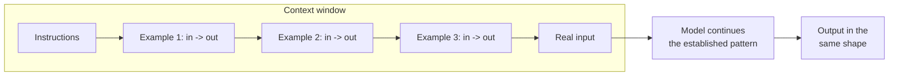

# Zero-Shot and Few-Shot — Showing Instead of Telling

The oldest reliable trick in modern prompting, and the one the 2024 source deck gestured at ("use examples") without ever naming or demonstrating. Here is the vocabulary, the mechanism, complete prompts, and the cases where examples make things worse.

---

## The vocabulary

| Term | Definition | In practice |
|---|---|---|
| **Zero-shot** | The prompt contains instructions and the input, and **no worked examples** of the task. | "Classify this ticket's severity." |
| **One-shot** | Exactly one worked input→output example. | Enough to pin an unusual format. |
| **Few-shot** | Typically 2–8 worked examples, i.e. **in-context learning** — the model infers the pattern from the demonstrations. | The workhorse. |
| **Exemplar** | The technical name for one of those input→output pairs. | The Prompt Report's term (`resources/sources.md` #3). |

**The mechanism, honestly stated.** Few-shot is not training. Nothing in the model changes. The examples sit in the context window and the model, doing what it always does — predicting the most likely continuation — finds that the most likely continuation of *"three examples of this exact mapping, then a fourth input"* is a fourth output in the same shape. You are not teaching. You are **making the desired output the statistically obvious one.** That framing predicts the failure modes: examples that are unrepresentative, imbalanced, or formatted inconsistently will be copied faithfully, including their flaws.


*Caption: few-shot as pattern continuation. The model is not learning the task; it is continuing a sequence you constructed.*

---

## Before / after: severity classification of a problem ticket

A real task for a problem manager. Zero-shot first.

### BEFORE — zero-shot, no contract

```text
What severity is this ticket?

Customer reports that the device reboots when switching from Wi-Fi to
cellular during an active call. Happens roughly one in twenty times.
Two customers affected so far. Workaround: disable call continuity.
```

Typical output:

```text
This appears to be a **High** severity issue, though it could be argued as Medium.
The reboot is disruptive and affects call continuity, which is a core function.
However, with only two customers affected and an available workaround, some
organisations would classify this as Medium. I'd suggest High severity given
the impact on core telephony functionality.
```

Everything wrong with that: it hedges, it uses a severity vocabulary that may not be yours, it argues with itself, and no pipeline can consume it. It is not *wrong* — it is unusable.

### AFTER — few-shot with your actual severity ladder

```text
You classify problem tickets into exactly one severity level using our
internal ladder. Reply with the severity and a one-sentence justification,
in the format shown. Nothing else.

Ladder: S1 (service down, no workaround) > S2 (core function degraded,
workaround exists) > S3 (non-core function affected) > S4 (cosmetic).

Example 1
Ticket: Device fails to boot after OTA update. All units on build 4471.
No workaround. 300+ reports.
Severity: S1
Why: Total loss of service with no workaround.

Example 2
Ticket: Bluetooth pairing fails with certain car kits. Users can pair
manually via settings. About 40 reports.
Severity: S2
Why: Core connectivity degraded but a workaround exists.

Example 3
Ticket: Settings menu icon is misaligned on tablets in landscape mode.
Severity: S4
Why: Cosmetic only, no functional impact.

Now classify:
Ticket: Customer reports that the device reboots when switching from Wi-Fi
to cellular during an active call. Happens roughly one in twenty times.
Two customers affected so far. Workaround: disable call continuity.
Severity:
```

Typical output:

```text
S2
Why: Core telephony is degraded intermittently but disabling call continuity is a workaround.
```

Two lines. Deterministic format. Uses *your* ladder, which the model could not have known. Machine-parseable. **Nothing changed about the model** — the examples did all of it.

| | Zero-shot | Few-shot |
|---|---|---|
| Output length | ~60 words, hedged | 2 lines, committed |
| Uses your taxonomy | no | **yes** |
| Parseable | no | **yes** |
| Extra input tokens | 0 | ~180 |
| Consistency across 10 runs | 6 different formats | 10 identical formats |

*(Figures illustrative of the shape of the result; run your own — that is the point of `content/01`.)*

---

## The same idea in code

```python
"""Few-shot classification with the Anthropic SDK.
Model ID is a placeholder - VERIFY AT DELIVERY.
"""
from anthropic import Anthropic

client = Anthropic()
MODEL = "claude-<small-model>-<version>"  # a SMALL model - see content/07

SYSTEM = """You classify problem tickets into exactly one severity level.
Ladder: S1 (service down, no workaround) > S2 (core function degraded,
workaround exists) > S3 (non-core function affected) > S4 (cosmetic).
Reply with exactly two lines:
Severity: <S1|S2|S3|S4>
Why: <one sentence>
Output nothing else."""

# Few-shot exemplars supplied as prior conversation turns.
# This is usually cleaner than pasting them into one big user message:
# it keeps the roles honest and makes the examples easy to edit or reorder.
EXEMPLARS = [
    ("Device fails to boot after OTA update. All units on build 4471. "
     "No workaround. 300+ reports.",
     "Severity: S1\nWhy: Total loss of service with no workaround."),
    ("Bluetooth pairing fails with certain car kits. Users can pair manually "
     "via settings. About 40 reports.",
     "Severity: S2\nWhy: Core connectivity degraded but a workaround exists."),
    ("Settings menu icon is misaligned on tablets in landscape mode.",
     "Severity: S4\nWhy: Cosmetic only, no functional impact."),
]

def classify(ticket: str) -> str:
    messages = []
    for user_text, assistant_text in EXEMPLARS:
        messages.append({"role": "user", "content": user_text})
        messages.append({"role": "assistant", "content": assistant_text})
    messages.append({"role": "user", "content": ticket})

    resp = client.messages.create(
        model=MODEL,
        max_tokens=100,
        temperature=0,
        system=SYSTEM,
        messages=messages,
    )
    return resp.content[0].text

print(classify(
    "Customer reports the device reboots when switching from Wi-Fi to "
    "cellular during an active call. Roughly one in twenty times. Two "
    "customers affected. Workaround: disable call continuity."
))

# Expected output:
# Severity: S2
# Why: Core telephony is degraded intermittently but a workaround exists.
```

The OpenAI equivalent is the same idea with a different envelope:

```python
"""Same few-shot pattern, OpenAI SDK. Model ID placeholder - VERIFY AT DELIVERY."""
from openai import OpenAI

client = OpenAI()
MODEL = "gpt-<small-model>"  # VERIFY AT DELIVERY

messages = [{"role": "system", "content": SYSTEM}]
for user_text, assistant_text in EXEMPLARS:
    messages.append({"role": "user", "content": user_text})
    messages.append({"role": "assistant", "content": assistant_text})
messages.append({"role": "user", "content": "Customer reports the device reboots ..."})

resp = client.chat.completions.create(
    model=MODEL, messages=messages, temperature=0, max_tokens=100
)
print(resp.choices[0].message.content)

# Expected output:
# Severity: S2
# Why: Core telephony is degraded intermittently but a workaround exists.
```

---

## How many examples, and which ones

| Question | Practical answer |
|---|---|
| **How many?** | Start with 2–3. Add more only if the eval set improves. Past ~8 the returns are usually gone and you are paying for tokens on every call. |
| **Which ones?** | The *hard* ones. Examples of the cases that previously went wrong are worth five easy ones. |
| **Balanced?** | Yes — cover the classes. If four of five exemplars are S2, expect an S2-happy model. Label imbalance in exemplars is a real, measurable bias. |
| **Realistic?** | Use real inputs with real messiness (typos, truncation, missing fields). Clean invented examples teach the model to expect clean inputs. |
| **Ordered?** | Order can matter, especially for classification (recency effects on the last exemplar). If your eval set is sensitive to exemplar order, that is a signal your prompt is fragile — usually fixable with a clearer contract. |
| **Consistent format?** | Rigidly. Every inconsistency in your exemplars becomes optional in the output. |

---

## When few-shot is the wrong tool

The honest half. Examples are not free and are not always an improvement.

| Situation | Why few-shot hurts | Do instead |
|---|---|---|
| **The rule is simple and statable** | You are spending 200 tokens per call to express something a one-line rule states exactly. | Zero-shot with a clear contract. |
| **Creative / variety wanted** | Exemplars collapse the output distribution toward themselves. Three example project names and you will get variations of those three. | Zero-shot, higher temperature, ask for *n* options. |
| **Long inputs, tight context** | Exemplars compete for context with the actual data. | Shorten exemplars, or move the format spec into a schema (`content/06`). |
| **High-volume, cost-sensitive** | Exemplars are re-sent on every call. At 200 tokens × 100k calls that is real money. | Put exemplars in a **stable prefix** so prompt caching can serve them (`content/07`), or fine-tune if the volume genuinely justifies it. |
| **The examples are subtly wrong** | The model copies your errors with total fidelity, including the one exemplar where someone mislabelled S2 as S3. | Review exemplars as carefully as code. They are code. |
| **The task needs knowledge, not format** | Examples teach shape. They cannot supply facts the model does not have. | Retrieval / RAG (Session 13), or supply the facts in the prompt. |

> **The diagnostic question:** *am I struggling to describe the output format, or struggling to get the right answer?* Few-shot fixes the first. It rarely fixes the second.

---

## A word on "semantic few-shot"

A more advanced pattern worth knowing exists: rather than hardcoding three exemplars, store a bank of labelled examples and **retrieve the ones most similar to the current input** at call time. This gives you dynamic, input-appropriate examples instead of a fixed set. It is genuinely effective for classification over a heterogeneous stream, and it is really a retrieval problem — so it belongs with Session 13's RAG material. Mentioned here so the term is not a surprise.

---

## What to take from this file

- **Few-shot is pattern continuation, not learning.** Nothing in the model changes.
- **2–3 well-chosen, hard, correctly-labelled, consistently-formatted examples** beat a paragraph of description for anything format-shaped.
- Exemplars are **code**: reviewed, versioned, and capable of introducing bugs (imbalance, copied errors, format drift).
- Few-shot fixes **shape**. It does not fix **knowledge** and it actively suppresses **variety**.
- Every claim in this file is testable against your eval set in ten minutes. Test it — *these nuances are found through testing, not guessing.*
