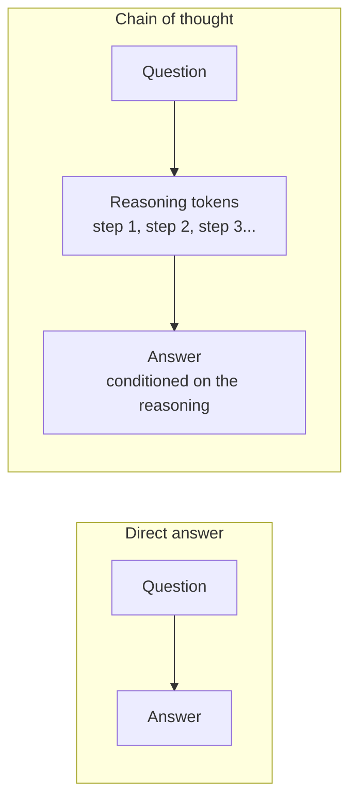
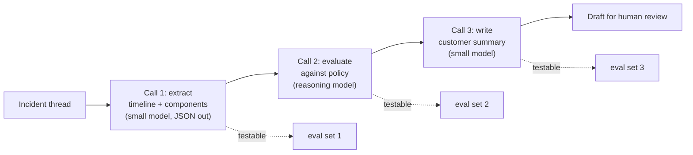

# Chain-of-Thought — From Prompt Trick to Model Parameter

The technique the 2024 source deck predates entirely, taught with its 2026 correction: **"let's think step by step" was a workaround for a limitation that no longer exists in that form.** Knowing both versions — and why one replaced the other — is more useful than knowing either.

---

## What chain-of-thought is

**Chain-of-thought (CoT)** prompting means eliciting intermediate reasoning steps before the final answer, rather than asking for the answer directly.

The mechanism is worth understanding because it explains both why it worked and why it changed. A model generates one token at a time, and each token is conditioned on everything before it. When the model emits the answer immediately, all the "work" has to happen inside a single forward pass — a fixed, shallow amount of computation. When it emits reasoning first, those reasoning tokens become **part of the context for the tokens that follow**. The model is, in effect, given more compute and a scratchpad. That is the entire trick: **reasoning tokens buy computation.**


*Caption: CoT gives the model intermediate tokens to condition on. More tokens = more computation applied to the problem.*

This also explains the cost: reasoning is not free. You pay for those tokens and you wait for them.

---

## The 2023 version (and why we still show it)

```text
Q: A release contains 3 blocking defects, 12 major, and 40 minor. Policy says we
may ship if blocking = 0 and major <= 10. After triage, 2 blocking were
downgraded to major and 4 major were closed. Can we ship?
A: Let's think step by step.
```

The phrase "let's think step by step" — appended to a prompt — measurably improved accuracy on multi-step problems on 2022–2023-era models. It became the most-quoted piece of prompt advice in the field, and a whole generation of training material (including, structurally, Anthropic's own interactive tutorial, whose chain-of-thought chapter is built on exactly this) teaches it as a headline technique.

**On a 2026 reasoning model this is at best redundant and can be counterproductive.** Redundant, because the model already reasons before answering — you are instructing it to do what it is doing. Counterproductive, because on some models an explicit "think step by step" instruction produces a *visible* verbose ramble in the answer channel on top of the internal reasoning, inflating cost and hurting the output format you asked for.

> **Teach the history, not the habit.** The reason to show the 2023 version in a 2026 course is that most of the room already believes it, and half the blog posts they will read still say it. Naming it as a superseded workaround is more useful than pretending it never existed.

---

## The 2026 version: reasoning is a dial

Current frontier models expose reasoning as a **request parameter**, not a prompt string. The names differ by vendor; the concept is identical: *how much thinking budget should this call get?*

| Vendor | Roughly how it is exposed | Notes |
|---|---|---|
| Anthropic | Extended thinking, with a **thinking token budget** | You set a budget; the model reasons within it. **Verify the exact parameter name and limits at delivery.** |
| OpenAI | A **reasoning-effort** setting (low / medium / high) | Same idea, coarser dial. **Verify at delivery.** |
| Google | A thinking configuration on the Gemini models | **Verify at delivery.** |
| Open-weights | Varies; some models reason by default, some need prompting | The 2023 technique still applies to models without native reasoning. |

```python
"""Reasoning as a parameter, not a prompt string.
Parameter names and model IDs are placeholders - VERIFY AT DELIVERY against
current provider documentation. The CONCEPT is stable; the API surface is not.
"""
from anthropic import Anthropic

client = Anthropic()

resp = client.messages.create(
    model="claude-<reasoning-model>-<version>",   # VERIFY AT DELIVERY
    max_tokens=2000,
    thinking={"type": "enabled", "budget_tokens": 4000},  # VERIFY AT DELIVERY
    messages=[{"role": "user", "content": SHIP_DECISION_QUESTION}],
)

# Note what did NOT appear anywhere above: the string "think step by step".
# Expected shape of the response: one or more thinking blocks (the model's
# reasoning) followed by the answer text block. Print the answer only:
answer = [b for b in resp.content if b.type == "text"][0].text
print(answer)

# Expected output (illustrative):
# No. After triage: blocking = 3 - 2 = 1, which violates "blocking = 0".
# Major = 12 + 2 - 4 = 10, which satisfies "major <= 10", but both conditions
# must hold. Recommendation: do not ship until the remaining blocking defect
# is resolved or formally waived.
```

The engineering question is no longer *"what phrase do I add?"* It is **"is this call worth the reasoning budget?"** — a cost/latency decision, made per task type, and testable.

---

## When reasoning helps, and when it does not

This is where the course's skeptical voice earns its keep. Reasoning is not a free upgrade, and the published evidence is more mixed than the marketing.

| Task | Reasoning worth it? | Why |
|---|---|---|
| Multi-step arithmetic or policy evaluation ("can we ship?") | **Yes** | Genuine sequential dependency; errors compound without intermediate steps. |
| Comparing options against weighted criteria | **Yes** | The comparison *is* the work. |
| Debugging a failure from logs + code | **Yes** | Hypothesis → check → revise is exactly what reasoning does. |
| Root-cause analysis over an incident timeline | **Yes** | Ordering and causality need working-through. |
| Classifying a ticket into 4 severities | **No** | A single pattern-match. Reasoning adds latency and cost for no accuracy gain. |
| Reformatting / summarising / translating | **No** | Transformational tasks have no reasoning to do. |
| Extracting fields into JSON | **No** | And it can actively damage format compliance. |
| Creative generation | **No** | Reasoning does not make it more creative; it makes it slower. |

**Three honest findings to state in the room** (all documented in the research base, `resources/sources.md` #6):

1. **Reasoning sometimes does not help at all.** On tasks that are a single pattern-match, published experiments show reasoning models performing no better than non-reasoning ones — while costing several times more and taking several times longer.
2. **Reasoning models can hallucinate *more* on some recall-shaped tasks** than their non-reasoning counterparts. "Reasoning" is not a truth-guarantee; more steps can mean more places to confabulate.
3. **Token budgets vary enormously between models on the same problem** — a difference of several times over for the same answer quality. Which means "use the reasoning model" is not a strategy; measuring is.

> The verbalised reasoning is **not** a reliable audit trail. It is generated text that correlates with, but does not causally record, the computation that produced the answer. A plausible-looking chain of reasoning ending in a wrong answer is a normal failure mode. Do not present model reasoning as a justification in a change-advisory board.

---

## Two techniques that still belong to the prompt

Even when reasoning is a parameter, two adjacent techniques remain prompt-side and remain useful.

### Self-consistency

Run the same reasoning prompt several times at non-zero temperature, then take the **majority answer**. For problems with a discrete answer, this reliably beats a single sample: independent reasoning paths that agree are more likely correct than any single path.

```python
"""Self-consistency: sample n reasoning paths, take the majority answer."""
from collections import Counter

def self_consistent(question: str, n: int = 5) -> str:
    answers = []
    for _ in range(n):
        r = client.messages.create(
            model=MODEL, max_tokens=800,
            temperature=1.0,   # deliberately NOT 0 - we want diverse paths
            system="Reason briefly, then end with a final line: 'ANSWER: <ship|hold>'",
            messages=[{"role": "user", "content": question}],
        )
        text = r.content[0].text
        answers.append(text.strip().splitlines()[-1].replace("ANSWER:", "").strip())
    return Counter(answers).most_common(1)[0][0]

print(self_consistent(SHIP_DECISION_QUESTION))
# Expected output: hold
#
# Cost note: this is n times the price and n times the latency of one call.
# Reserve it for decisions where being wrong is expensive - which is exactly
# where this audience operates.
```

**When to use it:** high-stakes, discrete-answer decisions where 5× the cost of one cheap call is trivially worth more confidence. **When not to:** anything high-volume, and anything where the answer is free text (there is no majority to take).

### Decomposition

Instead of asking for reasoning inside one call, split the task across calls: *extract the facts* → *evaluate against policy* → *write the recommendation*. Each step is separately testable, separately cheap, and separately fixable. For a room whose whole professional instinct is "make the pipeline observable," this usually lands better than reasoning does.


*Caption: decomposition turns one opaque call into three observable ones, each with its own eval set — and lets you spend the expensive reasoning model only on the step that needs it.*

---

## What to take from this file

- CoT works because **reasoning tokens buy computation**. That single sentence explains its benefits and its costs.
- **"Let's think step by step" is a 2023 artefact.** On modern reasoning models, reasoning is a **parameter with a budget**, not a phrase.
- Reasoning is **worth it for multi-step judgement and worthless for pattern-matching** — and it costs real latency and money either way. Decide per task type, and measure.
- Reasoning is not a correctness guarantee, and its verbalised chain is **not an audit trail**.
- **Self-consistency** (majority of n) and **decomposition** (split into testable calls) remain firmly in the prompt engineer's hands.
