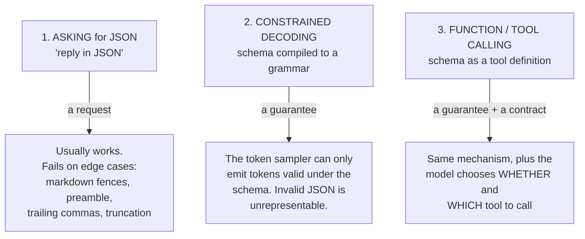
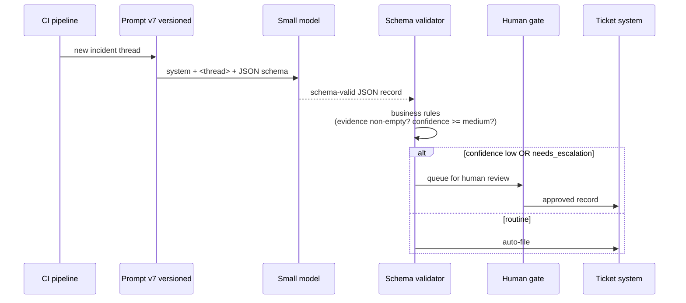

# Structured Output — The Bridge From Chat to Tooling

Prose output means a human must read every result. Schema-valid JSON means a program can act on it. This is the single change that turns prompting from a chat activity into an engineering activity — and it is the section of this session most likely to change what your team actually builds.

---

## Why this matters for this room

| Task | With prose output | With structured output |
|---|---|---|
| **Release notes** | A person copy-pastes and reformats each time | Generated per build, diffed against last release, posted automatically, human approves |
| **Incident triage** | A person reads the summary and files it | `{severity, component, customer_impact, needs_escalation}` → routed automatically, escalation gated by a human |
| **Config-diff review** | A person reads a paragraph | `{classification, reasons[], checks[]}` → CI comments on the PR and blocks on `blocking` |
| **Log triage** | A person skims | `{error_class, first_seen, likely_cause, confidence}` → aggregated into a dashboard |

In every row the model does the same work. The difference is entirely whether the output has a contract.

---

## The distinction engineers routinely miss

There are three quite different things people call "getting JSON out."


*Caption: three levels of "structured output". Only levels 2 and 3 are guarantees.*

**1. Instruction-following JSON.** You write "respond with JSON matching this shape." The model complies most of the time. The failures are the classic ones: a `Here's the JSON you requested:` preamble, a ```` ```json ```` fence, a trailing comma, a hallucinated extra field, a truncated object because you hit `max_tokens`. At 98% compliance and 10,000 calls a day, that is 200 daily parse failures.

**2. Constrained decoding.** You supply a **JSON Schema**; the provider compiles it into a grammar and restricts the model's token choices at each step to tokens that keep the output valid under that schema. Invalid output is not merely discouraged — it is **unrepresentable**. Failure rates drop to near zero by construction.

**3. Tool / function calling.** Mechanically the same guarantee, but framed as "here are functions you may call, with these argument schemas." Use it when the model should *decide* whether and which to call. For pure extraction, plain structured output is simpler.

> **A short piece of vendor history worth telling**, because it teaches how to read vendor claims: OpenAI shipped token-level constrained decoding in **August 2024** and marketed it as a guarantee. Anthropic argued for some time that strong instruction-following was sufficient — then shipped constrained decoding in **November 2025**. The market resolved the disagreement by convergence, and OpenAI's position turned out to be the right one. When two vendors disagree about whether something is a guarantee or a strong tendency, **the one claiming "guarantee" and shipping a mechanism is usually the one to believe.** (`resources/sources.md` #5)

| | Ask for JSON | Constrained decoding | Tool calling |
|---|---|---|---|
| Guarantee | none | **schema-valid by construction** | schema-valid arguments |
| Needs a retry path | **yes** | rarely (still handle truncation) | rarely |
| Works on any model | yes | provider-dependent | provider-dependent |
| Model may decline to answer | yes | yes (within the schema — design a null branch) | yes (may call nothing) |
| Best for | quick scripts, unsupported models | extraction, classification, pipelines | agents, multi-step, real side effects |

---

## Worked example: incident triage

### BEFORE — prose

**Prompt:** `Summarise this incident and tell me how bad it is.`

**Output:**

```text
This looks like a fairly serious issue affecting the payment flow. It started
around 14:00 and seems to have impacted a subset of users in the EU region.
The team should probably escalate this given the revenue impact, though the
exact number of affected users isn't clear from the thread.
```

Readable, and completely unusable by a machine. "Fairly serious", "probably", "a subset" — nothing here can be routed, counted, or alerted on.

### AFTER — schema

```python
"""Structured incident triage with a JSON Schema.
OpenAI SDK. Model ID placeholder - VERIFY AT DELIVERY.
"""
from openai import OpenAI
import json

client = OpenAI()

INCIDENT_SCHEMA = {
    "type": "object",
    "properties": {
        "severity": {"type": "string", "enum": ["S1", "S2", "S3", "S4"]},
        "component": {"type": "string",
                      "enum": ["payments", "auth", "radio", "ui", "unknown"]},
        "customer_visible": {"type": "boolean"},
        "started_utc": {"type": ["string", "null"],
                        "description": "ISO 8601, or null if not stated in the thread"},
        "affected_regions": {"type": "array", "items": {"type": "string"}},
        "needs_escalation": {"type": "boolean"},
        "summary": {"type": "string", "description": "<= 40 words, factual"},
        "evidence": {"type": "array", "items": {"type": "string"},
                     "description": "Verbatim quotes from the thread supporting the fields above"},
        "confidence": {"type": "string", "enum": ["high", "medium", "low"]},
    },
    "required": ["severity", "component", "customer_visible", "started_utc",
                 "affected_regions", "needs_escalation", "summary",
                 "evidence", "confidence"],
    "additionalProperties": False,
}

SYSTEM = """You triage incident threads into a structured record.
Use ONLY information present in the thread. If a field is not stated, use null,
an empty array, or 'unknown' as the schema allows - never infer or estimate.
Set confidence to 'low' when key fields had to be left unknown.
Every non-obvious field must be supported by a verbatim quote in 'evidence'."""

resp = client.chat.completions.create(
    model="gpt-<small-model>",           # VERIFY AT DELIVERY
    temperature=0,
    messages=[
        {"role": "system", "content": SYSTEM},
        {"role": "user", "content": f"<thread>\n{incident_thread}\n</thread>"},
    ],
    response_format={
        "type": "json_schema",
        "json_schema": {"name": "incident_triage",
                        "schema": INCIDENT_SCHEMA,
                        "strict": True},   # strict -> constrained decoding
    },
)

record = json.loads(resp.choices[0].message.content)
print(json.dumps(record, indent=2))

# Expected output:
# {
#   "severity": "S2",
#   "component": "payments",
#   "customer_visible": true,
#   "started_utc": "2026-07-14T14:02:00Z",
#   "affected_regions": ["EU"],
#   "needs_escalation": true,
#   "summary": "Payment authorisation failures for EU users beginning 14:02 UTC; retries succeed intermittently.",
#   "evidence": [
#     "first alert 14:02 UTC on payments-auth",
#     "only EU traffic affected, US unaffected"
#   ],
#   "confidence": "medium"
# }
#
# json.loads() will not throw: with strict=True the output is schema-valid by
# construction. Handle truncation (hitting max_tokens) separately - that is the
# one failure mode constrained decoding does not remove.
```

### The Anthropic equivalent, via a tool schema

```python
"""Same result on the Anthropic SDK, using a tool as the output contract.
Model IDs and the strict-mode flag are placeholders - VERIFY AT DELIVERY.
"""
from anthropic import Anthropic

client = Anthropic()

resp = client.messages.create(
    model="claude-<small-model>-<version>",   # VERIFY AT DELIVERY
    max_tokens=1000,
    temperature=0,
    system=SYSTEM,
    tools=[{
        "name": "record_incident",
        "description": "Record the structured triage result for one incident thread.",
        "input_schema": INCIDENT_SCHEMA,   # the same JSON Schema, reused
    }],
    tool_choice={"type": "tool", "name": "record_incident"},  # force the call
    messages=[{"role": "user", "content": f"<thread>\n{incident_thread}\n</thread>"}],
)

record = next(b.input for b in resp.content if b.type == "tool_use")
# `record` is already a dict - no parsing step, no fenced-markdown stripping.
# Expected output: the same object as above.
```

Note `tool_choice` forcing the call. Without it the model may reply in prose instead, which reintroduces exactly the uncertainty you were removing.

---

## Schema design: where the quality actually comes from

The schema is not just plumbing. **It is part of the prompt** — field names, enums, and descriptions all steer the model. Six rules:

| Rule | Why | Example |
|---|---|---|
| **Use enums instead of free strings** wherever the value set is known | Closes the vocabulary; makes downstream code total | `"severity": {"enum": ["S1","S2","S3","S4"]}` not `"type": "string"` |
| **Name fields the way you want them thought about** | `customer_visible` produces better answers than `flag2` | — |
| **Use `description` as a mini-instruction** | The model reads it; it is prompt real estate | `"description": "ISO 8601, or null if not stated"` |
| **Provide an explicit escape hatch** | Otherwise the model must invent a value to satisfy the schema — **a schema can force a hallucination** | `"unknown"` in the enum; `["string","null"]` |
| **Ask for evidence** | A `evidence: string[]` field of verbatim quotes makes verification cheap and reduces fabrication | see above |
| **Ask for calibrated confidence — and then check it** | Useful for routing, but treat it as a soft signal | `"confidence": {"enum": ["high","medium","low"]}` |

The fourth rule deserves emphasis, because it is the one that bites. **A required field with no null branch is an instruction to produce a value at all costs.** If `started_utc` is required, non-nullable, and the thread never states a time, the model will produce a plausible timestamp. Constrained decoding guarantees the output is *schema-valid*, not that it is *true*. Structured output eliminates parse errors; it does not eliminate hallucination — and by making the output look authoritative it can make hallucination *harder to spot*. That is exactly the human-factors trap the safety material warns about: a well-formatted wrong answer is more dangerous than a messy one.

On confidence: models are imperfectly calibrated, so `"confidence": "high"` is a hint, not a probability. Use it to route (low → human queue) rather than to decide. And if you rely on it, measure it — sample 50 records and check whether the "high" ones really are right more often.

---

## The pipeline this unlocks


*Caption: structured output makes the human gate a deliberate design decision rather than a bottleneck by default. Note that escalation is always human-gated — the safety principle from Session 14: never let an automated pipeline act on model output without a qualified human where the blast radius is real.*

---

## Practical gotchas

| Gotcha | Symptom | Fix |
|---|---|---|
| **Truncation** | Output stops mid-object even with strict mode | Raise `max_tokens`; check the stop reason on every call; keep schemas small |
| **Over-large schemas** | Latency up, quality down, deep nesting confuses the model | Flatten. Split into two calls. Aim for < ~15 fields per call |
| **Schema drifts from the prompt** | Prompt says four severities, enum has five | Generate the prompt text *from* the schema, or test both together |
| **Reasoning + strict format** | Reasoning models sometimes fight a rigid schema | Decompose: reason in call 1, format in call 2 (`content/04`) |
| **Optional-everything schemas** | Model returns `{}` | Require the fields you need; give each a legitimate null branch |
| **Enum values that don't match downstream** | Silent routing failures | Generate the enum from the same constant your router uses |

---

## What to take from this file

- **Asking for JSON is a request; constrained decoding is a guarantee.** Know which one you have.
- The **schema is part of the prompt** — enums, field names and descriptions steer the model as much as the instructions do.
- **Always provide a null/unknown branch.** A required field with no escape hatch is an instruction to fabricate.
- Add an **`evidence` field** of verbatim quotes. It is the cheapest verification tool available.
- Schema-valid ≠ true. Structured output removes parse failures, not hallucination — and it makes hallucination look more official.
- This is the technique that turns "the model wrote something nice" into "the pipeline did the work and a human approved the risky part."
