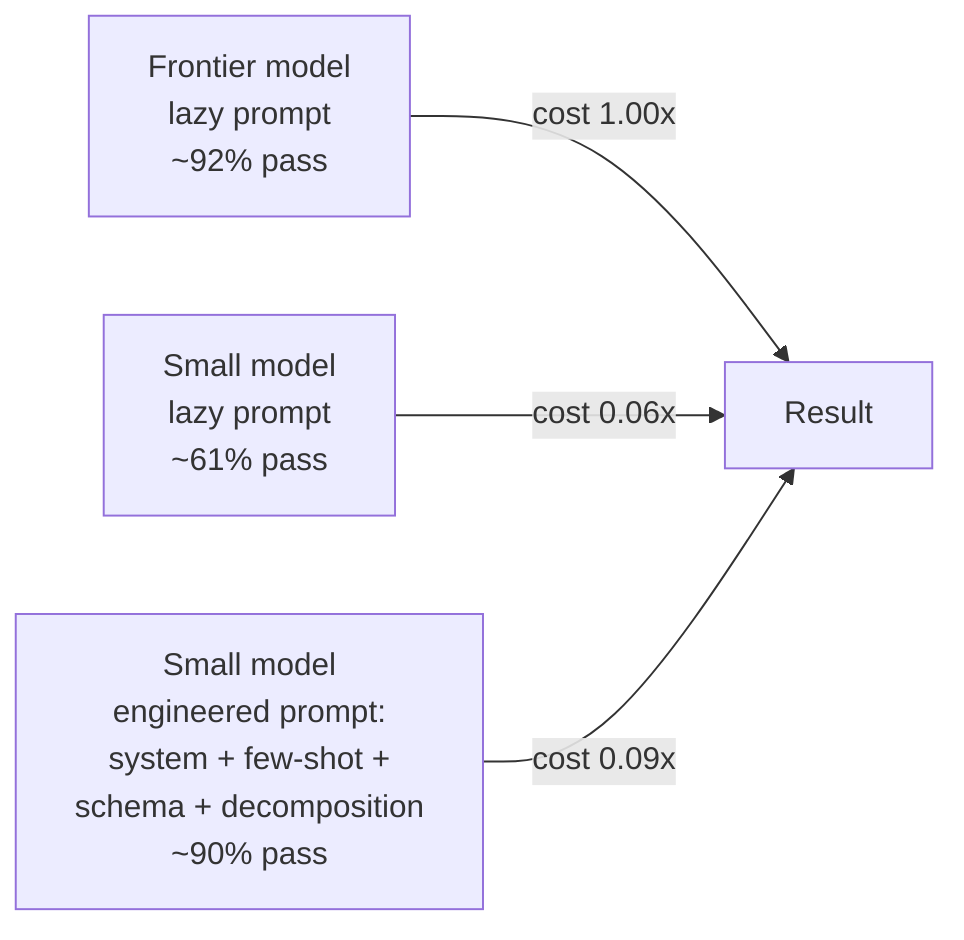
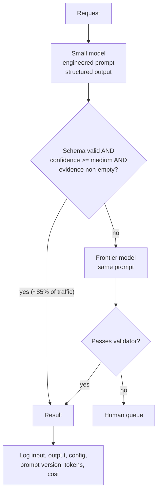

# The Engineering Lever — A Cheap Model, Well Prompted

The claim that reframes prompting from a soft skill into an engineering discipline: **a smaller, cheaper, faster model with a good prompt frequently matches a frontier model with a lazy one — and you can prove it in an afternoon.** With the caveat that makes the claim honest.

---

## Why this is the section management should care about

Everything else in this session improves quality. This one changes the invoice, the latency budget, and the architecture. It converts "prompting" from something individuals do into something that shows up in a capacity plan.

The claim, stated carefully:

> For a **narrow, well-specified, repetitive** task — the kind that dominates operational work — the gap between a small model and a frontier model is often closable by prompt engineering, and the cost difference is often an order of magnitude.

Note every qualifier. This is not "small models are as good as big models." It is: *on tasks where the difficulty is specification rather than intelligence, specification is the cheaper thing to buy.*

---

## The arithmetic


*Caption: the shape of the result on a well-specified task. The numbers are illustrative of a typical outcome — the discipline is to produce your own. Note that C costs more than B: engineering the prompt adds tokens. It still costs ~10x less than A.*

Worked example, with placeholder prices. **All prices and model names below must be verified at delivery — this is the fastest-moving data in the course.**

| | Frontier + lazy prompt | Small + engineered prompt |
|---|---|---|
| Input tokens/call | 1,200 | 1,900 (system prompt + 3 exemplars + schema) |
| Output tokens/call | 350 | 180 (schema-constrained, no preamble) |
| Input price /M tokens | $15.00 *(placeholder — verify)* | $0.80 *(placeholder — verify)* |
| Output price /M tokens | $75.00 *(placeholder — verify)* | $4.00 *(placeholder — verify)* |
| Cost per call | $0.0180 + $0.0263 = **$0.0443** | $0.0015 + $0.0007 = **$0.0022** |
| **At 20,000 calls/month** | **$886** | **$44** |
| Eval-set pass rate | 92% | 90% |
| p50 latency | ~6 s | ~1.2 s |

Two points the table makes better than prose:

- The engineered prompt has **more input tokens and fewer output tokens.** That is typical and it is good — output tokens are usually several times more expensive than input tokens, and a schema-constrained answer has no preamble, no hedging, and no closing paragraph. **Constraining output is a cost technique, not only a quality technique.**
- **Latency often matters more than money.** A 5× latency improvement is the difference between a CI check that runs inline and one that runs nightly.

---

## Add caching and the input side nearly disappears

The single largest cost lever in 2026 practice is not clever phrasing — it is **prompt caching**, and whether you benefit is a *prompt-structure* decision.

Both major providers let a stable prefix be served from cache at a large discount (**order-of-magnitude discounts are typical; verify current terms and percentages at delivery**). The engineering consequence:

> **Put everything static first — system message, exemplars, schema, style guide — and everything variable last.** Cache hit rate is then an engineering outcome, not luck.

```text
GOOD (cacheable prefix)                BAD (cache-busting)
-----------------------                --------------------
[system: rules, contract]              [system: rules ... "today is 2026-07-19"]
[exemplars 1-3]                        [the incident thread]
[schema / style guide]                 [exemplars 1-3]
[<thread> variable data </thread>]     [schema]
```

The right-hand version is functionally identical and may get near-zero cache hits, because a timestamp in the system message changes the prefix on every single call. Published case reports describe teams moving from single-digit to 80%+ cache hit rates purely by reordering, with total LLM spend falling by more than half. *(Sourced from vendor-adjacent write-ups — present as illustrative, not as a verified benchmark; `resources/sources.md` #7.)*

For our worked example, caching the 1,700-token static prefix reduces the per-call input cost by roughly an order of magnitude, taking the small-model path to a few dollars a month.

---

## The honest caveat: control for token spend

This is the part that separates an engineering claim from a marketing claim, and it is the most valuable habit in this file.

> **Whenever someone reports that clever prompting closed a capability gap, ask: was the comparison made at equal token budget?**

A great deal of what looks like clever prompting is simply **spending more tokens** — more examples, more reasoning, more self-critique passes, more retries. Spending more tokens does improve results. It is just not the same claim as "our prompt is better," and it does not survive contact with a cost model.

The 2026 evidence base makes this concrete. In the multi-agent literature — the closest well-documented case — one lab reported a large win for a multi-agent architecture over a single agent, and in the *same* write-up reported that **token usage alone explained about 80% of the performance variance**, with the multi-agent system consuming roughly **15× the tokens**. Neutral follow-up work found that when total thinking-token budget is held equal, the architectural advantage largely evaporates. (`resources/sources.md` #6)

The generalisation is the teaching point:

| Claim | Question that dissolves it |
|---|---|
| "Our prompt made the cheap model as good as the expensive one" | At what total cost per call, including exemplars and retries? |
| "Reasoning improved accuracy 12 points" | Against a non-reasoning baseline given the same token budget for self-consistency? |
| "The agent framework doubled our success rate" | Same tokens? Same harness? Same eval set? |
| "This model beats that one on the benchmark" | Same scaffold? What was the cost per task? |

Hold *your own* team to this bar too, not just vendors. It is the difference between an optimisation and a story.

---

## Measuring it properly: cost-adjusted evaluation

The fix is simple: **score cost alongside quality, in the same table.** Most benchmark suites do not — a widely cited critique is that essentially none of the major agent benchmarks incorporate cost into primary scoring, so 88% at $50/task ranks identically to 88% at $0.50/task. Do not replicate that mistake internally.

```python
"""Cost-adjusted A/B of two prompt+model configurations over one eval set.
Prices and model IDs are placeholders - VERIFY AT DELIVERY.
"""
from dataclasses import dataclass

PRICES = {  # USD per 1M tokens - VERIFY AT DELIVERY
    "frontier": {"in": 15.00, "out": 75.00},
    "small":    {"in":  0.80, "out":  4.00},
}

@dataclass
class Config:
    name: str
    tier: str          # "frontier" or "small"
    model: str
    system: str
    exemplars: list

def evaluate(cfg: Config, cases: list) -> dict:
    passes = in_tok = out_tok = 0
    for case in cases:
        out, usage = run(cfg, case["input"])        # returns text + token usage
        passes += score(case, out)                  # your rubric from content/01
        in_tok += usage.input_tokens
        out_tok += usage.output_tokens
    p = PRICES[cfg.tier]
    cost = (in_tok / 1e6) * p["in"] + (out_tok / 1e6) * p["out"]
    return {
        "config": cfg.name,
        "pass_rate": passes / len(cases),
        "cost_per_call": cost / len(cases),
        "tokens_per_call": (in_tok + out_tok) / len(cases),
    }

for cfg in (frontier_lazy, small_engineered):
    r = evaluate(cfg, EVAL_SET)
    print(f"{r['config']:<22} pass={r['pass_rate']:.0%}  "
          f"${r['cost_per_call']:.4f}/call  {r['tokens_per_call']:.0f} tok/call")

# Expected output (illustrative):
# frontier-lazy          pass=92%  $0.0443/call  1550 tok/call
# small-engineered       pass=90%  $0.0022/call  2080 tok/call
#
# Read BOTH columns. The engineered config uses MORE tokens and costs 20x LESS,
# because the token price differs by a factor of ~19. Reporting tokens alongside
# cost is what keeps the comparison honest: it shows you did not simply buy the
# improvement with extra spend at the same price point.
```

**Report three numbers, always: pass rate, cost per call, tokens per call.** Any two of them can tell a flattering story; all three cannot.

---

## The levers, ranked

What actually closes the gap between a small model and a large one, roughly in order of return per hour invested:

| Rank | Lever | Why it works | Cost |
|---|---|---|---|
| 1 | **Output contract + structured output** | Removes the entire class of "right answer, wrong shape" failures; also cuts output tokens | Near zero |
| 2 | **Few-shot exemplars** | Small models benefit disproportionately from being shown the target | Input tokens (cacheable) |
| 3 | **Decomposition** | Three easy sub-tasks beat one hard one; small models degrade sharply with task complexity | More calls, each cheap |
| 4 | **Prompt caching via prefix design** | Makes levers 1–2 nearly free at volume | Restructuring only |
| 5 | **Routing / cascade** | Small model first; escalate to the big one only on low confidence or validator failure | Adds a routing rule |
| 6 | **Self-critique with a cheap reviewer** | Catches rule violations before a human sees them | 1 extra cheap call |

### The cascade, in one diagram


*Caption: a cascade. If the small model handles 85% of traffic, the blended cost is close to the small model's, and the frontier model becomes a safety net rather than a default. The logging step is not optional — it is what feeds tomorrow's eval set.*

The cascade also gives you an honest metric for free: **escalation rate**. If it creeps up over a month, either your inputs have drifted or a model was updated underneath you. That is an early-warning system your prompting practice gets for nothing.

---

## Where this argument does *not* hold

Skepticism, applied to our own claim:

- **Genuinely hard reasoning.** If the task requires multi-step novel inference, prompting will not close the gap. Specification is not intelligence.
- **Broad, open-ended tasks.** The advantage of the frontier model is largest exactly where the task is least specified — which is why the claim is limited to narrow, repetitive work.
- **Long-context work.** Small models often degrade faster as context fills.
- **Tasks needing knowledge the small model lacks.** That is a retrieval problem (Session 13), not a prompting one.
- **Low volume.** At 200 calls a month, none of this matters and you should use the best model and move on. **Engineering effort has a cost too**, and a week of prompt work to save $40/month is a bad trade. Do the arithmetic before doing the work.

---

## What to take from this file

- On narrow, well-specified, repetitive tasks, **prompt engineering is a substitute for model spend** — often at 10–20× the cost difference, with a latency bonus.
- **Constraining output cuts cost**, because output tokens are the expensive ones.
- **Cache-friendly prompt ordering** (static first, variable last) is a prompting decision with the biggest single cost consequence.
- **Always ask "at equal token budget?"** — of vendors, of papers, and of your own team.
- Report **pass rate, cost per call, and tokens per call** together, or you are telling a story.
- Do the arithmetic before doing the work. Below a volume threshold, the honest answer is "just use the better model."
