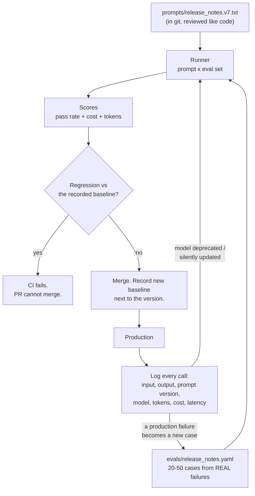

# Prompts as Versioned Artifacts

Everything in this session collapses back into one practice: **a prompt is a piece of production configuration.** It has a version, a test suite, an owner, and a changelog — or it is folklore that happens to work today.

---

## The failure this prevents

A prompt goes into production. Six weeks later:

- someone tweaks it to fix one complaint, and three other behaviours regress silently;
- the provider updates the model behind the same model name, and output format drifts;
- inputs drift — a new commit-message convention, a new ticket template — and the prompt quietly gets worse;
- the person who wrote it leaves, and nobody knows why the fourth paragraph is there.

None of these are prompting problems. They are **configuration-management** problems — which is why this session lands so squarely on this room's professional turf. A prompt has every property that makes something worth version-controlling: it is text, it changes behaviour, it is edited by multiple people, and it can regress.

---

## The test loop


*Caption: the prompt test loop. The bottom feedback edge is the one that matters — production failures become permanent test cases, so the same bug cannot ship twice.*

Every element in that diagram already exists in this room's working vocabulary. It is a build pipeline with a text file as the artifact.

---

## The four practices

### 1. Store prompts as files, not string literals

| Anti-pattern | Practice |
|---|---|
| Prompt inline in a `.py` file, triple-quoted, 60 lines | `prompts/release_notes.v7.txt`, loaded at runtime |
| Prompt in a Confluence page | Prompt in git; Confluence links to git |
| Prompt in someone's chat history | Prompt in git |
| Version implied by "the latest one" | Version in the filename **and** in the log line of every call |

Files give you diffs, blame, review, and rollback for free. A prompt change should arrive as a pull request with the eval results attached — exactly like a config change.

```
prompts/
  release_notes.v7.txt          # the current prompt
  release_notes.CHANGELOG.md    # why each version changed, and what it fixed
evals/
  release_notes.yaml            # the cases
  release_notes.baseline.json   # recorded scores for v7
```

### 2. Build the eval set from real failures

The paralysing belief is that you need a large, carefully designed benchmark before you can start. You do not.

- **Start with 5.** Five real inputs, with a checkable expectation each, gets you 80% of the value on day one.
- **Grow to 20–50.** That range is a well-established practical target for a solid working suite, and it is achievable in an afternoon if you harvest from history.
- **Harvest, don't invent.** The best cases are: the input that embarrassed you, the edge case someone reported, the empty case, the enormous case, the malformed case, and the one where a human disagreed with the model.
- **Keep some held-out.** Reserve ~20% of cases you never look at while iterating. They are your overfitting check — the same discipline as the test split in Session 8.

```yaml
# evals/release_notes.yaml
cases:
  - name: normal-release
    input_file: fixtures/commits_4471.txt
    assert:
      not_contains: ["PLT-", "JIRA-", "refactor"]
      max_lines: 12
      every_line_matches: '^- [A-Z][a-z]+ed '   # verb-first, past tense

  - name: internal-only-release        # harvested from a real 2026-04 failure
    input_file: fixtures/commits_internal_only.txt
    assert:
      equals: "No user-visible changes."

  - name: truncated-commit-log         # the messy real world
    input_file: fixtures/commits_truncated.txt
    assert:
      not_contains: ["I'm sorry", "As an AI"]
      max_lines: 12

  - name: vague-commit-messages        # tests the grounding constraint
    input_file: fixtures/commits_vague.txt
    assert:
      max_lines: 3                     # should OMIT what it cannot describe
```

Note what the assertions are: **cheap, deterministic string and structural checks.** Reach for an LLM-as-judge only for the criteria that genuinely need judgement ("is the tone appropriate for customers?"), and only after the cheap checks are exhausted. A judge is itself a prompt that needs its own eval set — do not add one casually.

### 3. Run it in CI

```python
"""prompt_regression_test.py - runs in CI on any change under prompts/ or evals/.
Model IDs and prices are placeholders - VERIFY AT DELIVERY.
"""
import json, sys, yaml, pathlib

PROMPT = pathlib.Path("prompts/release_notes.v7.txt").read_text()
CASES = yaml.safe_load(pathlib.Path("evals/release_notes.yaml").read_text())["cases"]
BASELINE = json.loads(pathlib.Path("evals/release_notes.baseline.json").read_text())

results = []
for case in CASES:
    out = run(PROMPT, pathlib.Path(case["input_file"]).read_text())
    results.append((case["name"], assert_all(case["assert"], out)))

pass_rate = sum(ok for _, ok in results) / len(results)

for name, ok in results:
    print(f"  {'PASS' if ok else 'FAIL'}  {name}")
print(f"\npass_rate={pass_rate:.0%}  baseline={BASELINE['pass_rate']:.0%}")

# Fail the build on regression, with a small tolerance for model nondeterminism.
if pass_rate < BASELINE["pass_rate"] - 0.05:
    print("REGRESSION - prompt change blocked.")
    sys.exit(1)

# Expected output on a healthy PR:
#   PASS  normal-release
#   PASS  internal-only-release
#   PASS  truncated-commit-log
#   FAIL  vague-commit-messages
#
# pass_rate=75%  baseline=75%
#
# Note the tolerance: even at temperature 0, model output is not perfectly
# deterministic. A zero-tolerance gate produces flaky CI, and flaky CI gets
# disabled. Pick the tolerance deliberately and document it.
```

**Run this on a schedule too, not just on prompt changes.** The most insidious regression is the one you did not cause: a provider updates the model served under a stable name, and your prompt's behaviour shifts underneath you. A weekly scheduled run against an unchanged prompt is how you find out on a Tuesday rather than during a release.

### 4. Log every production call

| Log field | Why |
|---|---|
| `prompt_version` | Correlate a complaint with a specific prompt |
| `model_id` | Distinguish "our change" from "their change" |
| `input_hash` (not raw input, if sensitive) | Reproduce without storing sensitive data |
| `output` | The raw material of tomorrow's eval cases |
| `tokens_in`, `tokens_out`, `cost`, `latency_ms` | The cost-adjusted evaluation of `content/07` |
| `validator_result`, `escalated` | Cascade health and early drift warning |
| `human_edited` (if a person corrected the draft) | **The highest-value signal you can collect** — every human edit is a labelled failure case |

That last row deserves the emphasis. If a person edits the model's draft release notes before shipping, the diff between draft and shipped version *is* a free, perfectly-labelled training example for your next eval case. Most teams throw it away.

⚠️ **Privacy note:** logging inputs and outputs means logging whatever was in them. Apply the same data-handling rules you would to any other log containing customer or configuration data. Session 14 covers this properly; do not build the logging pipeline without asking the question.

---

## Tooling — and one governance flag

You can do all of the above with a YAML file and 60 lines of Python, and for a first project you should, because it keeps the mechanism visible. When you outgrow that:

| Tool | Licence / cost | Good for | Note |
|---|---|---|---|
| **promptfoo** | MIT, open source | CLI + YAML configs, CI/CD integration, red-teaming (injection, PII, jailbreak) | The lowest-friction on-ramp for an engineering team already living in YAML and CI. ⚠️ **Acquired by OpenAI in March 2026**; committed to remaining open source and model-agnostic. For a multi-vendor organisation this is a **governance question to raise, not a settled fact** — flag it rather than assuming neutrality. *Verify current status at delivery.* |
| **DeepEval** | Open source | Broad metric coverage | Good vendor-independent alternative |
| **Arize Phoenix** | Open source | Tracing and observability | Pairs well with the logging table above |
| **Ragas** | Open source | RAG-specific evaluation | Narrow; relevant from Session 13 |
| **Braintrust**, **LangSmith** | Commercial | Production traces, eval against live traffic | LangSmith carries real LangGraph/LangChain lock-in risk |

⚠️ **Read "best eval tools 2026" listicles adversarially.** Much of that content is written by the vendors being compared — one prominent example is a commercial vendor publishing a ranking of alternatives to its own open-source competitor. The trustworthy signals are the **licence** and the **repository activity**, not the blog post.

---

## The maturity ladder

Where is your team today, and what is the next step?

| Level | Practice | Typical symptom |
|---|---|---|
| **0 — Folklore** | Prompts live in chat histories and heads | "Ask Priya, she has a good prompt for that" |
| **1 — Written down** | Prompts in a shared doc | Two versions in circulation, nobody knows which is current |
| **2 — Versioned** | Prompts in git, reviewed in PRs | Changes are traceable; quality is still opinion |
| **3 — Tested** | Eval set exists; run manually before changes | Regressions caught, sometimes |
| **4 — Gated** | Eval runs in CI, blocks on regression | Prompt changes are as safe as code changes |
| **5 — Observed** | Production logging feeds the eval set; scheduled runs catch model drift | You find out about drift before your users do |

Most teams reading this are at level 0 or 1. **Level 3 is a single afternoon away** and captures most of the value. Levels 4–5 are worth it once a prompt is on a path that touches customers.

---

## What to take from this file

- A prompt is **production configuration**: version it, review it, test it, log which version ran.
- **Start with five real cases.** Grow toward 20–50, harvested from actual failures, with a fifth held out.
- Score with **cheap deterministic assertions** first; add a judge only where judgement is genuinely required.
- **Run the eval on a schedule, not just on change** — the model can change under you.
- **Log human edits.** They are perfectly-labelled failure data that most teams discard.
- Level 3 of the maturity ladder is an afternoon's work and is where most of the value is.
