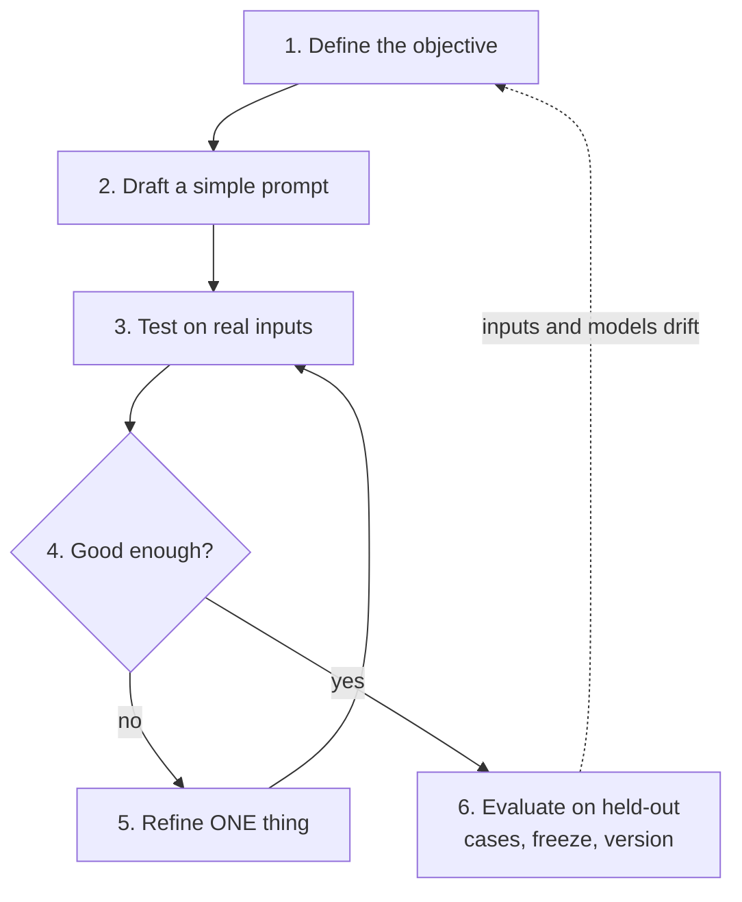
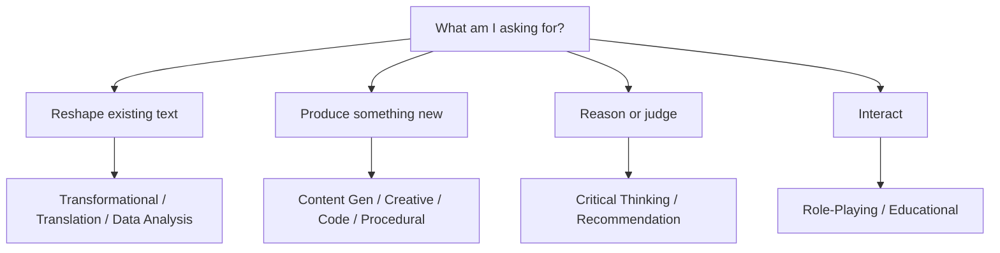
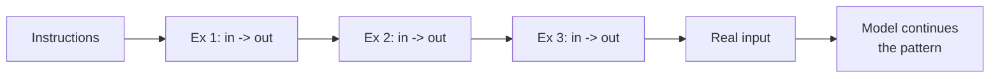
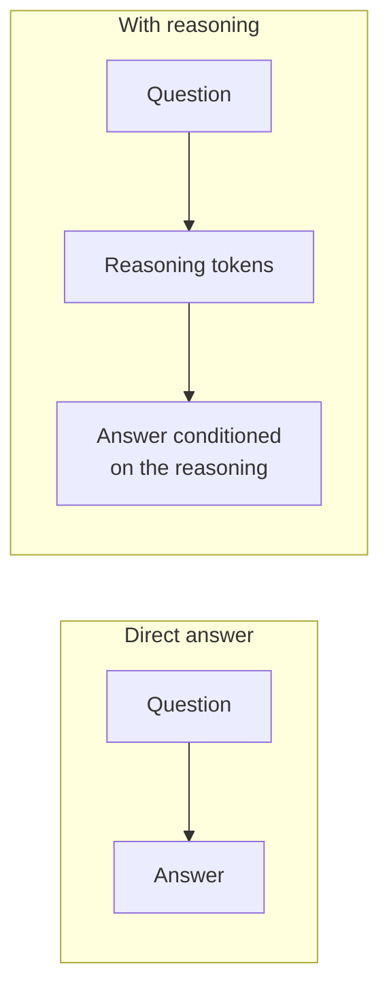
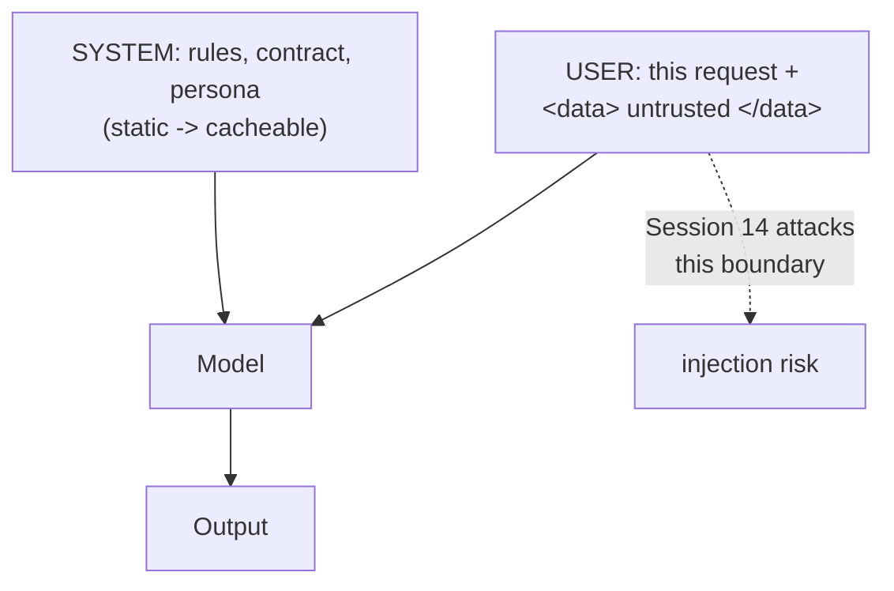
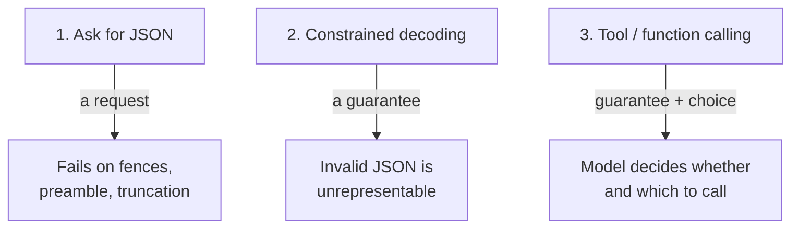
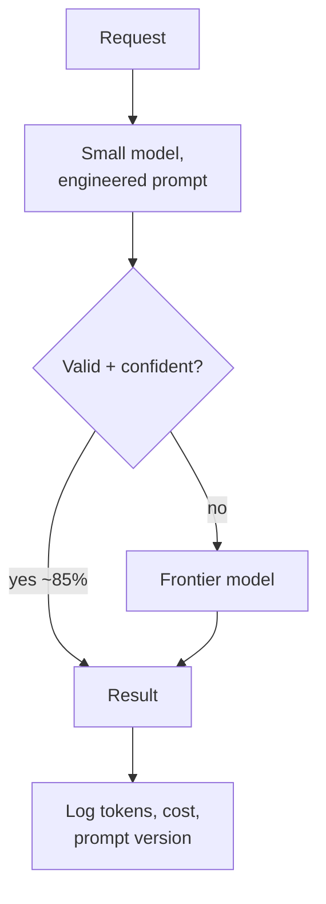
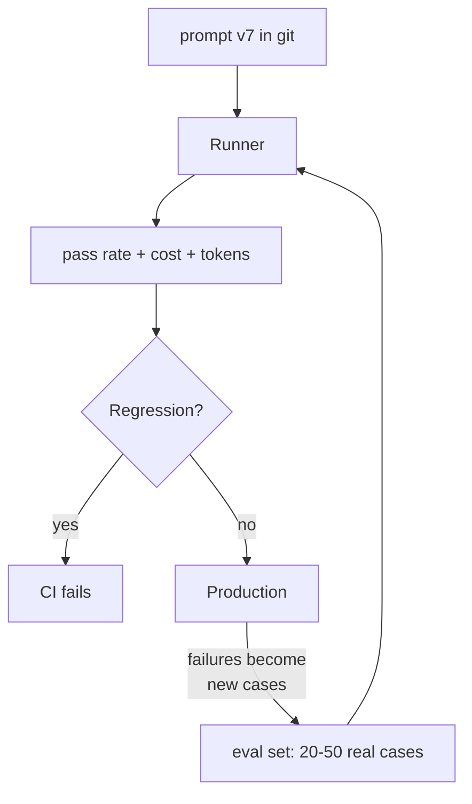

# Slides Outline — Session 10: Prompting I: The Craft

Slide-by-slide spec for the deck-builder. Build per `../../powerpoint_instructions.md` (layouts, palette, type, accessibility, licence footers). Speaker notes go in the Notes pane, never on the slide. Mermaid sources are given in the **Visual** field for the builder to render in-palette, with alt text.

**Deck size:** 1 title + 1 agenda + 17 content + 1 discussion + 1 resources = **21 slides.** Target 45 min (≈2.5 min per content slide).

**Deck-wide licence note.** The prompt-engineering cycle and the 11-task taxonomy are **re-authored** from a LINK-ONLY commercial deck (Wassell, *ChatGPT Prompt Engineering Cookbook*) — our own words, our own diagrams, materially extended. Nothing is reproduced, so those slides need no attribution footer. Where a slide derives from a SLIDE-SAFE source (OpenAI Cookbook — MIT; DAIR.AI promptingguide.ai — MIT; The Prompt Report v6 — CC BY 4.0), the footer tag is given per slide. **No Google whitepaper material and no Anthropic tutorial material appears on any slide** — both are resources-slide links only.

**⚠️ Verify at delivery:** every model name, price, context size, parameter name, and product/ownership claim on slides 15, 16, 18 and 19. Placeholders are marked `<...>` in the outline. This deck ages faster than any other in the series.

---

## Slide 1 — Title

- **On-slide text:** "Prompting I: The Craft" · Session 10 · Working with LLMs block · AI Training Series. Subtitle: *"Prompting is a loop, not a lucky guess."*
- **Speaker notes:** Set the frame in one line: by the end of this hour, prompting should look like a testable engineering technique rather than a knack some people have. Say up front that every technique comes with a complete prompt they can copy, and that the reading pack has more depth than the deck.
- **Visual:** Series title layout.
- **Source/licence:** none (original).

## Slide 2 — Agenda

- **On-slide text:** The cycle → the taxonomy → core craft → chain-of-thought → structured output → the cost lever → prompts as artifacts. "45 min + 15 min Q&A."
- **Speaker notes:** Twenty seconds. Flag the two segments that change what people build rather than what they type: structured output and the cost lever. Say honestly that the deck is tight and the reading carries the detail.
- **Visual:** Agenda table mirroring the README minute-budget.
- **Source/licence:** none.

## Slide 3 — Hook: same model, same commits, two prompts

- **On-slide text (headline is a claim):** "Nothing changed but the prompt." Two-column: LEFT `Write release notes from these commits:` → output riddled with ticket IDs, a dependency bump, and an invented feature. RIGHT the engineered prompt → 6 clean customer-facing bullets.
- **Speaker notes:** Do not explain anything yet — let the contrast land. Ask the room which one they would send to a customer. Then the point: same model, same input, same cost order of magnitude. The difference is entirely engineering, and by the end of the hour they will know every element that made the right-hand side work. This is the release-notes example we return to all session.
- **Visual:** Two-column layout. Real text on both sides, in a monospace box. Highlight in the LEFT output: one ticket ID, one dependency bump, one invented feature — three call-outs, labelled, not colour-only.
- **Source/licence:** original (prompts authored for this course).

## Slide 4 — Prompting is a loop, not a phrase

- **On-slide text:** "Define → draft → test → refine → iterate → evaluate." Bullets: the inner loop is the technique; change one thing per iteration; the outer loop never closes.
- **Speaker notes:** Introduce the cycle as the one durable framework from the 2024 source material. Emphasise that drawing it as a list is how you get people who "did prompt engineering" once. The inner test→refine loop is where the work is. The outer dotted return exists because inputs drift and models change under you.
- **Visual:**

- **Source/licence:** original diagram; framework re-authored from a LINK-ONLY source — no attribution footer needed, do not name the source deck on-slide.

## Slide 5 — Write the rubric before the prompt

- **On-slide text:** "If you can't grade it, you can't engineer it." Two-column table, vague vs. checkable: "Good release notes" → "One bullet per user-visible change; verb-first; ≤20 words; no ticket IDs; refactors excluded; ≤12 bullets."
- **Speaker notes:** This is the step people skip and it is the whole game. Point out what the right-hand column actually is: an eval rubric. They have written the scoring function before writing the prompt. Land the correction to the old material — testing is not step 3 of 6, it is a precondition. Without success criteria and a way to check them, you are not engineering, you are guessing.
- **Visual:** Two-row comparison table, large type, three examples (release notes / incident summary / config diff).
- **Source/licence:** the "presupposes success criteria + a way to test" framing is re-expressed from vendor documentation — paraphrased, not quoted. No footer.

## Slide 6 — Five refinements, each attributable

- **On-slide text:** "One change per iteration, or you learn nothing." Table: v2 output contract → format fixed 5/5; v3 exclusion list → dependency bumps gone; v4 grounding constraint → invention gone; v5 two exemplars → tone stable; v6 empty-case string → edge case fixed.
- **Speaker notes:** Walk the table quickly — this is the worked example from the reading. The contrast to draw: the usual alternative is rewriting the whole prompt in frustration and having no idea what fixed it. Each row here is a hypothesis, a test, and a result. Note that two of the five fixes are *exclusions* — telling the model what not to do.
- **Visual:** 5-row table (Iteration | The single change | Effect on 5 test cases). Include a small "5/5" style column so the greyscale print still reads.
- **Source/licence:** original.

## Slide 7 — Classify the task before you write

- **On-slide text:** "Eleven task types, four routing questions." Bullets: reshape / produce / reason / interact; ten seconds of classification changes which knobs you touch.
- **Speaker notes:** Introduce the taxonomy as a working reference, not an ontology — its categories overlap and that is fine. The value is that it breaks the habit of applying one prompt shape to everything. Point them at The Prompt Report for a rigorous 58-technique taxonomy when two engineers need to agree on what a word means.
- **Visual:**

- **Source/licence:** grouping original; the 11 types re-authored from a LINK-ONLY source. Mention The Prompt Report v6 (CC BY 4.0) verbally.

## Slide 8 — The decision table (the print-and-keep slide)

- **On-slide text:** Task type × technique matrix — rows: Transformational, Critical Thinking, Data Analysis, Code Generation, Recommendation (5 rows only on slide; full 11 in the handout). Columns: System msg · Delimiters · Few-shot · Reasoning · Structured output · Temperature.
- **Speaker notes:** Do not read the table. Name the two patterns instead: (1) delimiters are essential wherever the prompt contains text you did not write — that is a boundary, not a style preference; (2) temperature 0 is the right default for nearly everything this room does. Tell them the full 11-row version is in the reading and is designed to be printed.
- **Visual:** Table layout, 5 rows × 6 columns. Use text markers (essential / helpful / rarely), never colour alone.
- **Source/licence:** original synthesis.

## Slide 9 — Zero-shot vs. few-shot: show, don't describe

- **On-slide text:** "Few-shot is pattern continuation, not learning." Bullets: 2–3 examples; hard cases, not easy ones; consistent format; correct labels — the model copies your mistakes perfectly.
- **Speaker notes:** Explain the mechanism, because it predicts the failure modes: the exemplars sit in the context window, and the most likely continuation of three input→output pairs is a fourth in the same shape. Nothing in the model changes. Therefore: unrepresentative examples produce unrepresentative output, imbalanced labels produce biased output, and a mislabelled exemplar is a bug that ships.
- **Visual:**

- **Source/licence:** definitions align with The Prompt Report v6 (CC BY 4.0) — footer: "Terminology: The Prompt Report v6, CC BY 4.0."

## Slide 10 — Before / after: severity classification

- **On-slide text:** Two columns. LEFT zero-shot → 60 hedged words, "High, though it could be argued as Medium." RIGHT few-shot with your own S1–S4 ladder → `Severity: S2` / one-line justification.
- **Speaker notes:** Read both outputs aloud — the left one is the one everybody gets and quietly tolerates. Point out that the model could not possibly have known your severity ladder; three examples taught it. Then the numbers: +180 input tokens, output down from 60 words to 2 lines, 10 identical formats across 10 runs instead of 6 different ones. That consistency is what makes it automatable.
- **Visual:** Two-column layout with the actual verbatim prompts and outputs in monospace. Small comparison table beneath.
- **Source/licence:** original (prompts authored for this course).

## Slide 11 — When examples make it worse

- **On-slide text:** "Few-shot fixes shape, not knowledge." Bullets: simple statable rule → just state it; creative task → exemplars collapse variety; long inputs → they compete for context; high volume → you pay per call; wrong exemplar → copied perfectly.
- **Speaker notes:** The honest half. Give the diagnostic question: am I struggling to describe the *format*, or to get the right *answer*? Few-shot fixes the first and rarely the second. If the model lacks the knowledge, no number of examples supplies it — that is retrieval, which is Session 13.
- **Visual:** Bullets only; keep it sparse. Optional small icon row.
- **Source/licence:** original.

## Slide 12 — "Let's think step by step" is a 2023 artefact

- **On-slide text (headline is a claim):** "The most-quoted prompt tip is now obsolete." Bullets: CoT works because reasoning tokens buy computation; on modern models reasoning is a **parameter with a budget**; the engineering question is "is this call worth it?", not "what phrase do I add?"
- **Speaker notes:** Expect pushback — half the room believes this tip and most blog posts still repeat it. That is exactly why it is on a slide. Explain the mechanism: emitting reasoning first gives the model more tokens to condition on, i.e. more computation. Then explain what changed: current models expose thinking budget / reasoning effort as a request parameter, so instructing the model to think is redundant and can inflate cost and break your output format. Note that a 30-month-old prompting curriculum is missing half its vocabulary — assume the same about this one, which is why we teach testing rather than phrases.
- **Visual:**

- **Source/licence:** original. **Do not** reference or reproduce the Anthropic interactive tutorial's chapter on this — it is the example of the obsolete approach, and it is link-only.

## Slide 13 — Reasoning: when it pays and when it burns money

- **On-slide text:** Table. Worth it: policy/ship decisions · weighted comparisons · debugging from logs · RCA over a timeline. Not worth it: 4-way classification · summarise/reformat · JSON extraction · creative generation.
- **Speaker notes:** Three honest findings to say out loud: reasoning sometimes does not help at all on pattern-match tasks while costing several times more and taking several times longer; reasoning models can hallucinate *more* on some recall-shaped tasks; and token budgets for the same answer vary enormously between models. Then the hard one: the visible chain of reasoning is **not an audit trail**. It is generated text that correlates with, but does not record, the computation. Never present it as justification to a change board.
- **Visual:** Two-column table (Worth it / Not worth it), 4 rows each.
- **Source/licence:** findings summarised from LINK-ONLY source material and public research — paraphrased, no reproduction. No footer.

## Slide 14 — Three structural habits

- **On-slide text:** "System message = standing policy. User message = this request. Delimiters = the boundary." Bullets: rules and contract in system; data fenced in named tags; grounding constraint; self-critique for rule violations.
- **Speaker notes:** Cover the three quickly and concretely. System message: more authoritative, and — the bit everyone misses — it is the *cacheable* part, so put static content there. Delimiters: XML-ish tags by default, named so you can refer to them ("matching the tone of `<previous_notes>`"). Grounding: "describe only what is in the input" is the single highest-value line for any transformational task. Self-critique: good at rule violations, bad at factual errors, because the critique inherits the same blind spots.
- **Visual:**

- **Source/licence:** original.

## Slide 15 — The finished prompt, every element earning its place

- **On-slide text:** The v6 release-notes prompt, abbreviated to fit, with 6 numbered call-outs mapping each element to the failure it fixed: system block → rules ignored; `<commits>` tags → instruction/data confusion; output contract → marketing prose; exclusion list → dependency bumps as features; grounding line → invented features; negative exemplars → not knowing what "omit" looks like.
- **Speaker notes:** This is the payoff slide for the hook. Every line is there because a test case failed without it — nobody guessed. Draw attention to the exemplar design: two of the three examples show the model what *not* to output. Negative exemplars are underused and are often the fastest fix for over-inclusion. Tell them the full prompt is in the reading, ready to copy.
- **Visual:** Full-bleed monospace prompt with numbered annotation callouts. This slide may exceed the 6-bullet guidance because it is a single artefact, not a list.
- **Source/licence:** original (authored for this course).

## Slide 16 — Structured output is the bridge to tooling

- **On-slide text (headline is a claim):** "Prose needs a reader. JSON needs a pipeline." Table: release notes / incident triage / config diff / log triage — prose column vs. structured column.
- **Speaker notes:** This is the slide that changes what they build. In every row the model does identical work; the only difference is whether the output has a contract. Once triage returns `{severity, component, needs_escalation}`, routing is automatic and the human gate becomes a deliberate design decision instead of a bottleneck by default.
- **Visual:** 4-row, 3-column table.
- **Source/licence:** original.

## Slide 17 — Asking for JSON vs. guaranteeing it

- **On-slide text:** "A request is not a guarantee." Three tiers: (1) "reply in JSON" — usually works, fails on fences, preambles, truncation; (2) constrained decoding — schema compiled to a grammar, invalid output unrepresentable; (3) tool/function calling — same guarantee plus the model chooses whether to call.
- **Speaker notes:** Engineers conflate these constantly. Make the mechanism concrete: constrained decoding restricts the valid token set at each step, so invalid JSON cannot be sampled. At 98% compliance and 10,000 calls a day, tier 1 means 200 daily parse failures. Then the vendor-reading lesson: one vendor shipped constrained decoding in Aug 2024 and called it a guarantee; the other argued instruction-following sufficed until shipping the same mechanism in Nov 2025. The market resolved it by convergence. **Verify both dates and current capabilities at delivery.**
- **Visual:**

- **Source/licence:** mechanism description consistent with OpenAI Cookbook (MIT) — footer: "OpenAI Cookbook, MIT."

## Slide 18 — A schema is part of the prompt

- **On-slide text:** The incident-triage schema, abbreviated: enum severity, enum component, `started_utc: string|null`, `evidence: string[]`, `confidence: enum`. Bullets: enums close the vocabulary; descriptions are instructions; **always give a null branch**; ask for evidence.
- **Speaker notes:** The rule to land hard: a required field with no null branch is an instruction to fabricate. If `started_utc` is required and the thread never states a time, the model produces a plausible timestamp. Constrained decoding guarantees schema-valid, not true — and a well-formatted wrong answer is *harder* to catch than a messy one, which is the human-factors trap from the safety material. The `evidence` field of verbatim quotes is the cheapest verification tool available.
- **Visual:** Monospace schema excerpt with three annotations (enum · null branch · evidence). Small expected-output JSON block beside it.
- **Source/licence:** original.

## Slide 19 — A cheap model, well prompted, matches an expensive one

- **On-slide text (headline is a claim):** "Prompting is a cost lever, measurably." Table: frontier+lazy `92% pass · $0.044/call · 6 s` vs. small+engineered `90% pass · $0.0022/call · 1.2 s`. Footnote: illustrative — **run your own; prices/models verify at delivery.**
- **Speaker notes:** State the claim with all its qualifiers: narrow, well-specified, repetitive tasks — the kind that dominate operational work. Two non-obvious points from the table: the engineered prompt uses *more* input tokens and *fewer* output tokens, and output tokens are the expensive ones, so constraining output is a cost technique. And latency often matters more than money — 5× faster is the difference between an inline CI check and a nightly job. Then caching: put static content first and variable content last, and the input side nearly disappears.
- **Visual:** Comparison table, 6 rows. Add the small mermaid cascade if space allows; otherwise it goes on slide 20.
- **Source/licence:** original; numbers illustrative. Footer must read "Illustrative — verify prices and models at delivery."

## Slide 20 — The question that dissolves most claims

- **On-slide text:** "Was it compared at equal token budget?" Bullets: a documented multi-agent result where **token usage alone explained ~80% of performance variance** at ~15× the tokens; report pass rate + cost/call + tokens/call together; hold your own team to this bar.
- **Speaker notes:** This is the most durable thing in the session — a way of reading claims, not a technique. Much of what looks like clever prompting is simply spending more tokens, which does work and is a different claim. Give them the four-question card: at what total cost per call? against what baseline at the same budget? same scaffold? same eval set? Then turn it inward: apply it to your own A/B tests before someone else does.
- **Visual:** Large pull-question as the centrepiece, with the four follow-up questions beneath. Optionally the cascade diagram:

- **Source/licence:** the token-variance finding is from a vendor engineering post (LINK-ONLY) — **paraphrase the finding, do not quote or reproduce any figure.** Footer: none; attribute the concept verbally.

## Slide 21 — A prompt is production configuration

- **On-slide text:** "In git. In a PR. In CI. Logged with its version." The maturity ladder: 0 folklore → 1 written down → 2 versioned → 3 tested → 4 gated → 5 observed. Bullets: start with 5 real cases; grow to 20–50 from real failures; run on a schedule, not just on change.
- **Speaker notes:** Close on this room's home turf — every property that makes something worth version-controlling applies to a prompt. Most teams are at level 0 or 1; **level 3 is one afternoon away** and captures most of the value. Two things they will not have thought of: run the eval on a schedule because the model can change under a stable name, and log human edits of model drafts — that diff is perfectly-labelled failure data almost everyone discards. Hand off to Session 11, which does this live on their own tasks.
- **Visual:**

- **Source/licence:** original.

## Slide 22 — Discussion / poll

- **On-slide text:** "Where is your team on the ladder?" A/B/C poll: (A) prompts live in chat histories · (B) written down somewhere shared · (C) versioned and tested. Then the discussion prompts from `exercises/discussion.md`.
- **Speaker notes:** Run the poll first — it is fast, it is honest, and level 0/1 dominance is the point. Then open the floor. The prepared prompts are in the exercises file; the two that reliably generate the best discussion are "which of your recurring tasks is narrow enough for the cheap-model argument?" and "what would break if a prompt silently regressed next Tuesday?"
- **Visual:** Discussion/poll layout per the template.
- **Source/licence:** none.

## Slide 23 — Resources & credits

- **On-slide text:** Slide-safe: OpenAI Cookbook & prompting guides (MIT) · DAIR.AI promptingguide.ai (MIT) · The Prompt Report v6 (CC BY 4.0). Reading only, not reproduced: Google *Prompt Engineering* whitepaper (© Google) · Anthropic prompting best practices & interactive tutorial (proprietary; tutorial is Claude-3-era) · vendor blog posts. Tooling: promptfoo (MIT) — note OpenAI ownership since 2026-03.
- **Speaker notes:** Point out the licence split explicitly — this deck was built only from permissively licensed material, and the copyrighted sources are excellent reading that we deliberately did not copy. Warn them off the tutorial's chain-of-thought chapter specifically. Repeat the currency warning: verify every model name, price and feature claim before reusing this deck.
- **Visual:** Resources layout with licence tags; two clearly separated columns (embeddable vs. link-only).
- **Source/licence:** full detail in `../resources/sources.md`.

---

## Build checklist for this deck

- [ ] Slides 3, 10, 15, 18 carry **real verbatim prompt text** in monospace — this is the deck's differentiator from the source material. Do not paraphrase them into bullets.
- [ ] Slide 15 intentionally exceeds the 6-bullet rule (single annotated artefact). No other slide should.
- [ ] Every "verify at delivery" placeholder (`<...>`) is resolved before presenting: slides 15, 16, 18, 19, 23.
- [ ] Slide 19's footer states the numbers are illustrative.
- [ ] No Google whitepaper and no Anthropic tutorial content appears anywhere except slide 23 as a link.
- [ ] Slide 20 paraphrases the token-variance finding; no figure or quotation is reproduced.
- [ ] All mermaid diagrams rendered in-palette with alt text; ≤12 nodes each; greyscale-legible.
- [ ] The decision table (slide 8) is legible at 18 pt — if it is not, cut a column rather than shrinking type.
