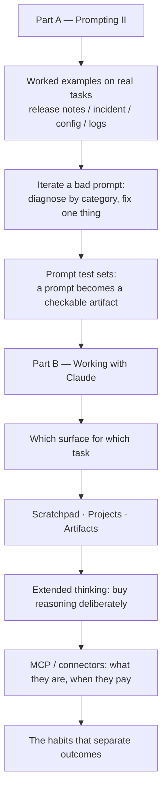

# Overview — From Technique to Practice

Session 10 gave you the moves. This session is about whether they survive contact with your actual work — and about the tool most of you will be using when you try.

---

## The gap this session closes

There is a predictable moment about two weeks after a prompting course. People go back to their desks, try the technique on a real task, get a mediocre result, conclude that "it doesn't really work for our stuff," and revert to typing one-line requests into a chat box forever. Nothing in Session 10 was wrong. What was missing was **length, iteration, and evidence**:

| What Session 10 showed | What real work needs |
|---|---|
| A three-line prompt demonstrating few-shot | A forty-line prompt carrying real context, real constraints, and a real output contract |
| A technique that visibly improved one example | A way to know it improved things *on average* and broke nothing |
| A prompt that worked | A prompt that is versioned, owned, and re-checkable when the model changes under you |
| "Prompting is a loop" | An actual loop you ran, with a diagnosis step that is not "add more words" |

This session supplies all four, on four tasks this team genuinely does.

## The arc

**Part A** is durable. Prompt structure, failure diagnosis, and test sets will still be correct in three years, because they are software-engineering discipline applied to a stochastic component.

**Part B** is perishable in its specifics and durable in its principles. This is stated bluntly and repeatedly in the materials, because pretending otherwise would be dishonest.

## The single most important idea in Part A

> A prompt without a test set is not an engineering artifact. It is a rumour that happened to work once.

This sounds harsh; it is just the ordinary standard applied consistently. Nobody on this team would accept "the new build script feels faster" as evidence. Nobody would ship a config change because it looked right in one environment. Yet prompts routinely get shared, copied, and enshrined on the strength of a single good output that nobody re-checked.

The fix is small — twenty cases, a pass/fail rule, ten minutes to run — and it changes the conversation from taste to evidence. It also gives you the only defence that works when a model version changes underneath you: you re-run the suite and you *know*.

## The single most important idea in Part B

> The people getting real value out of Claude are not using a better model. They are running a better loop.

Same model, same access, wildly different outcomes. The differences are boring and learnable:

| Low-value pattern | High-value pattern |
|---|---|
| One-shot question, accept or discard the answer | Draft → critique → revise, with the model doing the critique against stated criteria |
| Paste context fresh into every new chat | Stable context lives in a Project or a system prompt; only the variable part is typed |
| Read the answer, retype it into the real document | Have the model produce the artifact directly, then diff it against the previous version |
| "It got it wrong, this is useless" | "It got it wrong — which of the five failure categories is this?" then fix that one thing |
| Trust the output because it is fluent | Verify the output because verification is the job the human kept |

That last row is Session 1's thesis arriving as a daily habit rather than a warning.

## Four running tasks

Every example in this session uses one of four tasks, chosen because they cover the room and because they stress different parts of the craft.

| # | Task | Who owns it | What makes it hard | Where it is worked |
|---|---|---|---|---|
| 1 | **Release notes** from a set of merged changes | Release management | Audience mismatch — the same change must be described differently for customers and for internal ops | `01` |
| 2 | **Incident summary** from a long, messy timeline | Problem management | Long noisy input; must separate what is known from what is inferred | `01` |
| 3 | **Configuration review** — is this change safe? | Configuration management | The model must be willing to say "I cannot tell from this" | `02` |
| 4 | **Log triage** — cluster and rank an error dump | Developers | Volume; output must be machine-readable to be useful | `01`, `03` |

All data is invented. Component names, ticket IDs, and version numbers in these materials are fictional and deliberately do not resemble real Qualcomm artefacts.

## What this session does *not* cover

Honesty about scope, so nobody leaves expecting the wrong thing:

- **Agent building.** Multi-step autonomous systems, ReAct loops, orchestration frameworks — out of scope. We touch tool use only far enough to make MCP comprehensible.
- **RAG.** Retrieval architecture is its own topic.
- **Prompt injection and adversarial security.** That is Session 14, and it is a whole session because it deserves one. When Part B mentions connectors, it flags the security surface and forwards you there.
- **Fine-tuning.** Almost never the right first answer for the tasks above; prompting plus retrieval plus a test set gets you further, faster, for less.
- **Vendor comparison.** This session teaches Claude because it is the tool this team has. The prompting half is model-agnostic and transfers directly; the workflow half transfers in principle to any comparable assistant.

## A note on currency, stated once and meant throughout

Everything in Part B that names a Claude feature carries this tag:

> ⚠️ **Verify against current Claude documentation at delivery.**

This is not boilerplate hedging. Between authoring and delivery, model names change, context limits change, features get renamed, merged, or promoted out of beta, and pricing moves. The materials are written so that if a feature name is wrong, the surrounding principle is still right — but a presenter who reads the feature list aloud without checking it will be corrected by someone in the room, and should be.

The MCP segment carries a second constraint: **the final specification publishes 2026-07-28.** Schedule accordingly.

---

**Next:** `01-worked-prompts-on-real-tasks.md` — three tasks taken from a lazy prompt to a production one, with the outputs shown at each stage.
