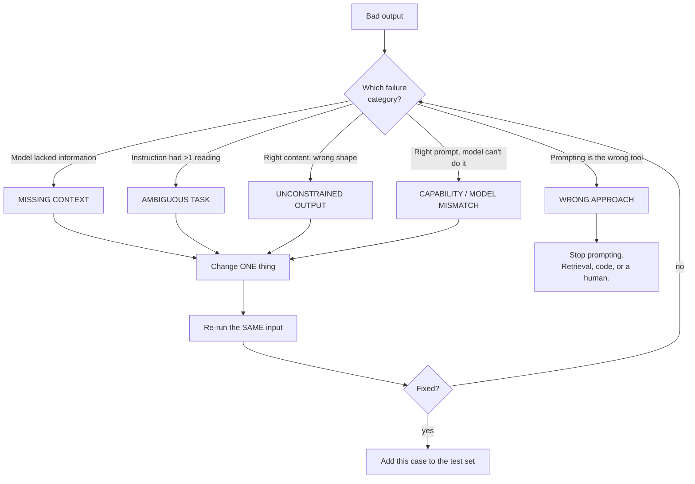
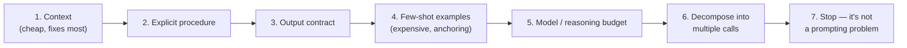

# Iterating a Bad Prompt — Diagnosis Before Treatment

The default response to a bad output is to add words. This file replaces that reflex with a diagnosis step: five failure categories, a test that tells them apart, and one fix per pass. Worked on a configuration-review prompt that fails three different ways in a row.

---

## Why "add more words" fails

Adding text to a failing prompt does sometimes help — which is exactly the problem, because it helps often enough to be reinforced and rarely enough to leave you with a 400-line prompt nobody understands. The prompt accumulates layers of scar tissue: instructions added to fix a problem that had a different cause, contradicting each other, none of them removable because nobody remembers which one is load-bearing.

The discipline that prevents this is the one you already apply to a flaky build:



Caption: the diagnosis loop. The two rules that make it work are *one change per pass* and *the same input every pass*. Change two things and you learn nothing about either.

## The five categories, and how to tell them apart

| Category | Signature in the output | The test that confirms it | The fix |
|---|---|---|---|
| **1. Missing context** | Output is competent but wrong for *your* situation; uses generic conventions; invents facts about your system | Give the model the missing fact by hand in a follow-up message. If the answer becomes right, this was it. | Move that fact into the prompt's CONTEXT layer permanently |
| **2. Ambiguous task** | Output is a *reasonable* answer to a *different* question; varies wildly between runs | Give the same prompt to a colleague with no context. If they ask a clarifying question, the model had the same one and guessed. | Rewrite the instruction as a numbered procedure; name the interpretation you want |
| **3. Unconstrained output** | Content is right; length, format, tone, or structure is wrong; format drifts across runs | Ask yourself whether a script could parse it. If not, this is it. | Output contract; for machine consumption, a tool schema |
| **4. Capability / model mismatch** | Fails consistently on the same *kind* of step (arithmetic, long-range consistency, precise counting) no matter how you phrase it | Run the identical prompt on a stronger model or with more reasoning budget. If it now passes, phrasing was never the issue. | Change model, raise thinking budget, or decompose into steps |
| **5. Wrong approach** | Failure is about facts the model has no access to, or a determinism the model cannot provide | Ask: could a competent human do this from *only* what is in the prompt? If no, no prompt fixes it. | Retrieval, a real tool/API, deterministic code, or a human |

**Category 5 is the one people skip, and it is the most expensive to skip.** Hours get burned prompt-tuning a task that was never a prompting task. If the question is "does this config value conflict with what we deployed to the EU region last Thursday," and last Thursday's deployment record is not in the prompt, no amount of phrasing will help. Get the record into the context or stop.

---

## The live iteration: a configuration-review prompt

### The starting prompt (deliberately bad)

```
Review this config change and tell me if it's safe to deploy.

max_batch_size: 512 -> 4096
upload_interval_ms: 5000 -> 1000
tls_verify: true -> false
retry_backoff: exponential -> fixed
```

### Pass 1

**What came back (abridged):**

> This configuration change appears generally safe, with some considerations. Increasing `max_batch_size` to 4096 will improve throughput efficiency. Reducing `upload_interval_ms` to 1000 provides more timely data delivery. Setting `tls_verify` to false may be appropriate in development environments. Switching to fixed backoff simplifies retry behaviour. Overall this looks like a reasonable performance-tuning change; consider monitoring memory usage after deployment.

**Diagnose it.** Two things are wrong and they are different faults.

First: **"safe" was never defined.** Safe against what — memory exhaustion, data loss, security, SLA breach? The model picked "performance tuning" as the frame and answered coherently within it. That is **Category 2, ambiguous task**.

Second, and more seriously: it soft-pedalled `tls_verify: false`. This is not a tuning knob, it is disabling certificate verification. The model hedged toward "appears generally safe" because the prompt's shape invited a verdict and the surrounding items were benign. That is **Category 1, missing context** — nothing told it what this system is, what it carries, or where it runs.

*(Note what happened there: four changes, three benign, one serious. The serious one got averaged into the tone of the other three. This is a general property worth flagging to the room — a model asked for an overall verdict will produce an overall verdict, and a single critical item can be diluted by its neighbours. The structural fix is to require a per-item verdict before any aggregate one.)*

**One fix this pass: define what "safe" means, and supply the system context.**

```
You are reviewing a configuration change to Helios Platform, an
embedded telemetry stack that runs on OEM devices in the field and
uploads customer telemetry over the public internet to our regional
ingest endpoints. Devices have 256 MB RAM and are not remotely
recoverable if they crash-loop.

"Safe to deploy" means ALL of the following hold:
  (a) no credential, transport-security, or data-exposure regression
  (b) no plausible path to device-side memory exhaustion or crash-loop
  (c) no increase in data loss under network failure
  (d) no more than a 2x increase in ingest request rate

Review this config change against (a)-(d).

max_batch_size: 512 -> 4096
...
```

### Pass 2

**What came back:** far better. It now flags `tls_verify: false` as a criterion (a) failure in explicit terms. It reasons about 4096-item batches against 256 MB and raises a memory concern. But:

> Regarding upload_interval_ms, reducing from 5000ms to 1000ms represents a 5x increase in upload frequency, which combined with the larger batch size should be evaluated carefully. This likely exceeds the stated 2x threshold, though the exact impact depends on data generation rate.

And the whole response is six paragraphs of flowing prose, with the criteria discussed in an order that changes between runs, and the final verdict buried in the fifth paragraph.

**Diagnose it.** The analysis is now right. The *shape* is unusable — you cannot tell at a glance whether it passed, you cannot diff two reviews, you cannot put it in a pipeline. That is **Category 3, unconstrained output**, cleanly.

Note that the hedging on criterion (d) — "though the exact impact depends on data generation rate" — is not a fault. It is correct. The prompt should give it a proper home rather than leaving it in a subordinate clause.

**One fix this pass: an output contract with a per-criterion verdict.**

```
OUTPUT
A markdown table with exactly these columns:
  Criterion | Verdict | Evidence | What would change the verdict

One row per criterion (a)-(d), in order. Verdict is exactly one of:
PASS, FAIL, INSUFFICIENT INFORMATION.

Then a single line:
  OVERALL: BLOCK  — if any criterion is FAIL
  OVERALL: HOLD   — if any criterion is INSUFFICIENT INFORMATION and none FAIL
  OVERALL: PROCEED — only if all criteria PASS

Then, if any row is INSUFFICIENT INFORMATION, a section "Questions for
the change author", one question per unresolved criterion.

Nothing else. No preamble, no summary paragraph.
```

The verdict enum with a deterministic aggregation rule is the important part. `INSUFFICIENT INFORMATION` is the escape hatch from `01`, promoted to a first-class outcome — and the aggregation rule means an honest "I can't tell" produces `HOLD`, not a silent pass.

### Pass 3

**What came back:**

| Criterion | Verdict | Evidence | What would change the verdict |
|---|---|---|---|
| (a) security | **FAIL** | `tls_verify: true -> false` disables certificate verification on uploads that traverse the public internet, permitting interception or impersonation of the ingest endpoint. | Nothing in this change set. This must be reverted or justified by a documented compensating control. |
| (b) memory | **INSUFFICIENT INFORMATION** | `max_batch_size` 512 → 4096 is an 8x increase in buffered records on a 256 MB device that cannot be remotely recovered. Per-record size is not given. | Per-record memory footprint and current peak heap usage. |
| (c) data loss | **FAIL** | Fixed backoff replacing exponential means a device that fails during a regional outage retries at a constant rate and is more likely to exhaust its retry budget before the endpoint recovers, dropping buffered telemetry. | Retry budget and buffer-persistence behaviour. If the buffer persists across retries and the budget is unbounded, this becomes PASS. |
| (d) request rate | **FAIL** | `upload_interval_ms` 5000 → 1000 is a 5x increase in upload frequency, exceeding the stated 2x limit before accounting for batch-size effects. | Raising the stated threshold, or a staged rollout limiting the affected fleet fraction. |

**OVERALL: BLOCK**

**Questions for the change author**
- What is the per-record memory footprint at `max_batch_size: 4096`, and what is current peak heap on a 256 MB device?

**This is now useful.** It is skimmable, diffable, has a machine-readable verdict, records its evidence, and — critically — the "what would change the verdict" column turns a review into a conversation with the change author rather than a wall.

### The three passes, tabulated

| Pass | Diagnosis | Single change made | What improved |
|---|---|---|---|
| 1 | Cat. 2 (ambiguous "safe") + Cat. 1 (no system context) | Defined 4 explicit safety criteria; supplied device and deployment context | Analysis became correct; the TLS item stopped being averaged away |
| 2 | Cat. 3 (unusable shape) | Added a per-criterion table, verdict enum, deterministic aggregation, questions section | Result became skimmable, diffable, automatable; uncertainty got a home |
| 3 | — | — | Ship it, and add the case to the test set |

Three passes, twenty minutes, and the resulting prompt is roughly forty lines. Compare against the alternative history where each bad output triggered another sentence of "be careful about security" bolted onto the end.

---

## What we did *not* do, and why

**We never told it "be more careful" or "this is important."** Exhortation is not a control. If the model is under-weighting security, the fix is a named criterion with a defined verdict, not an adverb.

**We never added an example.** Few-shot is powerful and Session 10 covered it — but examples are expensive in tokens and they anchor the output hard, including anchoring its mistakes. Reach for structure first; reach for examples when structure has failed and you need to demonstrate a *style* or an *edge-case handling* that you cannot describe. A good order of attack:



Caption: escalation order. Each step costs more than the last in tokens, latency, or complexity. Work left to right and stop at the first thing that passes your test set.

**We never changed model or added reasoning budget.** Not because those are wrong, but because reaching for them before fixing the prompt hides the real problem and raises your bill permanently. A stronger model will paper over an ambiguous instruction — and you will have paid for a fix you did not need and still have an ambiguous instruction, waiting to bite you when the input changes.

---

## Delivering this live

For the presenter, this segment is the highest-risk and highest-reward part of the session.

**Do:** pre-capture all three outputs. Reveal them. Ask the room to diagnose before you show the fix — "which of the five is this?" — and let two people disagree before adjudicating. The disagreement is the lesson.

**Do not** run this live against the API in front of the room hoping for a good failure. You will get a different failure than the one you rehearsed, or a suspiciously good first answer, and you will spend four minutes recovering. Rehearsed reveal, every time. If the room demands a live run, do it at the end with a spare prompt where any outcome is interesting.

**The exchange to aim for** is someone saying "wait, isn't that just missing context?" about pass 2. It is a defensible reading. Answer it honestly: categories 1 and 3 overlap at the edges, the taxonomy is a thinking tool rather than a law, and the value is in *stopping to ask* before typing, not in getting the label right.

---

**Next:** `03-prompt-test-sets.md` — how the passing cases from this loop become a suite, and why the suite is what makes the prompt an engineering artifact.
