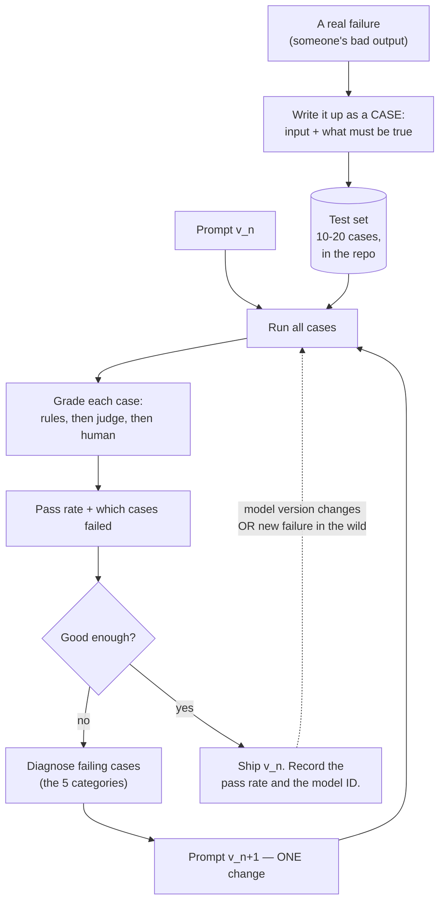
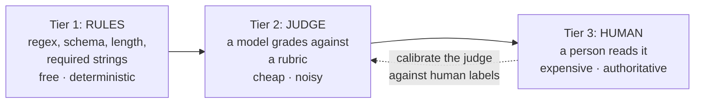

# Prompt Test Sets — Turning Folklore Into an Artifact

The single change that moves prompting from craft to engineering: a small set of cases with pass/fail criteria, versioned alongside the prompt. Twenty cases, ten minutes to run, and "the new one feels better" stops being an argument anyone has to accept.

---

## The problem, stated precisely

Here is how prompts actually spread through an organisation. Someone writes one that works. They paste it in a channel. Four people copy it. Two modify it. One of the modifications is better; nobody can tell which. Six weeks later the model version changes and three of the six copies quietly start failing in ways that only show up in the output, not in an error. Nobody notices for a month.

Every single failure there is a **testing** failure, not a prompting failure. And they are the exact failures the team already knows how to prevent in code.

| Practice you already apply to code | Its prompt equivalent | Typically in place? |
|---|---|---|
| Version control | The prompt lives in a repo, not a chat message | Rarely |
| A test suite | 10–20 cases with expected properties | Almost never |
| Regression testing on dependency upgrade | Re-run the suite when the model version changes | Almost never |
| Code review | Someone else reads the prompt before it is used in anger | Sometimes |
| A bug report becomes a test case | A bad output becomes a case in the suite | Almost never |

The asymmetry is odd once you see it. A prompt that generates customer-facing release notes is production software with an unusually unpredictable runtime. It gets less rigour than a shell script.

---

## The loop



Caption: the prompt test loop. The dotted line is the part that pays for the whole exercise — when the model changes under you, you re-run and *know* within ten minutes.

---

## Building a test set that is worth having

### How many cases, and where they come from

**Start with 10–20.** This number matters, because the usual reason teams have no test set is that they imagine needing hundreds and never begin. Twenty cases catch the great majority of the regressions you will actually hit.

Draw them from real failures, not from imagination. The best source is the diagnosis loop in `02` — every time a prompt fails and you fix it, that input becomes a case. A test set assembled this way has a useful property: every case is there because something really went wrong once, so none of them are decorative.

Aim for this mix:

| Case type | Share | Purpose | Example (release-notes prompt) |
|---|---|---|---|
| **Typical** | ~40% | The ordinary job; catches gross regressions | A normal 12-change release, nothing unusual |
| **Edge** | ~30% | Boundaries where behaviour changes | A release with *only* internal changes; a single-change release; a 60-change release |
| **Adversarial** | ~15% | Inputs designed to induce the known failure | A commit message containing the words "critical security fix" that is actually a typo fix; a commit message containing an instruction-shaped sentence |
| **Regression** | ~15% | One per bug you have already fixed | The input that made it invent a version number |

### What a case looks like

A case is an input plus **checkable assertions** — not a golden expected output. Requiring exact-match output is the classic beginner mistake: the model is stochastic, prose has a thousand valid forms, and you will spend your life updating expected strings. Assert on **properties**.

```yaml
# cases/release_notes/006_internal_only.yaml
id: 006_internal_only
type: edge
description: >
  A release containing nothing but internal refactors and CI changes.
  Historically the prompt invented user-facing entries rather than
  producing an empty note. Regression source: HEL release 2.4.1 draft.

input:
  changes: |
    HEL-5001 refactor: extract buffer allocator into its own module
    HEL-5004 chore: pin CI toolchain to 24.04.2
    HEL-5006 test: add fuzz harness for the frame parser

assertions:
  - id: no_fabricated_entries
    kind: rule
    check: "output must not contain the headings 'New', 'Changed', 'Fixed', 'Deprecated'"
  - id: all_ids_omitted
    kind: rule
    check: "output must list HEL-5001, HEL-5004, HEL-5006 under 'Omitted'"
  - id: no_invented_version
    kind: rule
    check: "output must not match a version-number pattern"
  - id: tone
    kind: judge
    check: "The note does not apologise, editorialise, or explain itself. It is a bare list."
```

### The three grading tiers — use them in this order



Caption: grading tiers. Push every assertion as far left as it will go.

| Tier | Use for | Cost | Trap |
|---|---|---|---|
| **1. Rules** | Format, required/forbidden strings, schema validity, counts, length, ID presence | ~free | It is tempting to stop here because it is easy — but rules cannot check whether the summary is *right* |
| **2. Model-as-judge** | Tone, relevance, "does the summary reflect the input", "is the reasoning supported" | ~1 extra call per assertion | **A judge is itself an unvalidated prompt.** It has the same failure modes, needs the same discipline, and is biased toward verbose and confident answers |
| **3. Human** | The judgement calls that matter and the periodic calibration of tier 2 | Expensive | Skipping it entirely means your judge drifts and you never find out |

**On the judge trap, specifically.** Using a model to grade a model feels circular, and partly is. It is still worth doing, on two conditions: keep the rubric narrow and binary (not "rate 1–10" — ask a yes/no question with stated criteria), and **spot-check it against human labels periodically.** Grade twenty cases by hand, compare with the judge, and measure the agreement rate. If the judge agrees with humans 65% of the time, your pass rate is decoration. If it agrees 95% of the time on a narrow binary question, it is a real instrument. You will not know which without checking.

Push everything you can into tier 1. Most people's first judge rubric turns out to be a regex in disguise.

---

## A minimal runner

Under a hundred lines. Deliberately dependency-light — the point is that the barrier to starting is nearly zero, not that you should build a framework.

```python
# prompt_eval.py — a minimal prompt test-set runner.
# pip install anthropic pyyaml
#
# Deliberately small. If you outgrow it, mature open-source options
# exist (promptfoo, DeepEval, Ragas for RAG specifically) — see
# resources/sources.md. Do not build a framework before you have
# twenty cases.
import os
import re
import glob
import yaml
import anthropic

# Verify current model IDs against the Claude documentation at delivery.
MODEL_UNDER_TEST = "claude-sonnet-4-5"
MODEL_JUDGE = "claude-sonnet-4-5"

client = anthropic.Anthropic(api_key=os.environ["ANTHROPIC_API_KEY"])


def run_prompt(system_prompt: str, user_content: str) -> str:
    """Single call to the model under test. Temperature 0 for repeatability."""
    resp = client.messages.create(
        model=MODEL_UNDER_TEST,
        max_tokens=2000,
        temperature=0,          # reduces run-to-run variance; does NOT remove it
        system=system_prompt,
        messages=[{"role": "user", "content": user_content}],
    )
    return resp.content[0].text


def check_rule(output: str, check: str) -> bool:
    """Tier 1. Real suites use a small vocabulary of named checks;
    this is illustrative."""
    if check.startswith("must not contain:"):
        return check.split(":", 1)[1].strip() not in output
    if check.startswith("must contain:"):
        return check.split(":", 1)[1].strip() in output
    if check.startswith("must not match:"):
        return re.search(check.split(":", 1)[1].strip(), output) is None
    if check.startswith("max_words:"):
        return len(output.split()) <= int(check.split(":", 1)[1])
    raise ValueError(f"Unknown rule: {check}")


JUDGE_SYSTEM = """You grade one narrow property of a text. You answer with
exactly one word: PASS or FAIL. No explanation, no hedging. If the
property is not clearly satisfied, answer FAIL."""


def check_judge(output: str, criterion: str) -> bool:
    """Tier 2. Narrow, binary, no scale. Calibrate against human labels."""
    resp = client.messages.create(
        model=MODEL_JUDGE,
        max_tokens=5,
        temperature=0,
        system=JUDGE_SYSTEM,
        messages=[{
            "role": "user",
            "content": (
                f"PROPERTY TO CHECK:\n{criterion}\n\n"
                f"TEXT:\n<text>\n{output}\n</text>\n\n"
                "Does the text satisfy the property? PASS or FAIL."
            ),
        }],
    )
    return resp.content[0].text.strip().upper().startswith("PASS")


def run_suite(system_prompt: str, case_glob: str) -> dict:
    results = {}
    for path in sorted(glob.glob(case_glob)):
        case = yaml.safe_load(open(path, encoding="utf-8"))
        output = run_prompt(system_prompt, case["input"])
        failed = []
        for a in case["assertions"]:
            ok = (check_rule(output, a["check"]) if a["kind"] == "rule"
                  else check_judge(output, a["check"]))
            if not ok:
                failed.append(a["id"])
        results[case["id"]] = {"passed": not failed, "failed": failed}
    return results


if __name__ == "__main__":
    prompt_v3 = open("prompts/release_notes_v3.txt", encoding="utf-8").read()
    res = run_suite(prompt_v3, "cases/release_notes/*.yaml")
    passed = sum(r["passed"] for r in res.values())
    print(f"PASS RATE: {passed}/{len(res)}")
    for case_id, r in sorted(res.items()):
        if not r["passed"]:
            print(f"  FAIL {case_id}: {', '.join(r['failed'])}")

# Expected output:
# PASS RATE: 17/20
#   FAIL 006_internal_only: no_fabricated_entries
#   FAIL 013_ambiguous_severity: no_invented_severity
#   FAIL 018_long_release: max_words
```

### Reading that output like an engineer

Three failures, and they are not equally interesting:

- `018_long_release` failing `max_words` is a boring, obvious fix.
- `013_ambiguous_severity` is a **regression** — the "do not invent severity" line was added for exactly this and it is no longer holding. Something in a later edit weakened it.
- `006_internal_only` is the expensive one. If it had shipped, a customer would have received a release note describing improvements that do not exist.

Without the suite, none of these are visible. The output for all three *reads fine*.

---

## The comparison that pays for the whole exercise

Once you have a suite, you can answer questions that were previously matters of opinion. Run two prompts, or two models, over the same twenty cases:

```python
# Comparing two prompt versions and two models on the same suite.
variants = {
    "v2_sonnet": ("prompts/release_notes_v2.txt", "claude-sonnet-4-5"),
    "v3_sonnet": ("prompts/release_notes_v3.txt", "claude-sonnet-4-5"),
    "v3_haiku":  ("prompts/release_notes_v3.txt", "claude-haiku-4-5"),
}
# ... run each, tabulate ...

# Expected output:
# variant       pass   typical  edge   adversarial  regression  ~cost/run
# v2_sonnet     14/20   8/8      3/6     0/3          3/3        $0.031
# v3_sonnet     19/20   8/8      6/6     2/3          3/3        $0.038
# v3_haiku      16/20   8/8      5/6     0/3          3/3        $0.004
```

Read that table and note how many real decisions it settles:

1. **v3 beats v2**, and the gain is concentrated in edge and adversarial cases — precisely the ones nobody would have checked by hand.
2. **Haiku on v3 beats Sonnet on v2**, at one-tenth the cost. The prompt was worth more than the model upgrade. This is the finding people find most surprising, and it is common.
3. **Haiku fails every adversarial case.** So: use Haiku for bulk drafting where a human reviews, use Sonnet where the output goes out unreviewed. That is now an evidence-backed policy rather than a preference.
4. **v3_sonnet still fails one adversarial case.** You know exactly which one, you can decide whether to accept it, and you have documented it. "Known limitation, tracked" is a completely respectable engineering position. "We don't know what it does on weird inputs" is not.

⚠️ The cost figures above are illustrative arithmetic, not quoted prices. **Verify current pricing against the Claude documentation at delivery** and recompute — per-token prices move.

---

## Living with the suite

| Situation | What to do |
|---|---|
| A prompt produces a bad output in real use | Write it up as a case *before* fixing the prompt. Confirm the case fails. Then fix. |
| The model version changes | Re-run the suite before anything else. Record the new pass rate next to the old one. |
| You want to try a cheaper model | Run the suite. Decide on numbers. |
| Someone proposes a prompt improvement | "Run it against the suite" is now a complete and sufficient review comment. |
| A case has failed for three months and nobody cares | Delete it or downgrade it. A permanently-red test teaches the team to ignore red. |
| The suite passes 20/20 for months | Your cases are too easy. Add harder ones from recent real inputs. |

### What to record with every prompt version

```
prompt: release_notes
version: v3
date: 2026-07-19
model_tested: claude-sonnet-4-5      # exact ID, not "Sonnet"
suite: cases/release_notes/*.yaml (20 cases)
pass_rate: 19/20
known_failures: 011_instruction_shaped_commit_message (accepted;
                mitigated by human review before publication)
owner: release-eng
```

That block is what makes the prompt an artifact. It has a version, a measured quality, a tested-against dependency, a documented limitation, and an owner. Compare with the alternative: a prompt in a chat message that someone says is good.

---

## Honest limitations

Do not oversell this in the room. The suite is a real instrument with real edges:

- **Twenty cases is a smoke test, not a guarantee.** It catches regressions and gross failures. It does not characterise behaviour on the long tail of inputs.
- **Temperature 0 is not determinism.** It reduces variance substantially; it does not eliminate it. A case that flips between runs is telling you something — usually that the prompt is under-constrained at that point. Investigate rather than re-running until green.
- **Pass rate is not quality.** It is quality *on the properties you thought to assert*. A prompt can pass 20/20 and produce output that is technically compliant and unhelpful. Human review of a sample stays necessary.
- **The judge is a model.** All of Session 1 applies to it.
- **A suite creates a maintenance obligation.** Twenty cases is roughly an afternoon to build and about an hour a month to keep honest. If nobody owns it, it rots and becomes worse than nothing, because it provides false assurance.

The claim is narrow and defensible: **a prompt with a small test set is a dramatically better engineering artifact than a prompt without one, at a cost of about one afternoon.** That is all, and it is enough.

---

**Next:** `04-which-claude-surface.md` — Part B opens with the decision table: which Claude surface for which task.
