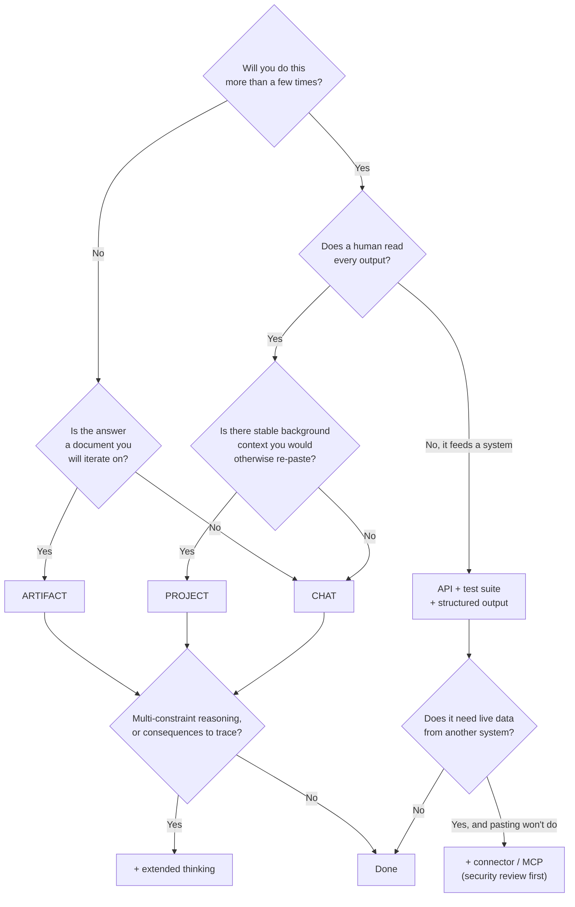
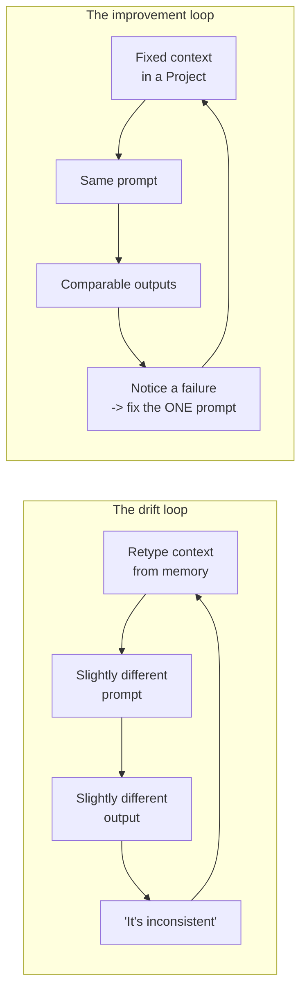

# Which Claude Surface for Which Task

Part B opens with the decision that most affects whether Claude is useful to you: not what you type, but *where* you type it. The same task can be trivial in one surface and painful in another.

> ⚠️ **Verify every product-specific statement in this file against current Claude documentation at delivery.** Surfaces get renamed, merged, promoted out of beta, and gain or lose limits. The decision *criteria* below are durable; the feature names are not.

---

## The surfaces, honestly described

| Surface | What it fundamentally is | Persists between sessions? | Best at | Falls down when |
|---|---|---|---|---|
| **Chat** | A conversation with a context window | No | Exploration, one-off questions, thinking out loud | You paste the same background for the fourth time |
| **Project** | A chat with a durable attached context and instructions | Yes — the context, not the conversation | Any recurring task with stable background material | The background changes constantly, or is enormous |
| **Artifact** | A generated document or app rendered beside the chat, editable and re-editable | Within the conversation; can be saved | Anything you will iterate on and then *use* — a document, a table, a script, a small tool | The output is a two-line answer |
| **Extended thinking** | A larger internal reasoning budget before the answer | Per-request setting | Multi-constraint reasoning, tracing consequences, hard analysis | Simple lookups — you pay latency for nothing |
| **API (SDK)** | Programmatic access, no UI | You build it | Repeatable, high volume, embedded in a pipeline, test suites | One-off human tasks — the UI is faster |
| **Connectors / MCP** | A standard way to give the model access to an external system | Depends on the server | When the model genuinely needs live data or must act in another system | The data would fit in a paste; or the security review has not happened |

## The decision table for this team's real tasks

This is the centrepiece of Part B. It is opinionated on purpose — a table that says "it depends" for every row teaches nothing.

| Task | Surface | Why this one | Watch out for |
|---|---|---|---|
| "What does this error message mean?" | **Chat** | One-off, no reusable context | Nothing — this is the easy case |
| Draft release notes for this sprint | **Project** (chat if truly one-off) | Product context, audience, tone conventions, and the banned-word list are stable; only the change list varies | Keep the Project's context current — a stale convention doc silently degrades every output |
| Release notes for 40 releases across 6 products, nightly | **API** | Volume and repetition; you want a test suite and a pass rate | This is software. It needs an owner, versioning, and monitoring |
| Summarise this incident timeline | **Chat or Project + extended thinking** | Long messy input, real reasoning over sequence and causality | Verify the ESTABLISHED lines against the source. Always |
| Review this config change | **Project + extended thinking** | Needs system context (Project) and multi-constraint reasoning (thinking) | The model does not know your deployed state unless you tell it |
| Turn this incident into a written post-mortem document | **Artifact** | You will revise it six times; you want the document, not a description of it | Fluency ≠ accuracy. Read every factual claim |
| Triage 2,000 log lines | **API** with a tool schema | Volume, and the output feeds a system | Cheap model + human review beats expensive model + blind trust |
| Build a small tool to visualise release cadence | **Artifact** | Self-contained, immediately runnable, iterate by conversation | Not production software. It is a prototype that persuades people |
| "Is this config value consistent with what we deployed last Thursday?" | **Connector**, or paste the record | The model has no access to your deployment records | If pasting is easy, paste. A connector is a security and maintenance commitment |
| Explore a design question you have not framed yet | **Chat** | Structure would be premature | Do not let it converge too fast. Ask it for the counter-argument |
| The prompt you will run 500 times | **API + test suite** (`03`) | Everything in Part A applies | — |

## The decision, as a flowchart

Caption: pick the surface. The two questions that decide almost everything are "how often?" and "is there stable context?"

---

## The three questions that do the work

Strip the flowchart down and it is three questions.

**1. How many times will you do this?**
Once → chat. A few times a week → Project. Hundreds of times → API. This is the same reasoning by which you would not write a script to rename one file, and would certainly write one to rename four thousand.

**2. Is there stable context you keep re-pasting?**
Re-pasting the same background is the single clearest signal you are in the wrong surface. It costs you time, costs tokens, and — worse — the version you paste drifts. Someone's copy of the release-note conventions is eight months old and nobody knows. Stable context belongs in one place: a Project, or a system prompt in code.

**3. Does the output get read by a human before it matters?**
This determines how much machinery you need. Human-in-the-loop output can tolerate a cheaper model and a looser format. Output that flows into a system needs a schema, a test suite, and monitoring — because there is no one to catch the failure.

---

## The mistake almost everyone makes

**Living in chat for tasks that are obviously recurring.**

The symptom is recognisable: a person who has done the same task twenty times, pasting the same three paragraphs of background each time, tweaking the wording slightly each time, getting slightly different output each time, and concluding that Claude is "inconsistent." It is not inconsistent. It is being given a different prompt every time, by someone who has not noticed they are writing a new prompt every time.

Moving that person's task into a Project with a fixed instruction block usually produces a bigger quality improvement than any prompting technique in Part A. Not because the surface is smarter, but because it makes the prompt *stable*, and a stable prompt can be improved, whereas a prompt that is retyped from memory can only drift.

Caption: the same person, the same model. The left loop cannot improve because there is nothing stable to improve. The right loop compounds.

## The opposite mistake

**Reaching for the API when the UI would do.**

Some developers, hearing "prompts should be versioned artifacts," conclude that everything belongs in code. It does not. If a task is done twice a month by one person who reads every output, building a Python harness for it is a hobby, not engineering. The cost of the API path is real: an API key to manage, code to maintain, a deployment story, and a thing that breaks when nobody is looking.

The honest heuristic: **go to the API when repetition or integration forces you there** — high volume, output feeding a system, or a test suite you actually intend to run. Not because it feels more rigorous.

## When *not* to use Claude at all

The most credible thing a session like this can do is mark its own boundary.

| Situation | Why not | What instead |
|---|---|---|
| The answer must be exactly right and is deterministic (version arithmetic, dependency resolution, diffing) | A model approximates; code computes | Write the script. Use the model to help you write it |
| The input contains data that must not leave your controlled environment | This is policy, not preference | Check your organisation's rules first. See `08` |
| You cannot verify the output and the output matters | Session 1's rule: an application is defensible when the user can verify the result, or when truth is irrelevant | Change the task so it is verifiable, or do not automate it |
| You need a citation to an authoritative internal document | The model will produce a plausible-looking reference | Retrieval against the real document, or look it up |
| The task is genuinely trivial | You will spend longer prompting than doing | Just do it |

---

**Next:** `05-scratchpad-projects-artifacts.md` — the three workhorse surfaces in detail, with the workflow diagram.
