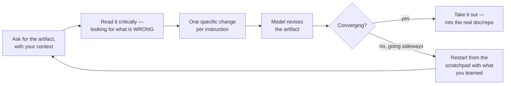
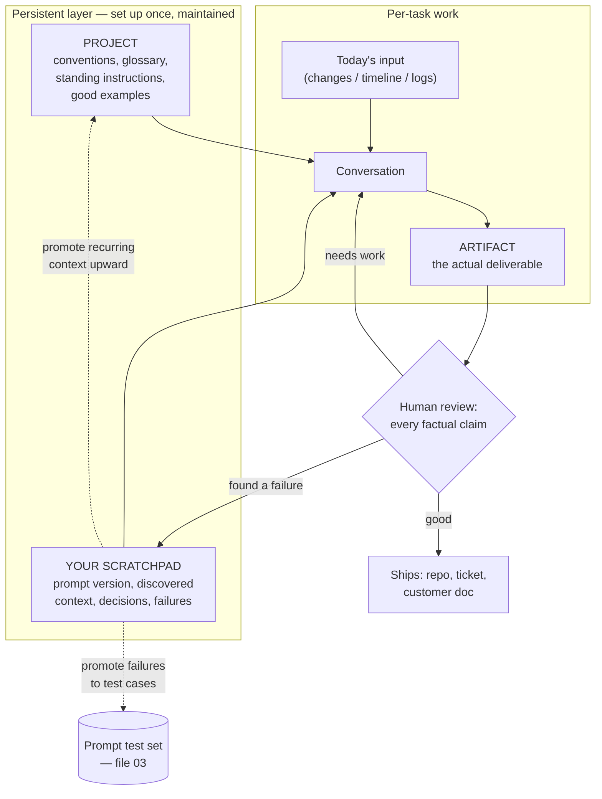

# The Scratchpad, Projects, and Artifacts

The three surfaces you will use most, and the workflow that connects them. This is the file that most directly answers "what do the people who get value out of this actually do differently?"

> ⚠️ **Verify all product-specific behaviour, limits, and feature names against current Claude documentation at delivery.** The workflow principles below outlive the features; the features do not outlive the quarter.

---

## 1. The scratchpad — the habit, and the mechanism

"Scratchpad" means two related things. Both are worth having, and people conflate them.

### 1a. The model's scratchpad

Given room to work before answering, a model produces better answers on tasks with intermediate steps. This is the mechanism behind chain-of-thought from Session 10, and it is now largely built into reasoning models rather than something you invoke with a magic phrase (`06` covers that shift).

Where you still steer it explicitly is by **asking for the intermediate artifact you want to inspect**:

```
Before you give the verdict, first list every configuration value in
<change> alongside the constraint it interacts with, in a table. Then
give the verdict.
```

You are not asking it to "think step by step." You are asking for a **specific intermediate output that you can check** — which is the durable version of the technique. If the table is wrong, you know the verdict is worthless and you know why. If you only see the verdict, you can only agree or disagree with it.

That distinction generalises:

| Weak form | Strong form | Why the strong form wins |
|---|---|---|
| "Think step by step" | "First produce X, then use X to answer" | X is inspectable |
| "Be thorough" | "List all N items before selecting" | You can count them |
| "Double-check your work" | "State the three assumptions your answer depends on" | Assumptions are checkable; "checking" is not |
| "Explain your reasoning" | "Cite the line from `<input>` that supports each claim" | Citations can be grepped |

### 1b. Your scratchpad

The second sense: **a working document you keep alongside the conversation**, holding the context you have accumulated, the prompt that finally worked, the constraints you discovered, and the decisions you made.

This sounds trivially obvious and almost nobody does it. The observable difference between someone extracting value from an assistant and someone not is often that the first person has a file open. Its contents look like:

```
## Release notes — Helios 2.7
Prompt version: v3 (repo: tooling/prompts/release_notes_v3.txt)
Context I had to supply beyond the Project doc:
  - HEL-5012 is customer-visible despite the "chore:" prefix (mislabelled)
  - the 3.0 deprecation window is 2 releases, not 1 (checked with S.)
Model got wrong first pass:
  - classified HEL-5019 as INTERNAL; it changes a public default
    -> ADDED AS TEST CASE 021
Decisions:
  - not mentioning the buffer refactor at all (agreed with product)
```

Three things that file buys you:

1. **Restart cost drops to near zero.** Context windows fill, sessions end, you come back on Monday. The scratchpad is what you re-establish from, in thirty seconds.
2. **Failures become test cases.** The line marked `-> ADDED AS TEST CASE 021` is the bridge between Part B habits and Part A discipline. Without a scratchpad, that failure is noticed, mentally noted, and lost.
3. **Someone else can take the task over.** The tacit knowledge is written down.

---

## 2. Projects — persistent context

A Project attaches durable material and standing instructions to every conversation inside it. That is the whole idea, and its value is entirely proportional to the discipline of what you put in it.

### What belongs in a Project, and what does not

| Put it in the Project | Keep it out |
|---|---|
| Conventions, templates, style rules, banned words | The specific change list for today's release |
| Component glossary, product architecture summary | Anything you are not permitted to store there — check policy first |
| The standing instruction block (role, audience, output contract) | Enormous archives on the theory that more is better |
| Definitions of your terms (what "P2" means *here*) | Material you cannot commit to keeping current |
| Worked examples of good output | Duplicates and superseded versions of the same document |

### The failure mode nobody warns you about: context rot

A Project's attached documents are a dependency, and like every dependency they go stale. The failure is silent and nasty: the release-note conventions document still says the deprecation window is one release; it changed to two in March; every note generated since has been subtly wrong, confidently, in a house style that makes it look authoritative.

Treat Project context as versioned material with an owner:

| Practice | Why |
|---|---|
| Every attached doc has a "last verified" date **inside the document** | The model reads it and you can ask "what is the oldest doc here?" |
| One named owner per Project | Shared ownership means no ownership |
| Review on a fixed cadence (quarterly is usually enough) | Drift is gradual and invisible without a trigger |
| Fewer, better documents | Ten curated pages beat two hundred uncurated ones — and contradictions between attached docs produce inconsistent output that is very hard to diagnose |
| When the output degrades, suspect the context first | It is the most common cause and the least suspected |

**The contradiction trap deserves emphasis.** If two attached documents disagree — an old template says 30 words, a new one says 25 — the model will not raise an error. It will pick one, differently on different days, and you will experience this as randomness. Before blaming the model for inconsistency, search your Project context for the contradiction. It is usually there.

---

## 3. Artifacts — make it produce the thing, not a description of the thing

An Artifact is a generated document, table, diagram, or small application rendered beside the conversation, which you then revise by talking about it.

The shift in habit is small and consequential: **stop asking for advice about the deliverable and start asking for the deliverable.**

| Instead of | Ask for |
|---|---|
| "How should I structure the post-mortem?" | "Write the post-mortem as a document. Here is the timeline." |
| "What columns should this comparison have?" | "Build the comparison table for these six options." |
| "How would I chart release cadence?" | "Build a small page that charts this cadence data." |

The reason this matters is not speed. It is that **a concrete artifact generates specific criticism.** Shown an abstract structure, you nod. Shown the actual post-mortem with your incident in it, you immediately notice that the impact section understates the customer effect and that section 4 is repeating section 2. You could not have produced that feedback from the abstract version. This is the same reason design reviews use mockups instead of descriptions.

### The iteration rhythm that works



Caption: the artifact loop. Step B is the one people skip — they read for confirmation rather than for faults, and then wonder why the output is mediocre.

Two rules make the loop behave:

**"One specific change per instruction."** "Make it better" produces a rewrite that fixes one thing and breaks two. "Cut section 3 to two sentences and move the customer-impact line into the summary" produces exactly that. Same discipline as `02`: one change per pass.

**Know when to restart.** After about five or six rounds an artifact often stops converging — the model is patching around accumulated constraints it can no longer all satisfy, and each fix reintroduces an earlier problem. When you notice you are going in circles, do not push. Start fresh with a prompt containing everything you learned. It is faster, and it produces a cleaner result, and the scratchpad is what makes the restart cheap.

### The honest caveat

An artifact that looks finished is not finished. A generated post-mortem is formatted like a real one, uses the vocabulary of a real one, and has the confident register of a real one — and may contain a root-cause claim the timeline never supported. **The polish is generated by the same mechanism as the content, and carries no information about the content's accuracy.** This is Session 1's point in its most dangerous everyday form, because a well-formatted document actively suppresses scrutiny.

For anything that will be read by people who were not in the loop, do the boring thing: check every factual claim against its source before it leaves your hands.

---

## The workflow, assembled



Caption: the whole Part B workflow. The two dotted arrows out of the scratchpad are where the compounding happens — recurring context graduates into the Project, and observed failures graduate into the test suite. A workflow without those arrows does not improve over time; it just runs.

---

## What this looks like for each role

| Role | Project holds | Typical artifact | The habit that pays most |
|---|---|---|---|
| **Release manager** | Note conventions, audience profiles, banned words, template, worked examples | The release note itself | Project + a versioned prompt; the same task weekly is the ideal case |
| **Problem manager** | Incident report template, severity definitions, service glossary | The post-mortem document | The ESTABLISHED / INFERRED / UNKNOWN split from `01`, every time |
| **Configuration manager** | System architecture summary, safety criteria, constraint list | The review table | Extended thinking + the per-criterion verdict table; never accept an aggregate verdict alone |
| **Developer** | Codebase conventions, tool schemas, prompt repo | Scripts, test suites, prototypes | Move to the API as soon as it repeats; build the test set early |

---

**Next:** `06-extended-thinking.md` — buying reasoning deliberately, and why "think step by step" is no longer the technique it was.
