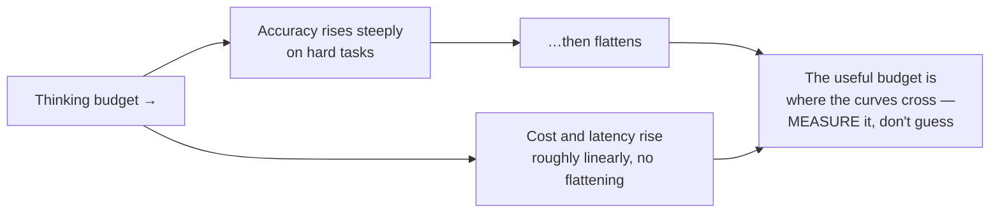

# Extended Thinking — Buying Reasoning Deliberately

Reasoning used to be something you coaxed out with a phrase. It is now something you buy with a parameter. That change is small in the API and large in how you should think about prompting.

> ⚠️ **Verify parameter names, budget units, defaults, and availability against current Claude documentation at delivery.** This area has changed repeatedly and will change again. The economics and the judgement calls below are the durable part.

---

## What changed, and why the old advice expired

In 2023, "let's think step by step" was a genuine technique. Appending it measurably improved accuracy on multi-step problems, because it induced the model to generate intermediate tokens instead of jumping to an answer, and those intermediate tokens carried the computation.

The mechanism has not changed. **What changed is that the model now does this by default, with a budget you control.** So a course that teaches CoT-as-magic-string in 2026 is teaching a workaround for a problem that has been productised.

| Era | How you got reasoning | What it cost | What you controlled |
|---|---|---|---|
| ~2023 | A prompt string ("think step by step") | Whatever tokens it happened to generate | Almost nothing |
| ~2026 | A thinking budget on the request | Tokens you explicitly authorise, plus latency | How much, per call |

The practical consequences:

1. **Stop paying prompt real estate for "think step by step."** On a reasoning model it is redundant at best. Spend those lines on context and constraints instead.
2. **Reasoning is now a cost/latency dial, and it belongs in the same conversation as model choice.** It is not free and it is not always better.
3. **What you still steer with prompting is the *shape* of the reasoning, not its existence** — "before answering, list every constraint that applies" is still useful, because it produces an inspectable intermediate artifact. See `05` §1a.

---

## What it costs

Extended thinking spends tokens before the answer starts, and you wait for them. Order of magnitude, for a typical config-review request:

| Setting | Thinking tokens | Wall-clock | Relative cost | Fits |
|---|---|---|---|---|
| Off | 0 | ~2 s | 1× | Classification, extraction, reformatting, lookup |
| Modest budget | ~1–2k | ~8 s | ~2–3× | Most real analysis; the default for judgement tasks |
| Large budget | ~8–16k | ~40 s | ~8–15× | Genuinely hard multi-constraint problems |

⚠️ Illustrative magnitudes, not quoted figures — **recompute against current pricing and measure your own latency at delivery.**

The shape of the curve is the point: **cost and latency rise steeply, accuracy rises and then flattens.** Past some budget, on most business tasks, you are paying for thinking that does not change the answer. There is no substitute for finding that point on your own task — which, again, is what the test set in `03` is for. Run your suite at three budgets and look at where the pass rate stops moving.



Caption: the trade-off. The flattening point is task-specific; the only way to find it is to run the suite at several budgets.

---

## When it earns its keep

| Use it | Skip it |
|---|---|
| Several constraints must be satisfied at once and they interact | Single-step extraction or classification |
| Consequences must be traced through a chain (this config → that behaviour → this failure mode) | Reformatting or summarising something short |
| The answer requires holding a long document together and noticing an inconsistency between distant parts | The answer is in the input verbatim |
| The cost of being wrong is high and a human will act on the answer | The next step catches errors immediately |
| You are asking "what did we miss?" rather than "what does this say?" | High-volume batch work where latency compounds |
| Genuine ambiguity requiring the model to weigh alternatives | You mainly want a different format |

**The config review from `02` is the archetype.** Four criteria, four config values, and the interactions matter — batch size interacts with memory, upload interval interacts with request rate, backoff interacts with data loss under exactly the conditions the other changes make more likely. That is a reasoning task, and a modest budget visibly improves it.

**Log triage from `01` is the archetype of the opposite.** Cluster by symptom, count, assign a severity from a four-value enum. There is no chain of consequences. Running that with a large thinking budget over 2,000 lines buys you a slower, more expensive version of the same clusters.

---

## In code

```python
# Extended thinking on a configuration-review request.
# pip install anthropic
#
# ⚠️ The exact parameter name, budget units, and constraints on this
# feature have changed more than once. VERIFY AGAINST CURRENT CLAUDE
# DOCUMENTATION AT DELIVERY. The judgement — when to spend, how much —
# is what this example is really teaching.
import os
import anthropic

MODEL = "claude-sonnet-4-5"   # verify at delivery
client = anthropic.Anthropic(api_key=os.environ["ANTHROPIC_API_KEY"])

SYSTEM = """You review configuration changes to Helios Platform, an
embedded telemetry stack on OEM devices with 256 MB RAM that are not
remotely recoverable, uploading over the public internet.

"Safe to deploy" requires ALL of:
 (a) no credential, transport-security, or data-exposure regression
 (b) no plausible path to device memory exhaustion or crash-loop
 (c) no increase in data loss under network failure
 (d) no more than a 2x increase in ingest request rate

Output a markdown table: Criterion | Verdict | Evidence | What would
change the verdict. Verdict is exactly PASS, FAIL, or INSUFFICIENT
INFORMATION. Then one line: OVERALL: BLOCK / HOLD / PROCEED, per the
rule that any FAIL blocks and any INSUFFICIENT INFORMATION holds."""

CHANGE = """max_batch_size: 512 -> 4096
upload_interval_ms: 5000 -> 1000
tls_verify: true -> false
retry_backoff: exponential -> fixed"""

response = client.messages.create(
    model=MODEL,
    max_tokens=4000,
    system=SYSTEM,
    # Extended thinking: authorise an explicit reasoning budget.
    thinking={"type": "enabled", "budget_tokens": 4000},
    messages=[{"role": "user",
               "content": f"Review this change.\n\n<change>\n{CHANGE}\n</change>"}],
)

# The response carries thinking blocks before the text block.
for block in response.content:
    if block.type == "thinking":
        print(f"[thinking: {len(block.thinking)} chars — summarised reasoning]")
    elif block.type == "text":
        print(block.text)

print(f"\ninput={response.usage.input_tokens} "
      f"output={response.usage.output_tokens}")

# Expected output (abridged):
# [thinking: 3184 chars — summarised reasoning]
# | Criterion | Verdict | Evidence | What would change the verdict |
# |---|---|---|---|
# | (a) security | FAIL | tls_verify disabled on public-internet uploads... |
# | (b) memory | INSUFFICIENT INFORMATION | 8x buffered records on 256 MB... |
# | (c) data loss | FAIL | fixed backoff exhausts retry budget during... |
# | (d) request rate | FAIL | 5x interval reduction exceeds the 2x limit... |
#
# OVERALL: BLOCK
#
# input=412 output=1120
```

### Two notes on the thinking blocks

**They are a debugging aid, not a proof.** Reading the reasoning is genuinely useful when you want to know *why* the model reached a verdict, and it will sometimes reveal that it reached the right answer for a wrong reason — which is exactly the case you want to catch. But do not treat it as a faithful transcript of the computation. It is generated text about the process, and what you are shown may be a summary. Use it as evidence, weigh it like evidence, do not mistake it for a log.

**Budget the output too.** A large thinking budget with a small `max_tokens` produces a truncated answer after expensive reasoning — the worst of both. Leave room for both.

---

## The comparison that settles the argument

Do not decide this by intuition. Run your suite at three budgets:

```python
# Which thinking budget does this task actually need?
BUDGETS = [None, 2000, 8000]
# for each budget: run the 20-case suite, record pass rate, cost, latency

# Expected output:
# budget      pass    p50 latency   ~cost/run
# none        13/20      2.1 s       $0.011
# 2000        19/20      9.4 s       $0.026
# 8000        19/20     31.2 s       $0.058
```

Read it: thinking is clearly worth buying on this task — six cases move — and the large budget buys nothing but 22 extra seconds and a doubled bill. **Use 2000.** That decision took twenty minutes and it is now a documented, defensible engineering choice rather than a preference.

This is the third time this pattern has appeared — prompt version, model choice, thinking budget, all settled the same way. That repetition is deliberate. **The test set is the instrument that answers every "which one should we use?" question in this session.** It is the connective tissue between Part A and Part B.

---

## Common misconceptions, corrected

| Belief | Correction |
|---|---|
| "Extended thinking makes it more accurate" | It makes it *better at multi-step reasoning*. It does not add knowledge it lacks, does not fix missing context, and does not prevent hallucination |
| "More budget is safer" | More budget costs more and past the flattening point changes nothing. Measure |
| "The thinking output shows what it really did" | It is generated text about the process, possibly summarised. Useful evidence, not a log |
| "I should still say 'think step by step'" | Redundant on a reasoning model. Ask for a specific inspectable intermediate instead |
| "If it's wrong, add more thinking" | Diagnose first (`02`). Missing context and ambiguous instructions are not fixed by reasoning harder about the wrong thing |

That last row is the one worth repeating aloud. **Reasoning budget is the fix for category 4 in the diagnosis table, and only category 4.** Applying it to a category 1 problem produces a beautifully reasoned answer built on the information you failed to supply.

---

**Next:** `07-mcp-and-connectors.md` — what a connector actually is, at the protocol level, and when it is worth the commitment.
