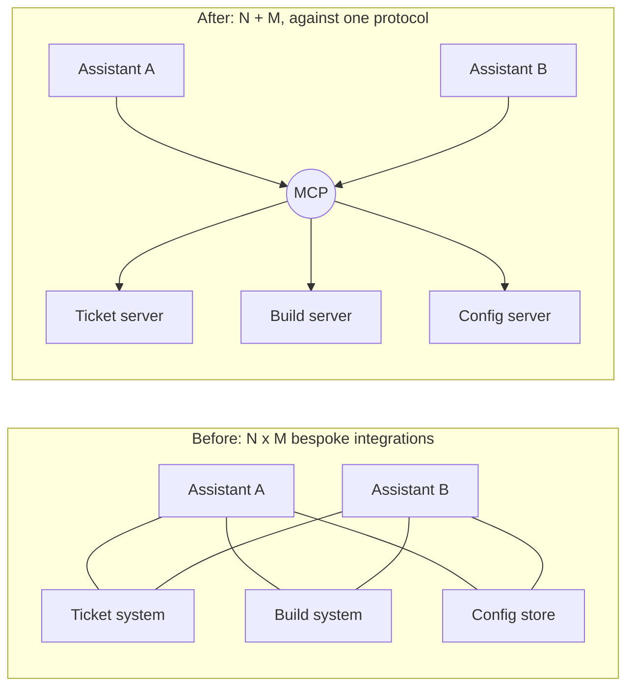
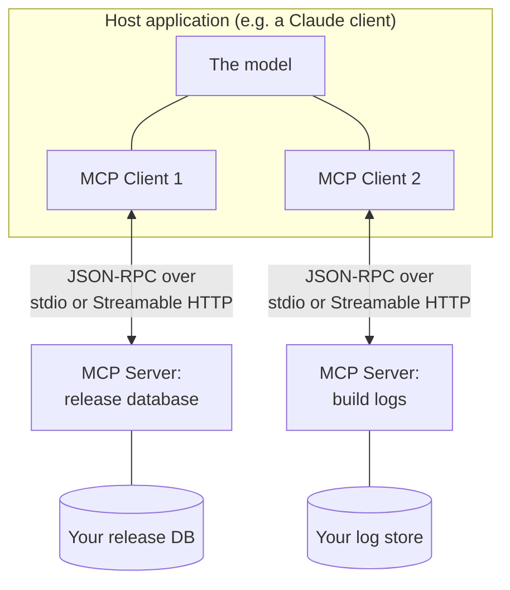
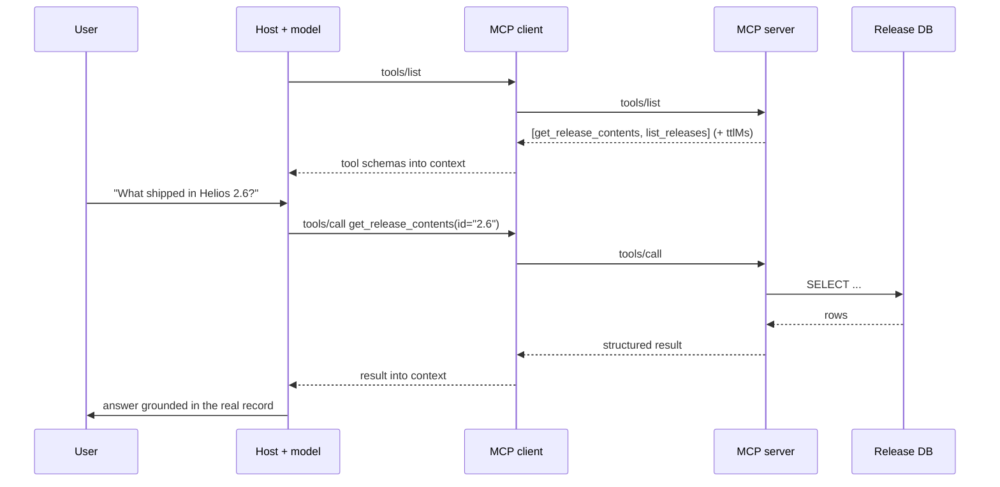
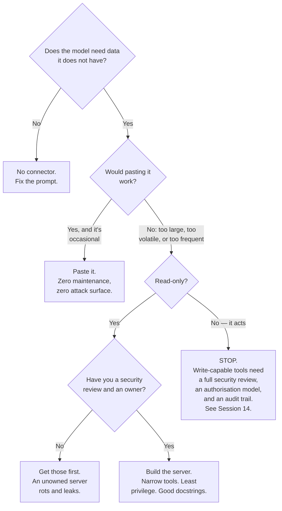

# MCP and Connectors — What They Are, and When They Pay

A connector lets the model reach a system you own. MCP is the open standard that defines how. This file teaches the durable protocol core, then spends most of its length on the decision that actually matters: whether you need one at all.

> ⚠️ **Scheduling constraint. The MCP final specification publishes 2026-07-28.** Deliver this segment after that date. Delivering earlier means teaching against a release candidate and telling an engineering audience that the details change in a fortnight — which correctly costs you their attention. If the session must run earlier, teach only the stateless conceptual core below and explicitly defer the specifics.
>
> ⚠️ Verify version numbers, transport status, and available connectors against the current specification and Claude documentation at delivery.

---

## Licence note, because this one is different

Unlike everything else in Part B, **MCP is an open standard, not a product** — donated by Anthropic to the Agentic AI Foundation under the Linux Foundation in December 2025, with OpenAI and Block as co-founding members and AWS, Google, Microsoft, Cloudflare, GitHub, and Bloomberg among supporting members. The specification and its official SDKs are **SLIDE-SAFE**: you may build slides from the protocol, diagram its architecture, and quote its structure with attribution.

That governance fact is also the answer to the room's obvious question. When a protocol's two largest commercial competitors co-found its foundation, "is this a real standard or one vendor's marketing?" is settled. Teach it as a standard.

---

## The problem MCP solves

Before it, every combination of assistant and system needed its own bespoke integration. N assistants times M systems is N×M pieces of glue, each separately built, separately maintained, separately broken.



Caption: the standard argument for any protocol. Write one MCP server for your config store and every MCP-speaking client can use it.

---

## The architecture, in the terms the spec uses



Caption: host, clients, servers. One client per server connection. The server is a thin, well-described adapter in front of a system you already own.

| Term | What it is | Concretely, for this team |
|---|---|---|
| **Host** | The application the user interacts with | A Claude client, an IDE, an internal tool you built |
| **Client** | The connection manager inside the host; one per server | Usually invisible to you |
| **Server** | A program exposing capabilities over the protocol | A ~200-line adapter in front of your release database |
| **Transport** | How bytes move | **stdio** (local process) or **Streamable HTTP** (remote). The older HTTP+SSE transport is **deprecated** — a real gotcha if you follow an old tutorial |
| **Tools** | Things the model can *call*, with a schema | `get_release_contents(release_id)` |
| **Resources** | Things the model can *read*, addressed by URI | `config://helios/prod/current` |
| **Prompts** | Reusable templates the server offers | "Review a config change" with your criteria pre-filled |

### The tools / resources distinction is worth getting right

**Resources are for reading; tools are for doing.** A resource is content the client can fetch and place in context — closer to a file than a function call. A tool is an action the model invokes, with arguments and consequences.

The practical rule: **if it changes something or has a side effect, it is a tool, and it needs an authorisation story.** A server exposing your deployment records as resources is a read-only risk. A server exposing `apply_config(env, values)` as a tool is a system that can change production because a language model decided to. Those are not the same review.

### The stateless core — the durable idea

**MCP is now stateless at the protocol layer.** Teach this as the centre, because it is the part that will still be true after several revisions.

Stateless means the server does not have to remember a session between requests. Each call carries what it needs. Practical consequences worth stating in the room:

| Consequence | Why it matters |
|---|---|
| Servers scale horizontally like ordinary web services | Any request can go to any instance; no sticky sessions |
| Servers are testable like ordinary functions | Call it with inputs, assert on outputs — no session fixture |
| Restarting a server does not destroy conversation state | Operationally boring, which is the goal |
| Caching becomes tractable | List/read results carry freshness metadata (`ttlMs`) and a scope indicating whether a result is safe to share across users (`cacheScope`) — verify names against the final spec |

That `cacheScope` idea deserves a beat: it is the protocol acknowledging that "is this response safe to reuse for a different user?" is a security question, not a performance question. Getting it wrong leaks one user's data into another's context.

---

## What a call actually looks like



Caption: discovery then invocation. Note that the model never touches the database — it emits a call against a schema, and your server decides what that means and whether it is allowed.

**That last sentence is the security-relevant one.** The server is your enforcement point. Whatever the model asks for, the server decides what it is permitted to do. Design servers on that assumption: narrow tools, validated arguments, least privilege, and no tool whose blast radius you would not accept from an automated caller.

---

## A minimal server, to make it concrete

```python
# A minimal MCP server exposing read-only release data.
# pip install mcp
#
# MCP is an open standard (Agentic AI Foundation / Linux Foundation).
# ⚠️ Verify SDK API and spec version against the final specification
# published 2026-07-28.
from mcp.server.fastmcp import FastMCP

mcp = FastMCP("helios-releases")


@mcp.tool()
def get_release_contents(release_id: str) -> dict:
    """Return the ticket IDs and titles included in a Helios release.

    Args:
        release_id: Release version, e.g. "2.6".

    The docstring is not decoration — the model reads it to decide
    when and how to call this tool. A vague description produces
    wrong calls. Write it as you would write API docs for a
    competent stranger.
    """
    rows = query_release_db(release_id)          # your existing code
    return {
        "release_id": release_id,
        "shipped_on": rows.shipped_on,
        "changes": [{"id": r.ticket, "title": r.title} for r in rows.changes],
    }


@mcp.resource("config://helios/{env}/current")
def current_config(env: str) -> str:
    """Read-only: the current deployed configuration for an environment."""
    if env not in ("dev", "staging"):
        # Least privilege at the server. The model cannot widen this.
        raise ValueError(f"Environment '{env}' is not exposed via this server.")
    return render_config(env)


if __name__ == "__main__":
    mcp.run(transport="stdio")   # local. Use Streamable HTTP for remote.

# Expected behaviour once connected:
#   Client issues tools/list -> [get_release_contents]
#   Client issues resources/list -> [config://helios/{env}/current]
#   User: "What shipped in 2.6?"
#   -> model calls get_release_contents(release_id="2.6")
#   -> answer is grounded in the actual record, not a guess
#
#   User: "Show me the prod config"
#   -> resource read raises; env not exposed. The refusal is
#      enforced in YOUR code, not in the model's judgement.
```

Two things to point out from that snippet:

**The docstring is part of the interface.** The model chooses tools based on their descriptions. A tool described as "gets release stuff" will be called at the wrong times with the wrong arguments. Tool description quality is prompt engineering wearing a different hat — and it is testable the same way, with the suite from `03`.

**The `prod` exclusion is in the server.** Not in the system prompt, not in a policy document, not in the model's discretion. Anything you rely on must be enforced where it cannot be argued with.

---

## The decision: do you actually need one?

Most people who think they need a connector need a paste.



Caption: the connector decision. The two most common right answers are the two leftmost boxes.

| Signal | Verdict |
|---|---|
| "I paste the same 200-line config export every day" | Connector is probably worth it |
| "I need last Thursday's deployment record, once" | Paste it |
| "The data changes hourly and the answer depends on it being current" | Connector |
| "It's 40 people doing the same lookup" | Connector — the per-person paste cost aggregates |
| "I want it to open tickets automatically" | Stop. Session 14. Read-only first, write later or never |
| "It would be cool" | No |

### The costs, stated plainly

A connector is not a feature you enable, it is a service you now operate:

- **A security review**, because you have created a path from a language model to an internal system.
- **An owner and an on-call story.** It breaks; someone fixes it.
- **An authorisation model.** Which users, through which servers, may reach what? "The model has access" is not an answer.
- **An audit trail.** When someone asks what the model read last quarter, you need to be able to say.
- **An expanded attack surface.** If untrusted content — a customer ticket, a log line, an external document — can reach the model's context while the model also holds a tool that can act, you have built the configuration that prompt injection exploits. **This is the single most important sentence in this file, and Session 14 is where it gets the treatment it deserves.**

None of that argues against connectors. It argues for building them deliberately, read-only first, narrow, and owned — rather than because the integration was one click.

---

## What to remember when the details change

Everything specific here will drift. These will not:

1. **MCP is a standard, foundation-governed, multi-vendor.** Not a proprietary hook.
2. **Host → client → server, over stdio or Streamable HTTP.** HTTP+SSE is deprecated.
3. **Stateless at the protocol layer**, which is why servers are ordinary, scalable, testable services.
4. **Tools act; resources are read.** Anything that acts needs an authorisation story.
5. **The server is the enforcement point.** Never the model's judgement.
6. **Tool descriptions are prompts.** Write and test them accordingly.
7. **Most connector ideas should be a paste.** Build one when repetition, volume, or volatility forces it.

---

**Next:** `08-workflow-habits.md` — the habits that separate people who get value from Claude from people who do not.
