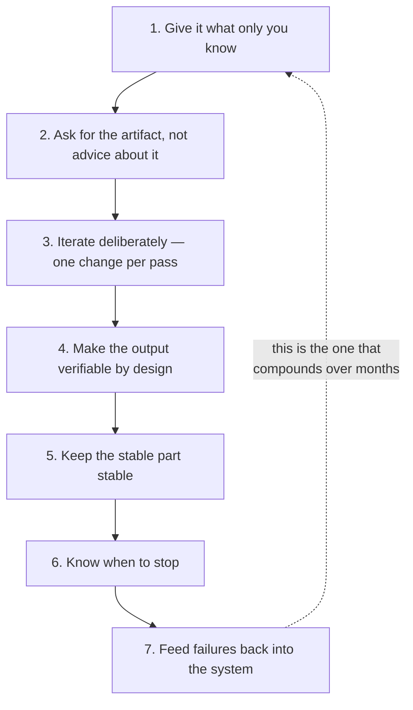
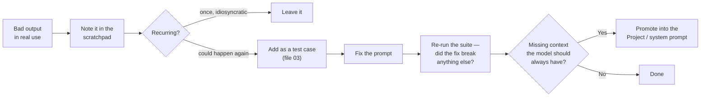

# The Workflow Habits That Actually Separate People

Two people, same model, same access, same tasks. One says it saved them a day a week; the other says it is an overconfident autocomplete. Usually neither is lying. The difference is a handful of habits, all of them learnable in an afternoon.

---

## The seven habits

Ranked by how much difference they make in practice, based on what distinguishes the two groups above.



Caption: the habits, in rough order of impact. The feedback arrow from 7 to 1 is what turns a set of tricks into a practice that improves.

---

### Habit 1 — Give it what only you know

The most common cause of a disappointing answer is that the question was answerable only by someone with information the model did not have.

The diagnostic is simple and worth internalising: **before complaining about an answer, ask whether a competent contractor who read only your prompt could have done better.** If not, the prompt was the problem.

| What people type | What was missing |
|---|---|
| "Is this config change safe?" | What "safe" means here; what the system is; where it runs; what it carries |
| "Summarise this incident" | Who reads it; what they will do with it; what counts as established |
| "Write release notes" | Who the audience is; what they care about; house conventions |
| "Why is this failing?" | What changed recently; what the expected behaviour is; what you already ruled out |

The four things worth supplying almost every time: **the audience**, **the constraint that makes this hard**, **what you have already ruled out**, and **what a good answer would let you do next**. The last one is underused and disproportionately effective, because it tells the model what the answer is *for*.

### Habit 2 — Ask for the artifact, not advice about it

Covered in `05`; restated because it is the habit people most often fail to adopt even after being told.

"How should I structure the post-mortem?" gets you a structure you will nod at. "Write the post-mortem, here is the timeline" gets you a document whose faults you can immediately see. **Concrete output generates specific criticism; abstract advice generates agreement.** Agreement teaches you nothing.

### Habit 3 — Iterate deliberately

Same discipline as `02`. One change per pass, same input, diagnose before treating.

The anti-pattern is the frustrated escalation: the answer is wrong, so you rewrite the whole prompt, change the model, add three constraints, and try again. It might work. You will have no idea why, and no ability to reproduce it.

Two specific tactics worth naming:

**Ask it to critique its own output against your criteria, as a separate step.** Not "check your work" — that is the weak form. Instead: *"Here are the four criteria. Go through the draft and identify every place it fails one, quoting the text. Do not rewrite it yet."* Separating criticism from revision produces better criticism, for the same reason you do not let an author be their own reviewer in one pass.

**Ask for the counter-argument.** When it agrees with you, that agreement carries very little information — the mechanism is disposed toward agreement. *"Make the strongest case that this change is unsafe"* is worth more than *"do you think this change is safe?"*, because it puts the model to work on the side you are not naturally checking.

### Habit 4 — Make the output verifiable by design

This is Session 1's rule turned into a daily practice: an application is defensible when the user can easily verify the output, or when truth does not matter. So **build verifiability into the request**, rather than hoping to spot errors afterwards.

| Instead of | Ask for | What you gained |
|---|---|---|
| A summary | A summary plus the source line supporting each claim | You can grep |
| A verdict | A per-criterion table with evidence | You can check the reasoning, not just the conclusion |
| A confident answer | The answer plus "what would change this verdict" | You know its dependencies |
| A narrative | Established / inferred / unknown, labelled | You know where to aim your scrutiny |
| A list | A list plus the ones it deliberately excluded and why | Silent omissions become visible |

The last row is the sleeper. **Silent omission is the failure mode you cannot detect by reading the output**, because what is missing leaves no trace. Requiring an "excluded, and why" section converts an invisible failure into a visible one. This is why the release-notes prompt in `01` has an "Omitted" heading.

### Habit 5 — Keep the stable part stable

Stable context in a Project or a system prompt; only the variable part typed. Covered in `04` and `05`. The consequence worth repeating: **a prompt you retype from memory cannot be improved, only drifted.**

There is a cheap version of this habit for people not using Projects: keep the prompt in a text file and paste it. That alone eliminates most of the drift.

### Habit 6 — Know when to stop

Three stop conditions, all of which people blow past:

| Signal | What it means | What to do |
|---|---|---|
| Five or six rounds and it is circling — each fix reintroduces an earlier problem | The accumulated constraints are over-determined, or the context is polluted | Restart fresh with everything you learned. The scratchpad makes this cheap |
| You are arguing with it about a fact | It does not have the information, and repetition will not create it | Supply the fact, or accept this is not a prompting problem |
| You have spent longer prompting than the task would have taken | It is not a task for this tool today | Do it. Note it in the scratchpad; maybe it becomes one later |

The last one is a real cost that enthusiasm hides. It is entirely possible to spend forty minutes getting a beautiful automated answer to a fifteen-minute task, and to feel productive throughout. That is fine *if* you are building something reusable — a prompt with a test set that will run 200 times. It is not fine as a one-off.

### Habit 7 — Feed failures back

The habit that compounds, and the one almost nobody has.

When the model gets something wrong, most people fix it in the moment and move on. The information is real — an observed failure on a real input — and it evaporates. Instead:



Caption: the failure-to-improvement pipeline. Six weeks of this and your prompt genuinely is better, and you can prove it. Six weeks without it and you have the same prompt and a lot of anecdotes.

---

## The seven anti-habits

Stated as their own list because people recognise themselves faster in the failure than in the prescription.

| Anti-habit | What it looks like | Cost |
|---|---|---|
| **Treating fluency as accuracy** | Accepting a well-formatted answer without checking any claim | The expensive one. Polish and correctness are produced by the same mechanism and are uncorrelated |
| **Prompt-golfing a context problem** | Rewording for twenty minutes when a missing fact was the issue | Time, and a prompt covered in scar tissue |
| **Chat-forever** | Re-pasting the same background for the fiftieth time | Drift, plus an hour a week |
| **Blind copy-paste in both directions** | Pasting things you should not paste; pasting output into production unread | The serious one. See below |
| **Escalating instead of diagnosing** | Bigger model, more thinking, more words — all at once | Cost, and no understanding of what fixed it |
| **Anthropomorphising** | "It's being lazy today", "it doesn't want to" | It leads to negotiating with the model instead of fixing the prompt |
| **Never revisiting** | The prompt written in March, unchanged, on a model that changed twice since | Silent degradation you find out about from a customer |

---

## What must never go in

This section is not optional, and it is the one thing in Part B a presenter must not improvise.

**Follow your organisation's current data-handling policy. It governs, not this file.** What follows is the general shape of the reasoning, not permission.

| Category | Default posture |
|---|---|
| Customer-identifying data, personal data | Do not paste. Anonymise or do not use the tool |
| Unreleased product information, roadmaps, embargoed dates | Governed by policy — check before, not after |
| Credentials, keys, tokens, certificates | Never. Not even redacted-looking ones. Not in a log paste |
| Third-party confidential material under NDA | Not yours to share, regardless of tooling |
| Security vulnerability details pre-disclosure | Handle by the disclosure process, not in a chat |
| Anything you would not put in an email to an external party | Use that as your gut-check test |

Two practical notes. First, **the risk usually arrives inside a paste, not inside a question** — a log dump with a token in line 400, a config export with an endpoint credential, a timeline with a customer name. Skim what you paste. Second, **sanitising is a habit worth building rather than a decision worth making each time**: strip identifiers by default, so that being careful is not contingent on being alert.

Every example in this session is invented, for exactly this reason. Demos should be too.

---

## The one-page version

Pin this. It is the session, compressed.

```
BEFORE YOU ASK
  □ Have I given it what only I know?
    (audience · the hard constraint · what I ruled out · what the answer is for)
  □ Is this the right surface? (chat / Project / Artifact / API)
  □ Does this need reasoning budget, or just context?

WHEN YOU ASK
  □ Role, context, task, constraints, output contract
  □ Input delimited in tags
  □ "Do not invent X" for the specific X it will invent
  □ An escape hatch: what to do when it cannot tell
  □ Ask for the artifact, not advice about the artifact

WHEN YOU READ THE ANSWER
  □ Read for what is WRONG, not for confirmation
  □ Check every factual claim against its source
  □ Fluent ≠ correct. Formatted ≠ verified
  □ What did it silently leave out?

WHEN IT IS WRONG
  □ Diagnose: missing context / ambiguous task / unconstrained output
    / capability / wrong approach entirely
  □ Change ONE thing. Same input. Re-run
  □ Circling after 5 rounds? Restart from the scratchpad

AFTERWARDS
  □ Note it in the scratchpad
  □ Recurring failure → test case
  □ Recurring context → Project or system prompt
  □ Model version changed → re-run the suite before trusting anything
```

---

**Next:** `99-key-takeaways.md`.
