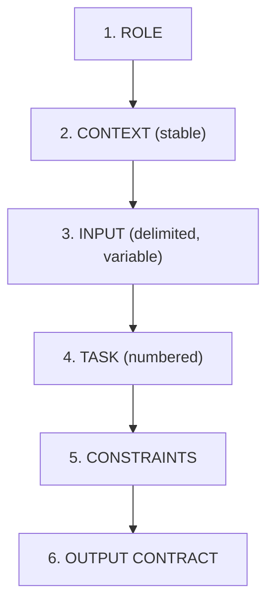
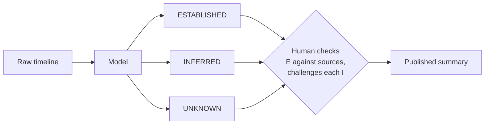
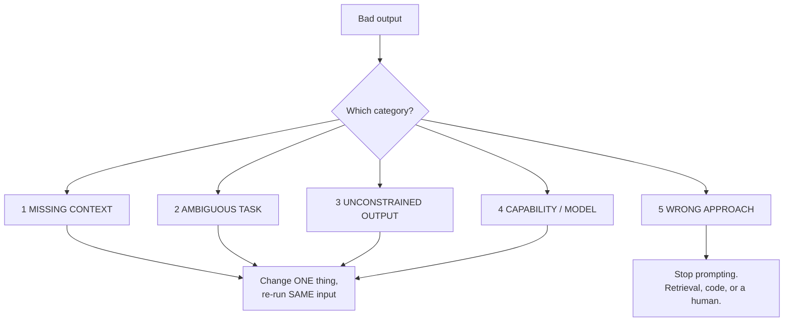
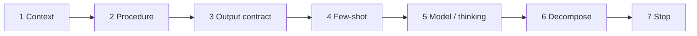
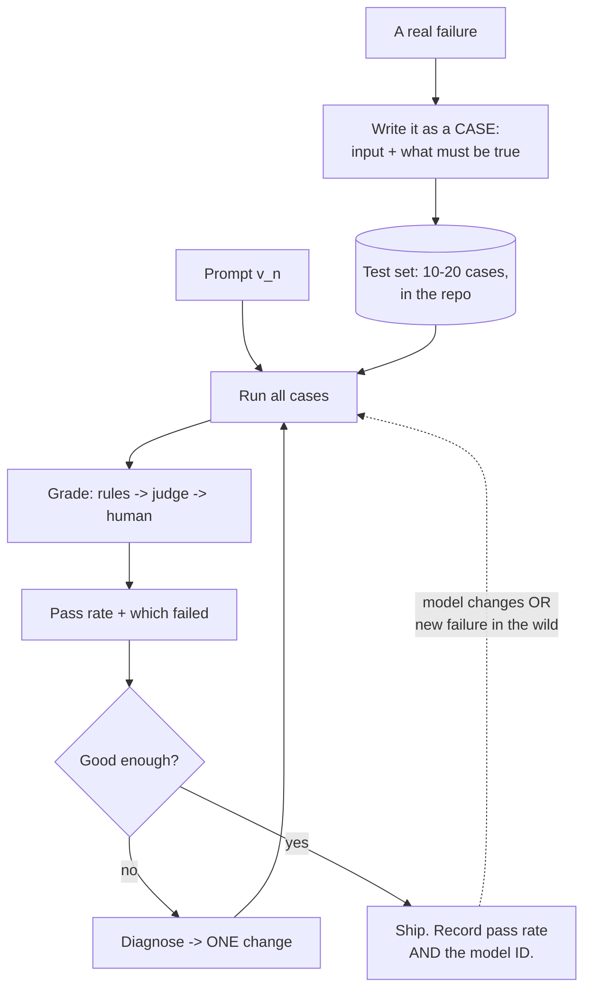
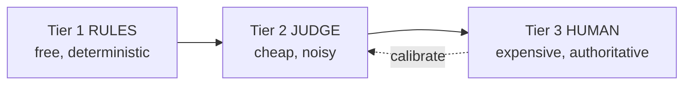
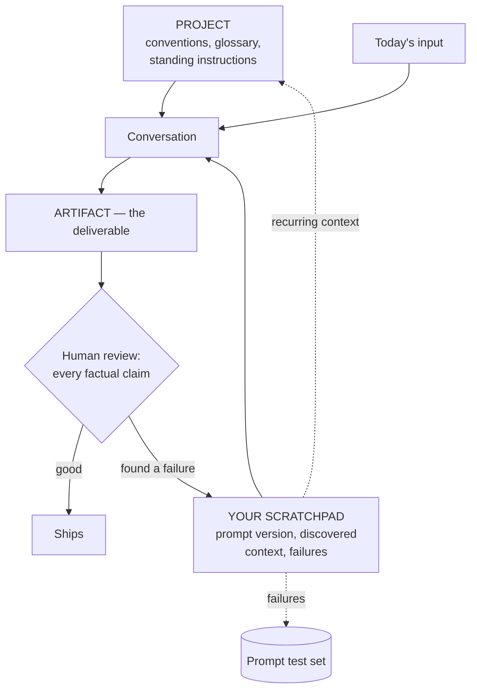
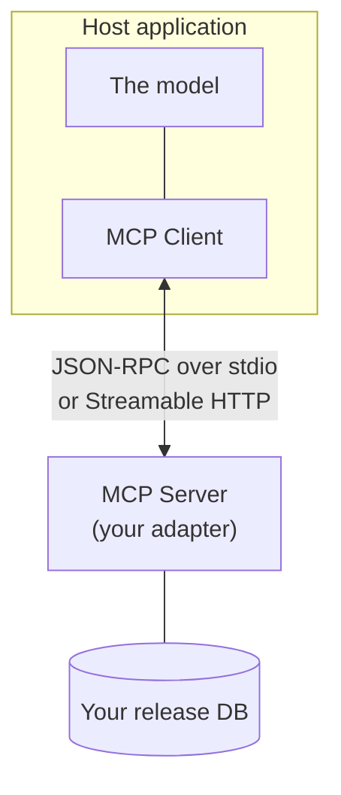

# Slides Outline — Session 11: Prompting II + Working With Claude

Slide-by-slide spec for the deck-builder. Build per `../../powerpoint_instructions.md` (layout, palette, type, accessibility, licence footers). Speaker notes go in the Notes pane, never on the slide. Mermaid sources are given in the **Visual** field for the builder to render in-palette, with alt text.

**Deck size:** 1 title + 1 agenda + 18 content + 1 discussion + 1 resources = **22 slides.** Target 45 min. This is the tightest deck in the series — see the pacing note below.

---

## Deck-builder notes — read before building

**1. Licence position for this deck is simple and good.** Almost everything on these slides is original work written for this course: every prompt, every worked example, every output, every diagram. **SLIDE-SAFE, no attribution needed** beyond the course itself. Three exceptions:
- **MCP** (slides 19) — open standard, Agentic AI Foundation / Linux Foundation. **SLIDE-SAFE with attribution.** Footer: "Model Context Protocol · Agentic AI Foundation (Linux Foundation)".
- **Anthropic product docs and engineering blog** — **LINK-ONLY**. Concepts are re-expressed in our own words throughout Part B. **Never embed a screenshot of Anthropic documentation, marketing, or blog prose.**
- **Claude product UI** — appears only as **live demo**. If you need a fallback for a no-network room, build a *hand-drawn schematic* of the UI, not a screenshot.

**2. Currency banner is mandatory.** Every Part B slide (16–20) carries a persistent corner tag: **"Verify against current Claude docs at delivery."** Build it into the layout so it cannot be forgotten. The presenter should say it aloud once, at slide 16, and then let the tag do the work.

**3. Schedule constraint.** Slide 19 covers MCP. **Deliver this deck after 2026-07-28** (MCP final spec). If that is impossible, cut slide 19 to the stateless conceptual core only and say so.

**4. Pacing.** 18 content slides in 45 minutes is ~2.5 min each with no slack. The deck only runs to time if slides 5, 7, 10 and 15 are **pre-baked reveals** — outputs captured in advance, revealed by animation, never generated live. If running behind at slide 12, drop slide 7 (incident summary) and slide 18 (extended thinking) to a single mention each; protect slides 12–15, which carry the session's thesis.

**5. Two live demos**, both in Part B, both optional and both with fallbacks: a Project with attached context (slide 17) and an Artifact generated then revised (slide 17). Rehearse; do not improvise.

---

## Slide 1 — Title

- **On-slide text:** "Prompting II + Working With Claude" · Session 11 · Application block · AI Training Series. Subtitle: *"Make it repeatable. Then make it checkable."*
- **Speaker notes:** Two halves tonight. First, prompting applied to work this room actually does — and the one discipline that turns a prompt into an engineering artifact. Second, Claude as a working environment rather than a chat box. Flag once, up front, that the second half is the most time-sensitive material in the whole series and that anything product-specific must be checked against current docs.
- **Visual:** Series title layout.
- **Source/licence:** none (original).

## Slide 2 — Agenda

- **On-slide text:** Worked prompts on real tasks → iterating a bad prompt live → prompt test sets → which Claude surface → scratchpad, Projects, Artifacts → extended thinking → MCP → habits. "45 min + 15 min Q&A."
- **Speaker notes:** Mirror the README minute budget. Say honestly that this session carries two halves that each deserve their own hour, that the reading in `content/` is deliberately larger than the session, and that the middle segment — test sets — is the part they cannot reconstruct alone.
- **Visual:** Agenda table matching README.
- **Source/licence:** none.

## Slide 3 — Hook: same model, same task, two prompts

- **On-slide text (headline is a claim):** "The gap is the prompt, not the model." Two columns: left, `Write release notes for these changes:` + output; right, the production prompt (collapsed) + output. Highlight three defects in the left output: invented version number, internal refactor described as a customer feature, two changes silently dropped.
- **Speaker notes:** Do not explain yet — let them read. Ask which defect is worst. The room usually says the invented version number; the right answer is the silent omission, because it is the only one nobody would catch by reading the output. That distinction — visible errors versus invisible ones — runs through the whole session.
- **Visual:** Two-column before/after layout. Real captured outputs, pre-baked.
- **Source/licence:** original (invented Helios data).

## Slide 4 — Every production prompt has six layers

- **On-slide text:** "A prompt is a brief, not a request." Role · Context · Delimited input · Task · Constraints · Output contract. One line: *stable first, variable last.*
- **Speaker notes:** These are the answer to "what would a competent contractor need to do this without asking a question?" Two structural rules carry most of the value: stable content first (it caches, and it diffs), and delimit the input in tags so the model can tell your instructions from your material. That second one is also a partial defence against a log line that reads like an instruction — partial, and Session 14 explains why nothing here is complete.
- **Visual:**

- **Source/licence:** original.

## Slide 5 — What each layer bought (release notes)

- **On-slide text:** Table — Layer added | Failure removed. Rows: role+audience → marketing tone, irrelevant internals; explicit procedure → silent omissions; delimiters → instructions/data blurring; word bans → filler; "do not invent X" → fabricated version numbers; escape hatch → confident guesses; output contract → drifting format.
- **Speaker notes:** This is the same prompt at four stages. Each row is a real failure that a specific layer removed. Land the two starred rows hard: naming the specific thing it must not invent, and giving it a legal way to say "I can't tell". Both address the same root cause — a model completing a pattern fills the slot whether or not it has the information. Notice we never wrote "be accurate" or "be careful". Exhortation is not a control.
- **Visual:** Table layout. Star the "do not invent" and "escape hatch" rows.
- **Source/licence:** original.

## Slide 6 — The two lines worth more than the rest

- **On-slide text:** "Name the fabrication. Offer an exit." Two code blocks: `Do NOT invent a version number, a release date, or a severity that is not present in <changes>.` and `If an entry is too ambiguous to classify confidently, put it under "Needs author review" with a one-line statement of what is unclear. Do not guess.`
- **Speaker notes:** These two lines do more work than any technique in Session 10. General instructions to be accurate do almost nothing; naming the specific slot it will otherwise fill does a great deal. And a model given no legal way to be uncertain will resolve uncertainty by guessing confidently — offer an exit and it takes it. In a release-management context, "Needs author review" is exactly the output you want.
- **Visual:** Two large code blocks, high contrast. Text only — this slide is a quote slide in effect.
- **Source/licence:** original.

## Slide 7 — Incident summaries: separate what you know from what you inferred

- **On-slide text:** "Coherence is the thing you must not trust." Three labels: ESTABLISHED (in the timeline) · INFERRED (tagged with its basis) · UNKNOWN (with what would resolve it). Plus: required section — *"What we do not know."*
- **Speaker notes:** A model will produce a coherent narrative, and coherence is exactly the risk — it smooths over the gap where the evidence ran out, and a beautifully written summary asserting an unsupported root cause becomes the thing everyone cites. Forcing the three-way split gives the human reviewer something specific to check: "is this summary right?" is hopeless, "are these nine ESTABLISHED lines actually in the timeline?" is ten minutes. The "what we do not know" section is the one a tired human always skips and the model will populate honestly — a genuinely good use of the tool.
- **Visual:**

- **Source/licence:** original.

## Slide 8 — When the output is for a machine, the schema is the prompt

- **On-slide text:** "Asking for JSON is a request. A schema is a contract." Log-triage tool schema, abridged: `symptom` / `count` / `severity` (enum: high, medium, low, unknown) / `example_line` ("copied verbatim").
- **Speaker notes:** Log triage differs from the first two tasks because no human reads the output — it feeds a ticket or a dashboard. Two details to point at: the enum means it is not possible to get back "critical" or "P1", so every downstream consumer can rely on four values; and asking for a verbatim line rather than a summary means you can grep the original file. Verifiability is a design decision you make when you write the schema. Also note the model choice — clustering by symptom is pattern-matching, so this is a cheap-model task. Prove that on your test set rather than assuming it.
- **Visual:** Code block (Python tool schema, abridged from `content/01`). Callouts on the `enum` and on `"copied verbatim"`.
- **Source/licence:** original. Anthropic SDK usage pattern.

## Slide 9 — Diagnose before you treat: five categories

- **On-slide text:** "Adding words is not a fix." 1 Missing context · 2 Ambiguous task · 3 Unconstrained output · 4 Capability/model mismatch · 5 Wrong approach entirely.
- **Speaker notes:** The default response to a bad output is to add a sentence. It helps often enough to be reinforced and rarely enough to leave you with a 400-line prompt full of scar tissue nobody dares delete. Each category has a different test and a different fix. Emphasise category 5 — the one people skip, and the most expensive to skip. If the answer requires last Thursday's deployment record and that record is not in the prompt, no phrasing helps. Two rules make the loop work: one change per pass, same input every pass.
- **Visual:**

- **Source/licence:** original.

## Slide 10 — Live: three passes on a config-review prompt

- **On-slide text:** Build across three reveals. Pass 1 output ("appears generally safe…") → **diagnosis: ambiguous task + missing context**. Pass 2 output (right analysis, six paragraphs of prose) → **diagnosis: unconstrained output**. Pass 3: the verdict table.
- **Speaker notes:** **Pre-baked reveal — do not run live.** Show pass 1 and ask the room to diagnose before revealing the answer; let two people disagree, that disagreement is the lesson. The critical observation in pass 1: four changes, three benign, one disabling TLS verification — and the serious one got averaged into the tone of its neighbours. A model asked for an overall verdict produces an overall verdict. The structural fix is requiring a per-item verdict before any aggregate one. If someone objects that pass 2 is "really missing context" too, agree: the categories overlap at the edges, and the value is in stopping to ask, not in getting the label right.
- **Visual:** Three-stage animated reveal. Pass 3 shown as the actual verdict table with the "What would change the verdict" column highlighted.
- **Source/licence:** original (invented Helios config).

## Slide 11 — Escalate in order, stop at the first thing that works

- **On-slide text:** Context → Procedure → Output contract → Few-shot examples → Model / reasoning budget → Decompose → Stop, it's not a prompting problem. One line: *each step costs more than the last.*
- **Speaker notes:** Note what we did *not* do in those three passes. We never added an example — few-shot is powerful but expensive in tokens and it anchors hard, including anchoring mistakes. And we never reached for a bigger model or more thinking, because doing that before fixing the prompt hides the real problem and raises your bill permanently. A stronger model papers over an ambiguous instruction, and you still have the ambiguous instruction, waiting for the input to change.
- **Visual:**

- **Source/licence:** original.

## Slide 12 — A prompt without a test set is folklore

- **On-slide text:** "You would not accept 'the new build script feels faster'." Table: Version control · A test suite · Regression testing on upgrade · Code review · Bug becomes a test case — with a "in place for prompts?" column reading Rarely / Almost never / Almost never / Sometimes / Almost never.
- **Speaker notes:** This is the thesis of the session. Describe the real lifecycle: someone writes a prompt that works, pastes it in a channel, four people copy it, two modify it, nobody knows which modification is better, the model version changes, three copies quietly start failing in ways that show up only in the output, nobody notices for a month. Every one of those is a testing failure, not a prompting failure — and every one is something this room already knows how to prevent in code. A prompt generating customer-facing release notes is production software with an unusually unpredictable runtime, and it typically gets less rigour than a shell script.
- **Visual:** Table. Emphasise the "Almost never" column.
- **Source/licence:** original.

## Slide 13 — The loop

- **On-slide text:** "A failure becomes a case. A case never stops paying." The loop diagram.
- **Speaker notes:** Walk it once. The dotted line is what pays for the whole exercise: when the model version changes under you, you re-run and *know* within ten minutes, instead of finding out from a customer. Point out where the cases come from — the diagnosis loop from slide 9. Every prompt you fix donates its input to the suite, so nothing in it is decorative; every case is there because something really went wrong once.
- **Visual:**

- **Source/licence:** original.

## Slide 14 — Twenty cases, three grading tiers

- **On-slide text:** Left: case mix — Typical 40% · Edge 30% · Adversarial 15% · Regression 15%. Right: Rules (free, deterministic) → Judge (cheap, noisy) → Human (expensive, authoritative). One line: *assert on properties, never on exact output.*
- **Speaker notes:** Start with 10–20 — the usual reason teams have no suite is that they imagine needing hundreds and never begin. Never assert an exact expected output; the model is stochastic and prose has a thousand valid forms. Assert properties: does it contain these IDs, does it avoid this pattern, does it validate against this schema. On the judge tier, be honest: a judge is itself an unvalidated prompt with all the same failure modes, and it is biased toward verbose confident answers. Keep its rubric narrow and binary, and spot-check it against human labels — if it agrees with humans 65% of the time your pass rate is decoration. Most people's first judge rubric turns out to be a regex in disguise.
- **Visual:** Two-column. Right column as the three-tier flow:

- **Source/licence:** original.

## Slide 15 — The table that settles arguments

- **On-slide text:** The comparison grid — v2_sonnet 14/20 $0.031 · v3_sonnet 19/20 $0.038 · v3_haiku 16/20 $0.004, broken out by typical / edge / adversarial / regression. Footer: *illustrative figures — recompute at current pricing.*
- **Speaker notes:** The payoff slide. Read four conclusions off it. One: v3 beats v2, and the gain sits entirely in edge and adversarial cases — exactly the ones nobody checks by hand. Two: **the cheap model on the good prompt beats the expensive model on the bad prompt, at a tenth of the cost** — the prompt was worth more than the model upgrade, and this is more common than people expect. Three: Haiku fails every adversarial case, so use it for drafting with human review and Sonnet where output goes out unreviewed — that is now an evidence-backed policy, not a preference. Four: v3 still fails one case, you know which, and "known limitation, tracked" is a respectable engineering position where "we don't know what it does on weird inputs" is not. Flag that the same method later settles thinking budget.
- **Visual:** Large table, monospaced. Highlight the v3_haiku cost cell.
- **Source/licence:** original. Figures illustrative — footer must say so.

## Slide 16 — Which Claude surface for which task

- **On-slide text:** ⚠️ *Verify against current Claude docs at delivery.* Decision table, abridged to six rows: one-off question → Chat · recurring drafting with stable background → Project · a document you will revise → Artifact · multi-constraint judgement → + extended thinking · high volume or feeds a system → API + test suite · needs live data from another system → Connector/MCP.
- **Speaker notes:** Say the currency warning aloud, once, here — features get renamed, merged, and promoted out of beta faster than any deck can track; the criteria are durable, the names are not. Then the three questions that decide almost everything: how many times will you do this, is there stable context you keep re-pasting, and does a human read every output before it matters. Name the most common mistake: living in chat for an obviously recurring task, retyping the background from memory each time, and concluding the model is "inconsistent". It is not inconsistent — it is being given a different prompt every time by someone who has not noticed they are writing one.
- **Visual:** Decision table. Persistent currency tag in the corner.
- **Source/licence:** original. Claude product surfaces are **LINK-ONLY** — describe, never screenshot.

## Slide 17 — Stable context, and making it produce the thing

- **On-slide text:** ⚠️ *Verify at delivery.* Two ideas: **Projects** — conventions, glossary, standing instructions live once, not in every message; *context is a dependency and it rots — date it, own it, review it.* **Artifacts** — ask for the deliverable, not advice about the deliverable.
- **Speaker notes:** **Demo slot.** Show a Project with an attached conventions doc; show an Artifact generated and then revised with one specific instruction. Fallback if no network: hand-drawn schematic, never a screenshot of the product. Two points to land. First, Project context goes stale silently — if the conventions doc still says a one-release deprecation window and it changed to two in March, every note since has been confidently wrong; and two attached documents that contradict each other produce output that looks like randomness. When quality degrades, suspect the context first. Second, asking for the artifact rather than advice about it matters because concrete output generates specific criticism — shown an abstract structure you nod; shown the actual post-mortem with your incident in it, you immediately see that section 4 repeats section 2.
- **Visual:** The assembled workflow diagram:

- **Source/licence:** original diagram. Product UI = live demo only.

## Slide 18 — Extended thinking is a dial, not a quality setting

- **On-slide text:** ⚠️ *Verify at delivery.* Table: off (~2 s, 1×) · modest ~1–2k (~8 s, 2–3×) · large ~8–16k (~40 s, 8–15×). Below: measured on one suite — none 13/20, 2000 → 19/20, 8000 → 19/20. Conclusion: **use 2000.**
- **Speaker notes:** The 2023 advice — "let's think step by step" — was real, and it has been productised. It is now a budget you authorise, not a string you paste; stop spending prompt space on it and spend those lines on context instead. What you still steer by prompting is the *shape* of the reasoning: ask for a specific inspectable intermediate ("list every config value alongside the constraint it interacts with, then give the verdict") rather than "think step by step". Cost and latency rise roughly linearly; accuracy rises then flattens. Note this is the third time the suite has settled a question — prompt version, model, now thinking budget. Same method, twenty minutes each. And the correction people need most: reasoning budget fixes exactly one diagnosis category. It does not add knowledge, fix missing context, or prevent hallucination.
- **Visual:** The cost/accuracy table plus the measured comparison. Keep numbers large; footer marks them illustrative.
- **Source/licence:** original. Figures illustrative.

## Slide 19 — MCP in one honest slide

- **On-slide text:** "A standard, not a hook." Host → Client → Server, over stdio or Streamable HTTP (HTTP+SSE deprecated). Stateless at the protocol layer. **Tools act; resources are read.** Below: *most connector ideas should be a paste.*
- **Speaker notes:** Governance first, because it answers the obvious question: Anthropic donated MCP to the Agentic AI Foundation under the Linux Foundation in Dec 2025, with OpenAI and Block as co-founders. When your two biggest competitors co-found your protocol's foundation, "is this a real standard?" is settled. Teach the stateless core — it is why servers are ordinary, scalable, testable services, and it is the part that survives revisions. Then the two sentences that matter operationally: **the server is the enforcement point, never the model's judgement** — least privilege lives in your code, not in a system prompt; and **most connector ideas should be a paste.** Close by flagging the risk you are deliberately not opening: untrusted content in context plus a tool that can act is the prompt-injection configuration, and that is Session 14.
- **Visual:**

- **Source/licence:** **Model Context Protocol · Agentic AI Foundation (Linux Foundation) — SLIDE-SAFE with attribution.** Footer tag required.

## Slide 20 — The habits, and the one-page checklist

- **On-slide text:** Give it what only you know · Ask for the artifact · One change per pass · Make it verifiable by design · Keep the stable part stable · Know when to stop · **Feed failures back.**
- **Speaker notes:** Same model, same access, wildly different outcomes — and the differences are boring and learnable. Two to emphasise. "Make it verifiable by design": ask for the source line supporting each claim, and ask for what it deliberately excluded and why — silent omission is the failure mode you cannot detect by reading the output, because what is missing leaves no trace. And "feed failures back" is the one that compounds: failure → scratchpad → test case → prompt fix → suite re-run → recurring context promoted into the Project. Without that loop you accumulate anecdotes instead of capability. Point them at the one-page checklist in `content/08` and tell them to pin it. Close on the data-handling line: sanitise by default, the risk arrives inside a paste, not inside a question — and every example tonight was invented for exactly that reason.
- **Visual:** The seven habits as a numbered list with the feedback arrow from 7 back to 1.
- **Source/licence:** original.

## Slide 21 — Discussion

- **On-slide text:** Three prompts from `exercises/discussion.md`: *"Which of your recurring tasks would survive a 20-case test set — and which would fail it today?"* · *"Where in your workflow would a silent omission do the most damage?"* · *"Name one task you would NOT give to Claude, and say why."*
- **Speaker notes:** Run the third one first if the room is quiet — it is the easiest to answer and it sets an honest tone. The second question is the one that produces the most useful answers for release and problem management specifically. Full prompts and what each surfaces are in `exercises/discussion.md`.
- **Visual:** Discussion layout.
- **Source/licence:** none.

## Slide 22 — Resources & credits

- **On-slide text:** Links only. MCP specification & SDKs (Agentic AI Foundation / Linux Foundation) · Anthropic prompting best practices, Building Effective Agents, context-engineering and evals posts (**link only — do not copy**) · promptfoo / DeepEval (MIT, open source) · OpenAI Cookbook prompting guides (MIT) · DAIR.AI promptingguide.ai (MIT) · The Prompt Report v6 (CC BY 4.0). Footer: **"All prompts, examples, and diagrams in this deck are original course material."**
- **Speaker notes:** Point at the two things worth their time this week: the one-page checklist in `content/08`, and the lab — build a 10-case test set for one prompt they already use. Repeat the currency warning once more, and note the MCP spec date so nobody teaches this deck from a stale copy.
- **Visual:** Resources layout with licence attributions per `resources/sources.md`.
- **Source/licence:** attributions as listed.

---

## Build checklist for this deck

- [ ] Currency tag ("Verify against current Claude docs at delivery") present on slides 16–20.
- [ ] No Anthropic documentation, blog, or marketing text or imagery embedded anywhere.
- [ ] No screenshots of Claude product UI — live demo or hand-drawn schematic only.
- [ ] MCP attribution footer on slide 19.
- [ ] Illustrative-figures footer on slides 15 and 18.
- [ ] Slides 5, 7, 10, 15 built as pre-baked reveals; nothing generated live on stage.
- [ ] Demo fallbacks built for slide 17 (no-network room).
- [ ] Delivery date confirmed **after 2026-07-28**, or slide 19 reduced to the conceptual core.
- [ ] All Helios data confirmed invented; no real component, ticket, or version identifiers anywhere.
- [ ] Rehearsed to 45 minutes with the drop-list (slides 7, 18) identified in advance.
