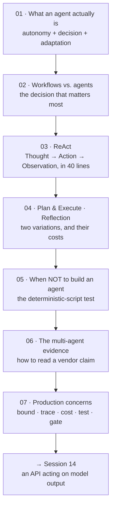

# Overview — The Loop Is the Whole Idea

Six sessions in this series have used the word "agent" and moved on. This one stops and defines it, builds one, and then spends most of its length arguing that you probably should not.

---

## What changes in this session

Everything so far has treated the model as a **function**: text in, text out, one call, a human reads the result. Session 11 added tools, which stretches that picture but does not break it — the model asks for a tool, your code runs it, the model gets one more turn, a human still reads the result.

This session breaks it. Add a `while` loop around that exchange and let the model decide when to stop, and you have changed the shape of the system:

| | A prompt (Sessions 10–11) | An agent (this session) |
|---|---|---|
| Number of model calls per user request | 1, or 2 with a tool | Unbounded until a stop condition fires |
| Who decides what happens next | You, in your code | **The model, at run time** |
| Number of steps | Known before you start | Not known before you start |
| What the output is | Text a human reads | **Actions that already happened** |
| Failure mode | A wrong answer | A wrong answer, plus whatever the actions did |
| Cost | Predictable | Multiplied, and the multiplier is decided at run time |
| Testability | Same input → similar output | Same input → different trajectory |

Read the "who decides what happens next" row again. That is the entire topic. Everything else in this session — the patterns, the cost tables, the failure modes, the security hand-off — follows from moving that decision from your code into the model.

## The arc

Caption: the session's shape. Note that only one file (`03`) is about building one, and three (`02`, `05`, `06`) are about deciding not to.

## The three sentences this session is built on

**1. An agent is an LLM wired to a loop and given the ability to act.**
Not a smarter model. Not a better prompt. A control-flow decision. If you remember nothing else, remember that the noun describes an *architecture*, not a capability.

**2. Most problems you want to solve are workflows, not agents.**
A workflow orchestrates model calls through **predefined code paths** that you wrote and can read. An agent lets the model **direct its own process**. The first is debuggable, testable, costable, and boring. Choose it whenever you can. This framing is the most useful single idea in the agent literature, and it comes — notably — from a vendor telling you to buy less of what they sell.

**3. Mistakes compound over multi-step tasks.**
A single call that is 95% reliable is a 95% reliable system. Ten dependent steps at 95% each is 0.95¹⁰ ≈ **60%**. Nothing in an agent architecture fixes this; the architecture is what creates it. Every production control in `07` exists to interrupt that multiplication.

## What this session assumes and does not repeat

- **MCP.** Session 11 covered host/client/server, stdio and Streamable HTTP, the stateless protocol core, the tools-act-versus-resources-read distinction, and the rule that the server — not the model's judgement — is the enforcement point. All of it stands. This session treats "the model can call a tool" as solved and asks what happens when you call tools in a loop.
- **Token cost mechanics.** Session 2 established that an 8-step agent turns one user request into 8 billed calls and roughly 13× the cost, because each step re-sends the accumulated trace. We reuse that arithmetic in `07` rather than re-deriving it.
- **Prompt test sets.** Session 11's twenty-cases-from-real-failures discipline is the foundation of agent testing in `07`. Agents make it harder, not different.
- **Benchmark skepticism.** Session 10 already taught the equal-token-budget question. `06` is where that question gets its full case study.

## What this session deliberately does not cover

- **Prompt injection, the three-precondition test, and agent attack surface.** That is **Session 14**, and it is a whole session because it deserves one. This session sets it up in one sentence and stops.
- **Framework tutorials.** We will name LangGraph, the OpenAI Agents SDK, and `smolagents` and note that they disagree with each other about architecture — a declarative state graph, code-first orchestration, and agents that write their actions as code. We will not teach any of them. Teaching a framework teaches the framework; the loop underneath is what transfers.
- **Computer use and browser agents.** Adjacent, real, and improving fast — and a different reliability discussion. Named in `07`, not taught.
- **RAG.** Retrieval is not agency. A retrieval step inside a fixed pipeline is a workflow.

## A note on the voice of this session

This course is skeptical by design, and agents are where that pays off most. The topic has more marketing per unit of evidence than anything else in the series. So:

- Every capability claim in these files is paired with what it costs.
- Where two vendors contradict each other, we teach **the disagreement**, not a winner.
- Where a number comes from an interested party, we say so.
- The strongest recommendation in the whole session is *don't*.

That is not conservatism for its own sake. It is that for a release, problem, or configuration function, the failure mode of an over-eager agent is not a bad paragraph — it is an action taken against a real system that nobody reviewed.

---

**Next:** `01-what-an-agent-is.md` — the definition, the loop, and the three properties that separate an agent from everything before it.
