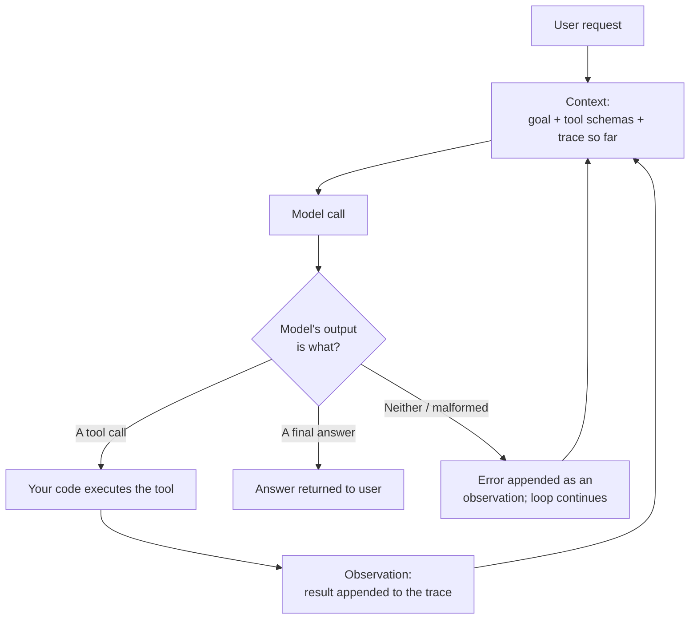
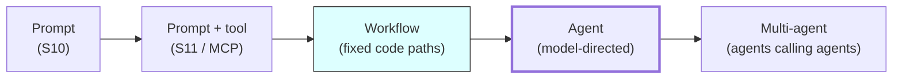

# What an Agent Actually Is

The word is used for at least four different things in vendor material. This file fixes the definition, shows the mechanism, and gives you a test you can apply to any product description in under a minute.

---

## 1. The definition

> **An agent is a semi-autonomous system that interacts with an environment, decides what to do, and acts on a user's behalf.**
>
> Mechanically: **an LLM wired to a loop and given the ability to act.**

The first sentence is the definition you would find in a textbook — it predates LLMs by decades and applies equally to a thermostat, a chess program, and a warehouse robot. The second is what it means *for us, in 2026*, and it is the one to hold on to, because it names the two things you actually add: **a loop**, and **the ability to act**.

Three properties follow, and all three must be present:

| Property | What it means | What it looks like when absent |
|---|---|---|
| **Autonomy** | The system takes multiple steps without asking you between them | A tool call where you re-prompt after each result. That is a conversation, not an agent |
| **Decision-making** | The system chooses which action to take next, from options it was given | A fixed sequence of steps you wrote. That is a workflow (see `02`) |
| **Adaptation** | What it does at step 4 depends on what it observed at step 3 | A retry loop with a fixed body. That is a `for` loop |

If any of the three is missing, whatever you are looking at may still be a good system — it is just not an agent, and calling it one imports risks it does not have and costs you should not pay for.

## 2. The mechanism, drawn

Caption: the agent loop. The only structural difference from a single tool call is the arrow from **Observation** back to **Context** — and the fact that the *model*, not your code, decides which branch of the diamond is taken.

Note what is and is not in this diagram:

- **There is no "planner" box.** In the simplest agent, planning is something the model does inside the model call. `04` shows what changes when you make it an explicit box.
- **Your code still executes every tool.** The model emits a *request* to call a tool, with arguments, against a schema. It never touches the system. This is the Session 11 point and it remains the most important security property in the design.
- **The loop has no natural end.** The model decides when to stop. That is the whole idea, and it is also why every production agent needs an explicit step cap, a token cap, and a wall-clock cap (`07`).
- **The trace grows every iteration.** Step 8's context contains all seven prior thoughts, actions, and observations. This is where Session 2's ~13× cost multiplier comes from, and why it is a multiplier rather than a constant.

## 3. Four things people call "an agent" — sorted

Apply the three-property test.

| Thing | Autonomy | Decision | Adaptation | Verdict |
|---|:---:|:---:|:---:|---|
| A chat assistant that answers a question | ✗ | ✗ | ✗ | **A prompt.** One call. |
| An assistant that calls one tool, gets a result, and answers | ✗ | partial | ✗ | **A tool call.** It chose *whether* to use a tool, then stopped. |
| A pipeline: classify the ticket → route it → draft a reply → hand to a human | ✗ | ✗ | ✗ | **A workflow.** Three model calls, but *you* wrote the order. See `02`. |
| A system given a goal and eight tools that runs until it decides it is done | ✓ | ✓ | ✓ | **An agent.** |

The third row is the one that matters commercially. **Most things marketed as agents are the third row.** That is not an accusation of bad faith — it is that "workflow with LLM steps" is a less exciting phrase for a product that is, in fact, the better design.

### The one-minute test for a product description

Ask two questions:

1. **Can I draw the sequence of steps before it runs?** If yes → workflow.
2. **Does the number of steps depend on what it finds?** If yes → agent.

That is it. Everything else in the brochure is downstream of those two answers.

## 4. Why the loop is genuinely powerful

It is worth being fair to the technology before spending three files being skeptical about it.

Consider a real problem from this audience's world: *"Component X regressed in release 2.6. Find out what changed."*

A workflow cannot express this well, because the correct sequence of steps depends on facts you do not have until you start looking:

- If the diff is small, read it and you are done in two steps.
- If the diff is large, you need to bisect — and the number of bisection steps depends on where the break is.
- If the diff is empty, the cause is not in the code, and you should be looking at configuration or a dependency version instead — a different set of tools entirely.
- If the dependency changed, you now need that dependency's changelog, which you did not know you needed at step 1.

To write this as a workflow, you must enumerate every branch in advance. To write it as an agent, you give the model the tools (`get_diff`, `list_dependencies`, `get_changelog`, `run_test`) and the goal, and let it choose. **That is what the loop buys you: the ability to handle tasks whose *shape* is data-dependent.**

That is the real and only justification. Whenever someone proposes an agent, the question is whether their task actually has that property. Usually it does not (`05`).

## 5. Why the loop is genuinely dangerous

The same fairness in the other direction.

**Errors compound.** Each step's output becomes the next step's input. There is no fresh start.

| Per-step reliability | 3 steps | 5 steps | 10 steps | 20 steps |
|---|---|---|---|---|
| 99% | 97.0% | 95.1% | 90.4% | 81.8% |
| 95% | 85.7% | 77.4% | **59.9%** | 35.8% |
| 90% | 72.9% | 59.0% | 34.9% | 12.2% |

*Assumes independent steps and no recovery — a simplification in both directions (a good agent can notice and correct an error; a bad observation can also poison every subsequent step). The point is the shape of the curve, not the exact figures.*

Read the 95% row. A component that is right nineteen times out of twenty — which most people would call good — produces a system that fails **two runs in five** at ten steps. This is the single best one-line argument for why agent engineering is hard, and it is why agents typically need the most capable (and expensive) models: the per-step error rate is inside an exponent.

**A poisoned observation persists.** Once a wrong tool result enters the trace, every subsequent model call reads it as fact. There is no mechanism that revisits it. This is also the mechanism Session 14 will exploit, and it is worth noticing that it is a *correctness* problem before it is a *security* problem.

**The stop condition is a judgement call made by a pattern-matcher.** "Am I done?" is answered by the same thing that answers everything else — a probable continuation. Agents stop early. Agents also loop forever. Both are common enough that every framework ships a step cap.

## 6. Where this sits relative to what you already know

Caption: the ladder. Each rung adds capability and subtracts predictability. **The correct default is to stop at the shaded rung** and climb further only when the task's shape forces it. `06` explains why the last rung is the least evidenced of all.

---

## What to remember

- An agent is **an LLM in a loop with tools**, exhibiting **autonomy, decision-making, and adaptation**. All three, or it is something else.
- The defining change is that **the model, not your code, decides what happens next.**
- Your code still executes every tool. The model only ever emits a request against a schema.
- The loop's justification is tasks whose **step sequence is data-dependent**. That is a real and narrow class.
- The loop's cost is **compounding error, an unbounded trace, a growing bill, and a stop condition decided by a pattern-matcher.**

---

**Next:** `02-workflows-vs-agents.md` — the distinction that decides most of these projects before a line of code is written.
