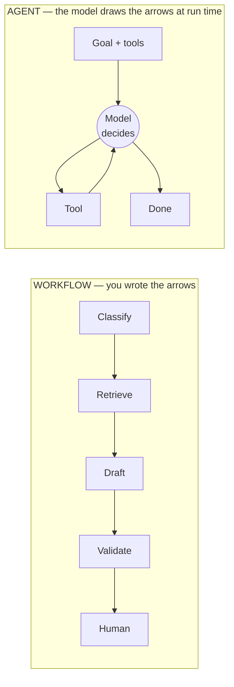
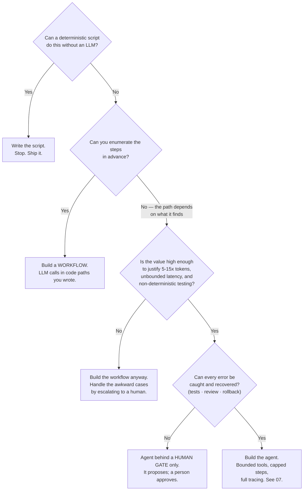
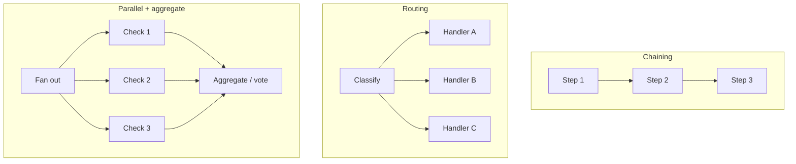
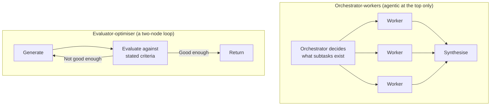

# Workflows vs. Agents — The Decision That Matters Most

This is the most useful single framing in the agent literature, and it decides most projects before anyone writes code. It also has an unusual provenance worth mentioning in the room: it comes from a vendor whose business is selling agents, telling you to build fewer of them.

---

## 1. The distinction

> **Workflow:** LLMs and tools orchestrated through **predefined code paths** — you wrote the sequence, and you can read it.
>
> **Agent:** a system where the LLM **dynamically directs its own process** and tool usage, deciding how to accomplish the task.

*(Framing after Anthropic's "Building Effective Agents." The post is all-rights-reserved — paraphrased here, never reproduced. Assign it as reading; see `resources/sources.md` #6.)*

The test is a single question: **who wrote the control flow?**

Caption: left, the arrows exist in your repository and can be reviewed. Right, they exist only in a trace after the fact.

Note that a workflow can contain plenty of LLM calls, plenty of tool calls, branching, retries, and parallelism. **None of that makes it an agent.** A ten-node graph with conditional edges is still a workflow if you drew the graph.

## 2. Why "workflow" is almost always the better answer

| Property | Workflow | Agent |
|---|---|---|
| **Steps per request** | Known, bounded | Unknown until it runs |
| **Cost per request** | Computable in advance | A distribution, with a tail |
| **Latency** | Sum of a known set of calls | Unbounded without a cap |
| **Debuggability** | Read the code | Read a trace, per run |
| **Testability** | Deterministic control flow; only the LLM steps vary | Both the control flow *and* the steps vary |
| **Reviewability** | A pull request | A judgement about a distribution of behaviours |
| **Failure containment** | Errors stay in the step that made them | Errors propagate into every later step |
| **Blast radius** | Exactly the tools that step is allowed | Every tool, at any point, in any order |
| **What "it broke" means** | A specific node returned wrong output | Something in a 14-step trajectory |
| **Handles data-dependent step sequences** | ✗ | ✓ |

Every row favours the workflow except the last. That last row is the entire case for agents, and it is a real case — but it is one row.

**The corollary that people resist:** if you can enumerate the steps, enumerating them in code is not a failure of ambition. It is the correct engineering answer. A workflow with LLM steps gets you most of the capability of "AI" with almost none of the operational cost.

## 3. The decision flowchart

Caption: the decision. Note that three of the five terminal boxes are "don't build an agent," and a fourth is "build one but do not let it act unsupervised."

The four questions in words, in order:

1. **Complexity** — is the task genuinely open-ended, or does it just look messy because nobody has written it down? *"Turn this design document into a pull request"* is open-ended. *"Extract the version number from this changelog"* is not, no matter how many edge cases it has.
2. **Enumerability** — can you draw the steps? If yes, draw them. A flowchart you can review beats a trajectory you can only audit.
3. **Value** — does the outcome justify five to fifteen times the tokens and a latency distribution with a long tail? For a task run twice a week, almost certainly not. For a task run ten thousand times a day, the multiplier is a budget line, not a rounding error.
4. **Cost of error** — can mistakes be caught and undone? Tests, code review, and rollback make an agent's errors cheap. An agent that sends email, closes tickets, or touches a configuration baseline has errors that are not cheap, and it belongs behind a human gate regardless of how good the demo was.

If the answer to any of the four is "no," step down a rung.

## 4. Worked examples from this team's actual work

| Task | Steps enumerable? | Verdict | Why |
|---|---|---|---|
| Draft release notes from a set of merged changes | Yes — fetch changes, classify, draft, format, human review | **Workflow** | The sequence never varies. An agent adds cost and removes the ability to diff the pipeline. |
| Triage an incoming defect: classify severity, route to a team, draft an acknowledgement | Yes | **Workflow** | Three model calls in a fixed order. Session 11 already taught you every piece. |
| Summarise a long incident timeline | Yes — chunk, summarise, merge, flag gaps | **Workflow** | "It's long" is not "the path is data-dependent." |
| Answer *"is this config change safe?"* against a policy document | Yes — retrieve policy, compare, output verdict + evidence | **Workflow (RAG)** | Retrieval is not agency. |
| *"Component X regressed in 2.6 — find out what changed"* | **No** — the diff might be empty, might be huge, might point at a dependency | **Agent** (behind a gate) | Genuinely data-dependent. Read-only tools. It proposes a cause; a human confirms. |
| *"Reproduce this customer's failure and open a fix PR"* | No | **Agent, gated hard** | Open-ended *and* it acts. Errors are recoverable (PR review, rollback) — which is exactly what makes it viable. |
| Regenerate the weekly release dashboard | Yes, trivially | **Deterministic script.** No LLM at all | See `05`. |

Two of seven. That ratio is not pessimism; it is what happens when you apply the test honestly.

## 5. The composition patterns that sit between the two

Most real systems are not "workflow or agent" — they are a workflow with an agentic node, or an agent whose tools are workflows. Naming the common shapes helps, because they are the answer far more often than a fully autonomous agent is.

Caption: five composition patterns. The first three are pure workflows. **Orchestrator-workers** is the only one where the model decides the *shape* of the work — and it is the honest home of most "multi-agent" products (see `06`). **Evaluator-optimiser** is the Reflection pattern, covered in `04`.

*(Pattern taxonomy after Anthropic's "Building Effective Agents"; concepts paraphrased, diagrams redrawn. LINK-ONLY — `resources/sources.md` #6.)*

The practical advice these patterns encode: **add agency one increment at a time.** Chaining before routing, routing before parallelism, parallelism before an orchestrator, an orchestrator before a free-running loop. At each step, measure whether the increment bought anything. Most teams that jump straight to a free-running loop end up back at routing three months later, having paid for the education.

## 6. What to say when someone asks for an agent

You will get this request. A useful, non-obstructive script:

1. **"What is the task, and can you draw me the steps?"** If they can draw them, you have a workflow and you have just saved a quarter. If they cannot, ask *why not* — the answer tells you whether the variability is real or just unexamined.
2. **"How many times a day does this run, and what does one run cost us if it takes twelve model calls?"** Session 2's arithmetic, applied. This question converts an architecture debate into a budget line, which is a much easier conversation.
3. **"When it gets it wrong — and it will — who finds out, and how?"** If the answer is "nobody," the design is not finished.
4. **"Does it act, or does it propose?"** Read-only agents are a different risk class from acting agents. Ship read-only first, always.

Not one of those four questions is about the model.

---

## What to remember

- **Workflow = predefined code paths you wrote. Agent = the model directs its own process.** The test is who wrote the control flow.
- Every operational property — cost, latency, debuggability, testability, blast radius — favours the workflow. Agents win exactly one row: **data-dependent step sequences.**
- Four gates: complexity, enumerability, value, cost of error. A "no" on any one means step down a rung.
- **Most real systems should be a workflow with one agentic node**, not an agent.
- Add agency one increment at a time, and measure whether each increment bought anything.

---

**Next:** `03-react-loop.md` — the core agent pattern, drawn and then built by hand in Python.
