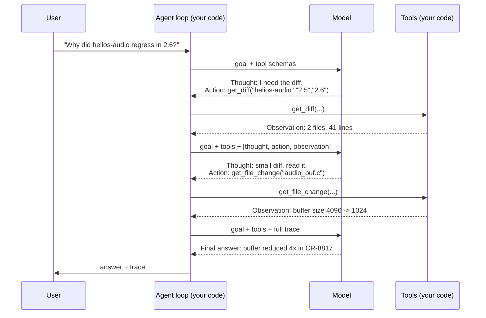

# ReAct — The Thought → Action → Observation Loop

The core agent pattern. This file draws it, traces one worked example step by step, and then builds it in about forty lines of Python **with the loop visible** — because the single most useful thing you can do for your understanding of agents is to write the `while` yourself once.

---

## 1. The pattern

**ReAct** = **Rea**soning + **Act**ing. Instead of reasoning once and then acting, or acting blindly, the model interleaves them:

> **Thought** — what do I know, and what should I do next?
> **Action** — call this tool with these arguments.
> **Observation** — here is what the tool returned.
> …and back to Thought, now with one more fact.

The interleaving is the point. Reasoning without acting produces confident guesses about a world the model cannot see. Acting without reasoning produces a random walk through your tools. ReAct grounds each reasoning step in an observation the previous action actually produced.



Caption: three model calls, two tool calls, one answer. Note that the third model call carries **everything** from the first two — that growth is the cost multiplier from Session 2, made visible.

## 2. Reading a trace — the skill that transfers

Whether or not you write agent code, you will read agent traces. Here is a complete one for the example above, annotated. This is the artifact you debug, review, and — in `07` — assert against in tests.

```text
STEP 1
  Thought:      The user wants a regression cause. I have no data yet.
                Start with the diff between the two releases.
  Action:       get_diff(component="helios-audio", from_rel="2.5", to_rel="2.6")
  Observation:  {"files": 2, "lines_changed": 41,
                 "paths": ["audio_buf.c", "audio_cfg.h"]}
  Tokens in/out: 1,180 / 96

STEP 2
  Thought:      Small diff. Read the buffer file directly rather than bisecting.
  Action:       get_file_change(path="audio_buf.c")
  Observation:  {"change": "AUDIO_BUF_SZ 4096 -> 1024", "ticket": "CR-8817"}
  Tokens in/out: 1,410 / 88

STEP 3
  Thought:      A 4x buffer reduction plausibly explains an audio regression.
                I have a concrete change and a ticket. That is enough to report.
  Action:       (none — final answer)
  Final:        "helios-audio 2.6 reduced AUDIO_BUF_SZ from 4096 to 1024
                 in CR-8817. That is the most likely regression cause.
                 I did not run a test to confirm it."
  Tokens in/out: 1,690 / 141

TOTALS: 3 model calls · 4,280 input tokens · 325 output tokens
        (a single non-agent call on the same question: ~600 in / ~150 out)
```

Four things to notice, and they are the four things to look for in every trace you read:

1. **Input tokens grow every step** (1,180 → 1,410 → 1,690) while the *question* never changes. That growth is the trace being re-sent. This is why cost scales super-linearly in step count.
2. **The Thought is generated text, not a log of the model's internals.** It is a useful and often accurate narration; it is not evidence about what the model "actually did." Treat it as a hypothesis about the reasoning, not a record of it.
3. **The final answer includes what it did *not* do** — "I did not run a test to confirm it." That sentence is there because the system prompt asked for it. It is the single highest-value line in the whole trace, and it does not appear unless you ask for it.
4. **Step 2's decision depended on step 1's observation.** "Small diff, read it directly" is adaptation. Had the diff been 4,000 lines, the correct step 2 was different. That is the property that justified building an agent at all (`02` §4).

## 3. The code — the loop, made visible

Written against the Anthropic Messages API, with no agent framework. The whole point is that you can read the `while`.

```python
"""
A minimal ReAct agent: an LLM in a loop with two read-only tools.

    pip install anthropic

No framework. The loop is the ~15 lines at the bottom of this file, and
that is deliberate: every agent framework you will meet is a wrapper
around this shape with retries, tracing, and opinions added.

⚠️ VERIFY AT DELIVERY: model IDs, SDK parameter names, and the thinking
   parameter shape all drift. They are set in one constant each, on purpose.
"""

import json
from anthropic import Anthropic

client = Anthropic()               # reads ANTHROPIC_API_KEY from the environment
MODEL = "claude-opus-4-8"          # ⚠️ verify at delivery
MAX_STEPS = 6                      # a hard cap. Never run an agent without one.

# ---------------------------------------------------------------------------
# 1. THE TOOLS — plain Python functions. Invented data; nothing real.
# ---------------------------------------------------------------------------

_DIFFS = {
    ("helios-audio", "2.5", "2.6"): {
        "files": 2, "lines_changed": 41,
        "paths": ["audio_buf.c", "audio_cfg.h"],
    },
}
_CHANGES = {
    "audio_buf.c": {"change": "AUDIO_BUF_SZ 4096 -> 1024", "ticket": "CR-8817"},
    "audio_cfg.h": {"change": "added HELIOS_AUDIO_DEBUG flag", "ticket": "CR-8802"},
}


def get_diff(component: str, from_rel: str, to_rel: str) -> dict:
    """Summarise what changed in a component between two releases."""
    return _DIFFS.get((component, from_rel, to_rel), {"error": "no such diff"})


def get_file_change(path: str) -> dict:
    """Describe the change made to one file."""
    return _CHANGES.get(path, {"error": f"no recorded change for {path}"})


TOOL_IMPLS = {"get_diff": get_diff, "get_file_change": get_file_change}

# ---------------------------------------------------------------------------
# 2. THE TOOL SCHEMAS — how the model learns what it may call.
#    The description is not decoration. The model chooses tools by reading
#    it, so a vague description produces wrong calls with wrong arguments.
#    Tool descriptions are prompt engineering wearing a different hat, and
#    they are testable the same way (Session 11, content/03).
# ---------------------------------------------------------------------------

TOOLS = [
    {
        "name": "get_diff",
        "description": (
            "Return a summary of what changed in one component between two "
            "release versions: how many files and lines changed, and which "
            "file paths. Call this FIRST when investigating a regression, "
            "before looking at any individual file."
        ),
        "input_schema": {
            "type": "object",
            "properties": {
                "component": {"type": "string",
                              "description": "Component name, e.g. 'helios-audio'."},
                "from_rel": {"type": "string", "description": "Older release, e.g. '2.5'."},
                "to_rel":   {"type": "string", "description": "Newer release, e.g. '2.6'."},
            },
            "required": ["component", "from_rel", "to_rel"],
            "additionalProperties": False,
        },
    },
    {
        "name": "get_file_change",
        "description": (
            "Describe the specific change made to one file, with the change "
            "request ID. Only call this for a path returned by get_diff."
        ),
        "input_schema": {
            "type": "object",
            "properties": {
                "path": {"type": "string", "description": "File path from get_diff."},
            },
            "required": ["path"],
            "additionalProperties": False,
        },
    },
]

SYSTEM = """You investigate software regressions using the tools provided.

Procedure:
1. Get the diff between releases before looking at individual files.
2. Read only files the diff actually names.
3. Stop as soon as you can name a concrete change that plausibly explains
   the regression. Do not keep exploring for completeness.

Rules:
- Do NOT invent file paths, ticket IDs, or version numbers. Use only values
  that appear in a tool result.
- If the tools do not give you enough to identify a cause, say
  "INSUFFICIENT EVIDENCE" and state exactly what you would need. Do not guess.
- In your final answer, state explicitly what you did NOT verify.
"""

# ---------------------------------------------------------------------------
# 3. THE LOOP. This is the agent.
# ---------------------------------------------------------------------------


def run_agent(question: str, max_steps: int = MAX_STEPS) -> str:
    messages = [{"role": "user", "content": question}]

    for step in range(1, max_steps + 1):
        response = client.messages.create(
            model=MODEL,
            max_tokens=2000,
            system=SYSTEM,
            tools=TOOLS,
            messages=messages,
        )

        # -- observability: one line per step, always. See content/07. ------
        used = [b.name for b in response.content if b.type == "tool_use"]
        print(f"[step {step}] stop={response.stop_reason} tools={used} "
              f"in={response.usage.input_tokens} out={response.usage.output_tokens}")
        for block in response.content:
            if block.type == "text" and block.text.strip():
                print(f"           thought: {block.text.strip()[:120]}")

        # -- the model produced a final answer: we are done -----------------
        if response.stop_reason != "tool_use":
            return "".join(b.text for b in response.content if b.type == "text")

        # -- otherwise: execute every requested tool, append, loop ----------
        messages.append({"role": "assistant", "content": response.content})

        results = []
        for block in response.content:
            if block.type != "tool_use":
                continue
            fn = TOOL_IMPLS.get(block.name)
            if fn is None:
                # An unknown tool is a normal event, not a crash. Tell the
                # model, and let it recover. This is the single most common
                # omission in first-draft agent code.
                out, is_error = {"error": f"unknown tool {block.name}"}, True
            else:
                try:
                    out, is_error = fn(**block.input), False
                except Exception as exc:               # noqa: BLE001 - deliberate
                    out, is_error = {"error": f"{type(exc).__name__}: {exc}"}, True
            print(f"           action:  {block.name}({block.input}) -> {out}")
            results.append({
                "type": "tool_result",
                "tool_use_id": block.id,       # MUST match, or the API rejects the turn
                "content": json.dumps(out),
                "is_error": is_error,
            })

        messages.append({"role": "user", "content": results})

    # -- the cap fired. This is a normal outcome and must be handled. -------
    return (f"STOPPED: step limit ({max_steps}) reached without a final answer. "
            f"Escalate to a human with the trace above.")


if __name__ == "__main__":
    print(run_agent("Why did helios-audio regress between release 2.5 and 2.6?"))

# Expected output (abridged; exact wording varies run to run — that
# variability IS the lesson, see content/07 on non-determinism):
#
# [step 1] stop=tool_use tools=['get_diff'] in=1180 out=96
#            thought: I need to see what changed between 2.5 and 2.6 first.
#            action:  get_diff({'component': 'helios-audio', 'from_rel': '2.5',
#                     'to_rel': '2.6'}) -> {'files': 2, 'lines_changed': 41, ...}
# [step 2] stop=tool_use tools=['get_file_change'] in=1410 out=88
#            thought: Small diff. audio_buf.c is the likely candidate.
#            action:  get_file_change({'path': 'audio_buf.c'})
#                     -> {'change': 'AUDIO_BUF_SZ 4096 -> 1024', 'ticket': 'CR-8817'}
# [step 3] stop=end_turn tools=[] in=1690 out=141
#
# helios-audio 2.6 reduced AUDIO_BUF_SZ from 4096 to 1024 in CR-8817.
# A 4x buffer reduction is a plausible cause of the audio regression.
# NOT VERIFIED: I did not run any test to confirm the link.
```

## 4. Six things in that code that are not optional

New agent code fails in the same six ways. Each of these is one or two lines, and each of them is the difference between a demo and something you would let near a real system.

| # | The line | Why it exists |
|---|---|---|
| 1 | `for step in range(1, max_steps + 1)` | **A hard step cap.** A `while True` agent will, eventually, loop forever, and the bill arrives before the alert does. |
| 2 | The `try/except` around the tool call | A tool that raises must become an **observation**, not a crash. Agents recover from errors they can see; they cannot recover from a stack trace in your process. |
| 3 | `"is_error": True` | Tells the model the result was a failure. Without it, the model reads an error dict as data and reasons from it. |
| 4 | `"tool_use_id": block.id` | Every result must be matched to the call that requested it, or the API rejects the turn. |
| 5 | `messages.append({"role": "assistant", "content": response.content})` — the **full** content | Append the whole content list, not just the text. Dropping the `tool_use` blocks breaks the conversation structure. |
| 6 | The `print` on every step | **Tracing is not a nice-to-have for agents; it is the only way you will ever debug one.** Cheap version: one line per step. Real version: `07`. |

## 5. The tool schema is the interface — treat it like one

Half of agent quality is tool design, and it gets a fraction of the attention that prompt wording does. Three rules earn most of it:

**Write the description for a competent stranger.** The model picks tools by reading descriptions. `"Gets release stuff"` produces calls at the wrong time with the wrong arguments; `"Return a summary of what changed... Call this FIRST when investigating a regression"` produces the ordering you wanted. Note that the description above encodes *procedure*, not just capability — that is deliberate and it works.

**Make the schema strict.** `additionalProperties: False` plus an explicit `required` list turns a class of malformed calls into an API-level rejection instead of a runtime surprise. Where the provider supports constrained decoding for tool inputs, use it — the difference between "please produce this shape" and "this shape is the only one that can be produced" is the difference between a request and a guarantee (Session 10, `content/06`).

**Fewer tools, more specific.** Twelve overlapping tools produce worse behaviour than five distinct ones. If two tools' descriptions could plausibly answer the same need, the model will pick between them semi-randomly, and your trace will be full of near-misses. Merge them or make the boundary explicit in the descriptions.

**Return small, structured results.** Every observation is re-sent on every subsequent step. A tool that returns 8,000 tokens of raw log has just added 8,000 tokens to *every remaining step*. Return the summary and a handle; let the model ask for detail if it needs it.

## 6. Where the frameworks fit

The loop above is roughly what every agent framework does. What they add, and what that costs:

| Framework | Its distinctive idea | What it costs you |
|---|---|---|
| **`smolagents`** (Hugging Face, Apache-2.0) | Minimal core, ~1,000 lines, readable end to end. "Code agents" write their actions as Python rather than emitting tool-call dicts — fewer steps on hard tasks, at the price of executing model-written code (**sandbox it; never run it locally unsandboxed**) | Least lock-in of the three. Genuinely worth reading as *source*, which is why it is this session's follow-on |
| **LangGraph** (MIT library) | Agents as an explicit state machine: State, Nodes, Edges. Makes the control flow reviewable — which, note, pushes you back toward *workflows*, and that is a feature | Real framework lock-in; the free tutorials exist partly to sell the observability product. Learn the concepts, not the API |
| **OpenAI Agents SDK** | Code-first: express orchestration in ordinary code, no graph declared up front. Hand-offs modelled as tools | Vendor-anchored |

They genuinely disagree about the right abstraction, which is a healthy sign for a young field and a bad sign for anyone hoping to pick a winner. **Learn the loop; treat frameworks as replaceable.** The forty lines above will still be the right mental model when today's frameworks have been renamed twice.

---

## What to remember

- **ReAct = Thought → Action → Observation, repeated.** Interleaving reasoning with grounded observations is the whole mechanism.
- **The trace is the artifact.** Reading one is the transferable skill: watch the input tokens grow, watch step *n* depend on step *n−1*, and treat the Thought as narration rather than evidence.
- Six non-optional lines: **step cap · try/except around tools · `is_error` · matched `tool_use_id` · append the full assistant content · trace every step.**
- **Tool descriptions are prompts.** Encode procedure in them, keep schemas strict, keep the tool count low, keep results small.
- Frameworks wrap this loop and disagree about how. Learn the loop.

---

**Next:** `04-plan-execute-and-reflection.md` — two variations on the loop, and an honest account of when each stops paying.
