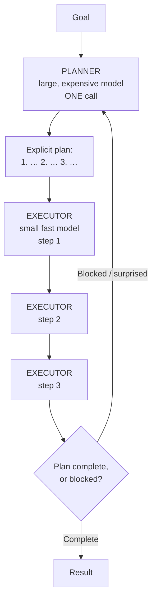
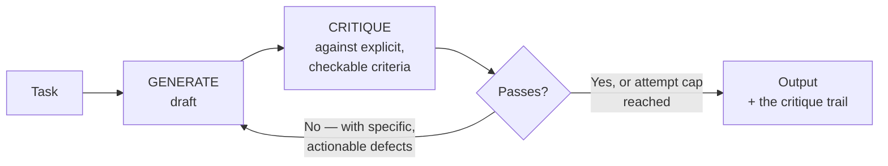
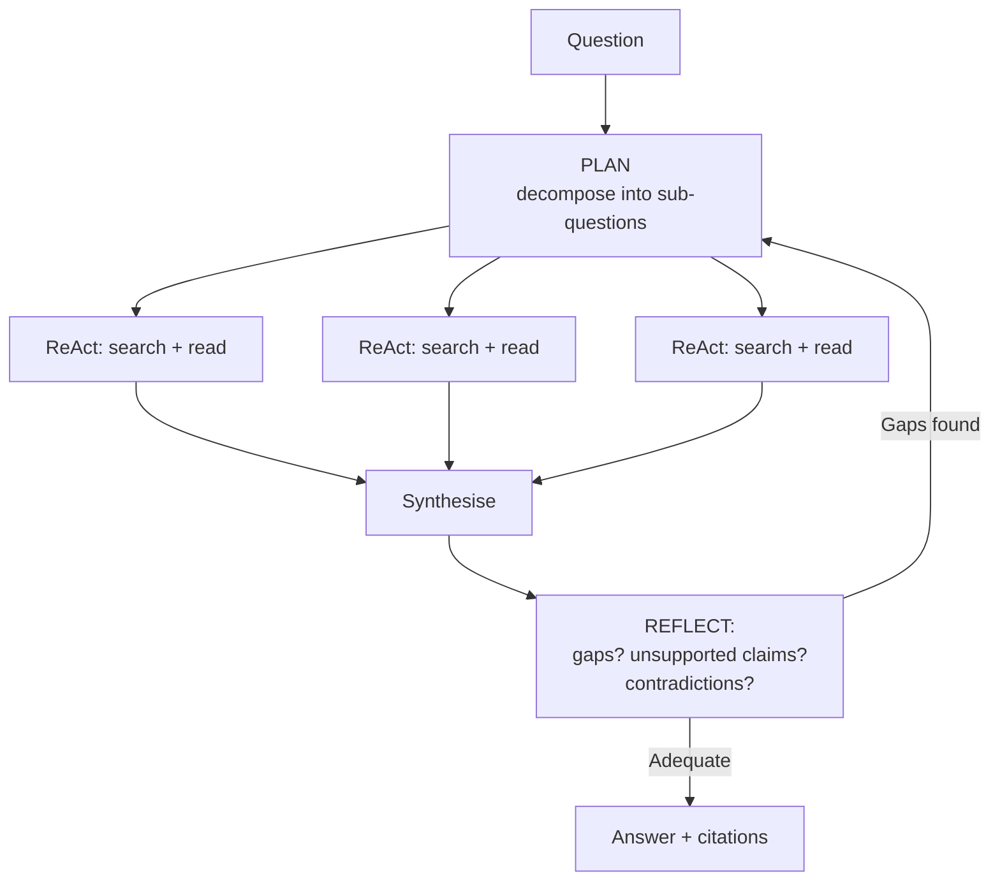

# Plan & Execute, and Reflection

Two variations on the ReAct loop. Both are real improvements on real task shapes, and both are routinely applied where they buy nothing. This file explains the mechanism, the architecture, and — as usual — when each one stops paying.

---

## 1. Plan & Execute — one big model plans, small fast models execute

### The problem it solves

In plain ReAct, the same model decides *the strategy* and *the next tool call*, on every single step, with the full trace in context. That has two costs:

- **You pay premium-model prices for clerical work.** Deciding "call `get_file_change` on the path I just found" is not hard reasoning, and it does not need the model that decided the overall approach.
- **The plan drifts.** With no explicit plan, the strategy is re-derived from scratch each step, from a context that is growing and getting noisier. Long ReAct runs wander.

### The architecture

Caption: one expensive call to plan, N cheap calls to execute, and a re-plan edge for when reality disagrees with the plan. **That re-plan edge is the difference between a design and a toy** — without it, the first surprising observation derails the whole run.

### The economics, worked

Illustrative rates: a large model at $5/M input and $25/M output; a small model at $1/M input and $5/M output. **⚠️ Illustrative only — verify prices at delivery.** An 8-step task, ~2,000 input and ~300 output tokens per step:

| Design | Model calls | Input tokens | Output tokens | Cost |
|---|---|---|---|---|
| Plain ReAct on the large model | 8 | 32,800 | 2,400 | **$0.224** |
| Plan & Execute (1 large plan + 7 small executes) | 8 | 32,800 | 2,400 | **$0.077** |
| Plain ReAct on the small model | 8 | 32,800 | 2,400 | $0.045 |

*Input-token totals assume the growing-trace pattern from Session 2 (`content/05`).*

Roughly a **3× saving** over the large-model loop, and the third row is the row people forget: if the small model can do the whole job unaided, Plan & Execute is a needless complication. **Always measure the third row before building the second.**

### When it pays

| Signal | Verdict |
|---|---|
| The task has a stable, statable plan (research, migration, multi-file refactor) | ✓ Pays |
| Runs are long (10+ steps) — the planner's cost amortises | ✓ Pays |
| Most steps are mechanical once the strategy is set | ✓ Pays |
| The task is 3 steps long | ✗ The planner is pure overhead |
| Every step genuinely changes the strategy | ✗ You will re-plan constantly; use ReAct |
| The small model cannot reliably follow a written step | ✗ You will pay twice — once in tokens, once in failures |

### The honest caveat

Plan & Execute **front-loads a commitment**. A plan written before any observation is a plan written in ignorance. If the first tool result invalidates step 3, a naive executor grinds through steps 3–8 anyway, producing eight steps of confident irrelevance. The re-plan edge is not optional, and deciding *when* to take it — how surprised is surprised enough? — is the hard part of the design, not the plan generation.

---

## 2. Reflection — a critique step before the final answer

### The mechanism

Generate a draft, then have a model criticise the draft against explicit criteria, then revise. Loop, up to a cap.

Caption: the evaluator-optimiser loop. Two decisions carry the whole pattern: **what the criteria are**, and **when to stop**.

### Why it works when it works

Producing and evaluating are different tasks, and a model is measurably better at spotting a specific defect in a concrete artifact than at avoiding it while generating. This is the same asymmetry Session 11 exploited: *"ask for the artifact, not advice about the artifact"* — concrete output generates specific criticism; abstract prompting generates agreement.

### Why it fails when it fails

**Vague criteria produce agreeable noise.** "Is this good?" reliably returns "yes, with minor suggestions" — every time, regardless of the draft. The critique step is only worth its tokens if the criteria are things that can actually fail:

| A criterion that does nothing | A criterion that works |
|---|---|
| "Is the summary accurate?" | "Does every claim in the summary appear verbatim in the source timeline? List any that do not." |
| "Is the code correct?" | "Does it handle an empty input list, a null config value, and a duplicate ticket ID? Show the line for each." |
| "Is this release note clear?" | "Does every entry name a component, a change type, and a ticket ID? List entries missing any of the three." |

The right-hand column produces findings. The left-hand column produces reassurance, which is worse than nothing because it feels like verification.

**A model critiquing itself shares its blind spots.** If the generator hallucinated a plausible ticket ID, the critic — same model, same priors — finds it plausible too. Two mitigations, in order of strength: (a) give the critic **the source material** and make it check claims against it, so the critique is grounded rather than introspective; (b) use a different model as critic. (a) matters much more than (b).

**Diminishing returns arrive fast.** In practice, iteration 1 → 2 is a large gain, 2 → 3 is a small one, and 3+ is usually the model rewording the same content while you pay for it. **Cap at two or three revisions**, and log how often the cap is hit — if it is hit most of the time, your criteria are not achievable and the loop is a token furnace.

### When it pays

| Signal | Verdict |
|---|---|
| There is an **automatic, non-model check** available — compiler, linter, test suite, schema validator | ✓✓ **Strongest case by far.** Ground the critique in a real signal |
| The output has explicit, checkable structure (a schema, a required set of fields) | ✓ Pays |
| The cost of a wrong answer clearly exceeds 2–3× the tokens | ✓ Pays |
| The criteria are subjective ("is it well written?") | ✗ You are paying for agreement |
| A human reviews the output anyway, immediately | ✗ You already have a critic, and a better one |
| It is a latency-sensitive interactive path | ✗ You just tripled time-to-answer |

That first row deserves emphasis: **the best reflection loops are not model-critiques-model at all.** They are generate → run the tests → feed the failures back. The critique is a real signal from a deterministic system, and it costs almost nothing. Reach for a model critic only when no such signal exists.

---

## 3. Combining them — and what "deep research" actually is

The research-assistant products people mean when they say "agent" are usually all three patterns stacked:

Caption: Plan & Execute at the top, ReAct in each branch, Reflection at the bottom, with a re-plan edge. This is the honest architecture behind most "deep research" features — and note that the parallel branches are exactly the orchestrator-workers pattern from `02` §5, which is where the multi-agent argument in `06` lives.

**Every stack multiplies cost.** A three-branch plan with five ReAct steps each and two reflection rounds is roughly 1 + 15 + 4 ≈ **20 model calls**, each carrying an accumulated trace, for one user question. Whether that is extravagant or excellent depends entirely on the question — which is the point.

## 4. Cost per pattern — score cost and quality in the same table

This is the table this course wants you to internalise, because **most agent benchmarks publish only the middle column.** A widely cited critique of the agent-benchmark literature is that essentially none of the major suites incorporate cost into primary scoring — so 88% at **$50/task** ranks identically to 88% at **$0.50/task**. For a corporate audience that pays the bill, that is not a footnote; it is the finding.

| Pattern | Model calls per request | Typical quality vs. a single call | Illustrative cost | Latency | Testability |
|---|---|---|---|---|---|
| Single call | 1 | baseline | 1× | ~1× | High |
| Workflow (fixed chain, 3 steps) | 3 | + on decomposable tasks | ~3× | ~3× | High |
| ReAct agent, 8 steps | 8 | + on data-dependent tasks | **~13×** | 8–15× | Low |
| Plan & Execute (1 large + 7 small) | 8 | ≈ ReAct | ~4× | 8–15× | Low |
| Reflection, 2 rounds | 3 | + where criteria are checkable | ~3× | ~3× | Medium |
| ReAct + Reflection | ~12 | + | ~18× | high | Low |
| "Deep research" stack | ~20 | + on breadth-first questions | ~25× | very high | Very low |
| Multi-agent, parallel subagents | many | **contested — see `06`** | reported **~15×** | high | Very low |

*Cost multipliers follow the growing-trace arithmetic from Session 2 (`content/05`) — they are ratios, not prices. Verify against current rates at delivery.*

Two habits follow, and they are the ones to carry out of this session:

1. **Never report an agent's quality without its cost per task.** Same table, adjacent columns. If a proposal shows you only accuracy, the number you are missing is the one that decides.
2. **Compare designs at equal token budget.** A 20-call architecture beating a 1-call architecture tells you almost nothing. `06` is the case study.

---

## What to remember

- **Plan & Execute:** one expensive planning call, N cheap execution calls, and a **re-plan edge you must not omit**. Pays on long tasks with a stable plan. Always first measure whether the cheap model can just do the whole job.
- **Reflection:** generate → critique against **explicit, failable** criteria → revise, capped at 2–3 rounds. Vague criteria produce agreement, not verification. A self-critique shares the generator's blind spots — ground it in source material, or better, in a real automated check.
- **The strongest reflection loop is not a model critic at all** — it is a compiler, a test suite, or a schema validator.
- Every pattern you stack multiplies calls, and each call carries the whole trace.
- **Score cost and quality in the same table.** Most agent benchmarks do not, and that omission is the single easiest way to be sold an expensive architecture.

---

**Next:** `05-when-not-to-build-an-agent.md` — the most important file in this session for this audience.
