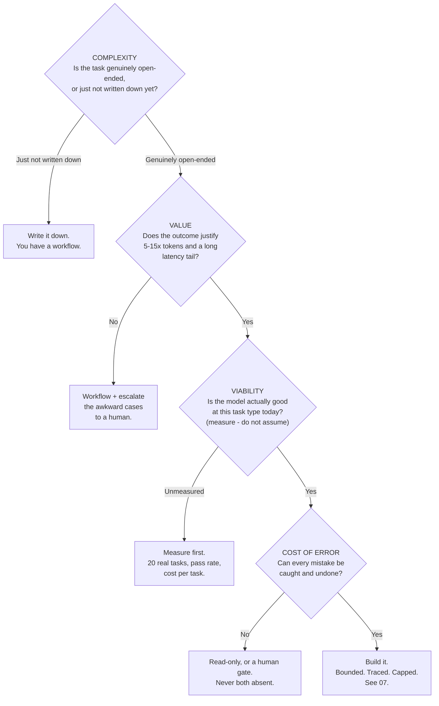

# When NOT to Build an Agent

The most important file in this session for a release, problem, or configuration function. The default answer to "should this be an agent?" is **no**, and this file gives you the reasoning to say so without sounding like you are blocking progress.

---

## 1. The rule

> **If a deterministic script can do it, use the script.**

Not "consider the script." Use it. A `for` loop over a database query is free, instant, correct every time, testable with an `assert`, reviewable in a pull request, and produces the same output on Tuesday as it did on Monday. An agent has none of those properties and costs money per run.

The extended form, which is the version to say out loud in a design review:

> **If a deterministic script works, use the script. If a script plus one model call works, use that. If a workflow works, use the workflow. Reach for an agent only when the *sequence of steps itself* depends on what you find — and even then, start read-only and behind a human gate.**

## 2. The decision table

Take this into a meeting.

| Signal in the proposal | Verdict | What to build instead |
|---|---|---|
| "It's the same five steps every time, but with edge cases" | **Not an agent** | A script, or a workflow. Edge cases are `if` statements, not autonomy |
| "It needs to look at data and decide" — but the decision is a classification | **Not an agent** | One model call with a strict output schema |
| "It has to handle unstructured input" | **Not an agent** | Extraction is a single call. Unstructured *input* ≠ variable *path* |
| "The steps depend on what it finds, and we genuinely cannot enumerate them" | **Possibly an agent** | Read-only agent first, human gate, capped steps |
| "It should run overnight without supervision" | **Not yet** | That is the *reward*, not the starting point. Earn it with a measured failure rate |
| "It needs to fix the problem, not just find it" | **Only behind a gate** | Agent proposes; a qualified human approves; the system executes |
| "Our competitor has one" | **No** | — |
| "It would let us cut the review step" | **Emphatically no** | The review step is the control that makes the rest defensible |
| "We tried a workflow and it was too rigid" | **Ask which part** | Usually one node needs agency, not the whole pipeline (`02` §5) |
| "The demo was amazing" | **Ask for the failure rate** | A demo is one trajectory. See `07` on pass^k |

## 3. Five concrete cases from this team's world

### Case 1 — "Generate the weekly release dashboard"

Query the release database, aggregate by component, render a table, email it.

**Verdict: deterministic script. No LLM at all.** Every step is known, the output is structured, and correctness is checkable. Adding a model here converts a reliable report into an unreliable one and bills you for the privilege. If someone wants prose commentary on top, that is *one* model call at the end, on data the script already computed — and even then a human should read it before it goes out.

### Case 2 — "Classify and route incoming defect reports"

Read the description, assign severity, route to a team, draft an acknowledgement.

**Verdict: workflow.** Three model calls in a fixed order: classify (strict schema, constrained output), look up the routing rule (that is a table lookup, not a model), draft (a prompt). You can test each node independently with the twenty-case suite from Session 11. An agent here buys nothing and costs an order of magnitude — the sequence never varies, so there is nothing for autonomy to do.

### Case 3 — "Check whether this configuration change violates policy"

**Verdict: workflow with retrieval.** Retrieve the relevant policy sections, compare, output a verdict with cited evidence and an explicit `INSUFFICIENT_EVIDENCE` option. Retrieval is not agency. The tempting agent version — "let it explore the policy repository until it is satisfied" — makes the result non-reproducible, which is precisely the property a compliance check must not have. **If two runs of your compliance check can disagree, it is not a compliance check.**

### Case 4 — "Find out why component X regressed in release 2.6"

**Verdict: this one is genuinely an agent** — read-only, capped, gated.

Why it qualifies: the path is data-dependent in a way you cannot enumerate. Empty diff → look at configuration and dependencies. Huge diff → bisect, for an unknown number of steps. Dependency changed → fetch a changelog you did not know you needed. That is the property from `01` §4, and it is rare.

Even so, the constraints are heavy: **read-only tools only** (it reads diffs, it does not write branches), **a step cap**, **full tracing**, and the output is a *hypothesis a human confirms*, never a conclusion the pipeline acts on.

### Case 5 — "Reproduce a customer failure and open a fix pull request"

**Verdict: an agent, and the best-justified one on this list** — but only because of a property that has nothing to do with the model.

It qualifies on complexity (genuinely open-ended) and value (an engineer-day per instance). What makes it *viable* is the fourth gate from `02`: **errors are cheap and recoverable.** A bad PR is caught by review, by tests, and by CI. Nothing reaches production without a human. The blast radius is bounded by machinery you already own.

Change one detail — let it merge its own PR — and it fails the gate immediately. Same model, same task, same tools: the difference is entirely in what it is permitted to do.

## 4. The four questions, in order

Before agreeing to build one, get an explicit answer to each.

Caption: complexity, value, viability, cost of error. A "no" anywhere means step down. Note that even the success path lands in `07`, not in production.

## 5. Six honest reasons agents fail in production

Not model failures. Design failures — and each one is more common than the model being wrong.

| # | Failure | What it looks like | The fix |
|---|---|---|---|
| 1 | **The task was never agentic** | It works, it just costs 15× what the workflow would have | The four questions, asked before building |
| 2 | **Compounding error** | Works for 3 steps, degrades past 8 (see `01` §5) | Fewer steps. Checkpoints. A human at the boundary |
| 3 | **Unbounded cost** | A retry storm, or one pathological input that loops | Step cap, token cap, wall-clock cap, per-tenant budget |
| 4 | **Nobody can debug it** | "It did something weird on Tuesday" and there is no trace | Tracing from day one, not after the first incident |
| 5 | **Silent tool failure** | A tool returns `{}` on error; the model reasons from nothing and produces a confident answer | Errors surface as explicit error observations (`03` §4) |
| 6 | **No stop condition anyone agreed on** | It declares success early, or never | An explicit success criterion in the prompt, and a cap that logs when it fires |

Notice that only #2 involves the model at all. **Agent failures are overwhelmingly engineering failures**, which is good news: they are the kind of problem this audience already knows how to fix.

## 6. The counter-argument, taken seriously

The honest objection: *"If we never build one, we never learn, and the capability is genuinely improving."* That is correct, and this file is not an argument for never.

The constructive version:

- **Build one, deliberately, on a low-stakes read-only task.** Case 4 above is a good candidate. Treat it as a measurement exercise, not a product.
- **Instrument it properly from the first day** — pass rate over 20 real tasks, cost per task, steps per task, and how often the cap fires.
- **Re-run the same 20 tasks after every model change.** That is your only defence when the ground moves under you.
- **Then decide with numbers**, not with the memory of a good demo.

That is a materially different activity from "we are building an agent platform," and it is the one worth doing.

---

## What to remember

- **If a deterministic script works, use the script.** Not "consider" — use.
- The default answer is **no**. Agents earn their place only when the *step sequence itself* is data-dependent.
- Four gates in order: **complexity, value, viability, cost of error.** One "no" and you step down a rung.
- **Read-only before acting. Gated before autonomous. Measured before trusted.**
- Agent failures in production are overwhelmingly **engineering** failures — unbounded loops, missing traces, silent tool errors, no agreed stop condition — not model failures.
- If you build one to learn, instrument it and measure it. A demo is one trajectory.

---

**Next:** `06-the-multi-agent-evidence.md` — where the vendors contradict each other, and what that teaches about reading any AI claim.
