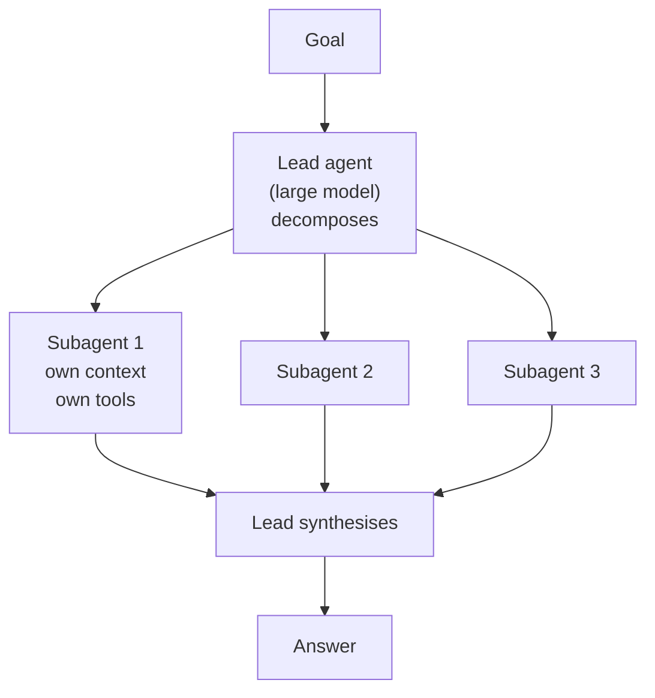
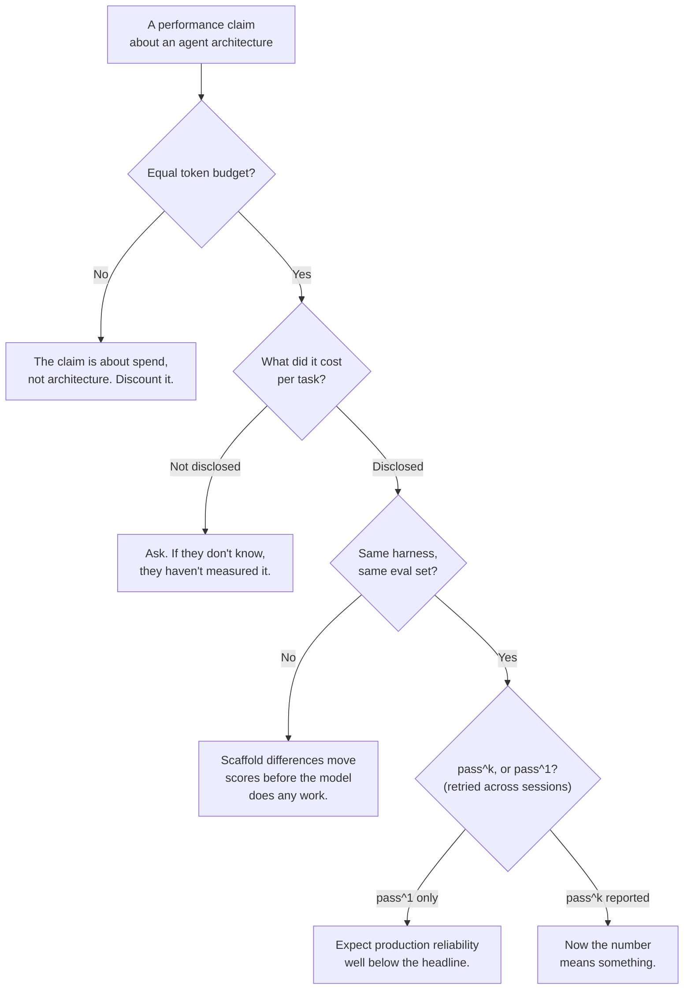

# The Multi-Agent Evidence — How to Read a Vendor Claim

This is the best critical-thinking material in the whole series, because for once the evidence is public, the parties are named, and **they contradict each other flatly.** The technique you take away — *was this compared at equal budget?* — outlives every architecture in this session.

> **Licence note.** Every source in this file is all-rights-reserved vendor writing or academic work. Nothing here is reproduced. The claims are stated in our own words and attributed by organisation; the numbers are facts, which are not copyrightable. **Do not put vendor prose or figures on a slide.** See `resources/sources.md`.

---

## 1. What "multi-agent" means

One agent orchestrates others. A lead agent decomposes a goal, spawns subagents with their own contexts and tools, and synthesises what they return. Architecturally it is the orchestrator-workers pattern from `02` §5, with the workers being agents rather than single calls.

The stated case for it is **context isolation**: each subagent gets a clean window for its slice, so no single context accumulates everything and degrades. The stated case against it is **coordination cost**: subagents cannot see each other's assumptions, so they make incompatible decisions that a later step must reconcile.

Both arguments are correct. That is why the evidence is a mess.

## 2. The disagreement, in four acts

### Act 1 — the positive result (mid-2025)

A frontier lab reported that a multi-agent research system — a large lead model plus smaller subagents — **outperformed the equivalent single agent by about 90%** on their internal research evaluation. It worked best on **breadth-first** queries: questions that decompose into several independent lines of enquiry pursued in parallel (*"identify every board member across these 500 companies"*).

That is a big number from a serious team, and taken alone it looks decisive.

### Act 2 — the caveat, in the same document

The same write-up reports, to the authors' considerable credit, that:

- **Token usage alone explained roughly 80% of the performance variance** across their configurations. The remaining variance came from the number of tool calls and the model choice.
- The multi-agent system consumed roughly **15× more tokens** than a chat interaction.

Sit with that. The paragraph that announces a 90% architectural win also reports that **the dominant explanatory variable was how many tokens were spent.**

So the honest question is not "does multi-agent beat single-agent?" It is:

> **Did the architecture win, or did fifteen times the token spend win?**

Their own variance decomposition suggests: largely the latter.

**This is the exercise.** Not the number — the habit of reading past the headline to the paragraph that qualifies it. It is in the source document, published by the party with the least incentive to publish it. If a vendor's own write-up does not contain a paragraph like that, the appropriate response is not comfort; it is suspicion.

### Act 3 — the flat contradiction (mid-2025, days later)

Another lab published, essentially, **"Don't Build Multi-Agents."** Their position, from building a coding agent: keep it single-threaded, and use a separate compression model to manage context rather than splitting the work across agents.

Two principles they articulated are worth carrying regardless of which side you end up on:

1. **Share context thoroughly** — and share *full traces*, not individual messages. A subagent given a task description but not the reasoning behind it will make locally reasonable, globally wrong choices.
2. **Actions carry implicit decisions, and conflicting decisions produce bad results.** Parallel agents with no visibility into each other's assumptions make incompatible choices — an inconsistent interface here, a different data format there — and something downstream has to reconcile them. That reconciliation is the coordination cost, and it is often larger than the parallelism saved.

Their conclusion was that in 2025, parallel multi-agent systems were **fragile**, with the caveat that better context compression might eventually change that.

### Act 4 — the reversal (early 2026)

The same lab later shipped a coordinator that scopes work, assigns pieces to managed sub-instances in isolated environments, and compiles the results.

Their justification: **context accumulates, focus degrades, and the quality of each subtask suffers.**

That is the isolation argument. It is the argument the *first* lab made. The post does not retract the earlier essay by name, but the architectural concession is unambiguous.

### The scoreboard

| | Lab A (mid-2025) | Lab B (mid-2025) | Lab B (early 2026) |
|---|---|---|---|
| Position | Multi-agent wins on breadth-first work | Don't build multi-agents | Shipped a coordinator |
| Mechanism cited | Context isolation | Coordination cost, conflicting decisions | **Context isolation** |
| Own caveat | ~80% of variance is tokens; ~15× cost | Compression may change this | Earlier essay not retracted |

## 3. The neutral research — which undercuts the *pro* side hardest

Independent work has the useful property of no product to sell.

- **Production measurement studies and independent agent-scaling research** report that multi-agent systems frequently perform **worse** than single agents because of coordination overhead, and that adding more agents or more compute often **degrades** performance rather than improving it. That is counterintuitive and it is the finding.
- **The decisive result for teaching:** several 2026 preprints report that **when total thinking-token budget is held equal, a single agent matches or beats a multi-agent setup** on multi-hop reasoning tasks.

Which gives the one-sentence summary of the entire literature:

> **A good part of what looks like coordination winning is really just more tokens winning.**

That single sentence, plus the question it implies, is the transferable content of this file.

## 4. So what should you actually do?

Four conclusions, in descending order of confidence.

**1. Default to a single agent, or to a workflow.** Note that this is the one point on which *both* labs agree, despite disagreeing about everything else. Both say start simple. When two parties with opposite conclusions agree on the starting position, that starting position is well supported.

**2. Multi-agent earns its place in a narrow band:** breadth-first, genuinely parallelisable work, where subtasks are independent, where context isolation is a real benefit and not a rationalisation — **and where you can afford roughly 15× the tokens.** Note that "identify all X across N sources" fits. "Write this feature" does not: writing a feature is full of decisions that must be consistent with each other, which is exactly what parallel agents are bad at.

**3. Watch for context accumulation and focus degradation.** This is the one mechanism *both camps converged on independently*, from opposite directions. Independent convergence is the strongest signal available in a literature this young, and it is stronger evidence than either headline result.

**4. Always ask the question.** Which brings us to the real deliverable.

## 5. The four questions that dissolve most agent claims

Take these into any vendor meeting, any internal proposal, any conference talk.

Caption: four questions. Most claims fail at the first.

**Question 1 — equal token budget?** The one that does most of the work. If architecture A spends 15× what B spends, "A beat B" is a statement about budget.

**Question 2 — cost per task?** Essentially none of the major agent benchmarks incorporate cost into primary scoring, so **88% at $50/task ranks identically to 88% at $0.50/task.** For anyone who pays the bill, those are not the same result. Ask for the column. If they do not have it, that is itself the answer.

**Question 3 — same harness?** Agent scores swing with the **scaffold**, not just the model. The harness controls which tools are exposed, how errors are surfaced, and how many retries are allowed — the prompt and planning loop can add or subtract points before the model does any real work. A comparison across different harnesses is not a comparison of models.

**Question 4 — pass^1 or pass^k?** Run-to-run variance in agents is large. **pass^k scores — requiring success on all *k* independent attempts — commonly run 15–25 points below pass^1.** So a **90% benchmark score can mean roughly 70% production reliability** when the same task is retried across sessions. This is the most important number in the whole session, and it is the one that most reliably surprises people who have only seen the leaderboard.

## 6. Why this matters beyond agents

The pattern generalises, and it is worth naming explicitly because you will meet it again next quarter with a different noun:

1. A vendor publishes an impressive architectural result.
2. The same document contains the confound — if you read past the headline.
3. A competitor publishes the opposite advice, from real experience.
4. Neutral research finds both overstated the architecture and understated the resource.
5. Eighteen months later the positions converge, quietly, without anybody retracting anything.

**The durable skill is not knowing whether multi-agent works.** It is asking *"compared against what, at what budget, measured how, and by whom?"* — and being willing to hold "the evidence does not settle this" as a position. In a field where every party has a product, that position is often the accurate one.

---

## What to remember

- **Two major labs published flatly opposing advice within days of each other. One later reversed. Neither retracted.**
- The headline **+90% multi-agent result** sits in a document that also reports **token usage explained ~80% of the variance** at **~15× the tokens**. Read the caveat paragraph; it is always there in good work and always missing in bad.
- **Neutral, equal-token-budget research finds the architectural advantage largely evaporates.**
- Both camps agree on exactly one thing — **start simple** — and converged independently on one mechanism: **context accumulation degrades focus.** Those are the two best-supported claims in the literature.
- **The four questions:** equal token budget? cost per task? same harness? pass^k or pass^1?
- **A 90% benchmark score is roughly 70% production reliability**, and mistakes compound over multi-step tasks.

---

**Next:** `07-production-concerns.md` — bounding, tracing, cost, testing a non-deterministic system, and the human gate.
