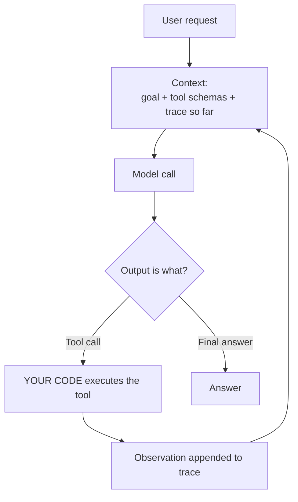

# Slides Outline — Session 12: Agents and Tool Use

Slide-by-slide spec for the deck-builder. Build per `../../powerpoint_instructions.md` (layout, palette, type, accessibility, licence footers). Speaker notes go in the Notes pane, never on the slide. Mermaid sources are given in the **Visual** field for the builder to render in-palette, with alt text.

**Deck size:** 1 title + 1 agenda + 18 content + 1 discussion + 1 resources = **22 slides.** Target 45 minutes.

---

## Deck-builder notes — read before building

**1. Licence position.** Almost everything on these slides is original course material — every diagram, table, code block, trace, and worked example was written for this course. **SLIDE-SAFE, no external attribution needed** beyond the course itself. Four exceptions:

- **Slide 6 (workflow/agent distinction) and slide 8 (composition patterns)** paraphrase a framing from Anthropic's *Building Effective Agents*. **LINK-ONLY.** The words on the slide are ours; the concept is attributed in a footer line: *"framing after Anthropic, 'Building Effective Agents' — paraphrased."* **Do not reproduce their prose or figures.**
- **Slides 14–17 (multi-agent evidence)** cite vendor and academic findings. **Numbers are facts and may be stated. Prose and figures may not be reproduced.** Attribute by organisation, not by quotation.
- **`smolagents` / Hugging Face Agents Course** (slide 12, slide 22) — **SLIDE-SAFE**, Apache-2.0. Footer: "smolagents · Hugging Face · Apache-2.0".
- **MCP** (referenced on slide 5) — **SLIDE-SAFE**, open standard. Footer: "Model Context Protocol · Agentic AI Foundation (Linux Foundation)".

**2. The trace on slide 10 must be pre-baked.** Capture a real agent run in advance — thoughts, actions, observations, and per-step token counts — and build it as a **progressive reveal, one step per click.** Do **not** run an agent live. A live run either takes four silent minutes or fails interestingly, and neither is the lesson. Have the captured trace in the deck and, if you want a live element, run it in the Q&A where a failure is a discussion rather than a derailment.

**3. Pacing.** 18 content slides in 45 minutes is ~2.5 min each with no slack. If behind at slide 13, compress slide 11 (Plan & Execute) to a single sentence over the diagram and drop slide 18 (failure modes) to a name-check. **Protect slides 13 (when NOT to) and 14–17 (the evidence).** Those two blocks are the session.

**4. Currency tag.** Slides 10, 12, 19 and 20 carry a persistent corner tag: **"Verify model names, framework APIs, and prices at delivery."** Build it into the layout. Note also that the MCP final specification publishes **2026-07-28** — if delivering before that date, say so at slide 5.

**5. Every cost figure is illustrative.** Slides 12 and 19 carry an "illustrative — recompute at delivery" footer. They are ratios from one worked scenario, not prices.

---

## Slide 1 — Title

- **On-slide text:** "Agents and Tool Use" · Session 12 · Application block · AI Training Series. Subtitle: *"An LLM in a loop, with the ability to act."*
- **Speaker notes:** Six sessions have used this word and moved on. Tonight we define it, build one, and then spend most of the hour arguing that you probably should not. Say up front that the strongest recommendation in this session is "don't" — it sets the tone and it is true.
- **Visual:** Series title layout.
- **Source/licence:** none (original).

## Slide 2 — Agenda

- **On-slide text:** What an agent is → workflows vs. agents → ReAct, built by hand → Plan & Execute, Reflection → when NOT to → the multi-agent evidence → production → hand-off to Session 14. "45 min + 15 min Q&A."
- **Speaker notes:** Mirror the README minute budget. Flag that the middle block (when not to build one) and the evidence block are the parts they cannot reconstruct from the reading, and that the reading in `content/` is deliberately larger than the session.
- **Visual:** Agenda table matching the README.
- **Source/licence:** none.

## Slide 3 — Hook: three things called "an agent"

- **On-slide text (headline is a claim):** "Two of these are not agents." Three short, realistic product descriptions, unlabelled: (a) a ticket triage pipeline — classify, route, draft, hand to a human; (b) a chat assistant that looks up an order status and answers; (c) a system given "find out why component X regressed" and eight tools, which runs until it decides it is done.
- **Speaker notes:** Do not resolve it. Ask for hands on each. The room will split, and the split is the point — the word has been used for four different things this quarter. Say: by the end of the next six minutes you will be able to sort these in about twenty seconds, and that skill is worth more than anything else tonight.
- **Visual:** Three-card layout, no labels, no verdicts. Verdicts appear on slide 7.
- **Source/licence:** original (invented product descriptions).

## Slide 4 — The definition

- **On-slide text:** "An agent is an LLM wired to a loop and given the ability to act." Three bullets: **Autonomy** — many steps, no check-in · **Decision-making** — it chooses the action · **Adaptation** — step *n* depends on what step *n−1* saw. One line beneath: *all three, or it is something else.*
- **Speaker notes:** The formal definition — a semi-autonomous system that interacts with an environment, decides, and acts on a user's behalf — predates LLMs by decades. The mechanical version is the useful one, because it names the two things you actually add: a loop, and the ability to act. It is a control-flow decision, not a capability upgrade. Nobody buys a smarter model when they build an agent; they change where the `while` lives.
- **Visual:** Three-property layout with the one-line definition as the headline.
- **Source/licence:** original.

## Slide 5 — The loop

- **On-slide text:** "The only new arrow is Observation → Context." Diagram only.
- **Speaker notes:** Walk the diagram once. Four things to land: (1) your code still executes every tool — the model only ever emits a request against a schema, which is the Session 11 point and the whole security posture; (2) the model decides which branch of the diamond is taken; (3) there is no natural end, so every production agent needs a cap; (4) the trace grows every iteration, and that is where Session 2's ~13× cost multiplier comes from. If delivering before 2026-07-28, note that the MCP details from Session 11 are against a release candidate.
- **Visual:**

- **Source/licence:** original. Footer if MCP is named: "Model Context Protocol · Agentic AI Foundation (Linux Foundation)".

## Slide 6 — Workflows vs. agents

- **On-slide text (claim headline):** "Who wrote the control flow?" Two columns. **Workflow:** LLMs and tools orchestrated through predefined code paths — you wrote the sequence, you can read it. **Agent:** the model dynamically directs its own process and tool usage.
- **Speaker notes:** This is the single most useful framing in the agent literature, and it has an unusual provenance worth naming: it comes from a vendor whose business is selling agents, telling you to build fewer of them. A vendor arguing you should buy less of its product is a credibility signal — weight it accordingly. Land the key consequence: a ten-node graph with conditional edges is still a workflow if you drew the graph, and that is a compliment.
- **Visual:** Two-column diagram (`content/02` §1 Mermaid): the workflow chain on the left, the model-decides loop on the right.
- **Source/licence:** **framing after Anthropic, "Building Effective Agents" — paraphrased, LINK-ONLY. Do not embed their text or figures.**

## Slide 7 — Sort the three from slide 3

- **On-slide text:** The slide-3 table, now with verdicts: **workflow · tool call · agent.** Plus the one-minute test: *Can I draw the steps in advance?* → workflow. *Does the number of steps depend on what it finds?* → agent.
- **Speaker notes:** The room mostly gets this right once the test is stated. Add the commercial observation: most things marketed as agents are the workflow row. That is not an accusation of bad faith — "workflow with LLM steps" is a less exciting phrase for what is, in fact, the better design.
- **Visual:** The slide-3 cards with verdict badges revealed on click.
- **Source/licence:** original.

## Slide 8 — Every row favours the workflow except one

- **On-slide text:** Comparison table, abbreviated to 8 rows: steps per request · cost · latency · debuggability · testability · reviewability · blast radius · **data-dependent step sequences**. Last row highlighted as the only agent win.
- **Speaker notes:** Read the table top to bottom and then land the last row hard. That one row is the entire case for agents. It is a real case — but it is one row, and the corollary people resist is that if you can enumerate the steps, enumerating them in code is not a failure of ambition. It is the correct engineering answer.
- **Visual:** Table layout. Highlight the final row with shape and label, not colour alone.
- **Source/licence:** original.

## Slide 9 — The decision flowchart

- **On-slide text:** Diagram only. Headline: "Three of five exits say *don't*."
- **Speaker notes:** Walk the four gates: complexity, enumerability, value, cost of error. Emphasise gate 1 — "can a deterministic script do this without an LLM?" — because it is the one nobody asks. Point out that even the success path lands in "bounded, capped, traced," not in production.
- **Visual:** The decision flowchart from `content/02` §3.
- **Source/licence:** original.

## Slide 10 — A real trace, one step per click

- **On-slide text:** The pre-baked trace: Step 1 thought/action/observation + tokens, Step 2, Step 3 final answer. Revealed one step per click.
- **Speaker notes:** **This is the pre-baked reveal — do not run it live.** Point at four things as they appear: input tokens grow every step while the question never changes (that is the cost multiplier, made visible); the Thought is generated narration, not a log of the model's internals; step 2's decision — "small diff, read it directly" — depended on step 1's observation, which is the adaptation that justified building an agent at all; and the final answer says what it did *not* verify, which only appears because the system prompt asked for it. That last line is the most valuable sentence in the trace.
- **Visual:** Monospace trace block, progressive reveal, token counts in a right-hand gutter.
- **Source/licence:** original (invented components and ticket IDs). **Currency tag.**

## Slide 11 — The loop in forty lines

- **On-slide text:** Six labelled call-outs on a condensed code block: **step cap · try/except around tools · `is_error` · matched `tool_use_id` · append the full assistant content · trace every step.**
- **Speaker notes:** Do not read the code. Show that the loop fits on a slide, then spend the time on the six call-outs — every one of them is one or two lines, and every one is the difference between a demo and something you would let near a real system. The two people miss most: a tool that raises must become an *observation*, not a crash; and a step cap, because a `while True` agent will eventually loop forever and the bill arrives before the alert does.
- **Visual:** Condensed Python from `content/03` §3 with numbered call-out bubbles. Full listing goes in the handout, not on the slide.
- **Source/licence:** original. Follows Anthropic Python SDK (MIT) usage patterns. **Currency tag.**

## Slide 12 — Plan & Execute, and Reflection

- **On-slide text:** Two small architecture diagrams side by side. Under Plan & Execute: *"~3× cheaper — but first check whether the cheap model can just do the whole job."* Under Reflection: *"'Is this good?' returns 'yes, with minor suggestions.' Every time."*
- **Speaker notes:** Two variations, two honest caveats. Plan & Execute front-loads a commitment made in ignorance, so the re-plan edge is not optional. Reflection only works with explicit, failable criteria — and the strongest reflection loop is not a model critic at all, it is a compiler, a test suite, or a schema validator. A model critiquing itself shares its own blind spots.
- **Visual:** The two Mermaid architectures from `content/04` §1 and §2, side by side.
- **Source/licence:** original. **Currency + illustrative-cost tag.**

## Slide 13 — When NOT to build an agent

- **On-slide text (the slide people photograph):** "If a deterministic script works, use the script." Then the decision table, five rows: *"same five steps with edge cases"* → not an agent · *"needs to look at data and decide"* → one call with a schema · *"steps depend on what it finds"* → possibly · *"should run overnight unsupervised"* → not yet, that's the reward not the start · *"would let us cut the review step"* → emphatically no.
- **Speaker notes:** **The most important slide in the session for this room; never cut it.** Land the last row hardest: the review step is the control that makes the rest defensible, so "it removes the review" is an argument against, not for. Give the four questions to take into a meeting: what are the steps and can you draw them; how many runs a day at twelve model calls each; when it's wrong, who finds out; does it act or does it propose. Not one of those four questions is about the model.
- **Visual:** Table layout, the headline in the largest type on the slide.
- **Source/licence:** original.

## Slide 14 — Two labs, opposite advice, days apart

- **On-slide text:** Timeline, four beats: **mid-2025** Lab A — multi-agent beats single-agent by ~90% on their eval · **mid-2025** Lab B — *"Don't build multi-agents"* · **2026** Lab B ships a coordinator · **2026** neutral research: at equal token budget, the advantage largely evaporates.
- **Speaker notes:** Set it up as a puzzle, not a conclusion. Two serious teams, opposite advice, within days. One later reversed without retracting. Say plainly: this session will not tell you who is right, because the evidence does not settle it — and holding "unsettled" as a position is the accurate stance, not a cop-out.
- **Visual:** Four-beat horizontal timeline. **Organisations named; no logos, no quotations.**
- **Source/licence:** vendor engineering posts — **LINK-ONLY, paraphrased.** Numbers stated as fact; no prose or figures reproduced.

## Slide 15 — The paragraph that reframes everything

- **On-slide text:** Three lines, large: **"+90% over single-agent."** · **"Token usage alone explained ~80% of the variance."** · **"~15× the tokens."** Then one question, largest: **"Did the architecture win, or did 15× the spend win?"**
- **Speaker notes:** **The best two minutes in the session.** All three facts come from the *same* write-up, published by the party with the least incentive to publish the second and third. Credit that honesty explicitly — then use it. The transferable lesson is not the number; it is the habit of reading past the headline to the paragraph that qualifies it. If a vendor's own write-up does not contain a paragraph like that, the right response is not comfort. It is suspicion.
- **Visual:** Progressive reveal, one line per click, ending on the question. Quote slide layout — but these are **our sentences summarising their reported figures**, not their prose.
- **Source/licence:** figures attributed to the publishing lab; **paraphrased, LINK-ONLY.**

## Slide 16 — What both camps agree on

- **On-slide text:** Two agreements: **"Start simple."** · **"Context accumulates; focus degrades."** One line beneath: *when parties with opposite conclusions converge, that convergence is the strongest signal in the literature.*
- **Speaker notes:** This is the constructive slide after the demolition. Both labs, from opposite directions, reached these two. That independent convergence is better evidence than either headline result. Give the narrow band where multi-agent does earn its place: breadth-first, genuinely parallel, independent subtasks, isolation is a real benefit not a rationalisation, and you can afford ~15× tokens. "Identify all X across N sources" fits. "Write this feature" does not — a feature is full of decisions that must be consistent with each other, which is exactly what parallel agents are bad at.
- **Visual:** Two-panel agreement layout.
- **Source/licence:** paraphrased, attributed by organisation. **LINK-ONLY.**

## Slide 17 — The four questions

- **On-slide text:** **1.** Equal token budget? **2.** Cost per task? **3.** Same harness, same eval set? **4.** pass^k or pass^1? Then the number: **a 90% benchmark score ≈ 70% production reliability.**
- **Speaker notes:** The take-home. Question 1 dissolves most claims on its own. On question 2: essentially no major agent benchmark incorporates cost into primary scoring, so 88% at $50 a task ranks identically to 88% at 50 cents a task — for a room that pays the bill, that is the finding, not a footnote. On question 4: pass^k, requiring success on all k attempts, commonly runs 15–25 points below pass^1. That gap is the most important number in the session.
- **Visual:** Four-question decision flowchart from `content/06` §5, with the pass^k number as a callout.
- **Source/licence:** benchmark critique findings cited as fact; no figures reproduced.

## Slide 18 — Production: bound · trace · cost · test · gate

- **On-slide text:** Five controls, one line each. **Bound** — tools (read-only first, least privilege in code), loop (step/token/time/per-tool caps), consequences (staging, reversible). **Trace** — every step, day one. **Cost** — cache the stable prefix; latency is a tail. **Test** — properties not trajectories; k runs; twenty real tasks. **Gate** — qualified, blocking, checkable.
- **Speaker notes:** Two lines to land. First: least privilege belongs in code, never in a prompt — a system prompt saying "never touch prod" is a suggestion; a service account without prod access is a control. Second: the better the agent gets, the harder the gate is to staff, because a human approving a stream of correct actions stops reading. So design the output to be *checkable*: small diffs, cited evidence, an explicit list of what was not verified. "Done ✅" is not gateable no matter who is standing next to it.
- **Visual:** Five-icon row with one line each. Icons paired with labels (never colour alone).
- **Source/licence:** original.

## Slide 19 — Cost per pattern

- **On-slide text:** The cost table, six rows: single call 1× · workflow (3 steps) ~3× · ReAct 8 steps **~13×** · Plan & Execute ~4× · ReAct + Reflection ~18× · multi-agent **reported ~15×**. Columns: calls, cost multiplier, latency, testability. Footer: *illustrative ratios — recompute at delivery.*
- **Speaker notes:** Session 2's meter, applied. The habit to carry out of this room: never report an agent's quality without its cost per task, in the same table, adjacent columns. If a proposal shows you only accuracy, the number you are missing is the one that decides.
- **Visual:** Table. **Illustrative + currency tags.**
- **Source/licence:** original arithmetic, built on Session 2's model.

## Slide 20 — Failure modes, by name

- **On-slide text:** Seven rows, symptom → control: looping · premature stop · tool thrash · silent tool failure · context poisoning · goal drift · cap thrash.
- **Speaker notes:** Only one of these is a model problem. The rest are engineering problems — which is good news for this room, because they are the kind of problem you already know how to fix. Flag cap thrash specifically: if the cap fires on most runs, that is not a cap problem, it is the task telling you it was never agentic.
- **Visual:** Two-column table. Compress to a name-check if running behind.
- **Source/licence:** original. **Currency tag.**

## Slide 21 — Hand-off to Session 14

- **On-slide text (one sentence, large):** **"An agent is an API acting on model output."** Beneath, four small lines: it reads content it did not author · it holds credentials and tools · it acts without a human between decision and consequence · one poisoned observation influences every later step. Footer: **→ Session 14.**
- **Speaker notes:** The safety framework this course inherited names *"an API that directly acts on LLM output"* as a hazard initiating mechanism. That bullet was written before agents were common and it is exactly right — an agent is that bullet, built on purpose. Say it, name it, and **stop.** Session 14 does prompt injection, indirect injection through the content an agent reads, the three-precondition test, and excessive agency. Tell the room to read that session before connecting an agent to anything they care about, not after. Do not start the security discussion here; you will not finish it.
- **Visual:** Single-sentence layout, four supporting lines small beneath.
- **Source/licence:** hazard framing paraphrased from the LLM-safety source deck — **LINK-ONLY**, attribute the framing.

## Slide 22 — Discussion / Q&A

- **On-slide text:** Three seed prompts: *"Name a task in your area someone has proposed automating with an agent. Walk it through the four gates."* · *"Where do we already have an API acting on model output — even without calling it an agent?"* · *"What would a qualified gate look like for that, and who staffs it?"*
- **Speaker notes:** See `exercises/discussion.md` for the full set and what a good answer surfaces. The second prompt is the one that produces the most useful silence — most teams find at least one existing pipeline that already qualifies.
- **Visual:** Discussion layout.
- **Source/licence:** none.

## Slide 23 — Resources & credits

- **On-slide text:** **Build from these:** Hugging Face AI Agents Course + `smolagents` (Apache-2.0) · Model Context Protocol specification (open standard) · Anthropic Python SDK (MIT) · this course's own materials. **Read, don't copy:** Anthropic's *Building Effective Agents* and its engineering posts · Cognition's multi-agent essays · agent-scaling research · Chip Huyen, *AI Engineering* · LangGraph docs. Attribution lines per `resources/sources.md`.
- **Speaker notes:** Point them at `smolagents` specifically for anyone who learns by reading implementations — about a thousand readable lines, and it will teach them more than any PDF. Repeat the standing warning: search results on this topic are heavily polluted by content marketing and AI-generated filler. Prefer the specification, the repository, and the licence file over any "best agents guide 2026" blog post.
- **Visual:** Two-column resources layout with licence badges.
- **Source/licence:** attributions as listed in `resources/sources.md`.

---

## Per-deck checklist (in addition to `../../powerpoint_instructions.md` §5)

- [ ] Slide 10's trace is **captured in advance** and reveals one step per click. No live agent run in the main deck.
- [ ] Slides 6, 8, 14–17 and 21 carry **paraphrase attributions** and contain **no vendor prose or figures**.
- [ ] Slides 10, 11, 12, 19, 20 carry the **"verify at delivery"** corner tag.
- [ ] Slides 12 and 19 carry the **"illustrative — recompute"** footer on cost figures.
- [ ] Slide 13 is intact. It is the session for this audience.
- [ ] Slide 21 stops at the hand-off. **Do not open the security discussion in this deck.**
- [ ] If delivering before **2026-07-28**, the MCP reference on slide 5 is flagged as pre-final-specification.
