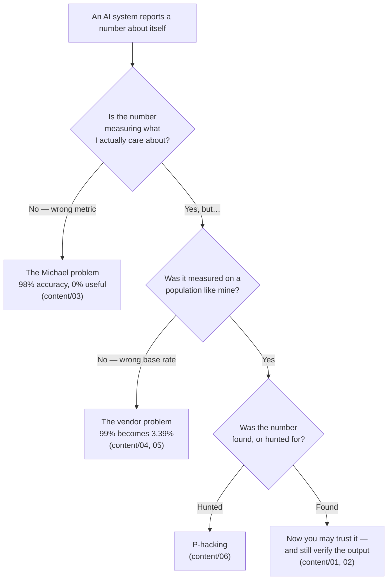

# Overview — When AI Is Confidently Wrong

This session is about a specific kind of failure: the system is wrong, it does not know it is wrong, and the number it reports about itself says everything is fine. Every other kind of failure announces itself. This one does not.

---

## The arc

There are two ways an AI system lies to you, and they are structurally different.

1. **The model lies about the world.** It generates something plausible and false — a hallucination. The mechanism is that it is completing a pattern, and nothing in the mechanism checks the pattern against truth (Session 1).
2. **The *metric* lies about the model.** The number is arithmetically correct and practically meaningless, because it was computed on a population that does not resemble yours, or because it averages away the only cases you care about.

Most training covers the first and stops. **The second is the one that costs money**, because it is the one that gets past procurement, past a review board, and into production with a signature on it.

*The four ways a true number can still mislead you. This session walks the diagram right to left.*

---

## The five ideas, in order

| # | Idea | The one-sentence version | File |
|---|---|---|---|
| 1 | **Hallucination has mitigations, not a cure** | Grounding fixes the *unverifiable* kind and creates a new failure mode of its own; verification fixes nothing unless the verifier is qualified. | `01` |
| 2 | **The 99% trap** | The better a model gets, the harder its remaining errors are to catch — because humans are measurably bad at catching infrequent errors from a system they have learned to trust. | `02` |
| 3 | **Accuracy is the wrong metric for rare events** | A model that is 98% accurate can be 0% useful; accuracy is an average, and averages hide exactly the cases you built the model for. | `03` |
| 4 | **Base rates decide everything** | The same test, unchanged, is excellent in one population and useless in another; the difference is not the test, it is how common the thing is. | `04`, `05` |
| 5 | **The number was probably found under pressure** | P-hacking is mostly not fraud; it is a competent person with a deadline, trying variants until one works. | `06` |

---

## Why this session is aimed at *this* room

Release, problem and configuration management exist because software systems make claims about themselves that are not automatically true. A build says it passed. A change record says it was reverted. A monitoring dashboard says the service is green. Your professional instinct is already to ask *"green according to what measurement, taken where, by whom?"*

That instinct is the entire content of this session. What is new is not the scepticism — it is the specific arithmetic that turns the scepticism into a number you can put in a report. "I have a bad feeling about this vendor" loses an argument. "At our base rate their tool will produce 619 false alarms per 10,000 commits and your engineers will stop reading them within a fortnight" wins it.

---

## The one idea that inverts an intuition

Almost everyone walks in believing:

> More accurate model → safer system.

That is false above a certain accuracy, and the reason is not statistical, it is human. At 70% accuracy, the human reviewer is genuinely reviewing — they expect errors, so they look for them. At 99.9% accuracy, the human reviewer is rubber-stamping, because 999 consecutive correct outputs have taught them to. The error rate went down; the *probability that an error reaches production* may have gone up, because the control that was supposed to catch it has quietly stopped functioning.

**"If it's right 99% of the time, spotting the 1% is harder, not easier."**

Which means: *model improvement is not, on its own, a risk-reduction measure.* It changes the shape of the risk. Somebody has to re-derive the control after the improvement — and in most organisations, nobody is assigned to.

That is `content/02`, and it is the sentence to carry out of this session if you carry only one.

---

## What this session deliberately does not cover

- **Adversarial attacks, prompt injection, data leakage, privacy.** That is Session 14 (Risk II). This session is about failures that arise from the technology working *as designed* on data that is *not adversarial*. Nobody is attacking you here. That is the point.
- **Fixing a bad model.** Sessions 7 and 8 cover training and improvement. Here we assume the model is what it is, and ask what we are entitled to conclude about it.
- **Regulation.** EU AI Act lands in Session 14.

---

## Reading order

`00` (here) → `01` hallucination and mitigations → `02` the 99% trap → `03` why your metric lies → `04` base rates → `05` the vendor role-play → `06` p-hacking → `99` key takeaways.

If you are short on time and only reading two files: **`03` and `05`**.
