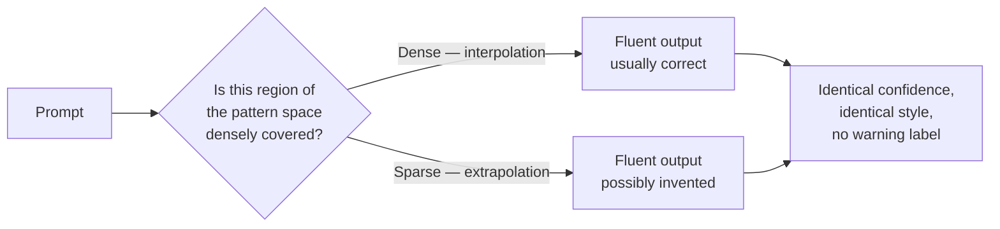
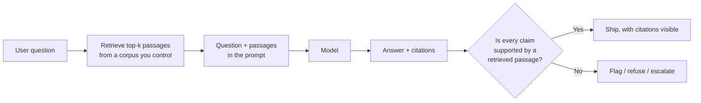
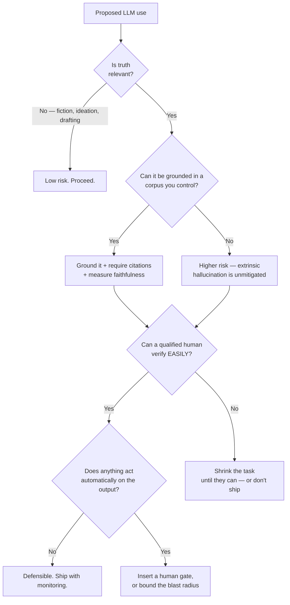

# Hallucination, Revisited — With Mitigations That Actually Do Something

Session 1 established *why* language models hallucinate. This file is about what you can do about it in a system you are responsible for, and — more importantly — what each mitigation does **not** do.

---

## 1. The mechanism, in one paragraph

A language model produces the next token by pattern-completion over what it has seen. Where the training data is dense — common phrasing, well-documented APIs, widely-repeated facts — the completion is an *interpolation*: it lands between points the model has actually seen, and it is usually right. Where the data is sparse — a niche library version, an internal system, a person who is not famous, a number nobody has written down — the completion is an *extrapolation*: it lands outside the data envelope, in brittle space, and the model produces something with exactly the same fluency and exactly the same confidence as when it was right.

**The model has no channel through which "I am now extrapolating" can reach the output.** Fluency is generated by the same machinery whether the content is true or invented. This is why hallucinations do not sound like hallucinations.

*Interpolation and extrapolation exit through the same door. That is the whole problem.*

---

## 2. Two kinds of hallucination — and why the distinction is operational

Maynez et al. (2020) drew the distinction that the industry now uses (see `resources/sources.md` #3). It is not academic hair-splitting: **the two kinds have different mitigations**, and buying the wrong mitigation for your failure mode is a common and expensive mistake.

| | **Intrinsic** | **Extrinsic** |
|---|---|---|
| Definition | The output **contradicts** the source material it was given | The output **cannot be verified** from the source material — it came from somewhere else (pre-training) or nowhere |
| Example | You paste a change record saying "rolled back at 14:20"; the summary says "rolled back at 04:20" | You ask for the owning team of a service; the model names a plausible team that does not exist |
| Detectable by | Comparing output against the provided source — **automatable** | Requires an external source of truth — **not automatable from the input alone** |
| Main mitigation | Faithfulness / groundedness checking | Grounding (give it a source), then faithfulness checking |
| Residual risk | Subtle contradictions in long documents; numbers and negations are the worst offenders | Anything the retrieval did not fetch |

**The operational point.** Grounding a model in retrieved documents converts a large slice of *extrinsic* hallucination into *intrinsic* hallucination. That is a real and valuable win — because intrinsic hallucination is checkable against something you possess. It is **not** a cure, and if your vendor describes it as one, that is your first data point about the vendor.

---

## 3. Mitigation A — grounding (RAG)

**What it is.** Before answering, retrieve relevant passages from a corpus you control, put them in the prompt, and instruct the model to answer only from them and to cite which passage each claim came from.

*Grounding does not stop at retrieval. The check after the answer is the part people skip — and it is the part that does the work.*

**What it fixes.** The model is now answering from material that exists. Extrinsic invention drops sharply, and — crucially — every claim becomes *attributable*, so a human can check it in seconds rather than minutes. Attributability is worth as much as the accuracy improvement, and often more.

**What it does not fix, and this is the part to internalise:**

| Failure | What happens |
|---|---|
| **Retrieval miss** | The relevant passage was not retrieved. The model answers anyway, from pre-training, fluently. You have not removed hallucination; you have removed the model's *excuse* for it while leaving the behaviour intact. |
| **Retrieval of the wrong thing** | The passage retrieved is topically similar and factually inapplicable — a different release, a different product line, a superseded policy. The answer is now grounded in a real document and still wrong. This is the failure mode that fools reviewers, because the citation is *right there*. |
| **Faithful-looking synthesis** | The model merges two passages into a claim neither of them makes. Each citation checks out individually. The sentence is still false. Risk grows with the number of documents in context. |
| **Stale corpus** | Grounding is only as current as the index. A confidently-cited obsolete runbook is worse than no runbook, because it carries an authority signal. |

**The uncomfortable summary:** RAG changes hallucination from *"the model made this up"* to *"the model made this up from something real."* The second is easier to audit and, for exactly that reason, easier to wave through.

**Can you measure groundedness?** Yes — this is the part most teams do not know exists. Automated faithfulness/groundedness evaluation is a real research area with usable frameworks: **RAGAS** (Es et al., EACL 2024) decomposes an answer into atomic claims and checks each against the retrieved context; **ARES** (Saad-Falcon et al., NAACL 2024) trains lightweight judges for context relevance, answer faithfulness and answer relevance, and reports confidence intervals rather than a bare score (`resources/sources.md` #4, #5). Both are CC BY 4.0 via the ACL Anthology, so the definitions and the framing are safe to put on a slide.

The takeaway for a manager: **"is this answer grounded in its cited source?" is a measurable quantity with published methodology.** If a vendor cannot report a faithfulness number alongside their accuracy number, they have not evaluated the thing you actually care about.

---

## 4. Mitigation B — make a human verify

The second lever, and the one every organisation reaches for first, because it requires no engineering.

**The condition under which an LLM application is defensible** (framing after the LLM-safety source deck, `resources/sources.md` #7) is genuinely compact:

> An LLM application is defensible when **(a) the user can easily verify the output**, or **(b) truth is irrelevant** — fiction, brainstorming, art.

Everything else needs a stronger control than "a human looks at it."

Note the load-bearing word: **easily**. Not "can verify in principle." Verification that takes longer than doing the task yourself is not a control; it is a control on paper that gets skipped in practice on day nine.

### The verification paradox

Here is the trap that makes this harder than it looks, and it is the bridge into the next file:

> **The more the model improves, the more work there is in verifying its output.**

That reads backwards until you see why. A weak model produces output that is obviously wrong — wrong length, wrong format, code that will not compile. Verification is cheap because the errors are loud. A strong model produces output that is *right almost all the time and indistinguishable from right the rest of the time*. Now verification means genuinely re-doing the reasoning, on every item, because you cannot tell from the surface which item is the bad one.

Cheap verification is a property of **bad** models. As the model gets better, you lose it.

| Model quality | Errors per 100 | What an error looks like | Cost to verify one output |
|---|---|---|---|
| Weak | ~30 | Obvious: won't compile, wrong format, nonsense | Seconds — the error is self-announcing |
| Good | ~5 | Plausible but checkable with effort | Minutes |
| Excellent | ~1 | Indistinguishable from correct without independent re-derivation | Full cost of doing the task yourself |

The right-hand column is the one that decides whether your business case survives. A great many AI business cases are built on "the model does it in 10 seconds instead of 20 minutes" and quietly assume verification is free. If verification costs 15 minutes because the model is *good*, the saving is 5 minutes, not 20 — and if verification is skipped to preserve the saving, you have not automated the task, you have automated the *appearance* of the task while removing the check.

---

## 5. Mitigation C — shrink what it is allowed to do

Cheapest and most effective, and the one nobody wants to hear, because it reduces the demo.

> **You make a system safer by constraining it to do less.**

Concretely, three things to write down before deployment (framing after the LLM-safety source deck):

1. **What data goes in** — and, explicitly, what does not. "Internal case documents only. Not the open internet."
2. **What tasks it is sanctioned for** — and, explicitly, what it is barred from. "Summarise and locate. Not discovery. Not a legal conclusion."
3. **How the user is trained to verify** — not *whether* a human is in the loop, but what the human is expected to check and how they are qualified to check it.

The third is where most operating-domain documents stop early, and it is the subject of `content/02`.

---

## 6. Mitigation D — never let an automated action fire on unverified output

The single highest-leverage engineering control in this whole session, stated as a rule:

> **An API that acts directly on model output turns a wrong sentence into a wrong action.**

The chain is `Data → Model → Human → Real-world action`. Every place you delete the human from that chain, you convert a recoverable error into an unrecoverable one. Cases where this is tempting and this room will meet it:

- Auto-filing or auto-closing incident tickets from a model's triage classification.
- Auto-applying a configuration change the model proposed.
- Auto-publishing release notes the model drafted.
- An agent with shell or repository write access.

None of these are forbidden. All of them need the question asked out loud: *what is the blast radius if this is confidently wrong, and who finds out?* Release notes: embarrassing, recoverable, publish freely. Config change on a production fleet: not recoverable, gate it.

---

## 7. Putting the mitigations in order

*The order matters: grounding before verification, verification before automation. Skipping to automation is how organisations discover all of this the expensive way.*

---

## Key points from this file

- Hallucination is fluent by construction; the model cannot flag its own extrapolation, so "it sounded confident" carries zero information.
- **Intrinsic** (contradicts the source) vs. **extrinsic** (unverifiable from the source) — different failure modes, different fixes.
- Grounding/RAG converts much extrinsic hallucination into intrinsic hallucination. That is progress, not a cure, and it introduces retrieval-miss and wrong-passage failures that are *harder* to spot because they come with a citation.
- Groundedness is measurable — RAGAS, ARES. Ask a vendor for a faithfulness number, not just an accuracy number.
- **Verification must be easy or it will not happen** — and it gets harder as the model gets better. That is the verification paradox, and `content/02` is what it costs you.
- Constrain the operating domain. Never let an API act on unverified output.
