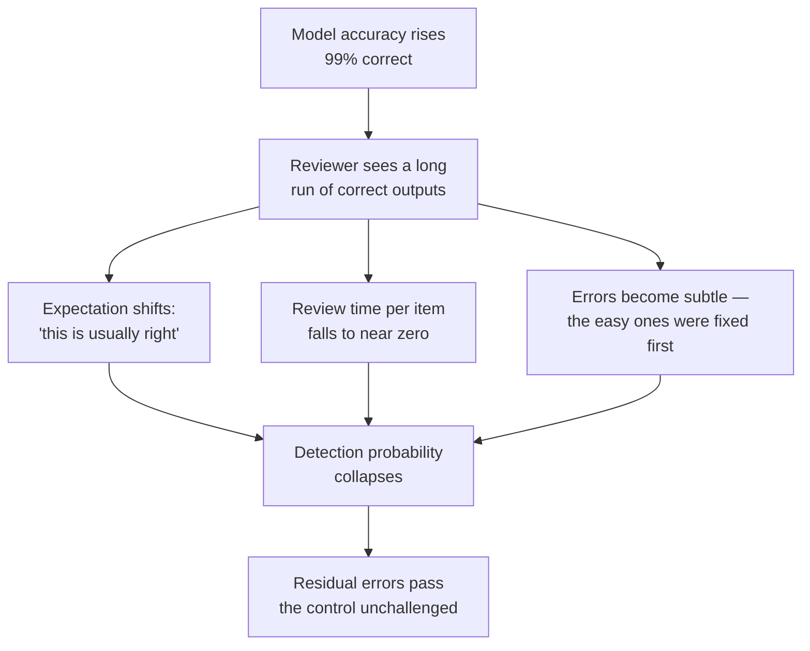
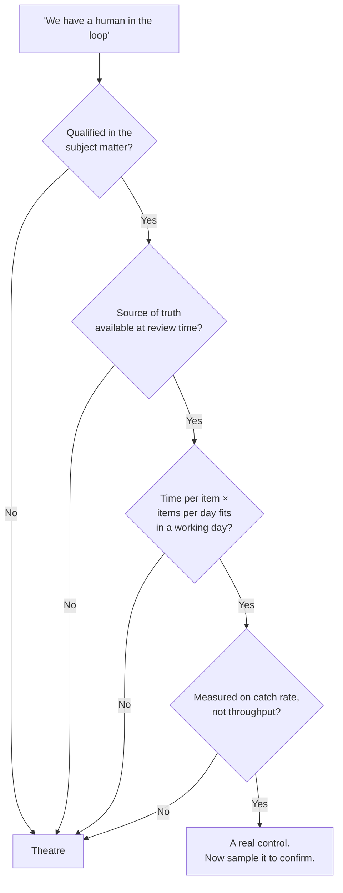

# The 99% Trap — Why a Better Model Can Make a System Less Safe

The claim in this file inverts the intuition almost everyone brings into an AI procurement meeting. It is the most useful thing in the session for a problem-management audience, and it takes two minutes to state and a career to stop forgetting.

---

## 1. The claim

> **If it's right 99% of the time, spotting the 1% is harder, not easier.**

Not "the 1% is still there." Not "no system is perfect." Something stronger and less obvious: **the improvement itself degrades the control that was catching the errors.**

The usual mental model is additive and wrong:

| Belief | Reality |
|---|---|
| Model error rate falls → fewer errors reach production | Model error rate falls → *human detection rate also falls* → the product of the two may not improve, and can worsen |
| Human-in-the-loop is a fixed-strength control | Human-in-the-loop strength is a **function of the model's error rate** — they are coupled, not independent |
| Improving the model is a risk-reduction measure | Improving the model is a risk-*reshaping* measure; it requires re-deriving the control |

The failure is not laziness. It is a well-documented property of human beings supervising reliable automation, known in system-safety work as **automation complacency** or the **startle factor**: humans are poor at detecting infrequent errors from an automated system they have learned to trust. This is not a character flaw to be trained out. It is how vigilance works. Aviation, process control and rail all designed around it decades ago; software has not.

---

## 2. Why it happens — three compounding mechanisms

**Mechanism 1 — expectation.** After 99 correct outputs, the reviewer's prior is "correct." They are no longer reading to find an error; they are reading to confirm an expectation. Confirmation is a much faster and much shallower cognitive operation, and it is the one that runs by default.

**Mechanism 2 — economics of attention.** Nobody funds a review step at the same intensity once the error rate falls. The reviewer who used to get 20 minutes per item now has a queue of 200 items, because the improved model made the queue cheaper to generate. Throughput expands to consume the accuracy gain. This is an organisational reflex, not a decision anyone makes explicitly.

**Mechanism 3 — the errors that survive are the hard ones.** This is the mechanism people miss, and it is the strongest of the three. Model improvement is not uniform: the easy, obvious errors get fixed first, because those are the ones that show up in evaluation. What remains at 99% is, *by selection*, the residue that was hardest to detect. The surviving 1% is not a random sample of the old 30% — it is the subtlest 1% of it.

So the reviewer's job gets harder in exactly the same movement in which their attention gets thinner. Both curves move the wrong way at once.

---

## 3. The arithmetic, so it is not just a story

Suppose 1,000 outputs per week, and errors that reach production cost you something.

| Scenario | Model error rate | Human detection rate | Errors reaching production |
|---|---|---|---|
| **A — weak model, alert reviewer** | 10% (100 errors) | 90% (errors are obvious; reviewer expects them) | **10** |
| **B — good model, complacent reviewer** | 1% (10 errors) | 30% (subtle errors, thin attention) | **7** |
| **C — excellent model, rubber stamp** | 0.2% (2 errors) | 10% | **~0.2** |
| **D — excellent model, throughput tripled to bank the saving** | 0.2% of 3,000 = 6 errors | 10% | **5.4** |

Read A → B: a **tenfold** improvement in the model bought a 30% improvement in the outcome. The rest was eaten by the control degrading.

Read C → D: the same excellent model, and the organisation's entirely rational decision to bank the accuracy gain as throughput, gives back almost the entire benefit.

These numbers are illustrative, not measured — but the *shape* is not in dispute, and the shape is the lesson. **You cannot infer system safety from model accuracy.** You have to measure the joint system.

---

## 4. Human-in-the-loop is necessary and **not sufficient**

"There's a human in the loop" is the most common answer to an AI risk question and the least informative. It tells you a person exists. It tells you nothing about whether that person can catch the error.

> Putting a human in the loop is not a control. **Putting a human who is equipped to detect this specific class of error, with the time and the incentive to do so, is a control.**

### The five questions that turn a claim into a control

Ask these about any proposed human-in-the-loop gate. If the answer to any of the first four is "no", the gate is theatre.

| # | Question | What a failing answer sounds like |
|---|---|---|
| 1 | **Is the reviewer qualified in the subject matter the model is producing?** Could they have produced the correct answer themselves? | "They're technical, they'll spot anything weird." |
| 2 | **Do they have the source of truth available at review time?** Can they check, or only judge plausibility? | "They review the summary." (Against what?) |
| 3 | **Do they have the time?** Time per item × items per day ≤ working hours. Do the multiplication. | "It's part of their normal workflow." |
| 4 | **Is the review real?** Is there any mechanism that would reveal a reviewer who approves everything without reading? | "We trust our people." |
| 5 | **Are they incentivised to find errors, or to clear the queue?** What is measured — throughput or catch rate? | "Their KPI is turnaround time." |

Question 5 is the one that decides the others. A reviewer measured on throughput will, entirely rationally and without any bad intent, become a rubber stamp. You built that.

*The gate is only as strong as its weakest answer. Four "yes" and one "no" is still theatre.*

### The verification-fitness test, in one line

> Could this reviewer have produced the correct output themselves, given the same inputs and enough time?

If **yes**, they can verify. If **no**, they can only judge plausibility — and plausibility is precisely the dimension on which a good model never fails. You have staffed a check that is structurally incapable of detecting the failure mode it exists to detect.

This is the sharpest version of the point and worth sitting with. A reviewer who cannot independently derive the answer is not verifying; they are *rating the writing style of the answer*. Language models are extremely good at writing style. That is the whole problem.

---

## 5. What to do about it

Five controls that survive an improving model, roughly in order of cost:

1. **Sample and re-derive.** Take a random 5% of outputs and have someone independently do the work from scratch. Compare. This is the only measurement that does not degrade with model accuracy, because it does not depend on anyone noticing anything. Budget it permanently; it is the cost of running the system, not a project.
2. **Seed known-bad items.** Inject items with known-wrong model output into the review queue at a low, unpredictable rate. Measure the catch rate. You now have a live number for the strength of your human control — the single most useful metric in this whole file, and almost nobody has it.
3. **Re-derive the control when the model changes.** Treat a model upgrade as a **change that invalidates the risk assessment**, exactly as you would treat a change to a safety-relevant component. This is a configuration-management instinct and it applies directly: the model version is a configuration item, and its accuracy is a property that other controls depend on.
4. **Make the reviewer's job specific.** "Review this output" produces skimming. "Confirm that every number in this summary appears in the source, and initial each one" produces checking. Checklists beat vigilance; this is an old and well-evidenced result.
5. **Cap throughput deliberately.** If you bank the entire accuracy gain as volume, you have converted a safety improvement into a productivity improvement and kept the original risk. That may be the right business decision — but make it a decision, in writing, not a drift.

---

## 6. Where this bites in this room's actual work

| Role | The 99% trap in the wild |
|---|---|
| **Release manager** | AI-drafted release notes are right 99 times running. Note 100 omits a breaking change. Nobody reads note 100 differently from note 99 — and the reader downstream is a customer. |
| **Problem manager** | AI-suggested root causes are usually right. The one that is subtly wrong sends a week of investigation down the wrong path, and it is *harder* to abandon because a tool endorsed it. |
| **Configuration manager** | Automated drift detection with a low false-positive rate trains everyone that a flag means a real problem — and trains nobody to notice a *missing* flag. High precision without measured recall is a silent-failure generator. |
| **Developer** | AI-generated code review comments are helpful and correct almost always. Approval becomes reflex. The one bad suggestion carries the tool's implicit authority into the merge. |

The common shape across all four: **the system's reliability becomes the reason nobody checks it.**

---

## Key points from this file

- Human detection rate is **coupled to** model error rate. They are not independent factors you can multiply and forget.
- Three mechanisms: shifted expectation, thinned attention, and — the strongest — *the surviving errors are selected for being hard to detect*.
- Automation complacency / startle factor is a documented human-performance property, not a discipline problem.
- Human-in-the-loop is **necessary and not sufficient**. Run the five questions; the incentive question decides the rest.
- The fitness test: *could the reviewer have produced the right answer themselves?* If not, they are rating prose, not verifying facts.
- Controls that survive an improving model: sampling with independent re-derivation, seeded known-bad items, treating a model upgrade as a change that invalidates the risk assessment.
