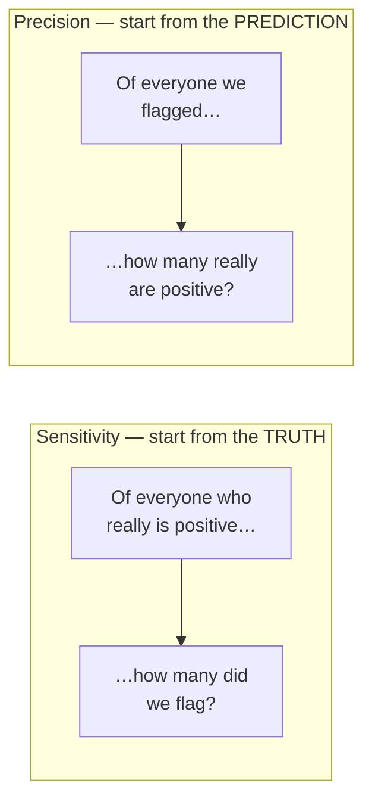
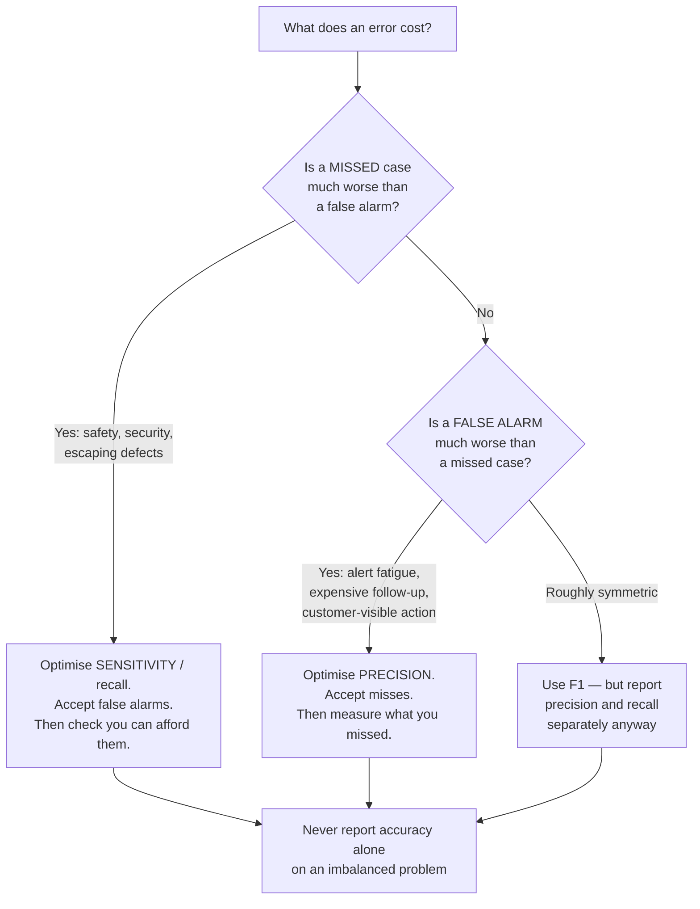

# Why Your Metric Lies — The Michael Parable and the Confusion Matrix

A model can be 98% accurate and 0% useful. This file shows exactly how, with the arithmetic worked twice — once by hand, once in scikit-learn — so you can do it to a vendor's numbers in a meeting.

---

## 1. The parable

A company of **100 employees** wants to predict who will quit this year. They train a model on historical HR data.

The model finds a pattern. In the training data, several people who quit were named **Michael**. So the model learns a rule of magnificent simplicity:

> **If the employee is named Michael, predict they will quit. Otherwise, predict they will stay.**

Deploy it. Over the year:

- There is **one Michael** in the company. The model predicts he will quit. **He stays.**
- **One other employee** — not called Michael — **quits.** The model predicted they would stay.
- The remaining **98 employees** stay, and the model predicted they would stay.

So the model got **both** of the interesting cases wrong. Every single prediction it made about the event of interest — quitting — was incorrect. It identified nobody who quit. It flagged one person who did not.

**And it reports 98% accuracy.**

98 out of 100 predictions were correct. The number is not a lie. It is arithmetically flawless and completely useless.

### It gets worse

Why stop at Michael? If 99% of employees do not quit in a given year, delete the model entirely and replace it with a constant:

> **Predict that nobody will ever quit.**

That model is **99% accurate**. It beats the Michael model. It beats a great many real models. It contains no information, requires no data, cannot be wrong in an interesting way, and would sail through any review that asks only "what's the accuracy?"

This is not a contrived edge case. **Machine learning makes shortcuts like this constantly, and it makes them precisely when the event of interest is rare** — which is to say, in almost every problem worth automating: disease screening, security breaches, employee attrition, fraud, escaping defects, rare road events, production incidents. The rarer and more valuable the event, the higher the accuracy a useless model can report.

---

## 2. The confusion matrix

Accuracy is a single average over a population, and averages annihilate minorities. The fix is to stop collapsing the four possible outcomes into one number.

Fix a convention first, because half of all confusion-matrix confusion is convention confusion:

> **The "positive" class is the event of interest** — the thing you built the model to find. Here, *quitting*. Positive does not mean good. In screening for a disease, "positive" is the disease. In defect detection, "positive" is the defect.

The four outcomes:

| | | |
|---|---|---|
| **True Positive (TP)** | Predicted quit, did quit | The win |
| **False Positive (FP)** | Predicted quit, stayed | False alarm — **Type I error** |
| **False Negative (FN)** | Predicted stay, quit | Missed case — **Type II error** |
| **True Negative (TN)** | Predicted stay, stayed | The boring correct case, usually the vast majority |

### The Michael matrix

Rows = what actually happened. Columns = what the model said. (This is the scikit-learn orientation: `confusion_matrix(y_true, y_pred)` puts truth on the rows.)

| | **Model: will quit** | **Model: will stay** | Row total |
|---|---|---|---|
| **Actually quit** | **TP = 0** | **FN = 1** | 1 |
| **Actually stayed** | **FP = 1** | **TN = 98** | 99 |
| **Column total** | 1 | 99 | **100** |

Read the top row: of the one person who actually quit, the model found **zero**.
Read the left column: of the one person the model flagged, **zero** actually quit.

Both of the numbers you care about are zero, and they sit in a matrix whose diagonal sums to 98.

> **Source correction.** The source deck presents this same matrix with predictions on the rows *and* with the FP and FN cell labels transposed (`resources/sources.md` #6). All six of its computed metric values are nonetheless correct, because in this particular scenario FP = FN = 1, so the transposition cancels out. Do not let that luck teach you a bad habit: **always state your row/column convention before reading a matrix out loud.** With any other numbers the same slip flips precision and recall, which is the single most common error in reading these tables.

---

## 3. The six metrics, worked

Each metric is a ratio of one cell to a row or column total. Which row or column you divide by *is the entire question* — it encodes what you are actually asking.

| Metric | Also called | Formula | Question it answers | Michael's value |
|---|---|---|---|---|
| **Sensitivity** | Recall, True Positive Rate | TP / (TP + FN) | *Of the cases that really are positive, what fraction did we catch?* | 0 / (0+1) = **0** |
| **Specificity** | True Negative Rate | TN / (TN + FP) | *Of the cases that really are negative, what fraction did we correctly clear?* | 98 / (98+1) = **0.9899** |
| **Precision** | Positive Predictive Value | TP / (TP + FP) | *Of the cases we flagged, what fraction really are positive?* | 0 / (0+1) = **0** |
| **Negative Predictive Value** | NPV | TN / (TN + FN) | *Of the cases we cleared, what fraction really are negative?* | 98 / (98+1) = **0.9899** |
| **Accuracy** | — | (TP+TN) / all | *What fraction of all predictions were correct?* | 98 / 100 = **0.98** |
| **F1 score** | — | 2 · (P·R)/(P+R) | *A single balance of precision and recall* | 2·(0·0)/(0+0) = **0/0 = undefined** |

**The punchline.** Precision and sensitivity are both **exactly zero**. The model fails *entirely* at positive predictions — the only predictions anyone wanted. F1, which exists specifically to combine them, is not merely low: it is **mathematically undefined**, because both inputs are zero and the denominator vanishes. And accuracy reports **0.98**.

An undefined F1 is a screaming alarm. If a vendor's report shows accuracy and omits F1, ask why.

### The sensitivity/precision pair is the whole game

These two are the pair to internalise, because **they are conditional probabilities pointing in opposite directions**, and confusing them is the mechanism behind the vendor scenario in `content/05`.



- **Sensitivity = P(flagged | truly positive).** This is what a vendor quotes. It is measured on the truly-positive cases only, so it is unaffected by how many negatives exist. **You can drive it to 1.0 by flagging everyone.**
- **Precision = P(truly positive | flagged).** This is what you experience. It is what determines whether your engineers trust the alerts.

They are not the same number, they are not interchangeable, and **the gap between them depends entirely on how common the positive class is.** That last sentence is the whole of `content/04` and `content/05`.

---

## 4. The same thing in scikit-learn

Run this. It takes ten seconds and it is the most useful ten seconds of the session for anyone who will ever read a model evaluation report.

```python
"""Michael's model: the 98%-accurate, 0%-useful classifier.
Requires: pip install scikit-learn numpy   (scikit-learn is BSD-3 licensed)
"""
import numpy as np
from sklearn.metrics import (confusion_matrix, accuracy_score, precision_score,
                             recall_score, f1_score, classification_report)

# Label convention: 1 = "quits" (the POSITIVE class, our event of interest), 0 = "stays".
#
# 100 employees, one year:
#   index 0      -> named Michael: model says QUIT, they actually STAYED   (false positive)
#   index 1      -> someone else:  model says STAY, they actually QUIT     (false negative)
#   indices 2-99 -> 98 people:     model says STAY, they actually STAYED   (true negatives)

y_true = np.array([0, 1] + [0] * 98)   # what actually happened
y_pred = np.array([1, 0] + [0] * 98)   # what the model predicted

cm = confusion_matrix(y_true, y_pred, labels=[0, 1])
print(cm)
# [[98  1]
#  [ 1  0]]
#   ^ row 0 = actually STAYED : 98 correctly cleared (TN), 1 false alarm (FP)
#     row 1 = actually QUIT   :  1 missed (FN),            0 caught (TP)

tn, fp, fn, tp = cm.ravel()
print(f"TN={tn}  FP={fp}  FN={fn}  TP={tp}")
# TN=98  FP=1  FN=1  TP=0
```

Now all six metrics:

```python
sensitivity = recall_score(y_true, y_pred, zero_division=0)      # TP/(TP+FN)
precision   = precision_score(y_true, y_pred, zero_division=0)   # TP/(TP+FP)
f1          = f1_score(y_true, y_pred, zero_division=0)          # harmonic mean
accuracy    = accuracy_score(y_true, y_pred)
specificity = tn / (tn + fp)                                     # no sklearn one-liner
npv         = tn / (tn + fn)                                     # no sklearn one-liner

for name, value in [("Sensitivity (recall)", sensitivity),
                    ("Specificity", specificity),
                    ("Precision", precision),
                    ("Neg. predictive value", npv),
                    ("Accuracy", accuracy),
                    ("F1 score", f1)]:
    print(f"{name:<24} {value:.4f}")

# Sensitivity (recall)     0.0000
# Specificity              0.9899
# Precision                0.0000
# Neg. predictive value    0.9899
# Accuracy                 0.9800
# F1 score                 0.0000     <-- see the note below: mathematically UNDEFINED
```

> **Read this note; it matters.** F1 here is **0/0 — undefined**. scikit-learn returns `0.0` because we passed `zero_division=0`. Without that argument it returns `0.0` *and* emits an `UndefinedMetricWarning`. **A metric library reporting 0.0 for an undefined quantity is a small lie of convenience that many dashboards inherit and then hide.** If you see F1 = 0.00 in a report, do not read it as "the model scored badly on F1." Read it as "the model made zero correct positive predictions, and possibly zero positive predictions at all." Those are very different diagnoses and only one of them is fixable by tuning.

The one-call version, which is what you will actually use:

```python
print(classification_report(y_true, y_pred,
                            target_names=["stays (0)", "quits (1)"],
                            zero_division=0))
#               precision    recall  f1-score   support
#
#    stays (0)       0.99      0.99      0.99        99
#    quits (1)       0.00      0.00      0.00         1
#
#     accuracy                           0.98       100
#    macro avg       0.49      0.49      0.49       100
# weighted avg       0.98      0.98      0.98       100
```

**Read that report the way a reviewer should.** Three numbers tell the story and they are not the big ones:

- `support` for the positive class is **1**. Any metric computed on one example is noise. This column is the first thing to look at and the thing people never look at.
- The **`quits (1)`** row is all zeros. That is the row the model exists for.
- **`macro avg` = 0.49** versus **`weighted avg` = 0.98**. Macro averaging treats both classes as equally important; weighted averaging weights by support and therefore lets the 99 boring cases drown the 1 interesting one. The 0.49 is the honest summary. **The 0.98 is the number that goes in the deck.**

And the degenerate baseline, which every evaluation should include and almost none do:

```python
# The "predict nobody ever quits" model — no data, no features, no model at all.
y_true_year = np.array([1] + [0] * 99)   # 1 person in 100 actually quits
y_pred_lazy = np.zeros(100, dtype=int)   # predict "stays" for everyone

print(accuracy_score(y_true_year, y_pred_lazy))
# 0.99
```

**99% accuracy, from a constant.** Any model that cannot beat this by a wide margin on precision and recall is not adding information, whatever its accuracy says.

---

## 5. Which metric should you ask for?

There is no universally right metric. There is a right metric *given what an error costs you*, and the honest move is to decide that before you see any numbers.



A worked instance for this room. A tool flags commits that may contain an escaping defect.

- **High sensitivity, low precision:** you catch nearly every real defect, and you also flag hundreds of clean commits. Engineers stop reading the flags within two weeks. Your measured sensitivity is now irrelevant, because **the control that consumes the output has been disabled by the output volume.** Sensitivity without precision is a way of turning off a control while reporting that it is on.
- **High precision, low sensitivity:** every flag is real, so people act on flags — and defects sail past unflagged, invisibly, with nothing in the metrics to reveal it. This is the more dangerous configuration, because it *feels* excellent. You only find out from field escapes months later.

There is no free choice here. **Pick the failure you can survive, state it in writing, and measure the other one anyway.**

---

## 6. The checklist for reading anyone's model evaluation

1. **What is the positive class?** If it is not stated, nothing else can be read.
2. **What is the class balance / `support`?** If the positive class is rare, accuracy is dead on arrival.
3. **Precision and recall, separately.** Not F1 alone; not accuracy alone. If only one is offered, ask for the other — a strong number on one and silence on the other is a choice, not an oversight.
4. **What does the degenerate model score?** Always-negative, or always-majority-class. If it is close to the real model, there is no model.
5. **How many positive examples were in the test set?** Precision computed on 4 positives is not a number, it is an anecdote.
6. **Macro or weighted average?** Weighted average on an imbalanced problem is a way of saying 0.98 when the truth is 0.49.
7. **What was the base rate in the test set, and what is it in my population?** → the subject of `content/04` and `content/05`, and the question that does the most damage.

---

## Key points from this file

- **Accuracy is an average, and averages hide rare events** — which are the events you built the model for.
- The Michael model: 98% accurate, sensitivity **0**, precision **0**, F1 **undefined**. All six numbers computed from a four-cell table.
- "Predict nobody ever quits" scores **99%**. Always compute the degenerate baseline.
- **Sensitivity = P(flagged | positive)**; **Precision = P(positive | flagged)**. Opposite directions. Vendors quote the first; you live with the second.
- An F1 of 0.00 in a report may be a library rendering an *undefined* quantity. Investigate, don't interpret.
- `support`, `macro avg` and the degenerate baseline are the three under-read numbers in a `classification_report`.
