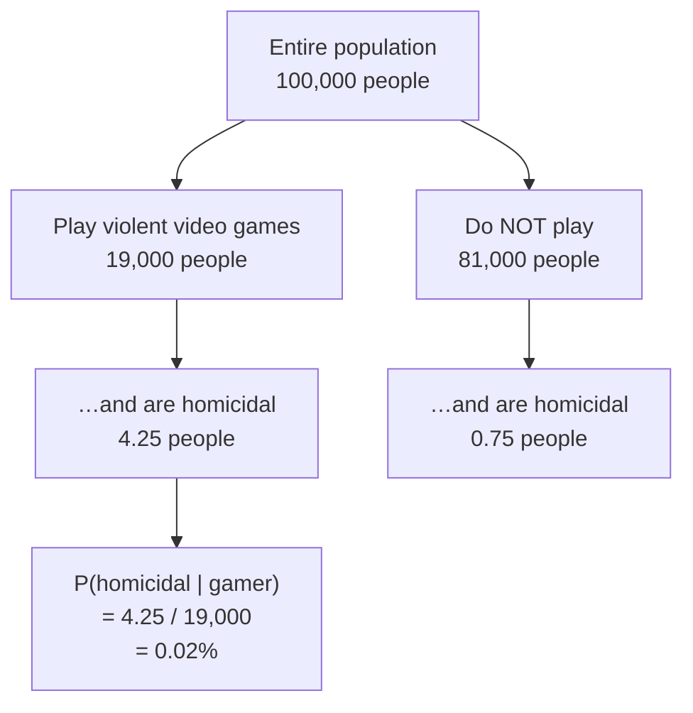
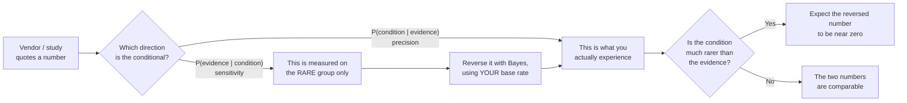

# Base Rates — Why the Same Test Is Excellent Here and Useless There

The single most reliable way to be misled by a true statistic. This file builds the machinery on a case with no money at stake, so that `content/05` — where there is money at stake — moves fast.

---

## 1. The claim that starts it

A study reports:

> **85% of homicidal offenders in the United States have played violent video games.**

Take the number at face value. It is not disputed here. The question is what follows from it.

The instinct — and it is a strong one, and it has shaped actual policy — is: *video games are implicated in violence; something should be done about the video game industry.*

That inference requires a step that was never taken. The study measured

> **P(played violent video games | is a homicidal offender) = 0.85**

and the policy conclusion requires

> **P(is a homicidal offender | played violent video games) = ?**

**These are different numbers.** Not "slightly different" — potentially different by four orders of magnitude. Reversing a conditional probability without doing the arithmetic is called the **base-rate fallacy**, and it is the most common quantitative error in public discourse, procurement, and internal reporting alike.

> **The general rule:** `P(A|B) ≠ P(B|A)`. Nearly everyone knows this abstractly. Nearly nobody applies it under time pressure to a number that confirms what they already suspect.

---

## 2. Bayes' theorem, as counting rather than algebra

The formula:

$$P(A|B) = \frac{P(B|A) \times P(A)}{P(B)}$$

Ignore it for a moment. Here is the same thing as counting people, which is how you should always do it in a meeting, because you cannot make an algebra mistake while counting bodies.

**Take 100,000 Americans.**

| Step | Source of the number | Result |
|---|---|---|
| How many are homicidal offenders? | FBI: 17,251 known homicide offenders (2017); US population ≈ 324 million → rate ≈ **0.00005** | **5 people** |
| Of those 5, how many play violent video games? | The study: 85% | **4.25 people** |
| How many of the 100,000 play violent video games at all? | Industry market research: **19%** | **19,000 people** |
| So: of 19,000 gamers, how many are homicidal? | 4.25 | **4.25 out of 19,000** |

$$P(\text{homicidal} \mid \text{gamer}) = \frac{4.25}{19{,}000} = 0.000224 = \mathbf{0.02\%}$$

Or via the formula, identically:

$$P(\text{homicidal}\mid\text{gamer}) = \frac{0.85 \times 0.00005}{0.19} = 0.000224$$

**From 85% to 0.02%.** Same study, same data, no trickery. Two of every ten thousand gamers.



*Nested-set view. Not to scale — and the fact that it cannot be drawn to scale is the lesson. Two of the boxes are ten thousand times smaller than the box they sit inside, which is exactly why intuition fails here.*

**Why the reversal is so violent.** Because the two conditionals divide by wildly different denominators. Sensitivity divides by *5*. The reverse divides by *19,000*. A ratio of 3,800 between the denominators is a ratio of 3,800 between the answers. When one category is very rare and the other is very common, reversing the conditional cannot be approximately right — it will be wrong by roughly the ratio of their sizes.

---

## 3. The rule, in one line

> **Never take a common trait and associate it with an uncommon one.**

85% of homicidal offenders drink water. 100% breathe air. Nearly all of them own shoes. None of these facts tell you anything about water, air or shoes, because the trait is far more common than the outcome. Playing video games (19% of the population) is a common trait. Being a homicidal offender (0.005%) is an uncommon one. Any correlation you find between them, *however real*, will produce a reverse probability near zero.

This generalises directly and unpleasantly to work:

| Common trait | Uncommon outcome | The seductive-but-empty claim |
|---|---|---|
| Used framework X | Suffered a major outage | "80% of outages involved framework X" |
| Committed on a Friday | Caused a production incident | "Most incidents trace to Friday commits" |
| Was an AI-assisted commit | Contained a security defect | "Most defective commits were AI-assisted" |
| Had a config drift event | Escalated to a Sev-1 | "Nearly every Sev-1 had prior drift" |

Every one of these can be **true and useless**. If 80% of your commits use framework X, then "80% of outages involved framework X" is exactly what you would expect if framework X had no effect whatsoever. **The comparison you need is against the base rate, and the base rate is the number that never makes it onto the slide.**

---

## 4. Correcting the source — the relative-risk trap

Here the source deck makes a slip that is more instructive than the correct version would have been, so we teach both (`resources/sources.md` #6).

Having found 0.02%, the source observes that a *non*-gamer's probability is lower, and that the press could therefore report **"gamers are 4× more likely to be homicidal."** The rhetorical point — that a large multiplier over a tiny number is still a tiny number — is exactly right. The arithmetic behind it is not. Let us do it properly, because the corrected version is *stronger*.

$$P(\text{homicidal} \mid \text{non-gamer}) = \frac{0.15 \times 0.00005}{0.81} = 0.00000926 = \mathbf{0.00093\%}$$

By counting: 0.75 homicidal non-gamers out of 81,000 non-gamers.

| Comparison | Ratio | The headline it produces |
|---|---|---|
| Gamers (0.0224%) vs. **non-gamers** (0.00093%) | **≈ 24×** | "Gamers are 24 times more likely to be homicidal" |
| Gamers (0.0224%) vs. **whole population** (0.005%) | **≈ 4.5×** | "Gamers are 4 times more likely to be homicidal" |

The source's "4×" is the comparison against the **whole population** — which includes gamers, and therefore understates the contrast. The comparison against non-gamers gives **24×**.

So the correction makes the number *worse*, and the lesson **stronger**:

> A reporter, an advocate, or a vendor can choose their comparison group, and different valid comparison groups here give 4× and 24× **from identical data**. Neither is a lie. Both are true statements about the same 0.02%.
>
> **A relative risk without an absolute risk is not information.** "24× more likely" means 2 in 10,000 instead of 1 in 100,000. Both are rounding error. The multiplier is enormous and the risk is negligible, simultaneously, and there is no contradiction in that.

Whenever you are shown a multiplier — in a study, a vendor deck, or your own dashboard — ask two questions before anything else: **multiplied from what, and compared to whom?**

> **Two further honesty notes on this case.** (a) The FBI's 17,251 is *homicide offenders in one year*, so 0.00005 is an annual rate, not a prevalence of "being a homicidal person" — the arithmetic is illustrative rather than epidemiological, and we say so rather than pretending otherwise. (b) The source deck's own nested-set diagram labels the gamer set as 12,000 out of 100,000, which does not match its stated 19% (that would be 19,000). We use 19,000 throughout so that the diagram and the arithmetic agree.

---

## 5. A Bayes calculator you can keep

The whole of this file, and the whole of `content/05`, in eleven lines of Python.

```python
"""Reverse a conditional probability: turn a test's quoted sensitivity
into the precision you will actually experience at YOUR base rate.
"""

def posterior(sensitivity, specificity, prevalence):
    """P(condition | positive result), i.e. the precision you get in a
    population where the condition occurs at the given prevalence.

    sensitivity -- P(test positive | condition present)   <- what vendors quote
    specificity -- P(test negative | condition absent)    <- ask for this
    prevalence  -- P(condition) in YOUR population        <- find this yourself
    Returns (precision, overall_positive_rate).
    """
    true_pos  = sensitivity * prevalence               # correctly flagged
    false_pos = (1 - specificity) * (1 - prevalence)   # wrongly flagged
    p_positive = true_pos + false_pos                  # everything flagged
    return true_pos / p_positive, p_positive


# The video-games case. There is no "test" here, so express it as one:
#   "condition"   = is a homicidal offender      -> prevalence 0.00005
#   "tests positive" = plays violent video games
#   sensitivity  = P(gamer | homicidal)     = 0.85
#   specificity  = P(non-gamer | not homicidal) = 1 - 0.19 (to 5 decimal places)
precision, rate = posterior(sensitivity=0.85, specificity=1 - 0.19, prevalence=0.00005)
print(f"P(homicidal | gamer) = {precision:.6%}   (share flagged: {rate:.2%})")
# P(homicidal | gamer) = 0.022368%   (share flagged: 19.00%)
```

The output reproduces the hand-count exactly: **0.02%**, from a "test" that is right about 85% of the actual cases.

**Why this function is worth keeping in a notes file.** In `content/05` you will change *one argument* — the prevalence — and watch a vendor's headline number collapse. That is the whole of the base-rate fallacy, and it is one keyword argument.

---

## 6. The general shape



*The one diagram that generalises this session. Which direction is the conditional, and how rare is the condition?*

---

## Key points from this file

- **P(A|B) ≠ P(B|A).** The gap between them is set by the ratio of the two base rates.
- 85% of offenders being gamers gives **P(homicidal | gamer) = 0.02%** — a four-order-of-magnitude reversal, from a study nobody is disputing.
- Do Bayes by **counting people out of 100,000**, not by manipulating the formula. It is faster, it is checkable in a meeting, and it is much harder to get wrong.
- **Never associate a common trait with an uncommon one.** The correlation can be real and the reverse probability still negligible.
- A **relative risk without an absolute risk is not information** — and the same data honestly supports 4× or 24× depending on the comparison group chosen. Always ask *multiplied from what, compared to whom?*
- One Python function reverses any of these. In the next file, you change one argument and a vendor loses a sale.
